# AWS Fundamentals & Cloud Computing

Welcome to the unified AWS Fundamentals guide. This document combines Cloud Computing foundations, AWS Global Infrastructure, the AWS Well-Architected Framework, the Shared Responsibility Model, Account Governance, study summaries, architecture diagrams, and exam-style practice questions.

## Table of Contents

1. [Introduction to Cloud Computing](#1-introduction-to-cloud-computing)
2. [AWS Global Infrastructure](#2-aws-global-infrastructure)
3. [AWS Management Tools](#3-aws-management-tools)
4. [AWS Well-Architected Framework](#4-aws-well-architected-framework)
5. [Shared Responsibility Model](#5-shared-responsibility-model)
6. [AWS Account Management & Governance](#6-aws-account-management--governance)
7. [AWS Service Categories Overview](#7-aws-service-categories-overview)
8. [⚡ Fast-Track Study Guide](#8-⚡-fast-track-study-guide)
9. [🚀 Ultra-Fast Learning Cheat Sheet](#9-🚀-ultra-fast-learning-cheat-sheet)
10. [📊 Architecture & Flow Diagrams](#10-📊-architecture--flow-diagrams)
11. [📝 Exam-Standard Practice Questions](#11-📝-exam-standard-practice-questions)

---

## 1. Introduction to Cloud Computing

- [Cloud Computing](#cloud-computing)
  - [What is Cloud Computing?](#what-is-cloud-computing)
    - [The Deployment Models of the Cloud](#the-deployment-models-of-the-cloud)
    - [The Five Characteristics of Cloud Computing](#the-five-characteristics-of-cloud-computing)
    - [Six Advantages of Cloud Computing](#six-advantages-of-cloud-computing)
    - [Problems Solved by the Cloud](#problems-solved-by-the-cloud)
    - [Types of Cloud Computing](#types-of-cloud-computing)
    - [Example of Cloud Computing Types](#example-of-cloud-computing-types)
    - [Pricing of the Cloud – Quick Overview](#pricing-of-the-cloud--quick-overview)
    - [How Cloud Pricing Solves Traditional IT Cost Issues](#how-cloud-pricing-solves-traditional-it-cost-issues)
    - [AWS Cloud Use Cases](#aws-cloud-use-cases)

#### 1.1.What is Cloud Computing?

Cloud computing is the on-demand delivery of compute power, database storage, applications, and other IT resources through a cloud services platform with pay-as-you-go pricing. It provides:

- Provisioning of exactly the right type and size of computing resources.
- Access to as many resources as needed, almost instantly.
- A simple way to access servers, storage, databases, and a set of application services.
- Amazon Web Services (AWS) owns and maintains the network-connected hardware, while you provision and use what you need via a web application.

#### 1.The Deployment Models of the Cloud

| **Private Cloud**                                                        | **Public Cloud**                                                                                         | **Hybrid Cloud**                                                             |
| ------------------------------------------------------------------------ | -------------------------------------------------------------------------------------------------------- | ---------------------------------------------------------------------------- |
| Cloud services used by a single organization, not exposed to the public. | Cloud resources owned and operated by a third-party cloud service provider, delivered over the Internet. | Keep some servers on-premises and extend some capabilities to the cloud.     |
| Complete control over data, security, and compliance.                    | Cost-effective as infrastructure is shared among multiple users.                                         | Allows data and applications to be shared between private and public clouds. |
| Security for sensitive applications, ideal for critical workloads.       | Suitable for less sensitive workloads that require high scalability and availability.                    | Offers flexibility, security, and scalability for different use cases.       |
| Meet specific business needs and compliance requirements.                | No maintenance required as the cloud provider manages the infrastructure.                                | Provides business continuity, disaster recovery, and data backup solutions.  |

#### 1.The Five Characteristics of Cloud Computing

1. **On-demand self-service**: Provision computing resources as needed automatically.
2. **Broad network access**: Access cloud resources over the network using standard mechanisms.
3. **Resource pooling**: Providers serve multiple customers using a multi-tenant model.
4. **Rapid elasticity**: Resources can be scaled up or down rapidly.
5. **Measured service**: Resource usage is monitored and billed accordingly.

#### 1.Six Advantages of Cloud Computing

1. **Cost Savings**: Pay only for the computing power, storage, and other resources you use.
2. **Speed and Agility**: Quickly deploy services and resources.
3. **Scalability**: Easily scale resources up or down as needed.
4. **High Availability**: Highly available architecture for business continuity.
5. **Global Reach**: Access services from any geographical region.
6. **Security**: AWS provides robust security capabilities to protect your data.

#### 1.Problems Solved by the Cloud

- **High upfront costs**: Replaced by a pay-as-you-go model.
- **Scalability limitations**: Dynamic scaling to meet business demands.
- **Limited infrastructure availability**: Global infrastructure to support workloads.

#### 1.Types of Cloud Computing

| **Infrastructure as a Service (IaaS)**                                      | **Platform as a Service (PaaS)**                                                                               | **Software as a Service (SaaS)**                                                            |
| --------------------------------------------------------------------------- | -------------------------------------------------------------------------------------------------------------- | ------------------------------------------------------------------------------------------- |
| Provides virtualized computing resources over the internet (e.g., AWS EC2). | Provides a platform allowing customers to develop, run, and manage applications (e.g., AWS Elastic Beanstalk). | Provides software applications over the internet on a subscription basis (e.g., AWS Chime). |
| Offers maximum control over the infrastructure.                             | Focus on deploying applications without managing underlying infrastructure.                                    | Accessible over the internet, usually via a web browser.                                    |
| Suitable for developers needing control over OS, middleware, and runtime.   | Ideal for developers who want to focus on application development.                                             | Suitable for users needing access to software without infrastructure management.            |

#### 1.Example of Cloud Computing Types

- **IaaS**: AWS EC2 (Elastic Compute Cloud)
  - GCP, Azure, Rackspace, Digital Ocean, Linode
- **PaaS**: AWS Elastic Beanstalk
  - Heroku, Google App Engine (GCP), Windows Azure (Microsoft)
- **SaaS**: AWS Chime
  - Google Apps (Gmail), Dropbox, Zoom

#### 1.Pricing of the Cloud – Quick Overview

AWS follows three fundamental pricing principles based on the pay-as-you-go pricing model:

| **Fundamental**       | **Description**                                                                                                                                                      |
| --------------------- | -------------------------------------------------------------------------------------------------------------------------------------------------------------------- |
| **Compute**           | Pay for the compute time you consume. Examples include EC2 instance hours or Lambda invocation duration.                                                             |
| **Storage**           | Pay for the amount of data stored in the cloud. Examples include S3 storage space and EBS volume usage.                                                              |
| **Data Transfer OUT** | Pay for data transfer out of the cloud. Data transfer IN is free. This pricing structure solves the issue of expensive data transfer fees in traditional IT systems. |

#### 1.How Cloud Pricing Solves Traditional IT Cost Issues

- Traditional IT requires expensive upfront investments for hardware, maintenance, and upgrades.
- With AWS's pay-as-you-go model, you only pay for what you use, reducing overall costs.
- You can scale up or down based on demand, minimizing under-utilized resources.

#### 1.AWS Cloud Use Cases

1. **Web Hosting**: Host websites with elastic scaling and high availability.
2. **Big Data Analytics**: Run analytics on large datasets.
3. **Application Hosting**: Host applications with global accessibility and automated scaling.
4. **Disaster Recovery**: Implement disaster recovery strategies with minimized infrastructure.
5. **Backup and Storage**: Store backups in a highly durable and secure manner.

---

---

## 2. AWS Global Infrastructure

#### 2.1 Regions

**What is a Region?**

- A geographical area containing multiple Availability Zones
- Completely independent and isolated from other regions
- Currently 30+ regions globally

**Key Characteristics:**

- Each region has a unique code (e.g., `us-east-1`, `eu-west-1`)
- Data doesn't leave a region unless you explicitly configure it
- Pricing varies by region
- Not all services are available in all regions

**How to Choose a Region:**

```
Consider these factors:
1. Compliance - Data sovereignty requirements
2. Proximity - Latency to end users
3. Available Services - Not all services in all regions
4. Pricing - Costs vary by region
```

**Exam Tip**: 🎯 Choose the region closest to your users to minimize latency.

#### 2.2 Availability Zones (AZs)

**What is an Availability Zone?**

- One or more discrete data centers within a region
- Each AZ has independent power, cooling, and networking
- Connected to other AZs via low-latency links
- Each region has minimum 3 AZs (most have 3-6)

**Key Characteristics:**

- AZs are named: `us-east-1a`, `us-east-1b`, `us-east-1c`, etc.
- Isolated from failures in other AZs
- Enables high availability and fault tolerance
- ~100 total AZs globally

**Multi-AZ Deployment Pattern:**

```
Region: us-east-1
├── AZ: us-east-1a
│   ├── Application Server 1
│   └── Database Primary
├── AZ: us-east-1b
│   ├── Application Server 2
│   └── Database Standby
└── AZ: us-east-1c
    └── Application Server 3
```

**Exam Tip**: 🎯 Always deploy across multiple AZs for high availability.

#### 2.3 Edge Locations

**What is an Edge Location?**

- Endpoints for AWS services like CloudFront and Route 53
- Used to cache content closer to end users
- 400+ edge locations globally (more than Regions)
- Part of the AWS Global Network

**Use Cases:**

- Content Delivery Network (CloudFront)
- DNS service (Route 53)
- AWS WAF and Shield
- Lambda@Edge

**Exam Tip**: 🎯 Edge Locations ≠ Regions. They're for caching and low-latency access.

#### 2.4 Local Zones

**What is a Local Zone?**

- Extension of an AWS region closer to large population centers
- Provides single-digit millisecond latency to end users
- Useful for latency-sensitive applications

**Example:** Los Angeles Local Zone extends `us-west-2` region

#### 2.5 Wavelength Zones

**What is a Wavelength Zone?**

- AWS infrastructure embedded within telecom providers' 5G networks
- Enables ultra-low latency for mobile and edge devices
- Use cases: AR/VR, real-time gaming, autonomous vehicles

---

---

## 3. AWS Management Tools

2.1 AWS Management Console

**Web-Based Interface:**

- Visual, point-and-click interface
- Accessible at: https://console.aws.amazon.com
- Best for: Learning, exploration, one-time tasks

**Key Features:**

- Service search and favorites
- Recently visited services
- Resource groups
- Cost and usage dashboards

#### 3.2 AWS Command Line Interface (CLI)

**Command-Line Tool:**

```bash
# Install AWS CLI
pip install awscli

# Configure credentials
aws configure

# Example: List S3 buckets
aws s3 ls

# Example: Launch EC2 instance
aws ec2 run-instances --image-id ami-12345678 --instance-type t2.micro
```

**Use Cases:**

- Automation and scripting
- Batch operations
- Integration with CI/CD pipelines

#### 3.3 AWS SDKs (Software Development Kits)

**Programming Languages Supported:**

- Python (Boto3)
- JavaScript/Node.js
- Java
- .NET
- Ruby
- PHP
- Go

**Example (Python):**

```python
import boto3

# Create S3 client
s3 = boto3.client('s3')

# List buckets
response = s3.list_buckets()
```

#### 3.4 AWS CloudFormation

**Infrastructure as Code (IaC):**

- Define infrastructure in JSON or YAML templates
- Version control your infrastructure
- Repeatable deployments
- Automatic rollback on errors

**Example Template:**

```yaml
Resources:
  MyBucket:
    Type: AWS::S3::Bucket
    Properties:
      BucketName: my-unique-bucket-name
```

#### 3.5 AWS CloudShell

**Browser-Based Shell:**

- Pre-configured with AWS CLI and tools
- No installation required
- 1 GB of storage per region
- Automatically authenticated with your console credentials

---

---

## 4. AWS Well-Architected Framework

ork

#### 4.1 Overview

The AWS Well-Architected Framework helps you understand best practices for designing and operating reliable, secure, efficient, and cost-effective systems in the cloud.

**6 Pillars: CROPSS (Mnemonic: "CROPS + Security")**

#### 4.2 Operational Excellence

**Design Principles:**

- Perform operations as code
- Make frequent, small, reversible changes
- Refine operations procedures frequently
- Anticipate failure
- Learn from operational failures

**Key Services:**

- AWS CloudFormation
- AWS Config
- AWS CloudTrail
- Amazon CloudWatch

**Questions to Ask:**

- How do you determine your operational priorities?
- How do you design your workload for operational excellence?

#### 4.3 Security

**Design Principles:**

- Implement strong identity foundation
- Enable traceability
- Apply security at all layers
- Automate security best practices
- Protect data in transit and at rest
- Keep people away from data
- Prepare for security events

**Key Services:**

- AWS IAM
- AWS KMS
- AWS WAF
- AWS Shield
- Amazon GuardDuty

**Questions to Ask:**

- How do you securely operate your workload?
- How do you manage identities and permissions?

#### 4.4 Reliability

**Design Principles:**

- Automatically recover from failure
- Test recovery procedures
- Scale horizontally
- Stop guessing capacity
- Manage change through automation

**Key Services:**

- Amazon Route 53
- Elastic Load Balancing
- Auto Scaling
- Amazon RDS Multi-AZ

**Questions to Ask:**

- How do you design your workload to adapt to changes in demand?
- How do you implement your workload to withstand component failures?

#### 4.5 Performance Efficiency

**Design Principles:**

- Democratize advanced technologies
- Go global in minutes
- Use serverless architectures
- Experiment more often
- Consider mechanical sympathy

**Key Services:**

- AWS Lambda
- Amazon CloudFront
- Amazon ElastiCache
- Amazon RDS Read Replicas

**Questions to Ask:**

- How do you select appropriate resource types and sizes?
- How do you monitor your resources to ensure performance?

#### 4.6 Cost Optimization

**Design Principles:**

- Implement cloud financial management
- Adopt a consumption model
- Measure overall efficiency
- Stop spending on undifferentiated heavy lifting
- Analyze and attribute expenditure

**Key Services:**

- AWS Cost Explorer
- AWS Budgets
- Reserved Instances
- Savings Plans
- AWS Trusted Advisor

**Questions to Ask:**

- How do you govern usage?
- How do you monitor usage and cost?

#### 4.7 Sustainability

**Design Principles:**

- Understand your impact
- Establish sustainability goals
- Maximize utilization
- Anticipate and adopt new, more efficient offerings
- Use managed services
- Reduce downstream impact

**Key Services:**

- EC2 Auto Scaling
- Serverless services
- AWS Graviton processors

**Exam Tip**: 🎯 Know the 6 pillars by heart. Use mnemonic: **"CROPSS"** or **"SCROPP"**

---

---

## 5. Shared Responsibility Model

#### 5.1 Concept

**"Security OF the cloud vs. Security IN the cloud"**

```
┌─────────────────────────────────────────────┐
│          CUSTOMER RESPONSIBILITY            │
│         "Security IN the Cloud"             │
├─────────────────────────────────────────────┤
│ • Customer Data                             │
│ • Platform, Applications, IAM               │
│ • Operating System, Network, Firewall       │
│ • Client-Side Encryption & Authentication   │
│ • Server-Side Encryption (File System/Data)│
│ • Network Traffic Protection                │
└─────────────────────────────────────────────┘

┌─────────────────────────────────────────────┐
│            AWS RESPONSIBILITY               │
│         "Security OF the Cloud"             │
├─────────────────────────────────────────────┤
│ • Hardware / AWS Global Infrastructure      │
│ • Regions, AZs, Edge Locations             │
│ • Compute, Storage, Database, Networking    │
│ • Software (Hypervisor, Host OS)           │
│ • Physical Security of Data Centers         │
└─────────────────────────────────────────────┘
```

#### 5.2 Examples by Service Type

**IaaS (EC2):**

- **AWS**: Physical hardware, hypervisor
- **Customer**: OS patches, security groups, data encryption

**PaaS (RDS):**

- **AWS**: OS patches, database patching, backups
- **Customer**: Database credentials, network access, data encryption

**SaaS (S3):**

- **AWS**: Infrastructure, software, physical security
- **Customer**: Data classification, bucket policies, encryption

**Exam Tip**: 🎯 If you can configure it, you're responsible for it!

---

---

## 6. AWS Account Management & Governance

### 6.1 AWS Account Basics

**Root User:**

- Created when AWS account is created
- Has complete access to all resources
- **NEVER use for everyday tasks**
- Enable MFA immediately

**Best Practices:**

- ✅ Create IAM users for daily tasks
- ✅ Enable MFA on root account
- ✅ Use strong password
- ✅ Don't share root credentials
- ✅ Delete root access keys

#### 6.2 AWS Organizations

**What is AWS Organizations?**

- **Centrally manage multiple AWS accounts**
- Consolidated billing across all accounts
- Hierarchical account structure with Organizational Units (OUs)
- Automate account creation
- Apply policies across accounts

**Key Benefits:**

- ✅ **Consolidated Billing**: Single payment method, volume discounts
- ✅ **Centralized Management**: Control access and security policies
- ✅ **Service Control Policies (SCPs)**: Set permission guardrails
- ✅ **Account Automation**: Programmatic account creation
- ✅ **Cost Allocation**: Tag-based cost tracking across accounts

#### AWS Organizations Structure

```
Root (Organization)
│
├── Management Account (Master Account)
│   └── Pays all charges, full admin access
│
├── Production OU
│   ├── Prod-App Account
│   ├── Prod-DB Account
│   └── Prod-Network Account
│
├── Development OU
│   ├── Dev Account 1
│   ├── Dev Account 2
│   └── Test Account
│
├── Security OU
│   ├── Security Audit Account
│   └── Log Archive Account
│
└── Sandbox OU
    ├── Sandbox 1
    └── Sandbox 2
```

**Organizational Unit (OU) Best Practices:**

- Group accounts by function (Production, Development, Security)
- Nest OUs up to 5 levels deep
- Apply different policies to different OUs
- Use meaningful names for easy management

#### Service Control Policies (SCPs)

**What are SCPs?**

- JSON policies that define **maximum permissions** for accounts
- Act as **guardrails** (don't grant permissions, only limit them)
- Applied at: Organization Root, OU, or individual Account level
- Inherited down the OU hierarchy

**Important SCP Rules:**

- ❌ SCPs **DO NOT** affect the Management Account
- ❌ SCPs **DO NOT** grant permissions (only restrict)
- ✅ SCPs override IAM policies in member accounts
- ✅ Effective permissions = IAM permissions AND SCP permissions

**SCP Example 1: Deny All Access to Specific Region**

```json
{
  "Version": "2012-10-17",
  "Statement": [
    {
      "Sid": "DenyAllOutsideUSEast1",
      "Effect": "Deny",
      "Action": "*",
      "Resource": "*",
      "Condition": {
        "StringNotEquals": {
          "aws:RequestedRegion": "us-east-1"
        }
      }
    }
  ]
}
```

**SCP Example 2: Require Encryption for EBS Volumes**

```json
{
  "Version": "2012-10-17",
  "Statement": [
    {
      "Sid": "DenyUnencryptedEBS",
      "Effect": "Deny",
      "Action": ["ec2:CreateVolume", "ec2:RunInstances"],
      "Resource": "*",
      "Condition": {
        "Bool": {
          "ec2:Encrypted": "false"
        }
      }
    }
  ]
}
```

**SCP Example 3: Prevent Users from Leaving Organization**

```json
{
  "Version": "2012-10-17",
  "Statement": [
    {
      "Effect": "Deny",
      "Action": "organizations:LeaveOrganization",
      "Resource": "*"
    }
  ]
}
```

**Common SCP Use Cases:**

- Restrict services to specific regions (data sovereignty)
- Enforce encryption requirements
- Prevent deletion of CloudTrail logs
- Restrict instance types to approved list
- Deny public S3 buckets
- Prevent leaving the organization

**SCP Evaluation Logic:**

```
User attempts action
    ↓
Is there an explicit Deny in SCP? → YES → ❌ DENY
    ↓ NO
Is there an explicit Allow in SCP? → YES → Check IAM Policy
    ↓ NO                                      ↓
❌ DENY (implicit)                    Is there Allow in IAM? → YES → ✅ ALLOW
                                            ↓ NO
                                        ❌ DENY
```

**Exam Tip**: 🎯 Remember: SCPs affect ALL users and roles in member accounts, but NOT the management account!

#### AWS Control Tower

**What is AWS Control Tower?**

- **Easy way to set up and govern multi-account AWS environments**
- Built on top of AWS Organizations
- Automated account provisioning
- Pre-configured guardrails (SCPs + Config rules)
- Dashboard for compliance monitoring

**Key Features:**

- **Landing Zone**: Well-architected multi-account baseline
- **Guardrails**: Preventive (SCPs) and detective (Config rules)
- **Account Factory**: Automated account provisioning
- **Dashboard**: Centralized visibility and compliance

**Control Tower Guardrails:**

**Mandatory Guardrails** (always enforced):

- Disallow changes to CloudTrail configuration
- Disallow deletion of log archive
- Enable CloudTrail in all regions
- Enable MFA for root user

**Strongly Recommended Guardrails**:

- Enable encryption for EBS volumes
- Disallow public read/write on S3 buckets
- Enable AWS Config in all regions

**Elective Guardrails** (optional):

- Restrict EC2 instance types
- Disallow internet connections from VPC
- Require tags on resources

**Control Tower vs Organizations:**
| Feature | Organizations | Control Tower |
|---------|---------------|---------------|
| Setup Complexity | Manual | Automated |
| Guardrails | Manual SCPs | Pre-built + custom |
| Account Provisioning | Manual | Account Factory |
| Compliance Dashboard | No | Yes |
| Use Case | Full control | Quick setup with best practices |

**When to Use:**

- **Control Tower**: Quick setup, governance out-of-the-box, less AWS experience
- **Organizations**: Maximum flexibility, custom policies, experienced teams

#### AWS Resource Access Manager (RAM)

**What is AWS RAM?**

- **Share AWS resources across accounts** without duplicating them
- Share within your Organization or with specific accounts
- No additional charge for using RAM
- Centralized resource management

**Shareable Resources:**

- **VPC Subnets**: Share subnets with other accounts (common use case)
- **Transit Gateway**: Share transit gateway attachments
- **Route 53 Resolver**: Share DNS query resolution rules
- **License Manager**: Share software licenses
- **Aurora DB Clusters**: Share Aurora DB clusters
- **Resource Groups**: Share resource groups
- **Capacity Reservations**: Share EC2 capacity reservations
- **Dedicated Hosts**: Share dedicated hosts
- **Prefix Lists**: Share managed prefix lists

**Common Use Case: VPC Subnet Sharing**

```
Account A (Networking Account)
└── VPC (10.0.0.0/16)
    ├── Private Subnet 1 (shared via RAM)
    └── Private Subnet 2 (shared via RAM)
        ↓
        RAM Resource Share
        ↓
Account B (Application Account)
└── EC2 instances launch in Account A's subnets
    (but owned by Account B)
```

**Benefits of Subnet Sharing:**

- ✅ Centralized network management
- ✅ Reduced number of VPCs
- ✅ Simplified network architecture
- ✅ Lower operational overhead
- ✅ Efficient use of IP addresses

**RAM Sharing Process:**

1. Resource owner creates a resource share
2. Specify which resources to share
3. Specify which accounts/OUs can access
4. Recipients accept the share (if outside Organization)
5. Recipients can use resources (but not modify/delete)

**Exam Tip**: 🎯 RAM is commonly tested with VPC subnet sharing scenarios for centralized networking!

#### Consolidated Billing

**How Consolidated Billing Works:**

- Single payment method for all accounts in Organization
- Management account pays all charges
- Member accounts cannot change billing settings
- Combined usage for volume discounts

**Volume Discount Benefits:**

```
Account 1: Uses 500 GB S3 storage
Account 2: Uses 800 GB S3 storage
Account 3: Uses 700 GB S3 storage
Total: 2,000 GB → Higher volume pricing tier applies
```

**Cost Allocation Tags:**

- Tag resources across accounts
- Track costs by project, department, environment
- Generate detailed cost reports
- Examples: `Project:WebApp`, `Environment:Production`, `CostCenter:Engineering`

#### 6.3 Billing and Cost Management

**Key Services:**

- **AWS Budgets**: Set custom budgets and alerts
- **Cost Explorer**: Visualize and analyze costs
- **Cost and Usage Report**: Detailed cost data
- **AWS Cost Anomaly Detection**: ML-powered cost anomaly alerts

**Free Tier:**

- 12 months free for many services
- Always free services (Lambda, DynamoDB limits)
- Trials (short-term free trials)

---

---

## 7. AWS Service Categories Overview

### 7.1 Compute

- **EC2**: Virtual servers
- **Lambda**: Serverless functions
- **ECS/EKS**: Containers
- **Elastic Beanstalk**: PaaS

#### 7.2 Storage

- **S3**: Object storage
- **EBS**: Block storage for EC2
- **EFS**: File storage
- **Glacier**: Archive storage

#### 7.3 Database

- **RDS**: Managed relational databases
- **DynamoDB**: NoSQL database
- **Aurora**: High-performance relational
- **Redshift**: Data warehouse

#### 7.4 Networking

- **VPC**: Virtual network
- **Route 53**: DNS service
- **CloudFront**: CDN
- **Direct Connect**: Dedicated connection

#### 7.5 Security & Identity

- **IAM**: Identity and access management
- **KMS**: Key management
- **WAF**: Web application firewall
- **GuardDuty**: Threat detection

#### 7.6 Management & Monitoring

- **CloudWatch**: Monitoring and logging
- **CloudTrail**: API auditing
- **Config**: Resource inventory and compliance
- **Systems Manager**: Operations hub

---

---

## 8. ⚡ Fast-Track Study Guide

> **Time to Complete**: 30-45 minutes | **Exam Weight**: ~10% foundation

#### 8.8.🎯 Must-Know Concepts (5 Minutes)

#### 8.AWS Global Infrastructure - The 3 Pillars

```
REGIONS → AVAILABILITY ZONES → EDGE LOCATIONS
  30+           3-6 per region        400+
Isolated      Independent DCs      CDN endpoints
```

**Memory Aid: "RAE" = Regions, AZs, Edge**

#### 8.Key Numbers to Remember

- **Regions**: 30+ worldwide
- **AZs per Region**: Minimum 3, typically 3-6
- **Edge Locations**: 400+ (most numerous)
- **Local Zones**: Extended regions for ultra-low latency

#### 8.8.📊 Quick Reference Tables

#### 8.Region Selection Criteria (CPAS)

| Factor           | Question to Ask          |
| ---------------- | ------------------------ |
| **C**ompliance   | Data sovereignty laws?   |
| **P**roximity    | Where are users located? |
| **A**vailability | Service available here?  |
| **S**pending     | What's the cost?         |

#### 8.Well-Architected Framework - 6 Pillars (OSCRPS)

| Pillar                     | Key Question           | Quick Tip            |
| -------------------------- | ---------------------- | -------------------- |
| **O**perational Excellence | Run & monitor?         | Automate everything  |
| **S**ecurity               | Protect data?          | Defense in depth     |
| **C**ost Optimization      | Reduce cost?           | Pay for what you use |
| **R**eliability            | Recover from failures? | Multi-AZ always      |
| **P**erformance Efficiency | Right resources?       | Match workload       |
| **S**ustainability         | Minimize impact?       | Optimize utilization |

#### 8.8.🔥 Exam Hot Topics

#### 8.1. Shared Responsibility Model

```
AWS RESPONSIBILITY (Security OF the cloud)
├── Physical security
├── Hardware/infrastructure
├── Network infrastructure
└── Hypervisor

CUSTOMER RESPONSIBILITY (Security IN the cloud)
├── Data encryption
├── IAM permissions
├── OS patches
├── Application security
└── Network configuration
```

**Mnemonic**: AWS = HARDWARE, You = SOFTWARE & DATA

#### 8.2. High Availability Pattern

```
✅ CORRECT: Deploy across multiple AZs in same region
❌ WRONG: Single AZ deployment
❌ WRONG: Multiple regions for HA (that's DR, not HA)
```

#### 8.3. AWS Management Tools - Quick Pick

| Tool           | Best For               | Exam Scenario          |
| -------------- | ---------------------- | ---------------------- |
| Console        | Visual, learning       | One-time tasks         |
| CLI            | Automation, scripts    | Repeatable tasks       |
| SDK            | Application code       | Building apps          |
| CloudFormation | Infrastructure as Code | Replicate environments |

#### 8.8.💡 Common Exam Scenarios

#### 8.Scenario 1: Minimize Latency

**Question**: Users in Europe experience high latency
**Answer**: Deploy in EU region (eu-west-1) + use CloudFront for static content

#### 8.Scenario 2: Ensure High Availability

**Question**: Application must survive data center failure
**Answer**: Deploy across multiple AZs in same region

#### 8.Scenario 3: Disaster Recovery

**Question**: Protect against region-wide failure
**Answer**: Backup/replicate to different region

#### 8.Scenario 4: Data Compliance

**Question**: Data cannot leave country
**Answer**: Choose region in that country + verify data residency

#### 8.8.🎓 Speed Learning Tips

#### 8.1-Minute Drill

- Region = Geography (multiple buildings)
- AZ = Building (independent data center)
- Edge = Cache point (faster delivery)

#### 8.AWS Organizations - Multi-Account Management

```
STRUCTURE:
Root (Organization)
├── Management Account (pays bills, full access)
├── Production OU
│   ├── App Account
│   └── DB Account
└── Development OU
    └── Dev Accounts
```

**Key Concepts:**

- **Organizations**: Manage multiple accounts centrally
- **OUs (Organizational Units)**: Group accounts logically
- **SCPs (Service Control Policies)**: Maximum permissions guardrails
- **Consolidated Billing**: Single bill, volume discounts

#### 8.Service Control Policies (SCPs) - CRITICAL FOR EXAM

```
❌ SCPs DO NOT grant permissions
✅ SCPs set maximum permissions (guardrails)
❌ SCPs DO NOT affect management account
✅ SCPs affect all member accounts
✅ Effective permissions = IAM policy AND SCP
```

**Common SCP Use Cases:**
| Scenario | SCP Action |
|----------|------------|
| Restrict to specific regions | Deny all actions outside allowed regions |
| Require encryption | Deny creating unencrypted resources |
| Prevent leaving org | Deny organizations:LeaveOrganization |
| Protect CloudTrail | Deny deletion/modification of logs |

**SCP Quick Example:**

```json
{
  "Effect": "Deny",
  "Action": "*",
  "Resource": "*",
  "Condition": {
    "StringNotEquals": {
      "aws:RequestedRegion": ["us-east-1", "eu-west-1"]
    }
  }
}
```

#### 8.Control Tower vs Organizations

| Feature    | Organizations   | Control Tower        |
| ---------- | --------------- | -------------------- |
| Setup      | Manual          | Automated (minutes)  |
| Guardrails | Manual SCPs     | Pre-built + custom   |
| Accounts   | Manual creation | Account Factory      |
| Best For   | Custom/flexible | Quick/best practices |

**Exam Tip**: Control Tower = Organizations + Automation + Best Practices

#### 8.AWS Resource Access Manager (RAM)

**Purpose**: Share resources across AWS accounts

**Most Common Use**: VPC Subnet Sharing

```
Networking Account
└── VPC with Subnets
    ↓ (shared via RAM)
Application Accounts
└── Launch EC2 in shared subnets
```

**Benefits:**

- ✅ Centralized network management
- ✅ Reduced VPC sprawl
- ✅ Efficient IP usage
- ✅ No resource duplication

**Other Shareable Resources:**

- VPC Subnets (most tested)
- Transit Gateway
- Route 53 Resolver rules
- Aurora clusters
- License Manager configs

#### 8.Consolidated Billing Benefits

1. **Single Bill**: One payment for all accounts
2. **Volume Discounts**: Combined usage = better pricing
3. **RI Sharing**: Reserved Instances shared across accounts
4. **Cost Allocation**: Tags work across organization

**Example:**

```
Account 1: 500 GB S3
Account 2: 800 GB S3
Account 3: 700 GB S3
Total: 2,000 GB → Higher pricing tier applies to all
```

- Multi-AZ = High Availability
- Multi-Region = Disaster Recovery

#### 8.Common Mistakes to Avoid

❌ Confusing AZ with Region
❌ Thinking Edge Locations = Regions
❌ Deploying to single AZ for HA
❌ Assuming all services in all regions
❌ Forgetting shared responsibility boundaries

#### 8.8.📝 Rapid-Fire Facts

**Global vs Regional Services:**

- **Global**: IAM, CloudFront, Route 53, WAF
- **Regional**: EC2, RDS, VPC, Lambda, S3 (global namespace)

**Service Categories (CSDMANS):**

- **C**ompute: EC2, Lambda
- **S**torage: S3, EBS, EFS
- **D**atabase: RDS, DynamoDB
- **M**onitoring: CloudWatch, CloudTrail
- **A**nalytics: Athena, EMR
- **N**etworking: VPC, Route 53
- **S**ecurity: IAM, KMS, Secrets Manager

#### 8.8.🚀 5-Minute Master Review

1. **Infrastructure**: Regions → AZs → Edge Locations (largest to smallest coverage)
2. **HA Strategy**: Always use multiple AZs in same region
3. **DR Strategy**: Backup to different region
4. **Well-Architected**: 6 pillars (OSCRPS)
5. **Shared Responsibility**: AWS = infrastructure, You = data/config
6. **Region Selection**: Compliance → Proximity → Availability → Spending (CPAS)

#### 8.8.🎯 Exam Practice Speedrun

**Quick Questions** (Answers at bottom)

1. How many AZs minimum per region? \_\_
2. What provides low-latency CDN? \_\_
3. Who secures the hypervisor? \_\_
4. For HA, deploy across multiple \_\_?
5. IAM is global or regional? \_\_

---

**Answers**: 1) 3 2) CloudFront/Edge Locations 3) AWS 4) AZs 5) Global

#### 8.8.⏱️ Next Steps

- Time spent: ~30 min
- Ready for: Practice questions
- Move to: Module 01 - IAM

---

---

## 9. 🚀 Ultra-Fast Learning Cheat Sheet

#### 9.9.AWS Global Infrastructure

- **Regions**: Geographic areas, 30+ worldwide, data stays unless you move it
- **AZs**: 2-6 per region, physically separated, connected by low-latency links
- **Edge Locations**: 400+ for CloudFront/Route 53, content caching
- **Choose Region by**: Compliance, latency, pricing, service availability

#### 9.9.Management Tools

- **Console**: Web-based GUI
- **CLI**: Command-line access, uses access keys
- **CloudShell**: Browser-based shell, free
- **SDK**: Programmatic access (Python/Java/Node.js)
- **CloudFormation**: Infrastructure as Code (IaC)

#### 9.9.Well-Architected Framework (6 Pillars)

1. **Operational Excellence**: Run, monitor, improve systems
2. **Security**: Protect data, encryption, least privilege
3. **Reliability**: Recover from failures, auto-scaling
4. **Performance Efficiency**: Right resources for workload
5. **Cost Optimization**: Avoid unnecessary costs
6. **Sustainability**: Minimize environmental impact

#### 9.9.Shared Responsibility Model

- **AWS Responsible FOR the Cloud**: Physical security, hardware, network
- **YOU Responsible IN the Cloud**: Data, IAM, encryption, OS patches, firewall

#### 9.9.AWS Account Management

- **Root User**: Email + password, enable MFA, don't use daily
- **Organizations**: Centralized billing, consolidated billing, SCPs
- **Control Tower**: Multi-account governance, guardrails
- **Service Control Policies (SCPs)**: Restrict what accounts can do
- **RAM (Resource Access Manager)**: Share resources across accounts

#### 9.AWS Organizations - Key Points

- **Management Account**: Pays bills, not affected by SCPs, full control
- **Member Accounts**: Subject to SCPs, inherit from OU/Org
- **OUs**: Organizational Units, up to 5 levels deep
- **Consolidated Billing**: Volume discounts, single payment, RI sharing

#### 9.SCPs (Service Control Policies) - EXAM CRITICAL

- ❌ **DON'T** grant permissions (only restrict)
- ❌ **DON'T** affect management account
- ✅ **DO** set maximum permissions
- ✅ **DO** override IAM in member accounts
- ✅ **Formula**: Effective = IAM AND SCP

**Common Uses:**

- Restrict regions: Deny actions outside allowed regions
- Require encryption: Deny unencrypted EBS/S3
- Protect logs: Deny CloudTrail deletion
- Prevent org exit: Deny LeaveOrganization

#### 9.Control Tower

- **What**: Automated multi-account setup on top of Organizations
- **Landing Zone**: Well-architected baseline
- **Account Factory**: Auto-create accounts
- **Guardrails**: Mandatory (always on) + Optional (your choice)
- **Dashboard**: Compliance visibility
- **Use When**: Quick setup, less experience, want best practices

#### 9.AWS RAM (Resource Access Manager)

- **Share**: VPC subnets, Transit Gateway, Route 53 rules, Aurora
- **Most Common**: Share VPC subnets across accounts
- **Benefit**: Centralized networking, no VPC duplication
- **Free**: No charge for using RAM

#### 9.9.Service Categories (Must Know)

- **Compute**: EC2, Lambda, ECS, EKS, Fargate, Beanstalk
- **Storage**: S3, EBS, EFS, Storage Gateway
- **Database**: RDS, DynamoDB, Aurora, ElastiCache, Redshift
- **Networking**: VPC, Route 53, CloudFront, Direct Connect
- **Security**: IAM, KMS, WAF, Shield, GuardDuty
- **Integration**: SQS, SNS, EventBridge, Step Functions
- **Analytics**: Athena, Kinesis, EMR, Glue, QuickSight

#### 9.9.Quick Exam Tips

- **Region** = multiple AZs (min 2)
- **AZ** = one or more data centers
- **Edge Location** = CloudFront caching
- **Free Tier**: 12 months for most services
- **Support Plans**: Basic (free), Developer ($29), Business ($100), Enterprise ($15K)
- **Billing**: Use Cost Explorer, Budgets, Cost Allocation Tags

---

---

## 10. 📊 Architecture & Flow Diagrams

#### 10.10.AWS Global Infrastructure

#### 10.Regions and Availability Zones Architecture

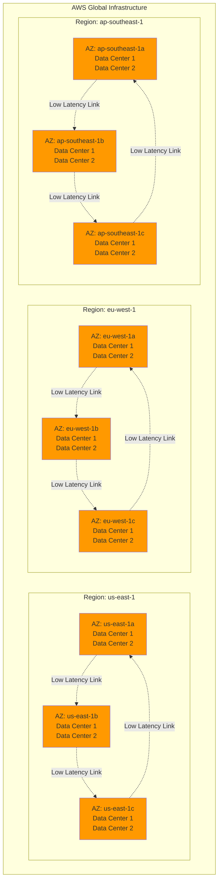

#### 10.Edge Locations and CloudFront Distribution

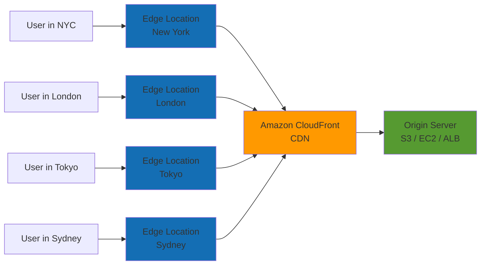

#### 10.Region Selection Decision Flow

```mermaid
flowchart TD
    Start([Start: Need to Choose Region]) --> Q1{"Data Sovereignty<br/>Requirements?"}
    Q1 -->|Yes| RegionCompliance["Choose Region<br/>Based on Compliance"]
    Q1 -->|No| Q2{"Where are<br/>your users?"}

    Q2 --> Proximity["Choose Closest Region<br/>for Low Latency"]

    Proximity --> Q3{"Service Available<br/>in Region?"}
    Q3 -->|Yes| Q4{Check Pricing}
    Q3 -->|No| AltRegion["Choose Alternative<br/>Region"]

    Q4 --> Final[Selected Region]
    RegionCompliance --> Final
    AltRegion --> Q3

    classDef style1 fill:#232F3E
    class Start style1
    classDef style2 fill:#569A31
    class Final style2
    classDef style3 fill:#FF9900
    class Q1 style3
    classDef style4 fill:#FF9900
    class Q2 style4
    classDef style5 fill:#FF9900
    class Q3 style5
    classDef style6 fill:#FF9900
    class Q4 style6
```

#### 10.10.AWS Well-Architected Framework

#### 10.Six Pillars Overview

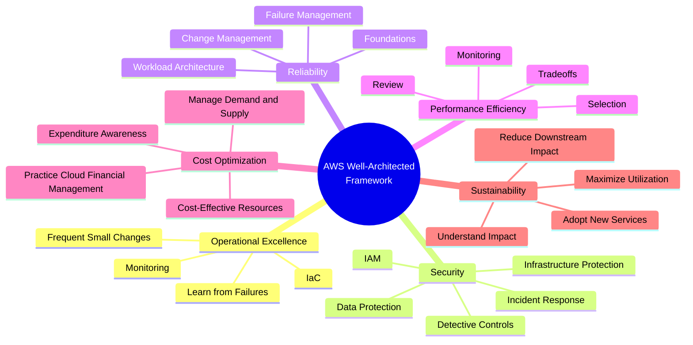

#### 10.Well-Architected Framework Pillars Details

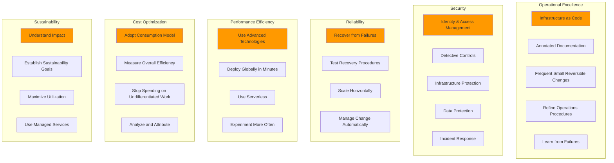

#### 10.10.Shared Responsibility Model

#### 10.Security Responsibility Division

```mermaid
graph TB
    subgraph Customer_Responsibility_br_Security_IN_the_Cloud_Group["Customer Responsibility&lt;&lt;&lt;BRTAG&gt;&gt;&gt;(Security IN the Cloud)"]
        C1[Customer Data]
        C2[Platform, Applications, IAM]
        C3["Operating System, Network,<br/>Firewall Configuration"]
        C4[Client-Side Data Encryption]
        C5[Server-Side Encryption]
        C6[Network Traffic Protection]
    end

    subgraph AWS_Responsibility_br_Security_OF_the_Cloud_Group["AWS Responsibility&lt;&lt;&lt;BRTAG&gt;&gt;&gt;(Security OF the Cloud)"]
        A1["Hardware/AWS Global Infrastructure"]
        A2[Regions, AZs, Edge Locations]
        A3["Compute, Storage, Database,<br/>Networking"]
        A4[Software - Managed Services]
        A5[Physical Security of Data Centers]
    end

    C1 --> Line[Shared Responsibility Line]
    Line --> A1

    classDef style1 fill:#FF9900
    class C1 style1
    classDef style2 fill:#FF9900
    class C2 style2
    classDef style3 fill:#FF9900
    class C3 style3
    classDef style4 fill:#146EB4
    class A1 style4
    classDef style5 fill:#146EB4
    class A2 style5
    classDef style6 fill:#146EB4
    class A3 style6
    classDef style7 fill:#232F3E
    class Line style7
```

#### 10.Service-Specific Responsibility Model

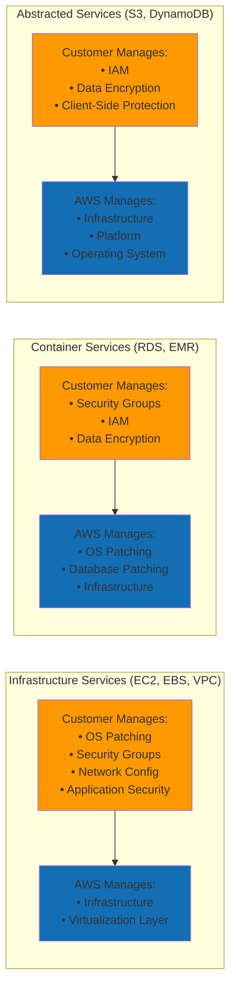

#### 10.10.AWS Management Tools

#### 10.Management Console Access Flow

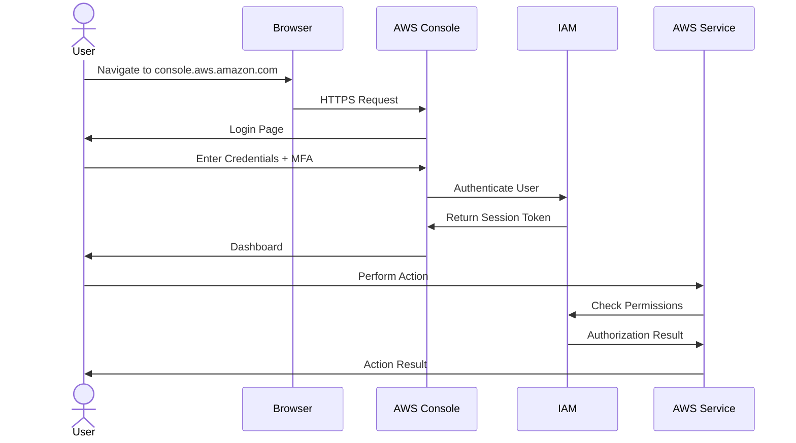

#### 10.AWS CLI and SDK Architecture

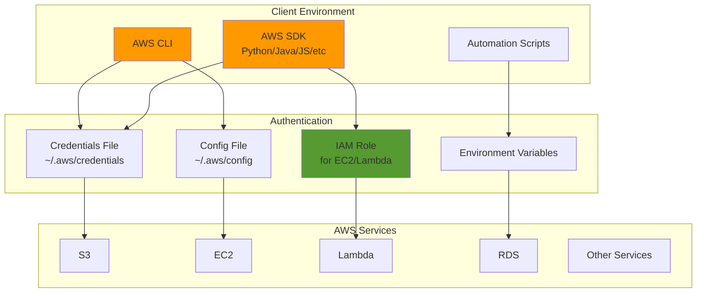

#### 10.10.AWS Service Categories

#### 10.Service Categories Map

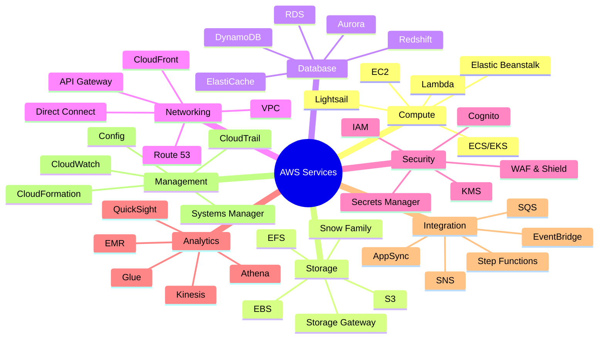

#### 10.Service Selection Decision Tree

```mermaid
flowchart TD
    Start([What do you need?]) --> Type{Service Type?}

    Type -->|Compute| Compute{Workload Type?}
    Type -->|Storage| Storage{Data Type?}
    Type -->|Database| Database{Data Model?}
    Type -->|Network| Network{Use Case?}

    Compute -->|Traditional| EC2[EC2]
    Compute -->|Serverless| Lambda[Lambda]
    Compute -->|Containers| Container{Managed?}
    Container -->|Yes| Fargate[Fargate]
    Container -->|No| ECS["ECS/EKS"]

    Storage -->|Object| S3[S3]
    Storage -->|Block| EBS[EBS]
    Storage -->|File| File{Protocol?}
    File -->|NFS| EFS[EFS]
    File -->|SMB/Windows| FSx[FSx]

    Database -->|Relational| RDS["RDS/Aurora"]
    Database -->|NoSQL| NoSQL{Key-Value?}
    NoSQL -->|Yes| DynamoDB[DynamoDB]
    NoSQL -->|Document| DocumentDB[DocumentDB]

    Network -->|Isolation| VPC[VPC]
    Network -->|DNS| Route53[Route 53]
    Network -->|CDN| CloudFront[CloudFront]

    classDef style1 fill:#232F3E
    class Start style1
    classDef style2 fill:#FF9900
    class EC2 style2
    classDef style3 fill:#FF9900
    class Lambda style3
    classDef style4 fill:#FF9900
    class S3 style4
    classDef style5 fill:#FF9900
    class RDS style5
    classDef style6 fill:#FF9900
    class VPC style6
```

#### 10.10.AWS Account Management

#### 10.Account Structure with AWS Organizations

```mermaid
graph TB
    Root["Root Account<br/>Management Account"]

    Root --> OU1["Organizational Unit:<br/>Production"]
    Root --> OU2["Organizational Unit:<br/>Development"]
    Root --> OU3["Organizational Unit:<br/>Security"]

    OU1 --> ProdAcct1[Production Account 1]
    OU1 --> ProdAcct2[Production Account 2]

    OU2 --> DevAcct1[Dev Account 1]
    OU2 --> DevAcct2[Dev Account 2]

    OU3 --> SecAcct1[Security Account]
    OU3 --> SecAcct2[Audit Account]

    SCP1["Service Control Policy<br/>Deny S3 Public Access"] -.Applies to.-> OU1
    SCP2["Service Control Policy<br/>Restrict Regions"] -.Applies to.-> OU2

    classDef style1 fill:#232F3E
    class Root style1
    classDef style2 fill:#FF9900
    class OU1 style2
    classDef style3 fill:#FF9900
    class OU2 style3
    classDef style4 fill:#FF9900
    class OU3 style4
    classDef style5 fill:#146EB4
    class SCP1 style5
    classDef style6 fill:#146EB4
    class SCP2 style6
```

#### 10.Billing and Cost Management Flow

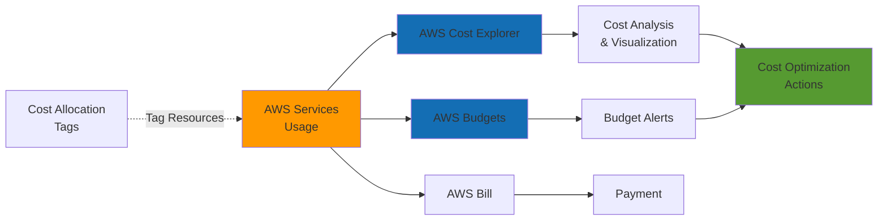

#### 10.Multi-Account Strategy

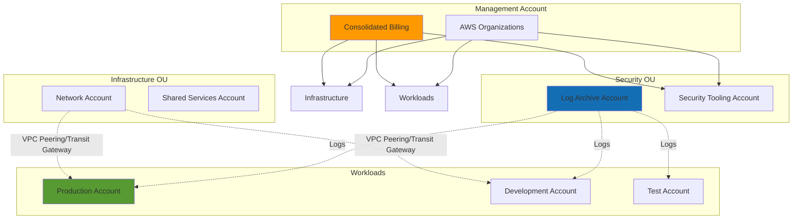

#### 10.10.High Availability Multi-AZ Deployment

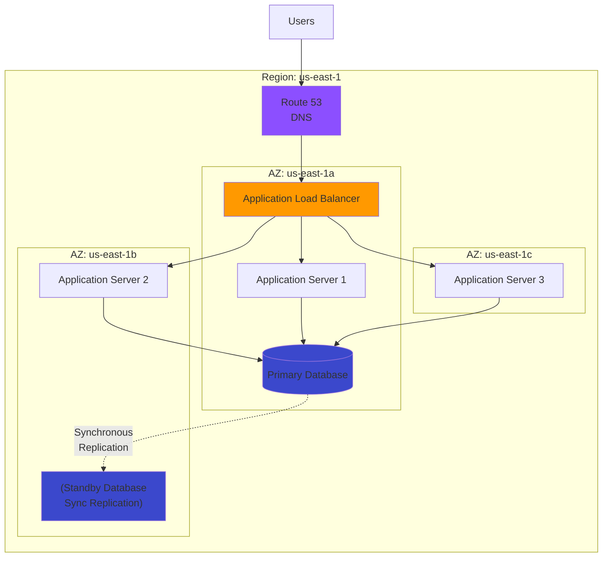

---

---

## 11. 📝 Exam-Standard Practice Questions

> **⚠️ DISCLAIMER:** These are **original practice questions** created for educational purposes based on AWS documentation. They are **NOT actual exam questions** from the AWS certification exam.

#### 11.11.Exam-Standard Questions (SAA-C03)

---

#### 11.Question 1

A company is deploying a new application on AWS and needs to ensure the highest level of availability and fault tolerance. The application must continue to operate even if an entire data center fails. Which AWS infrastructure component should be used?

A. Deploy across multiple Edge Locations  
B. Deploy across multiple Availability Zones within a single Region  
C. Deploy across multiple Regions  
D. Deploy using AWS Local Zones

<details>
<summary>Show Answer</summary>

**Answer: B**

**Explanation:**

- Availability Zones (AZs) are separate data centers within a Region
- Deploying across multiple AZs protects against data center failure
- This is the standard approach for high availability within a Region
- Option C (multiple Regions) is for disaster recovery, not just data center failure
- Edge Locations are for content delivery, not application hosting
- Local Zones are for ultra-low latency but don't provide the same fault tolerance

**References:** AWS Global Infrastructure, Well-Architected Framework - Reliability Pillar

</details>

---

#### 11.Question 2

A solutions architect needs to design a solution that minimizes latency for users accessing static content globally. Which combination of AWS services should be used?

A. Amazon S3 with Cross-Region Replication  
B. Amazon CloudFront with S3 as the origin  
C. Amazon S3 with Transfer Acceleration  
D. Multiple EC2 instances in different Regions

<details>
<summary>Show Answer</summary>

**Answer: B**

**Explanation:**

- CloudFront is AWS's Content Delivery Network (CDN) with 400+ edge locations globally
- It caches content close to users, minimizing latency
- S3 serves as the origin for static content
- Option A provides redundancy but doesn't optimize latency
- Option C accelerates uploads, not downloads
- Option D is cost-ineffective and complex to manage

**References:** CloudFront, Edge Locations, Global Infrastructure

</details>

---

#### 11.Question 3

According to the AWS Shared Responsibility Model, which of the following is AWS's responsibility?

A. Encryption of data at rest in S3  
B. Patch management of guest operating systems on EC2  
C. Physical security of data centers  
D. Configuration of security groups

<details>
<summary>Show Answer</summary>

**Answer: C**

**Explanation:**

- AWS is responsible for "Security OF the Cloud" - physical infrastructure
- This includes data centers, hardware, and facilities
- Customers are responsible for "Security IN the Cloud"
- Options A, B, and D are all customer responsibilities
- Customers choose whether to encrypt, patch OS, and configure security

**References:** AWS Shared Responsibility Model

</details>

---

#### 11.Question 4

A startup company wants to deploy an application without managing servers, operating systems, or runtime environments. Which AWS service category best fits this requirement?

A. Infrastructure as a Service (IaaS)  
B. Platform as a Service (PaaS)  
C. Software as a Service (SaaS)  
D. Function as a Service (FaaS)

<details>
<summary>Show Answer</summary>

**Answer: B**

**Explanation:**

- PaaS services (like Elastic Beanstalk) abstract infrastructure management
- Users deploy code without managing servers or OS
- IaaS (like EC2) requires managing virtual machines
- SaaS is fully managed applications (like Amazon Chime)
- FaaS (like Lambda) is event-driven, not for full applications typically
- PaaS is the best fit for deploying applications without infrastructure management

**References:** AWS Service Categories, Cloud Computing Models

</details>

---

#### 11.Question 5

A company has regulatory requirements to ensure that data stored in AWS does not leave a specific geographic location. How can this be achieved?

A. Enable AWS GuardDuty  
B. Choose the appropriate AWS Region and do not enable cross-region features  
C. Use AWS Organizations with Service Control Policies  
D. Enable AWS CloudTrail

<details>
<summary>Show Answer</summary>

**Answer: B**

**Explanation:**

- Data in an AWS Region stays in that Region unless you explicitly configure otherwise
- No cross-region replication, backups, or data transfer ensures data residency
- GuardDuty is for threat detection, not data residency
- SCPs can enforce policies but the key is choosing the right Region
- CloudTrail is for logging, not data residency
- Primary control: select Region and don't configure cross-region services

**References:** AWS Regions, Data Sovereignty, Compliance

</details>

---

#### 11.Question 6

Which pillar of the AWS Well-Architected Framework focuses on the ability to recover from failures and dynamically acquire computing resources to meet demand?

A. Operational Excellence  
B. Security  
C. Reliability  
D. Performance Efficiency

<details>
<summary>Show Answer</summary>

**Answer: C**

**Explanation:**

- Reliability pillar focuses on recovery from failures and maintaining workload functionality
- Key aspects: fault tolerance, disaster recovery, self-healing
- Operational Excellence focuses on operations and monitoring
- Security focuses on protecting information and systems
- Performance Efficiency focuses on using resources efficiently

**References:** AWS Well-Architected Framework - Reliability Pillar

</details>

---

#### 11.Question 7

A company wants to estimate the cost of running their planned AWS infrastructure before deployment. Which AWS tool should they use?

A. AWS Cost Explorer  
B. AWS Budgets  
C. AWS Pricing Calculator  
D. AWS Cost and Usage Report

<details>
<summary>Show Answer</summary>

**Answer: C**

**Explanation:**

- AWS Pricing Calculator estimates costs for planned architectures
- Cost Explorer analyzes existing/historical costs
- AWS Budgets sets budget alerts
- Cost and Usage Report provides detailed billing data
- For estimation BEFORE deployment, Pricing Calculator is correct

**References:** AWS Pricing Tools, Cost Management

</details>

---

#### 11.Question 8

An application requires 15 milliseconds or less of latency for users in a specific metropolitan area. Which AWS infrastructure component should be used?

A. AWS Region  
B. Availability Zone  
C. AWS Local Zone  
D. AWS Wavelength Zone

<details>
<summary>Show Answer</summary>

**Answer: C**

**Explanation:**

- AWS Local Zones bring compute, storage, and database closer to end-users
- Designed for single-digit millisecond latency requirements
- Placed in metropolitan areas for ultra-low latency applications
- Wavelength Zones are for 5G edge computing
- Regular Regions/AZs may not meet ultra-low latency requirements

**References:** AWS Local Zones, Global Infrastructure

</details>

---

#### 11.Question 9

Which AWS service provides a unified interface to manage multiple AWS accounts within an organization?

A. AWS IAM  
B. AWS Organizations  
C. AWS Control Tower  
D. AWS Systems Manager

<details>
<summary>Show Answer</summary>

**Answer: B**

**Explanation:**

- AWS Organizations centrally manages multiple AWS accounts
- Provides consolidated billing, account creation, and policy management
- IAM manages permissions within an account
- Control Tower sets up multi-account environments (uses Organizations underneath)
- Systems Manager manages AWS resources, not accounts
- Direct answer for multi-account management: Organizations

**References:** AWS Organizations, Account Management

</details>

---

#### 11.Question 10

According to the AWS Well-Architected Framework, which design principle is recommended for the Security pillar?

A. Implement a strong identity foundation  
B. Go global in minutes  
C. Stop spending money on data center operations  
D. Implement feedback loops

<details>
<summary>Show Answer</summary>

**Answer: A**

**Explanation:**

- "Implement a strong identity foundation" is a Security pillar principle
- Includes: least privilege, separation of duties, centralized identity management
- Option B relates to global deployment (general AWS benefit)
- Option C is a cloud advantage, not security principle
- Option D relates to Operational Excellence pillar

**References:** AWS Well-Architected Framework - Security Pillar Design Principles

</details>

---

#### 11.Question 11

A company wants to use AWS CLI to manage resources but wants to avoid embedding long-term credentials in their scripts. What is the BEST practice?

A. Use root account credentials  
B. Create an IAM user and store credentials in the script  
C. Use IAM roles with temporary security credentials  
D. Use access keys without secret keys

<details>
<summary>Show Answer</summary>

**Answer: C**

**Explanation:**

- IAM roles provide temporary security credentials via AWS STS
- Credentials rotate automatically, enhancing security
- Never use root account credentials for daily tasks
- Never hardcode credentials in scripts
- Access keys always require secret keys
- Best practice: IAM roles with temporary credentials

**References:** IAM Best Practices, AWS CLI Security

</details>

---

#### 11.Question 12

Which of the following is a benefit of using AWS Regions? (Choose TWO)

A. Reduced latency for users in specific geographic areas  
B. Automatic data replication across all Regions  
C. Compliance with data sovereignty requirements  
D. Lower costs compared to using a single Region  
E. Automatic failover between Regions

<details>
<summary>Show Answer</summary>

**Answer: A, C**

**Explanation:**

- **A is correct**: Deploying in Regions closer to users reduces latency
- **C is correct**: Regions enable meeting data residency/sovereignty requirements
- B is incorrect: Replication is NOT automatic, must be configured
- D is incorrect: Multiple Regions typically increase costs
- E is incorrect: Failover is NOT automatic, requires architecture design

**References:** AWS Regions, Global Infrastructure Benefits

</details>

---

#### 11.Question 13

A solutions architect needs to design a system that follows the "Design for Failure" principle of the Well-Architected Framework. Which approach should be taken?

A. Use only the largest EC2 instance types to prevent failures  
B. Design the application to handle component failures gracefully  
C. Deploy all resources in a single Availability Zone for simplicity  
D. Rely on AWS Support to handle all failures

<details>
<summary>Show Answer</summary>

**Answer: B**

**Explanation:**

- "Design for Failure" means assuming components will fail and planning accordingly
- Applications should handle failures gracefully with retry logic, health checks, etc.
- Larger instances don't prevent failures
- Single AZ deployment increases failure risk
- You must design for failure, not rely solely on support
- Proper approach: graceful degradation, automatic recovery

**References:** AWS Well-Architected Framework - Reliability Pillar

</details>

---

#### 11.Question 14

Which statement about AWS Edge Locations is correct?

A. Edge Locations are only used for CloudFront content delivery  
B. There are fewer Edge Locations than Regions  
C. Edge Locations can be used for both content delivery and edge computing  
D. Edge Locations are the same as Availability Zones

<details>
<summary>Show Answer</summary>

**Answer: C**

**Explanation:**

- Edge Locations support CloudFront (CDN), Lambda@Edge, and other edge services
- There are 400+ edge locations vs 30+ Regions
- Edge Locations ≠ Availability Zones (different purposes)
- Used for content delivery AND edge computing (Lambda@Edge, CloudFront Functions)

**References:** AWS Global Infrastructure - Edge Locations

</details>

---

#### 11.Question 15

A company wants to receive alerts when their monthly AWS costs exceed a threshold. Which service should they use?

A. AWS Cost Explorer  
B. AWS Budgets  
C. AWS Pricing Calculator  
D. AWS Trusted Advisor

<details>
<summary>Show Answer</summary>

**Answer: B**

**Explanation:**

- AWS Budgets allows setting custom cost/usage budgets with alerts
- Can send notifications via SNS when thresholds are exceeded
- Cost Explorer visualizes historical costs but doesn't send alerts
- Pricing Calculator estimates future costs
- Trusted Advisor provides best practice recommendations
- For threshold alerts: AWS Budgets

**References:** AWS Budgets, Cost Management

</details>

---

#### 11.Question 16

According to the AWS Shared Responsibility Model, who is responsible for patching the underlying hypervisor for EC2 instances?

A. Customer  
B. AWS  
C. Both AWS and Customer  
D. Third-party vendors

<details>
<summary>Show Answer</summary>

**Answer: B**

**Explanation:**

- AWS manages the hypervisor layer (security OF the cloud)
- Customers manage guest OS patches (security IN the cloud)
- Hypervisor is infrastructure, AWS's responsibility
- Customer patches OS, applications, data encryption

**References:** AWS Shared Responsibility Model - EC2

</details>

---

#### 11.Question 17

A company wants to deploy applications closer to 5G mobile users for ultra-low latency. Which AWS service should be used?

A. AWS Local Zones  
B. AWS Wavelength  
C. AWS Outposts  
D. AWS Direct Connect

<details>
<summary>Show Answer</summary>

**Answer: B**

**Explanation:**

- AWS Wavelength embeds compute at 5G network edge
- Provides single-digit millisecond latency to mobile devices
- Local Zones are for metro areas but not 5G-specific
- Outposts is for on-premises AWS infrastructure
- Direct Connect is for dedicated network connection
- For 5G mobile: Wavelength

**References:** AWS Wavelength, Edge Computing

</details>

---

#### 11.Question 18

Which pillar of the AWS Well-Architected Framework includes the principle "Stop guessing your capacity needs"?

A. Cost Optimization  
B. Performance Efficiency  
C. Reliability  
D. Operational Excellence

<details>
<summary>Show Answer</summary>

**Answer: B**

**Explanation:**

- Performance Efficiency pillar includes capacity planning principles
- "Stop guessing capacity" - use Auto Scaling and elastic services
- Enables right-sizing and dynamic capacity adjustment
- Cost Optimization focuses on eliminating waste
- Reliability focuses on recovery and testing
- Operational Excellence focuses on running/monitoring

**References:** AWS Well-Architected Framework - Performance Efficiency Pillar

</details>

---

#### 11.Question 19

A company has multiple development teams that need separate AWS accounts for isolation. They want consolidated billing. What should they implement?

A. AWS Control Tower  
B. AWS Organizations with consolidated billing  
C. Multiple IAM users in one account  
D. AWS Resource Groups

<details>
<summary>Show Answer</summary>

**Answer: B**

**Explanation:**

- AWS Organizations provides consolidated billing across multiple accounts
- Each team gets isolated account with separate resources
- Single bill for entire organization
- Control Tower helps set up Organizations but Organizations is the direct answer
- IAM users don't provide account-level isolation
- Resource Groups organize resources, not billing

**References:** AWS Organizations, Consolidated Billing

</details>

---

#### 11.Question 20

What is the primary purpose of Availability Zones within an AWS Region?

A. To provide different pricing tiers  
B. To enable fault tolerance and high availability  
C. To support different AWS services  
D. To reduce data transfer costs

<details>
<summary>Show Answer</summary>

**Answer: B**

**Explanation:**

- Availability Zones are isolated locations within a Region
- Primary purpose: fault tolerance and high availability
- Each AZ has independent power, cooling, networking
- Deploying across AZs protects against single point of failure
- Not for pricing, service availability, or cost reduction
- Core purpose: resilience and availability

**References:** AWS Availability Zones, High Availability Architecture

</details>

---

#### 11.Question 21

A company has 50 AWS accounts and wants to centrally manage billing and apply organization-wide security policies. Which AWS service should they use?

A. AWS IAM  
B. AWS Organizations  
C. AWS Control Tower  
D. AWS Systems Manager

<details>
<summary>Show Answer</summary>

**Answer: B**

**Explanation:**

- **AWS Organizations** is the service for managing multiple AWS accounts
- Provides consolidated billing across all accounts
- Enables Service Control Policies (SCPs) for organization-wide policies
- Can create Organizational Units (OUs) for logical grouping
- Control Tower (C) is built on Organizations but is for automated setup
- IAM (A) is for user/role management within a single account
- Systems Manager (D) is for operations, not multi-account management

**References:** AWS Organizations, Multi-Account Strategy

</details>

---

#### 11.Question 22

A security team wants to prevent all member accounts in their AWS Organization from creating resources in any region except us-east-1 and eu-west-1. How should this be implemented?

A. Create IAM policies in each account restricting regions  
B. Use AWS Config rules to detect non-compliant resources  
C. Create a Service Control Policy (SCP) denying actions in other regions  
D. Use AWS Firewall Manager to block region access

<details>
<summary>Show Answer</summary>

**Answer: C**

**Explanation:**

- **Service Control Policies (SCPs)** provide centralized, preventive controls
- SCPs can restrict which AWS regions can be used
- Applied at the Organization, OU, or account level
- Cannot be overridden by users in member accounts
- IAM policies (A) can be changed by account administrators
- Config rules (B) are detective, not preventive
- Firewall Manager (D) is for security group/WAF rules, not region restrictions

**SCP Example:**

```json
{
  "Version": "2012-10-17",
  "Statement": [
    {
      "Effect": "Deny",
      "Action": "*",
      "Resource": "*",
      "Condition": {
        "StringNotEquals": {
          "aws:RequestedRegion": ["us-east-1", "eu-west-1"]
        }
      }
    }
  ]
}
```

**References:** Service Control Policies, AWS Organizations, Region Restrictions

</details>

---

#### 11.Question 23

Which of the following statements about Service Control Policies (SCPs) is TRUE?

A. SCPs grant permissions to users and roles  
B. SCPs affect the management account in an AWS Organization  
C. SCPs define maximum permissions for member accounts  
D. SCPs can only be applied to individual accounts, not OUs

<details>
<summary>Show Answer</summary>

**Answer: C**

**Explanation:**

- **SCPs define maximum permissions** - they act as guardrails
- SCPs do NOT grant permissions (A is wrong)
- They only restrict what is possible
- SCPs do NOT affect the management account (B is wrong)
- SCPs can be applied to Organization root, OUs, or accounts (D is wrong)
- Effective permissions = IAM policy AND SCP

**Key SCP Rules:**

- ❌ Don't grant permissions
- ❌ Don't affect management account
- ✅ Set maximum permission boundaries
- ✅ Can be applied to OUs
- ✅ Inherited down the hierarchy

**References:** Service Control Policies, Permission Boundaries

</details>

---

#### 11.Question 24

A company wants to quickly set up a secure, multi-account AWS environment following best practices with automated account provisioning and pre-configured governance guardrails. Which service should they use?

A. AWS Organizations  
B. AWS Control Tower  
C. AWS CloudFormation StackSets  
D. AWS Service Catalog

<details>
<summary>Show Answer</summary>

**Answer: B**

**Explanation:**

- **AWS Control Tower** provides automated multi-account setup
- Includes Landing Zone (well-architected baseline)
- Pre-configured guardrails (preventive and detective)
- Account Factory for automated provisioning
- Built on top of AWS Organizations
- AWS Organizations (A) requires manual setup
- CloudFormation StackSets (C) deploys templates, not governance
- Service Catalog (D) is for self-service IT resources

**Control Tower Features:**

- ✅ Automated setup (minutes vs days)
- ✅ Pre-built guardrails
- ✅ Account Factory
- ✅ Compliance dashboard
- ✅ Integrated with Organizations, IAM Identity Center, CloudTrail

**When to Use:**

- Quick setup with best practices
- Less AWS expertise required
- Want pre-built governance

**When to Use Organizations Directly:**

- Need maximum flexibility
- Have custom requirements
- Experienced AWS team

**References:** AWS Control Tower, Landing Zone, Multi-Account Governance

</details>

---

#### 11.Question 25

A company has a centralized networking account and wants to share VPC subnets with multiple application accounts without duplicating VPC infrastructure. Which AWS service enables this?

A. VPC Peering  
B. AWS Transit Gateway  
C. AWS Resource Access Manager (RAM)  
D. AWS PrivateLink

<details>
<summary>Show Answer</summary>

**Answer: C**

**Explanation:**

- **AWS Resource Access Manager (RAM)** allows sharing resources across accounts
- Can share VPC subnets between accounts
- Resources remain in owner account, but accessible to shared accounts
- No need to duplicate VPCs
- VPC Peering (A) connects VPCs but doesn't share subnets
- Transit Gateway (B) connects networks but doesn't share subnets
- PrivateLink (D) is for service-to-VPC connectivity

**Benefits of Subnet Sharing with RAM:**

- ✅ Centralized network management
- ✅ Reduced VPC sprawl
- ✅ Efficient IP address usage
- ✅ Simplified network architecture
- ✅ Lower operational overhead

**Other Shareable Resources via RAM:**

- VPC Subnets (most common)
- Transit Gateway attachments
- Route 53 Resolver rules
- License Manager configurations
- Aurora DB clusters
- Prefix lists

**References:** AWS Resource Access Manager, VPC Subnet Sharing, Centralized Networking

</details>

---

#### 11.Question 26

A company uses AWS Organizations with consolidated billing. They notice they're receiving volume discounts on S3 storage even though no single account uses enough storage to qualify. Why?

A. AWS provides automatic discounts for Organizations  
B. Consolidated billing combines usage across all accounts for volume pricing  
C. The management account gets all the discounts  
D. SCPs enable cost savings automatically

<details>
<summary>Show Answer</summary>

**Answer: B**

**Explanation:**

- **Consolidated billing** combines usage across all accounts
- AWS treats the entire organization as a single billing entity
- Volume discounts apply to combined usage
- Example: 3 accounts with 500GB each = 1500GB total → higher tier pricing
- Not automatic discounts (A), just usage aggregation
- All accounts benefit, not just management account (C)
- SCPs are for permissions, not costs (D)

**Consolidated Billing Benefits:**

- ✅ Volume discounts across accounts
- ✅ Single payment method
- ✅ Easier cost tracking
- ✅ Cost allocation tags across org
- ✅ Reserved Instance sharing

**References:** AWS Organizations, Consolidated Billing, Volume Pricing

</details>

---

#### 11.Question 27

Which AWS Organizations feature allows you to create policies that prevent accounts from leaving the organization?

A. IAM Policy  
B. Service Control Policy (SCP)  
C. Resource Control Policy  
D. Organizational Lock

<details>
<summary>Show Answer</summary>

**Answer: B**

**Explanation:**

- **Service Control Policies (SCPs)** can prevent accounts from leaving
- SCP can deny the `organizations:LeaveOrganization` action
- Applied at Organization or OU level
- Cannot be overridden by member accounts

**Example SCP:**

```json
{
  "Version": "2012-10-17",
  "Statement": [
    {
      "Effect": "Deny",
      "Action": "organizations:LeaveOrganization",
      "Resource": "*"
    }
  ]
}
```

**Other Preventive SCP Use Cases:**

- Prevent deletion of CloudTrail
- Deny public S3 buckets
- Restrict to approved instance types
- Enforce encryption requirements
- Restrict root user actions

**References:** Service Control Policies, Organization Governance

</details>

---

#### 11.11.Summary

**Total Questions**: 27  
**Topics Covered**:

- AWS Global Infrastructure (Regions, AZs, Edge Locations, Local Zones, Wavelength)
- AWS Well-Architected Framework (All 6 pillars)
- Shared Responsibility Model
- AWS Account Management (Organizations, Consolidated Billing)
- **Service Control Policies (SCPs)** - NEW
- **AWS Control Tower** - NEW
- **AWS Resource Access Manager (RAM)** - NEW
- Cost Management Tools (Pricing Calculator, Budgets, Cost Explorer)
- Service Categories and Cloud Models

**Exam Tips**:

1. ✅ Understand the difference between Regions, AZs, Edge Locations, Local Zones, and Wavelength
2. ✅ Memorize the 6 pillars of Well-Architected Framework
3. ✅ Know what AWS vs Customer manages in Shared Responsibility Model
4. ✅ **CRITICAL**: Understand SCPs - they DON'T grant permissions, only restrict
5. ✅ **CRITICAL**: SCPs do NOT affect the management account
6. ✅ Know when to use Control Tower vs manual Organizations setup
7. ✅ Understand RAM for VPC subnet sharing (common exam scenario)
8. ✅ Consolidated billing enables volume discounts across accounts
9. ✅ Understand when to use each cost management tool
10. ✅ Know AWS Organizations for multi-account management

**Key Exam Concepts - AWS Organizations:**

- **Management Account**: Cannot be restricted by SCPs, pays all bills
- **Member Accounts**: Subject to SCPs, inherit from OU/Organization
- **Organizational Units (OUs)**: Logical groupings, up to 5 levels deep
- **SCPs**: Maximum permissions, don't grant access, preventive control
- **Consolidated Billing**: Volume discounts, single payment, RI sharing
- **Control Tower**: Automated setup, Landing Zone, guardrails
- **RAM**: Share resources (especially VPC subnets) across accounts

**Common Exam Scenarios:**

- "Prevent accounts from using services in specific regions" → SCP
- "Centralize billing across 50 accounts" → AWS Organizations
- "Quick multi-account setup with governance" → Control Tower
- "Share VPC subnets across accounts" → RAM
- "Enforce encryption across all accounts" → SCP
- "Get volume discounts across accounts" → Consolidated Billing

**Next Steps**:

- Review incorrect answers
- Study referenced topics in main README
- Practice scenario-based questions
- Take module quiz to reinforce learning
- **FOCUS**: Spend extra time on SCPs - heavily tested!

---

## Prerequisites

- [Module 1: Security Foundations](../9-security-foundations.md)

## Recommended Next Topics

- Congratulations! You have completed the IT Foundation track.
