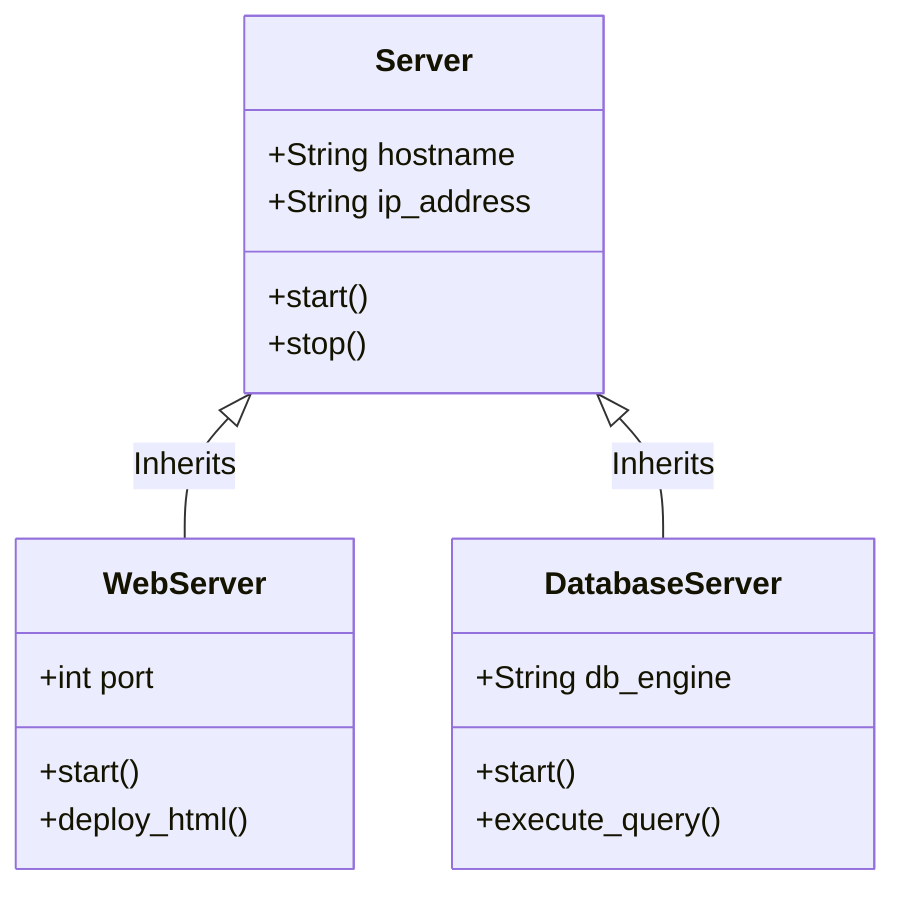

# Module 4: Programming Fundamentals

Software powers the logic of modern applications and automation. This module covers core programming structures, control flow execution, exception handling patterns, JSON API structures, and hands-on scripting with Python.

---

## 4.1 Programming Structures & Mappings

Regardless of the language, developers write code by structuring data and logic into standard components.

### 4.1.1 Variables, Constants, and Scope
*   **Variable:** A named reference pointing to a value stored in memory. Variables can change their value during execution (e.g. `user_count = 10`).
*   **Constant:** A named reference designed to remain unchanged once defined (e.g., `MAX_RETRY_LIMIT = 5`).
*   **Scope:** The lifecycle and accessibility boundary of a variable:
    *   *Global Scope:* Declared outside functions, accessible from anywhere in the codebase.
    *   *Local Scope:* Declared inside a function or loop block. Created on execution and garbage-collected when the function finishes.

### 4.1.2 Base Data Types
*   **Strings:** Text characters enclosed in quotes (e.g. `"prod-database"`).
*   **Numbers:** Integers (e.g., `42`) and floating-point decimals (e.g., `9.81`).
*   **Booleans:** Binary states (`True` or `False`), matching digital logic.

### 4.1.3 Data Collections
*   **Lists / Arrays:** Ordered collections of values accessed by a zero-based index. Lists can expand dynamically.
    *   *Python Example:* `servers = ["web01", "web02", "db01"]`
    *   Accessing index `0`: `servers[0]` returns `"web01"`.
*   **Dictionaries / Maps / Objects:** Unordered collections of key-value pairs. Keys must be unique and act as indexes to retrieve values.
    *   *Python Example:*
        ```python
        config = {
            "environment": "production",
            "db_port": 5432,
            "ssl_enabled": True
        }
        ```
    *   Accessing key: `config["db_port"]` returns `5432`.
*   **Sets:** Unordered collections of unique values. Used to perform operations like unions, intersections, and deduplication.

### 4.1.4 How Code Runs: Compilers vs. Interpreters
Computers only execute binary machine code (`1`s and `0`s). Programming languages translate high-level readable code to machine code in two main ways:
1.  **Compilers (e.g. C++, Java, Rust, Go):** A compiler scans the entire codebase ahead of time and translates it into a standalone binary executable file (like a `.exe` on Windows). The execution is extremely fast, but compiling takes time, and you must recompile the code for different hardware architectures.
2.  **Interpreters (e.g. Python, JavaScript, Ruby):** An interpreter reads the source code file line-by-line at runtime and translates/executes it on the fly. No compilation phase is needed, making development fast and cross-platform. However, runtime execution is slower than compiled code.

---

## 4.2 Control Flow & Function Design

Control flow directs the execution path of code statements based on logic conditions.

### 4.2.1 Conditionals
Branching logic redirects code execution paths.
```
              [Check Condition]
               /             \
         (If True)         (If False)
           /                 \
    [Execute Code Block]   [Skip / Else Block]
```
```python
if score >= 90:
    print("Grade: A")
elif score >= 75:
    print("Grade: B")
else:
    print("Grade: F")
```

### 4.2.2 Loops
Loops repeat code blocks to process batches of items:
*   **For Loops:** Iterate over a predefined collection or range.
    ```python
    for server in ["web01", "web02"]:
        print(f"Deploying updates to: {server}")
    ```
*   **While Loops:** Execute continuously as long as a boolean condition remains true.
    ```python
    retries = 0
    while retries < 3:
        print("Checking server status...")
        retries += 1
    ```

### 4.2.3 Functions
Functions compile reusable, modular logic. They take parameters (inputs), perform actions, and return a value (output).

```python
def calculate_network_throughput(file_size_bytes, bandwidth_bps):
    bits = file_size_bytes * 8
    time_seconds = bits / bandwidth_bps
    return time_seconds

# Call function
duration = calculate_network_throughput(1000000, 100000)
```

---

## 4.3 Exceptions & Error Handling

Runtime errors occur during code execution (like trying to read a missing file or divide by zero). If unhandled, these errors crash the application and print a stack trace.

To prevent crashes, developers write **Try-Catch** (or **Try-Except** in Python) blocks:

```python
def read_configuration(path):
    try:
        with open(path, "r") as file:
            return file.read()
    except FileNotFoundError as error:
        print(f"Warning: Configuration file not found at {path}. Details: {error}")
        return "{}" # Return a default safe fallback string
    finally:
        print("Configuration read operation completed.")
```

*   **Try:** The code block containing the risky operation that might throw an error.
*   **Except:** The backup code block that executes only if the specific error is encountered.
*   **Finally:** A block that executes regardless of whether an error occurred, useful for cleanup tasks (like closing open files or database connections).

---

## 4.4 APIs & JSON (JavaScript Object Notation)

An API (Application Programming Interface) allows two software services to exchange data. The standard data exchange format is **JSON**.

### 4.4.1 Scenario: The User Sign-Up Data Flow
To see how APIs and databases fit together conceptually, let's trace a user registering for a website:

```
 [User Client Browser] ──(1. Send Form)──> [API Server Gateway] ──(2. Write User)──> [Database]
 [User Client Browser] <──(4. HTTP 201)─── [API Server Gateway] <──(3. Success)─────── [Database]
```

1.  **Form Input:** You type your name and email into a browser form and click "Sign Up."
2.  **API Request:** The client frontend script packages your inputs into a **JSON string** payload and makes an HTTP `POST` request to the API server URL `/v1/users`.
3.  **API Processing:** The API server receives the request, parses the JSON string into memory, runs business validation logic (e.g. checking if the email is valid), and executes database query commands to write the new user record into a database table.
4.  **Database Commit & Response:** The database commits the row and returns a success status back to the API server. The API server then returns an HTTP status code `201 Created` with a confirmation JSON payload back to the browser client, which displays a welcome message.

---

## 4.5 Hands-on Python Scripting (Line-by-Line Guide)

Python is a popular programming language for sysadmins and developers. Let's look at a complete, practical Python script that demonstrates imports, file handling, JSON processing, loops, and exception handling, with step-by-step commentary:

```python
# 1. Import built-in modules to interact with JSON, the OS, and system parameters
import json
import os
import sys

# 2. Define a function that processes configuration settings
def process_servers_configuration(input_file_path):
    
    # 3. Check if the config file physically exists on storage to prevent a crash
    if not os.path.exists(input_file_path):
        print(f"Error: The file {input_file_path} does not exist.")
        sys.exit(1) # Terminate the script with exit code 1 (failure)

    try:
        # 4. Open the file in read-only mode ('r'). 'with' ensures the file is closed automatically
        with open(input_file_path, 'r') as file:
            # 5. Deserialize the JSON string inside the file into a Python Dictionary
            data = json.load(file)
            
        print(f"Successfully loaded configuration: {data.get('config_name', 'Unnamed')}")
        
        # 6. Loop through the list of servers registered in the config dictionary
        for server in data['servers']:
            name = server['name']
            role = server['role']
            active = server['active']
            
            # 7. Check the boolean state and print formatted output
            if active:
                print(f" [ACTIVE] Server: {name} is configured as a {role}")
            else:
                print(f" [INACTIVE] Server: {name} ({role}) is currently disabled.")
                
    # 8. Catch specific exceptions to handle formatting or key issues gracefully
    except json.JSONDecodeError as decode_err:
        print(f"Error: Failed to parse JSON file. Invalid format: {decode_err}")
    except KeyError as key_err:
        print(f"Error: Missing expected key in the JSON configuration: {key_err}")

# 9. standard entry point block ensuring script only runs if called directly
if __name__ == "__main__":
    # Simulate execution by passing a configuration filename
    process_servers_configuration("servers_config.json")
```

---

## 4.6 Advanced Programming Paradigms, Algorithms, & Clean Code

To scale enterprise applications in the cloud and utilize AWS SDKs efficiently, developers must master advanced coding structures, algorithmic complexity, design patterns, and secure programming practices.

### 4.6.1 Introduction to Advanced Programming
At an advanced level, programming is not just about writing syntax that runs; it is about writing structured, maintainable, secure, and computationally efficient code. As systems scale to millions of users, the structural design and algorithmic choices in your code directly impact both performance and infrastructure costs.

### 4.6.2 Why This Exists (The Architectural Mandate)
Cloud environments charge you for the exact compute time (e.g. millisecond billing in AWS Lambda) and memory you consume. If your application code contains inefficient algorithms ($O(N^2)$ complexity instead of $O(N)$ or $O(\log N)$) or suffers from memory leaks, it will run slower and consume more resources, directly increasing your monthly cloud bill. Furthermore, AWS SDKs themselves are structured using Object-Oriented design patterns, requiring a solid understanding of objects, classes, and inheritance.

### 4.6.3 Core Concepts (OOP vs. Functional Programming)
Modern software engineering utilizes two primary programming paradigms:
*   **Object-Oriented Programming (OOP):** Focuses on creating "objects" that bundle both data (attributes) and behavior (methods) together, modeling real-world entities.
    *   *Classes and Objects:* A Class is a blueprint (e.g. `Server`), while an Object is an instance created from that blueprint (e.g. `web_server_01`).
    *   *Inheritance:* Allowing a child class to inherit attributes and methods from a parent class (e.g. a `DatabaseServer` class inheriting from a base `Server` class).
    *   *Polymorphism:* The ability of different classes to respond to the same method call in different ways (e.g. calling `deploy()` on both `WebServer` and `DatabaseServer`, each executing its own unique deployment steps).
    *   *Encapsulation:* Hiding internal data states and restricting direct access, exposing only public methods (e.g. using getter/setter methods to modify database connection strings).
    *   *Abstraction:* Hiding complex implementation details and exposing only essential features (e.g. calling `connect()` on a database client without needing to know the low-level socket protocol implementation).
*   **Functional Programming (FP):** Focuses on writing code using pure mathematical functions, avoiding shared state and mutable data.
    *   *Pure Functions:* A function that, given the same inputs, will always return the exact same output, and has no side effects (does not modify external variables or file systems).
    *   *Immutability:* Data cannot be modified once created. If data changes are needed, a new data structure is returned.
    *   *Higher-Order Functions:* Functions that accept other functions as arguments or return them as outputs (e.g. `map()`, `filter()`).
    *   *Lambda Functions:* Small, anonymous, single-line functions (e.g. `lambda x: x * 2`).

### 4.6.4 Internal Architecture: Runtime Memory Execution
When your code executes, the runtime environment (like Python's virtual machine or Java's JVM) manages memory using two distinct structures:
1.  **The Stack:** Stores local primitive variables and active function execution frames. It is structured as a Last-In-First-Out (LIFO) stack. Allocation and deallocation are extremely fast and handled automatically.
2.  **The Heap:** Stores dynamically allocated objects (like class instances, lists, and dicts). The runtime's **Garbage Collector** periodically scans the heap to free memory occupied by objects that no longer have active reference pointers.

### 4.6.5 How It Works: OOP Class Inheritance Hierarchy
The following Mermaid class diagram demonstrates how child classes inherit attributes and polymorphism behaviors from a base parent class:



### 4.6.6 Real-World Use Cases: AWS SDK Client Architecture
When working with AWS, you interact with services using the AWS SDK (e.g., Python's `boto3` or Node's `@aws-sdk`). The SDK instantiates Object-Oriented clients:
```python
import boto3

# Instantiating an S3 Client Object from the boto3 Client Class
s3_client = boto3.client('s3')

# Invoking a method on the S3 client object (Abstraction)
response = s3_client.list_buckets()
```
Here, `s3_client` abstracts away the complex HTTP REST calls, headers, and signature signatures, exposing a simple class method interface.

### 4.6.7 Software Best Practices & SOLID Design
To ensure code remains clean and maintainable:
*   **DRY (Don't Repeat Yourself):** Avoid duplicate code blocks; encapsulate repeating logic into reusable functions or classes.
*   **KISS (Keep It Simple, Stupid):** Write simple, readable code rather than overly complex structures.
*   **SOLID Principles:**
    *   *Single Responsibility:* A class or function should have only one reason to change (do one thing well).
    *   *Open/Closed:* Code entities should be open for extension but closed for modification.
    *   *Liskov Substitution:* Parent instances should be replaceable with child instances without breaking the app.
    *   *Interface Segregation:* Clients should not be forced to depend on methods they do not use.
    *   *Dependency Inversion:* High-level modules should not depend on low-level modules; both should depend on abstractions.

### 4.6.8 Security Considerations: Secure Coding
Secure applications prevent exploits at the application code layer:
*   **Input Sanitization & Parameterization:** Never trust user input. Sanitize inputs to prevent SQL Injection and Cross-Site Scripting (XSS). Use parameterized queries or ORMs when interacting with databases.
*   **Principle of Least Privilege in Code:** Do not run application processes as `root`. Run processes as dedicated service accounts with minimal filesystem read/write privileges.

### 4.6.9 Cost Considerations: Algorithmic Big O Complexity
The time and space complexity of your algorithms determines the compute scale limits:
*   **Big O Notation:** Describes the execution time or space requirements of an algorithm as the input size ($N$) grows:
    *   **$O(1)$ (Constant Time):** Execution time remains the same regardless of input size (e.g., looking up a value in a Hash Table/Dictionary by key).
    *   **$O(\log N)$ (Logarithmic Time):** Search space is halved on each step (e.g., searching a sorted list using Binary Search in a B-Tree).
    *   **$O(N)$ (Linear Time):** Execution time grows proportionally to input size (e.g., scanning an unsorted array for a value).
    *   **$O(N^2)$ (Quadratic Time):** Execution time grows quadratically (e.g., nested loops, bubble sort).
*   *Cloud Cost Impact:* If you process 1,000,000 files using an $O(N^2)$ algorithm inside an AWS Lambda function, it will timeout (max 15 minutes limit) and incur high billing costs. Converting it to an $O(N \log N)$ algorithm completes the task in seconds, saving compute costs.

### 4.6.10 Monitoring & Observability
Applications must expose telemetry to trace failures:
*   **Structured Logging:** Write logs in JSON format to stdout. The logs are collected by logging agents and sent to central storage (like CloudWatch).
*   **Distributed Tracing:** Inject trace headers (like X-Ray correlation IDs) into HTTP request payloads to track transactions across multiple microservices.

### 4.6.11 Common Mistakes & Memory Leaks
*   **Catch-All Exception Blocks:** Writing `except Exception:` without logging details hides bugs, making troubleshooting impossible. Always catch specific exceptions.
*   **Memory Leaks in Heap:** Appending items to a global list without clearing them prevents the Garbage Collector from freeing the memory. Eventually, the application runs out of memory (OOM crash).

### 4.6.12 Troubleshooting Scenarios: Resolving Infinite Loops
If a program stops responding or CPU utilization spikes to 100%, check for infinite loops or deep recursion:
*   *Diagnosing:* Run `top` or `htop` to identify the high-CPU process ID. Use debugging tools (like Python's `pdb` or thread dumps) to inspect the active call stack.
*   *Prevention:* Ensure loops have clear termination conditions and recursive functions have base cases to prevent a `StackOverflowError`.

### 4.6.13 Design Patterns: Singleton and Factory
*   **Singleton Pattern:** Restricts a class to a single instance. Essential for database connection pools where opening multiple connections degrades performance.
*   **Factory Pattern:** Creates objects without exposing the instantiation logic to the client, returning instances dynamically based on input parameters.

### 4.6.14 Paradigm & Complexity Comparisons

| Paradigm/Algorithm | Advantages | Disadvantages | Ideal Use Case |
| :--- | :--- | :--- | :--- |
| **Object-Oriented (OOP)** | Clear structure, highly reusable, modular logic. | Higher abstraction overhead; memory intensive. | Enterprise applications, GUI design, SDK design. |
| **Functional (FP)** | Safe concurrency (no mutable state), highly testable. | Steep learning curve; complex state tracking. | Data pipelines, mathematical analysis. |
| **$O(1)$ Hash Lookup** | Instant retrieval regardless of data size. | High memory overhead for hash table storage. | Cache storage, unique key lookups. |
| **$O(N)$ Linear Scan** | Zero memory overhead; simple to write. | Extremely slow as datasets scale to millions. | Tiny configuration lookups. |

### 4.6.15 DVA-C02 Exam Notes: SDK & Concurrency
The 01-developer-associate exam tests code-level configurations:
*   **SDK Retries & Backoff:** When connecting to AWS APIs, code must implement Exponential Backoff and Jitter to prevent overloading service limits.
*   **Environment Variables:** Never store access keys in code. Use OS environment variables or AWS Systems Manager Parameter Store.

### 4.6.16 SAP-C02 Exam Notes: Resilient Code Architecture
The Solutions Architect Pro exam focuses on loose coupling:
*   **Stateless Code:** Store session data in Redis/DynamoDB rather than application memory (Heap). This allows the application servers to scale out horizontally behind load balancers without losing user session states.

### 4.6.17 Technical Interview Questions
1.  *What is the difference between a Process and a Thread?* Processes are isolated with their own memory spaces; threads run within a process and share its memory.
2.  *Why are global variables discouraged in multi-threaded programs?* Multiple threads modifying a shared global variable can cause race conditions and data corruption unless protected by locks.

---

## 4.7 Hands-On Lab: Python Object-Oriented Banking System

### Overview
In this lab, you will build a complete, production-grade Python script implementing an Object-Oriented Banking System. You will write classes, enforce data encapsulation, implement inheritance, manage data structures, and handle exceptions.

#

---

## Prerequisites

- [Module 3: Networking Fundamentals](3-networking-fundamentals.md)

## Recommended Next Topics

- [Module 5: Database Fundamentals](5-databases.md)

## Related Topics

- [Beginner Study Roadmap](beginner-roadmap.md)
- [Phase 0: Foundation Bridge Overview](0-intro.md)
- [Module 1: How Computers Actually Work](1-how-computers-work.md)
