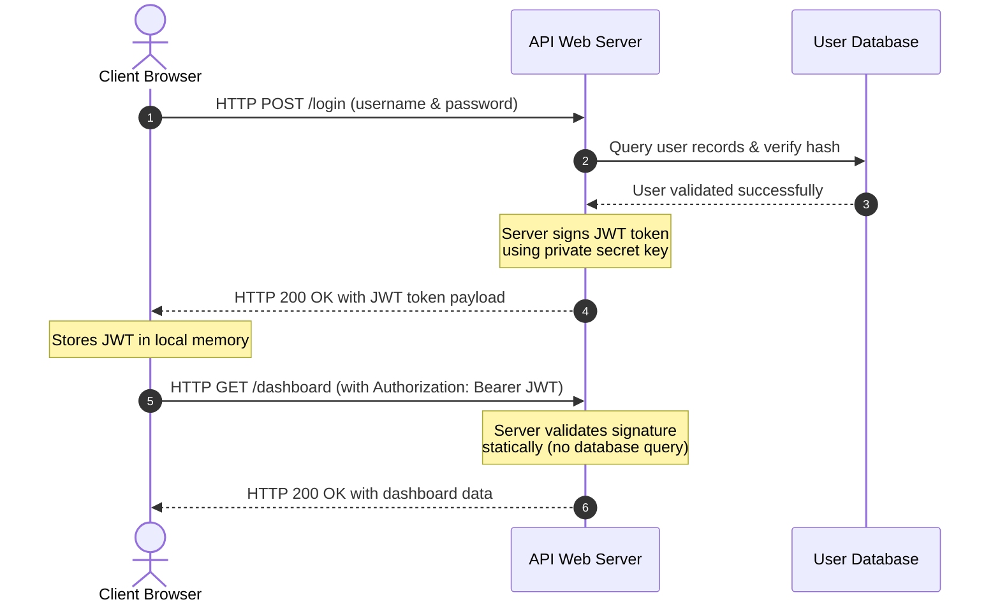

# Module 6: Web Application Fundamentals

Modern applications are distributed systems communicating over HTTP. This module covers monolithic vs. microservices web topologies, frontend web languages, runtime rendering strategies (CSR, SSR, SSG), and the mechanics of web servers and reverse proxies.

---

## 6.1 Monolithic vs. Microservice Architectures

How codebases are organized determines how they scale, fail, and deploy.

### 6.1.1 Monolithic Architecture
A monolith houses all application logic—user authentication, payment processing, database queries, and frontend rendering—inside a single, unified codebase compiled and running as a single process.
*   **Advantages:** Simple to build, test, and deploy initially. Low latency since all code calls are local in memory.
*   **Disadvantages:** Hard to scale individual components (e.g. if payment code needs CPU but user dashboard needs memory, you must scale the entire server). Large codebases lead to longer build times and increase the risk of a single bug crashing the entire application.

### 6.1.2 Microservices Architecture
Microservices break the application down into independent, isolated services, each running its own process and communicating over lightweight protocols (like HTTP REST APIs or gRPC).

```
                      [ Client Browser ]
                              │
            ┌─────────────────┼─────────────────┐ (HTTP Requests)
            ▼                 ▼                 ▼
     [ Auth Service ]  [ Order Service ]  [ Billing Service ]
            │                 │                 │
            ▼                 ▼                 ▼
      [ Auth DB ]        [ Orders DB ]     [ Billing DB ]
```

*   **Advantages:** 
    *   *Scale Isolation:* Scale only the services under heavy load.
    *   *Fault Isolation:* If the billing service crashes, users can still log in and browse products.
    *   *Polyglot Development:* Different services can use different languages and databases.
*   **Disadvantages:** High operational complexity. Introducing network latencies between services requires handling network failures, distributed tracing, and transactional consistency.

---

## 6.2 The Frontend Stack (The House Analogy)

The client-side application runs inside the user's browser. To understand how the three core frontend technologies fit together, think of building a house:
*   **HTML5 is the House Skeleton & Framing:** This defines the structural layout. It puts the walls, door frames, and window slots in place.
*   **CSS3 is the Interior Styling & Paint:** This dictates how the house looks. It applies colors, wallpapers, sets column layouts (Flexbox/Grid), and formats dimensions.
*   **JavaScript is the Infrastructure (Plumbing/Electricity):** This makes the house functional. When you flip a switch, the lights turn on; when you turn a tap, water flows. JS executes active functions (like validating forms, displaying popups, and fetching API data).

### 6.2.1 HTML5 (Structure)
HTML (Hypertext Markup Language) defines the semantic document structure. Modern HTML5 uses descriptive tags (like `<header>`, `<article>`, `<section>`, and `<nav>`) to build accessible Document Object Models (DOM).

### 6.2.2 CSS3 (Presentation)
CSS (Cascading Style Sheets) controls the layout, colors, and typography of the HTML structure.
*   **Flexbox & Grid:** Modern layout engines that allow developers to design fluid, responsive interfaces that adapt dynamically to different screen dimensions.

### 6.2.3 JavaScript (Execution & Concurrency)
JavaScript is a single-threaded, asynchronous programming language that makes web pages interactive.
*   **The Event Loop:** JavaScript executes code sequentially on a call stack. When it hits an asynchronous task (like fetching an API resource or reading a file), it offloads the task to the browser APIs and continues executing. When the async task finishes, its callback enters the Callback Queue and runs when the stack is empty.
*   **Promises & Async/Await:** Modern syntax to write readable asynchronous code:
    ```javascript
    async function getUserProfile(userId) {
        try {
            // Suspends execution until fetch promise resolves
            const response = await fetch(`https://api.com/users/${userId}`);
            if (!response.ok) throw new Error("Network error");
            const data = await response.json();
            console.log("User Profile Loaded:", data);
        } catch (error) {
            console.error("Failed to load user:", error);
        }
    }
    ```

---

## 6.3 Web Application Rendering Strategies (The Restaurant Analogy)

How the browser retrieves and renders HTML and JavaScript impacts performance and search engine optimization. Think of these rendering options as different dining experiences:

### 6.3.1 Client-Side Rendering (CSR)
*   **The Restaurant Analogy:** The server serves you raw ingredients and a recipe (JavaScript bundle) to your table. You (the client browser) cook it yourself at the table.
*   **Process:** The server returns a near-empty HTML file containing a `<script>` tag. The browser downloads the Javascript bundle, executes it, fetches API data, and renders the interface dynamically.
*   *Frameworks:* React (classic SPA), Vue.js, Angular.

### 6.3.2 Server-Side Rendering (SSR)
*   **The Restaurant Analogy:** The restaurant chef cooks the food in the kitchen (Server) on every individual order and serves it hot and ready to eat directly to your table.
*   **Process:** On every page click, the server fetches DB records, compiles the page into an HTML string, and returns it. The browser paints it instantly.
*   *Frameworks:* Next.js, Nuxt.js.

### 6.3.3 Static Site Generation (SSG)
*   **The Restaurant Analogy:** The restaurant pre-cooks all meals in the morning (during the build phase) and puts them on display. When you walk in, they hand you the meal instantly.
*   **Process:** The code is compiled during the deployment build phase, outputting static HTML pages for all routes. The pre-rendered pages are deployed to CDN servers globally.
*   *Frameworks:* Docusaurus, Gatsby, Hugo.

---

## 6.4 Rendering Comparison Matrix

| Strategy | Performance Metrics | SEO Friendliness | Server Compute Costs |
| :--- | :--- | :--- | :--- |
| **CSR (Client-Side Rendering)** | Slow initial load (must download JS bundle); fast subpage transitions. | Poor (crawlers see empty HTML initially). | Zero (assets are static files). |
| **SSR (Server-Side Rendering)** | Fast initial page paint; slower subpage transitions; TTFB dependent on DB. | Excellent (server outputs fully populated HTML). | High (server renders HTML on every click). |
| **SSG (Static Site Generation)** | Fastest load times; near-zero latency; served from CDNs. | Excellent (crawlers see fully populated HTML). | Low (compiled once during build). |

---

## 6.5 Web Servers & Reverse Proxies (Nginx / Apache)

Web servers route incoming HTTP traffic from port 80/443 to target files or application processes.

### 6.5.1 Web Server vs. Application Server
*   **Web Server (Nginx, Apache):** Optimised for serving static files (HTML, CSS, images) and proxying requests. Extremely fast and lightweight.
*   **Application Server (Node.js, Python Gunicorn, Tomcat):** Runs the dynamic application logic, database connections, and business code.

### 6.5.2 Reverse Proxy Configuration
A reverse proxy acts as an intermediary, sitting in front of application servers to protect, load balance, and optimize traffic:

```
 [User Client] ──(HTTPS: 443)──> [Reverse Proxy (Nginx)] ──(HTTP: 3000)──> [Node.js Application]
```

*   **SSL/TLS Termination:** The reverse proxy decrypts incoming HTTPS requests, offloading cryptographic CPU loads, and passes plain HTTP back to the backend application running on localhost.
*   **Static Asset Offloading:** Nginx intercepts requests for static assets (like `/static/logo.png`) and serves them directly from the local disk, bypassing the slower application server.
*   **Example Nginx Reverse Proxy Configuration:**
    ```nginx
    server {
        listen 80;
        server_name example.com;

        # Serve static assets directly
        location /static/ {
            root /var/www/app;
            expires 30d;
        }

        # Proxy all other requests to Node.js backend
        location / {
            proxy_pass http://localhost:3000;
            proxy_set_header Host $host;
            proxy_set_header X-Real-IP $remote_addr;
            proxy_set_header X-Forwarded-For $proxy_add_x_forwarded_for;
        }
    }
    ```

## 6.6 Web Application Security, State Management, & JWT Auth

Modern web applications must protect data integrity, prevent unauthorized resource access, and secure user states across stateless HTTP requests.

### 6.6.1 Web Security Foundations: OWASP Top 10
The Open Worldwide Application Security Project (OWASP) lists the most critical security vulnerabilities found in web applications:
*   **SQL Injection (SQLi):** An attacker injects malicious SQL statements into input fields (like a login username box). If the application code concatenates the string directly into a query (e.g. `SELECT * FROM users WHERE user = '` + input + `'`), the database executes the injected command, potentially exposing or deleting the entire database.
    *   *Mitigation:* Use parameterized queries (Prepared Statements) or Object-Relational Mappings (ORMs).
*   **Cross-Site Scripting (XSS):** An attacker injects malicious client-side JavaScript scripts into a website, which then executes in the browsers of unsuspecting users. XSS is used to steal session cookies or credentials.
    *   *Mitigation:* Sanitize and escape all user inputs before rendering them in the DOM. Use Content Security Policies (CSP).
*   **Cross-Site Request Forgery (CSRF):** Tricking a user's browser into executing an unwanted action on a trusted site where the user is currently authenticated (e.g. initiating a bank transfer on a tab while logged into your bank account).
    *   *Mitigation:* Use CSRF tokens (unique, random tokens verified on every state-changing request) and set cookie attributes to `SameSite=Strict`.
*   **Broken Authentication:** Weak session management or credential validation that allows attackers to compromise accounts or hijack active sessions.

### 6.6.2 CORS (Cross-Origin Resource Sharing)
By default, web browsers enforce the **Same-Origin Policy**, prohibiting a web page from one domain (e.g. `example.com`) from making API requests to another domain (e.g. `api.example.com`).
*   **How CORS works:** When a cross-origin HTTP request is made, the browser automatically sends a pre-flight request (`OPTIONS` verb) to the API server. The server must respond with specific headers allowing the origin:
    *   `Access-Control-Allow-Origin: https://example.com` (Allows only this domain to read responses).
    *   `Access-Control-Allow-Methods: GET, POST, OPTIONS` (Permitted HTTP verbs).
    *   `Access-Control-Allow-Headers: Content-Type, Authorization` (Permitted request headers).
*   If the headers match, the browser allows the actual request to proceed; otherwise, it blocks the response in user space.

### 6.6.3 Session State & Authentication Models
Because HTTP is a **stateless protocol** (each request is treated as independent with no memory of prior calls), applications must explicitly track login states:
*   **Session/Cookie-Based Authentication:**
    1.  User logs in with credentials.
    2.  The server validates credentials, creates a unique session record in its database/memory store, and returns a `session_id` in a `Set-Cookie` header to the browser.
    3.  The browser automatically attaches this cookie to all subsequent requests.
    4.  The server queries its session store on every request to validate the login state.
*   **Token-Based (JWT) Authentication:**
    1.  User logs in with credentials.
    2.  The server validates credentials and generates a signed **JSON Web Token (JWT)** containing user metadata (claims) and an expiration time. The token is cryptographically signed using a private key on the server.
    3.  The token is returned to the browser. The browser stores it in memory or storage.
    4.  The client attaches the JWT to the `Authorization: Bearer <token>` header of every API request.
    5.  The server verifies the cryptographic signature of the token without needing to query a database, allowing stateless, distributed authentication.

### 6.6.4 How It Works: Client-Server JWT Authentication Flow
The following sequence diagram illustrates the stateless request-response verification cycle using JSON Web Tokens:



---

## 6.7 Hands-On Lab: Run a Local Web Server & Test CORS

### Overview
In this lab, you will write a complete Python script that runs a local HTTP Web Server. The server will host two routes: a static homepage and an API endpoint that demonstrates dynamic JSON responses and custom CORS headers.

### Step 1: Create the Web Server Script
Create a new file named `web_server.py` in your workspace and paste the following code:

```python
from http.server import HTTPServer, BaseHTTPRequestHandler
import json

class WebServerHandler(BaseHTTPRequestHandler):
    # Handle GET requests
    def do_GET(self):
        # 1. Route for static welcome page
        if self.path == "/":
            self.send_response(200)
            self.send_header("Content-Type", "text/html; charset=utf-8")
            self.end_headers()
            
            html_content = """
            <!DOCTYPE html>
            <html>
            <head>
                <title>AWS Learning Web Lab</title>
                <style>
                    body { font-family: sans-serif; text-align: center; padding: 50px; background: #faf8f5; }
                    h1 { color: #c05c3d; }
                </style>
            </head>
            <body>
                <h1>Welcome to the Local Web Server Lab</h1>
                <p>Verify API connection: <a href="/api/status">/api/status</a></p>
            </body>
            </html>
            """
            self.wfile.write(html_content.encode("utf-8"))
            
        # 2. Route for API status endpoint
        elif self.path == "/api/status":
            self.send_response(200)
            self.send_header("Content-Type", "application/json")
            
            # CORS Headers - allow requests from any origin for testing
            self.send_header("Access-Control-Allow-Origin", "*")
            self.send_header("Access-Control-Allow-Methods", "GET, OPTIONS")
            self.send_header("Access-Control-Allow-Headers", "Content-Type")
            self.end_headers()
            
            payload = {
                "status": "healthy",
                "version": "1.0.0",
                "message": "Hello from your local Python server!"
            }
            self.wfile.write(json.dumps(payload).encode("utf-8"))
            
        # 3. Fallback route for non-existent pages (404)
        else:
            self.send_response(404)
            self.send_header("Content-Type", "text/plain")
            self.end_headers()
            self.wfile.write(b"404 Not Found")

    # Handle OPTIONS requests (CORS preflight checks)
    def do_OPTIONS(self):
        self.send_response(204)
        self.send_header("Access-Control-Allow-Origin", "*")
        self.send_header("Access-Control-Allow-Methods", "GET, POST, OPTIONS")
        self.send_header("Access-Control-Allow-Headers", "Content-Type")
        self.end_headers()

def run_server(port=8080):
    server_address = ("", port)
    httpd = HTTPServer(server_address, WebServerHandler)
    print(f"Starting local server on port {port}... Access at http://localhost:{port}/")
    try:
        httpd.serve_forever()
    except KeyboardInterrupt:
        print("\nStopping web server. Lab completed.")
        httpd.server_close()

if __name__ == "__main__":
    run_server()
```

### Step 2: Execute the Server
Run the web server from your terminal:
```bash
python web_server.py
```

### Step 3: Test Web Server Response
1.  Open your browser and navigate to: `http://localhost:8080/`. You should see the welcome HTML page.
2.  Navigate to: `http://localhost:8080/api/status`. You should see the JSON payload returned.
3.  Open browser developer tools (F12) and inspect the **Network** tab when calling `/api/status`. Observe the response header: `Access-Control-Allow-Origin: *`.

---

## 6.8 Official Web Documentation & References

To read official specifications and detailed manuals:
*   **MDN Web Docs:** [MDN Web Technology Hub](https://developer.mozilla.org/) - The industry-standard reference for HTML, CSS, JavaScript, DOM, and Web APIs.
*   **Nginx Documentation:** [Nginx Doc Portal](https://nginx.org/en/docs/) - The official manuals for configuring reverse proxies, HTTP load balancing, and SSL servers.
*   **Apache HTTP Server Project:** [Apache HTTPd Docs](https://httpd.apache.org/docs/) - Official manuals for setting up HTTP servers, module configurations, and directories.

---

## Prerequisites

- [Module 5: Database Fundamentals](5-databases.md)

## Recommended Next Topics

- [Module 7: Servers & Infrastructure](7-servers-infrastructure.md)

## Related Topics

- [Beginner Study Roadmap](beginner-roadmap.md)
- [Phase 0: Foundation Bridge Overview](0-intro.md)
- [Module 1: How Computers Actually Work](1-how-computers-work.md)
