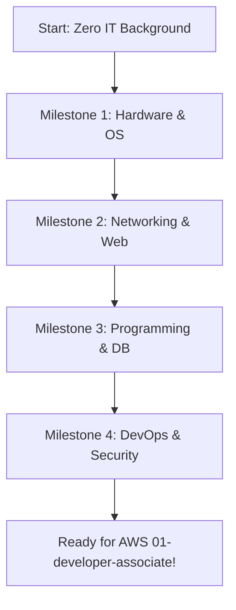

# Beginner Study Roadmap (IT Foundations Bridge)

Welcome to the AWS Study Library! If you are new to information technology, cloud computing, or software engineering, this roadmap is designed for you. It bridges the gap between absolute beginner and AWS Cloud Developer level.

:::note
**Total Estimated Study Time:** 40 Hours
**Pre-requisites:** None
**Objective:** Master operating systems, networking basics, databases, programming principles, and web communication.
:::

---

## The Learning Path

---

## Recommended Study Sequence

### Phase 1: Hardware & Operating Systems (10 Hours)
Get familiar with how hardware coordinates with operating systems.
1. **Computer Architecture & OS Basics** (4 Hours)
   - *Study Page:* [How Computers Work](./1-how-computers-work.md)
   - *Key Focus:* CPU, RAM, disk storage, and process scheduling.
2. **Linux Command Line Fundamentals** (6 Hours)
   - *Study Page:* [Linux Fundamentals](./2-linux-fundamentals.md)
   - *Key Focus:* Navigating the filesystem, changing permissions (`chmod`), searching logs, and piping outputs.
   
:::info
**Milestone Checkpoint 1:** You should be able to spin up a shell (or Git Bash) on your computer, navigate files, edit a text file using a terminal editor, and list running system processes.
:::

---

### Phase 2: Core Networking & Web Infrastructure (12 Hours)
Cloud is essentially "someone else's computer" connected over the internet. You must master the plumbing.
3. **Computer Networks** (6 Hours)
   - *Study Page:* [Networking Fundamentals](./3-networking-fundamentals.md)
   - *Key Focus:* IP Addresses (IPv4 vs IPv6), Subnets, CIDR blocks, TCP/IP vs OSI model, DNS routing, and standard ports.
4. **Web Applications & Protocols** (6 Hours)
   - *Study Page:* [Web Application Fundamentals](./6-web-application-fundamentals.md)
   - *Key Focus:* HTTP methods (GET, POST, PUT, DELETE), status codes (2xx, 3xx, 4xx, 5xx), client-server architecture, and APIs.

:::info
**Milestone Checkpoint 2:** You must understand how a domain name (like `example.com`) resolves to an IP address, and what happens when a browser sends an HTTP request to a server.
:::

---

### Phase 3: Software & Database Foundations (10 Hours)
Learn how application code runs and how structured data is stored.
5. **Programming Principles** (5 Hours)
   - *Study Page:* [Programming Fundamentals](./4-programming-fundamentals.md)
   - *Key Focus:* Variables, conditional logic, loops, basic algorithms, data structures (Arrays, Objects), and JSON syntax.
6. **Database Basics** (5 Hours)
   - *Study Page:* [Database Foundations](./5-databases.md)
   - *Key Focus:* Relational databases (SQL queries, primary/foreign keys) vs. NoSQL document stores (key-value structures).

---

### Phase 4: Infrastructure, Security & DevOps (8 Hours)
Transition from traditional hardware management to modern operations.
7. **Servers & Core Infrastructure** (3 Hours)
   - *Study Page:* [Servers & Infrastructure](./7-servers-infrastructure.md)
   - *Key Focus:* Virtualization, hypervisors, server scaling, load balancing, and high availability.
8. **DevOps & Automation Basics** (3 Hours)
   - *Study Page:* [DevOps Foundations](./8-devops-foundations.md)
   - *Key Focus:* Version Control (Git commits, branches), CI/CD concepts, and Infrastructure as Code.
9. **Basic Security & Cryptography** (2 Hours)
   - *Study Page:* [Security Foundations](./9-security-foundations.md)
   - *Key Focus:* Symmetric/Asymmetric encryption, SSL/TLS certificates, firewalls, and least privilege access.

:::tip
**Final Milestone Checkpoint:** Clone a Git repository, write a basic SQL query to extract user data from a mock table, and sketch a small layout showing how two virtual servers sit behind a network firewall.
:::

---

## Next Steps
Once you check off all checkpoints, you are ready to proceed to your chosen AWS learning track:
- **Developer Associate (DVA-C02) Track:** [Go to AWS Developer Study Plan & Roadmap](../01-developer-associate/dva-roadmap.md)
- **Solutions Architect Associate (SAA-C03) Track:** [Go to AWS Solutions Architect Associate Study Plan & Roadmap](../01-solutions-architect-associate/saa-roadmap.md)
- **Solutions Architect Professional (SAP-C02) Track:** [Go to AWS Solutions Architect Professional Study Plan & Roadmap](../02-solutions-architect-professional/sap-roadmap.md)

---

## Prerequisites

- [IAM: Identity and Access Management](../01-developer-associate/1-aws-fundamentals/iam.md)

## Recommended Next Topics

- [Phase 0: Foundation Bridge Overview](0-intro.md)

## Related Topics

- [Phase 0: Foundation Bridge Overview](0-intro.md)
- [Module 1: How Computers Actually Work](1-how-computers-work.md)
- [Module 2: Linux Fundamentals](2-linux-fundamentals.md)
