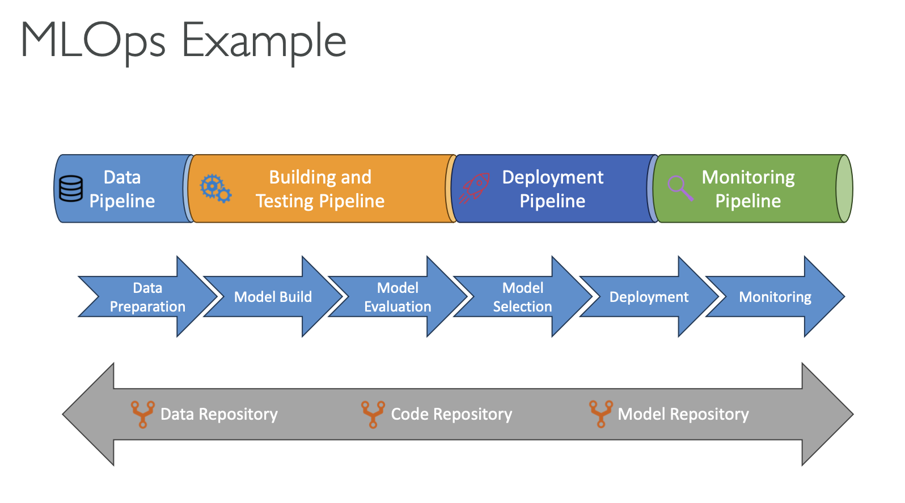

# MLOps (Machine Learning Operations)

- MLOps ensures that AI models are not only built but also deployed, monitored, and improved in a reliable and repeatable manner.
- **Key Concepts**
  - Extension of DevOps principles to machine learning workflows
  - Enables continuous delivery and lifecycle management of models
- Core MLOps Principles
  - **Version Control**: manage versions of data, code, and models with rollback capability
  - **Automation**: of all stages, including data ingestion, pre-processing, training, etc…
  - **Continuous Integration**: test models consistently
  - **Continuous Delivery**: deploy models safely to production
  - **Continuous Retraining**: adapt models to new data and changing conditions
  - **Continuous Monitoring**: track model performance, identify issues, and trigger retraining

---

## Prerequisites

- [Security and Privacy for AI Systems](security-and-privacy.md)

## Recommended Next Topics

- [AWS Security Services and more](../aws-security-services/aws-security-services.md)

## Related Topics

- [Responsible AI and Security](responsible-ai.md)
- [GenAI Capabilities and Challenges](genai-challenges.md)
- [Compliance for AI](compliance.md)
