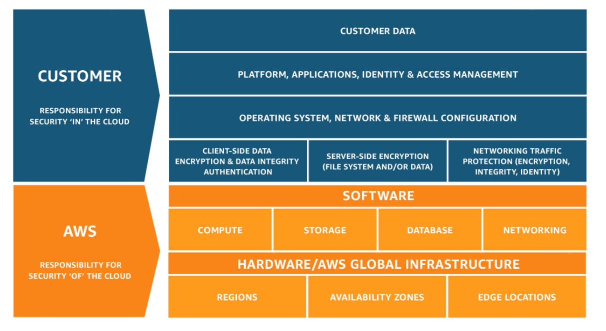
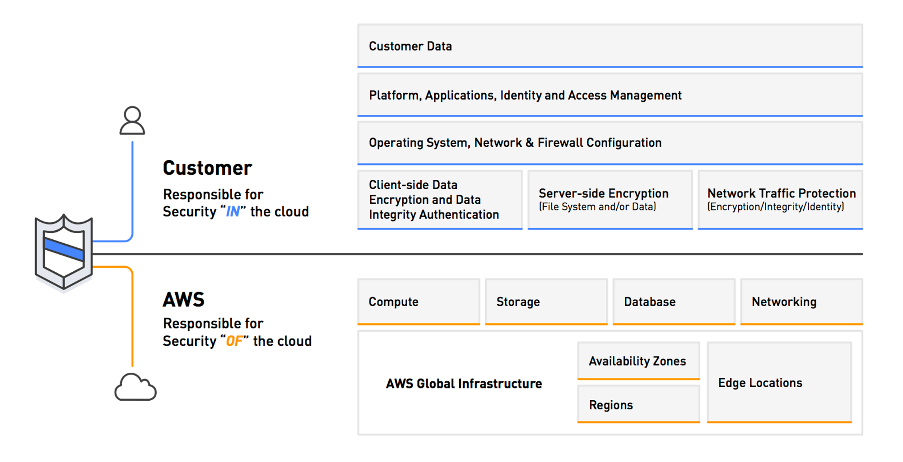

# Security and Privacy for AI Systems

- [Security and Privacy for AI Systems](#security-and-privacy-for-ai-systems)
  - [Monitoring AI systems](#monitoring-ai-systems)
  - [AWS Shared Responsibility Model](#aws-shared-responsibility-model)
  - [Secure Data Engineering – Best Practices](#secure-data-engineering--best-practices)

## Monitoring AI systems

- Performance Metrics
  - Monitoring model behavior ensures accuracy, reliability, and user trust:
  - **Accuracy**: ratio of correct predictions
  - **Precision**: ratio of correct positive predictions among all positive prediction
  - **Recall**: ratio of actual positives correctly identified
  - **F1 Score**: average of precision and recall (good balanced measure)
  - **Latency**: time taken by the model to make a prediction
- **Infrastructure monitoring** (catch bottlenecks and failures)
  - Detect bottlenecks and failures by monitoring:
  - Compute resources (CPU and GPU usage)
  - Network performance
  - Storage
  - System Logs
- Bias and Fairness, Compliance and Responsible AI

## AWS Shared Responsibility Model

- **AWS Responsibility – Security of the Cloud**
  - AWS is responsible for protecting the infrastructure that supports its services, including:
    - Physical data centers, networking, hardware, and software
    - Security of managed services such as Amazon Bedrock, SageMaker, and S3
- **Customer responsibility - Security in the Cloud**
  - Customers are responsible for securing what they build and deploy on AWS:
  - For Bedrock, customer is responsible for data management, access controls, setting up guardrails, etc…
  - Encrypting application and training data
- **Shared Responsibilities:**
  - Some controls are shared between AWS and customers
  - Patch management
  - Configuration management
  - Security awareness and training
  - Awareness and Training

**Source**: [Shared Responsibility Model](https://aws.amazon.com/compliance/shared-responsibility-model/)

## Secure Data Engineering – Best Practices

- **Data Quality Assessment**
  - High-quality data is essential for secure and reliable AI systems:
  - **Completeness**: diverse and comprehensive range of scenarios
  - **Accuracy**: accurate, up-to-date, and representative
  - **Timeliness**: age of the data in a data store
  - **Consistency**: maintain coherence and consistency in the data lifecycle
  - Data profiling and monitoring
  - Data lineage
- **Privacy-Enhancing technologies**
  - Reduce privacy risks using:
    - Data masking and obfuscation
    - Encryption, tokenization to protect data during processing and usage
- **Data Access Control**
  - Comprehensive data governance framework with clear policies
  - Role-based access control and fine-grained permissions to restrict access
  - Single sign-on, multi-factor authentication, identity and access management solutions
  - Monitor and log all data access activities
  - Regularly review and update access rights based on least privilege principles
- **Data Integrity**
  - Ensure data remains accurate and trustworthy
  - Maintain completeness and consistency
  - Implement backup and disaster recovery strategies
  - Maintain data lineage and audit trails
  - Monitor and test the data integrity controls to ensure effectiveness

---

## Prerequisites

- [Governance for AI](governance.md)

## Recommended Next Topics

- [MLOps (Machine Learning Operations)](mlops.md)

## Related Topics

- [Responsible AI and Security](responsible-ai.md)
- [GenAI Capabilities and Challenges](genai-challenges.md)
- [Compliance for AI](compliance.md)
