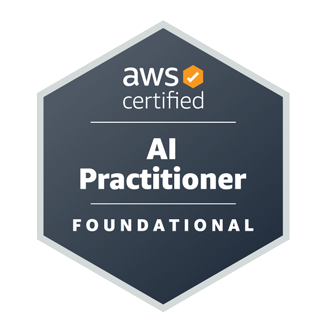

# AWS Certified AI Practitioner (AIF-C01) Study Notes and Practice Tests

This study plan and roadmap will help you for quick revision before the exam.

Below is the step-by-step study path containing detailed notes and practice tests for each section.

## 📅 Step-by-Step Study Phases

### Phase 1: AI/ML Fundamentals

- [AI and Machine Learning Overview](ai-and-ml/ai-and-ml-introduction.md)

### Phase 2: Generative AI & Amazon Bedrock

- [GenAI Introduction](gen-ai/genai-introduction.md)
- [Amazon Bedrock](gen-ai/amazon-bedrock.md)
- [Prompt Engineering](gen-ai/prompt-engineering.md)
- [Amazon Q](gen-ai/amazon-q.md)

### Phase 3: AWS Managed AI Services

- [Introduction of AWS Managed AI Services](aws-managed-ai-services/introduction-of-aws-managed-ai-services.md)
- [Amazon Comprehend](aws-managed-ai-services/aws-comprehend.md)
- [Amazon Translate](aws-managed-ai-services/aws-translate.md)
- [Amazon Transcribe](aws-managed-ai-services/aws-transcribe.md)
- [Amazon Polly](aws-managed-ai-services/aws-polly.md)
- [Amazon Rekognition](aws-managed-ai-services/aws-rekognition.md)
- [Amazon Lex](aws-managed-ai-services/aws-lex.md)
- [Amazon Personalize](aws-managed-ai-services/aws-personalize.md)
- [Amazon Textract](aws-managed-ai-services/aws-textract.md)
- [Amazon Kendra](aws-managed-ai-services/aws-kendra.md)
- [Amazon Mechanical Turk](aws-managed-ai-services/aws-mechanical-turk.md)
- [Amazon Augmented AI (A2I)](aws-managed-ai-services/aws-augmented-ai.md)
- [Hardware for AI](aws-managed-ai-services/ai-hardware.md)
- [AWS Managed AI Services - Quick Revision Summary](aws-managed-ai-services/aws-ai-services-summary.md)

### Phase 4: Amazon SageMaker Deep Dive

- [Amazon SageMaker](sagemaker/aws-sagemaker.md)

### Phase 5: Responsible AI, Security & MLOps

- [Responsible AI and Security](ai-challenges-and-responsibilities/responsible-ai.md)
- [GenAI Capabilities and Challenges](ai-challenges-and-responsibilities/genai-challenges.md)
- [Compliance for AI](ai-challenges-and-responsibilities/compliance.md)
- [Governance for AI](ai-challenges-and-responsibilities/governance.md)
- [Security and Privacy for AI Systems](ai-challenges-and-responsibilities/security-and-privacy.md)
- [MLOps (Machine Learning Operations)](ai-challenges-and-responsibilities/mlops.md)
- [AWS Security Services and more](aws-security-services/aws-security-services.md)

### Phase 6: Reference & Practice

- [AWS Certified AI Practitioner Study Guide](study-guide.md)
- [Glossary of AWS AI Practitioner Exam](glossary.md)
- [Practice Tests Overview](practice-test/tests.md)
- [Practice Test 1](practice-test/practice-test-1.md)
- [Practice Test 2](practice-test/practice-test-2.md)
- [Practice Test 3](practice-test/practice-test-3.md)
- [Practice Test 4](practice-test/practice-test-4.md)
- [Practice Test 5](practice-test/practice-test-5.md)
- [Practice Test 6](practice-test/practice-test-6.md)
- [Practice Test 7](practice-test/practice-test-7.md)

---

## Prerequisites

- None (Start of AI Practitioner track)

## Recommended Next Topics

- [AI and Machine Learning Overview](ai-and-ml/ai-and-ml-introduction.md)

## Related Topics

- [AWS Certified AI Practitioner (AIF-C01) Study Guide](study-guide.md)
- [AWS AI Practitioner Test Study Notes - Glossary](glossary.md)
