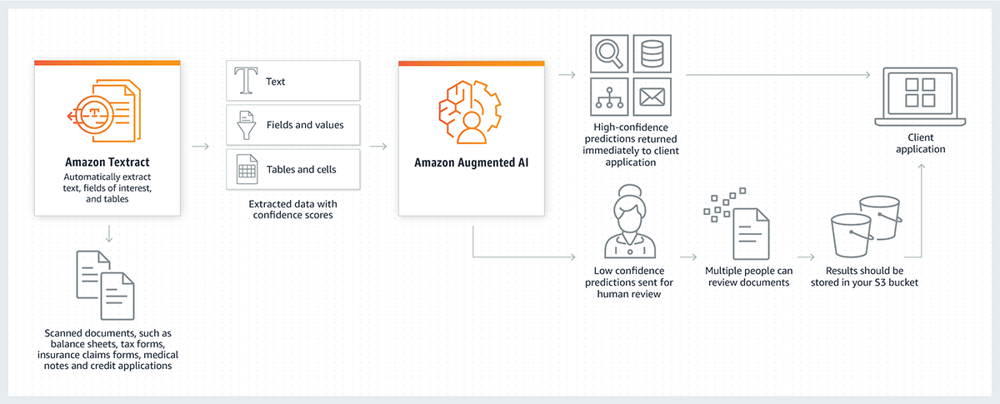

# Amazon Augmented AI (A2I)

- Human review of ML predictions
- Human workers can be our own employees, over 500k AWS contractors or can access the Mechanical Turk workforce of vendors
- Predictions with high confidence are returned immediately, while low confidence predictions are sent for human review.
- Reviewed predictions are stored and fed back into the model to improve its quality.
- Some vendors are pre-screened for confidentiality requirements
- We can builds workflows for reviewing low-confidence predictions
- It is integrated into Amazon Textract and Rekognition
- Integrates with SageMaker
- Similar to SageMaker Ground Truth

[**Source**](https://aws.amazon.com/blogs/machine-learning/amazon-a2i-is-now-generally-available/)

---

## Prerequisites

- [Amazon Mechanical Turk](aws-mechanical-turk.md)

## Recommended Next Topics

- [Hardware for AI](ai-hardware.md)

## Related Topics

- [Introduction of AWS Managed AI Services](introduction-of-aws-managed-ai-services.md)
- [Amazon Comprehend](aws-comprehend.md)
- [Amazon Translate](aws-translate.md)
