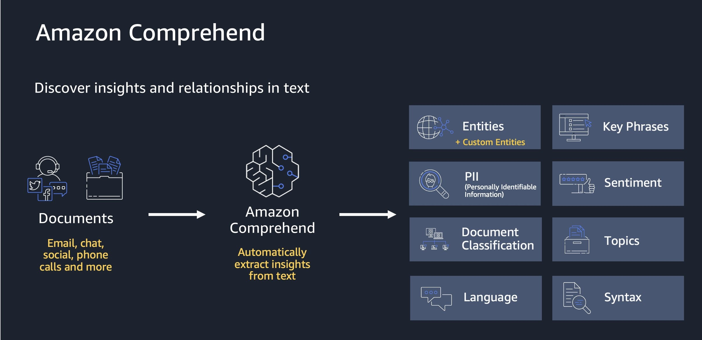
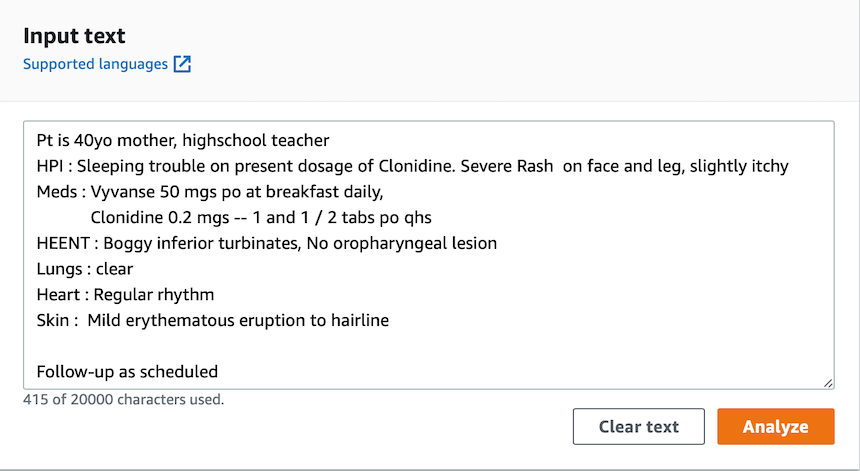
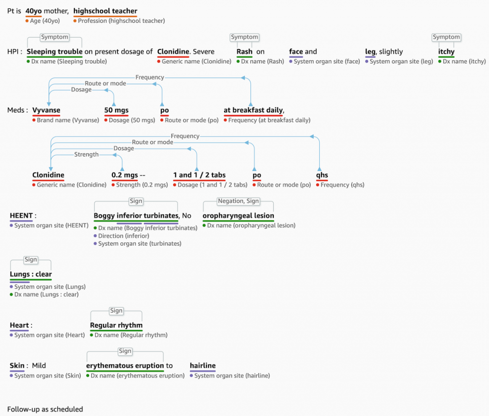

# Amazon Comprehend

- [Amazon Comprehend](#amazon-comprehend)
  - [Overview](#overview)
  - [Why Use Amazon Comprehend?](#why-use-amazon-comprehend)
  - [Custom Classification](#custom-classification)
  - [Named Entity Recognition (NER)](#named-entity-recognition-ner)
  - [Custom Entity Recognition](#custom-entity-recognition)
  - [Amazon Comprehend Medical](#amazon-comprehend-medical)

## Overview

- A fully managed, serverless natural language processing (NLP) service
- It accepts input documents which can come from a wide area of sources such as: social media, email, web pages, raw documents, transcripts, medical records (Comprehend Medical)
- Uses machine learning to find insights and relationships within text
- **Key Capabilities:**
  - Extracts key phrases, entities (people, places, brands, events)
  - Analyzes sentiment (positive or negative)
  - Understands language and performs tokenization
  - Part-of-speech tagging
  - Organizes collections of text files by topics
  - Events detection (mainly about companies)
  - Identifies and redacts PII (Personally Identifiable Information)
  - Targeted sentiment analysis for specific entities
  - Custom classification and entity recognition
- We can train it on our own data
- **Use Cases**
  - **Customer Interaction Analysis**
    - Analyze emails and support tickets to identify factors leading to positive or negative experiences
    - Categorize customer feedback by sentiment and topics
    - Identify common complaint patterns
    - **Content Organization**
      - Group articles by topics that Comprehend automatically uncovers
      - Organize large document collections by theme
      - Discover topics without manual categorization

**Example Workflow:**

[**Source**](https://aws.amazon.com/jp/blogs/news/quickly-build-high-accuracy-generative-ai-applications-on-enterprise-data-using-amazon-kendra-langchain-and-large-language-models/)

## Why Use Amazon Comprehend?

- **Fully Managed**: No infrastructure to maintain
- **Serverless**: Scales automatically
- **Pre-trained Models**: Ready to use out-of-the-box
- **Customizable**: Train on your own data for specific use cases
- **Multiple Analysis Types**: Real-time and asynchronous processing

## Custom Classification

- We can organize documents into categories that we define
- Example: categorize customer emails so that we can provide guidance based on the type of the customer request
- Supports different types of documents (txt, PDF, Word, images)
- **Real-time analysis** on single documents on a synchronous way
- **Asynchronous analysis** on a batch of documents

## Named Entity Recognition (NER)

- NER – Extracts predefined, general-purpose entities like people, places, organizations, dates, and other standard categories, from text
- **Use Cases**
  - Identify key people in a document
  - Extract company names and locations
  - Find dates and times
  - Categorize events and activities

## Custom Entity Recognition

- We can analyze text for specific terms and noun-based phrases
- Can be used to extract terms like policy numbers or phrases that imply a customer escalation, or anything specific to our business
- We can train the model with custom data such as a list of entities and documents that contain them
- It can do real-time or async analysis

## Amazon Comprehend Medical

- Detects and returns useful information in unstructured clinical text:
  - Can understand physician's notes
  - Can discharge summaries
  - Can understand test results and case notes
- **Uses NLP to detect Protected Health Information (PHI)**
- We can store input documents in Amazon S3
- Input data can be analyzed in real-time with the help of Kinesis Data Firehose
- We can use Amazon Transcribe to transcribe patient narratives into text that can be analyzed by Comprehend Medical

**Example Workflow:**

**Input Text:**

**Output Entities:**

[**Source**](https://aws.amazon.com/blogs/aws/new-amazon-comprehend-medical-adds-ontology-linking/)

---

## Prerequisites

- [Introduction of AWS Managed AI Services](introduction-of-aws-managed-ai-services.md)

## Recommended Next Topics

- [Amazon Translate](aws-translate.md)

## Related Topics

- [Introduction of AWS Managed AI Services](introduction-of-aws-managed-ai-services.md)
- [Amazon Translate](aws-translate.md)
- [Amazon Transcribe](aws-transcribe.md)
