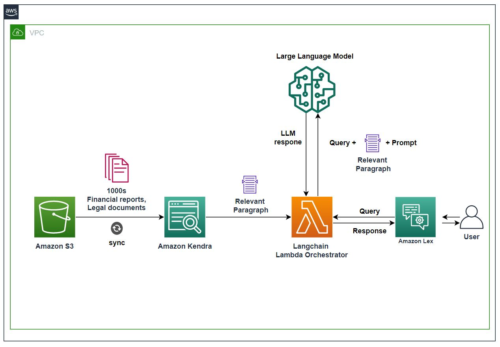

# Amazon Kendra

- Fully managed document search service powered by ML
- It's primary aim is to be designed to mimic interacting with a human expert
- Can extract answers from documents (text, pdf, HTML, PowerPoint, Word, etc.)
- Natural language search capabilities
- Learn from user interactions/feedback to promote preferred results (Incremental Learning)
- Use cases:
  - **Hotel FAQ chatbot**
  - Hotel can have a lot of FAQ's
  - Kendra can be used to index the FAQ's and provide a chatbot to answer questions
  - Example: "What is the check-in time? or do you have a parking lot?"

## Key Concepts

- **Index**: searchable data organized in an efficient way
- **Data Source**: where the data lives, Kendra connects and indexes from this location. Example of data sources are: S3, Confluence, Google Workspaces, RDS, OneDrive, Salesforce, Kendra Web Crawler, Workdocs, FSX, etc.
- We configure Kendra to synchronize a data source with an index based on a **schedule**. This should keep the index current
- **Documents**: can be structured (FAQs) and unstructured (HTML, PDF, etc.)
- Index Document → Kendra(knowledge index powered by ML) → User Question → Kendra → Answer

**Example Workflow:**

[**Source**](https://aws.amazon.com/jp/blogs/news/quickly-build-high-accuracy-generative-ai-applications-on-enterprise-data-using-amazon-kendra-langchain-and-large-language-models/)

---

## Prerequisites

- [Amazon Textract](aws-textract.md)

## Recommended Next Topics

- [Amazon Mechanical Turk](aws-mechanical-turk.md)

## Related Topics

- [Introduction of AWS Managed AI Services](introduction-of-aws-managed-ai-services.md)
- [Amazon Comprehend](aws-comprehend.md)
- [Amazon Translate](aws-translate.md)
