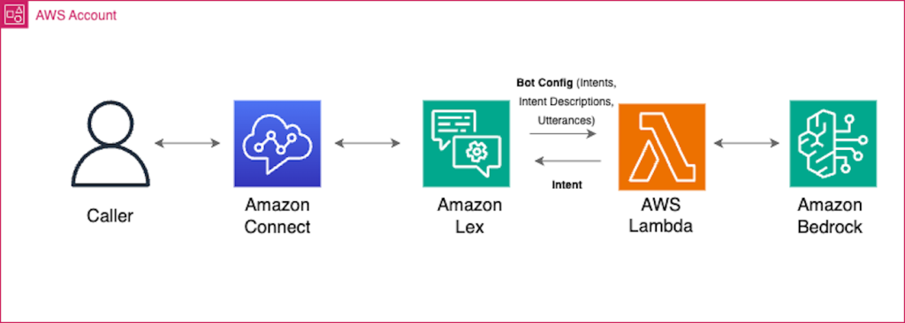

# Amazon Lex

- Build chatbots quickly for your applications using voice and text
- It is a Natural-language chatbot engine
- Supports multiple languages
- A **Bot** is build around **Intents**:
  - **Utterances** invoke intents (e.g., "I want to order a pizza")
  - **Lambda functions** are invoked to fulfill the intent
  - **Slots** specify extra information needed by the intent. Example: pizza size, toppings, crust type, when to deliver, etc.
- Integrates with AWS Lambda, AWS Connect, Comprehend and Kendra

## workflow

- give user intents to Lex
- Lex invokes Lambda functions to fulfill the intent (e.g., "I want to order a pizza")
- Slots specify extra information needed by the intent (e.g., pizza size, toppings, crust type, when to deliver, etc.)
- Lambda functions return the response to Lex(makes the API call to the external service and orders the pizza)
- Lex returns the response to the user (e.g., "Your pizza is on the way")

**Example Workflow:**

[**Source**](https://aws.amazon.com/blogs/machine-learning/enhance-amazon-connect-and-lex-with-generative-ai-capabilities/)

---

## Prerequisites

- [Amazon Rekognition](aws-rekognition.md)

## Recommended Next Topics

- [Amazon Personalize](aws-personalize.md)

## Related Topics

- [Introduction of AWS Managed AI Services](introduction-of-aws-managed-ai-services.md)
- [Amazon Comprehend](aws-comprehend.md)
- [Amazon Translate](aws-translate.md)
