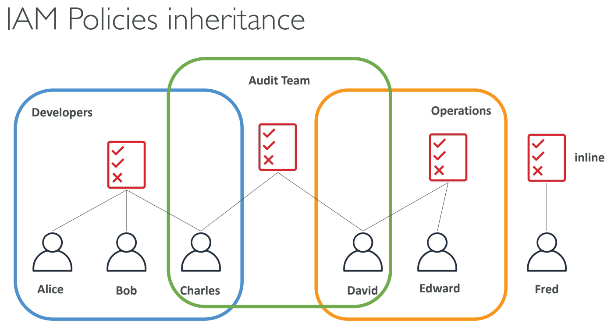
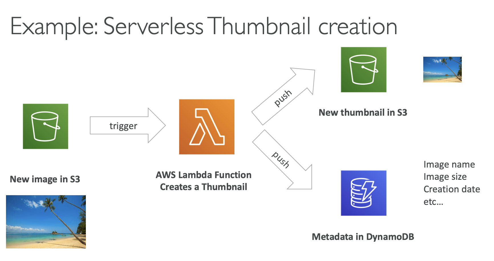

# AWS Security Services and more

- [AWS Security Services and more](#aws-security-services-and-more)
  - [IAM - Identity and Access Management](#iam---identity-and-access-management)
    - [IAM: Permissions](#iam-permissions)
    - [IAM Policies Structure](#iam-policies-structure)
      - [Example IAM Policy](#example-iam-policy)
    - [IAM Roles for Services](#iam-roles-for-services)
  - [Amazon S3 - Simple Storage Service](#amazon-s3---simple-storage-service)
    - [S3 Use cases](#s3-use-cases)
    - [S3 Overview - Buckets](#s3-overview---buckets)
    - [S3 Overview - Objects](#s3-overview---objects)
    - [S3 Storage Classes](#s3-storage-classes)
      - [S3 Standard General Purpose](#s3-standard-general-purpose)
      - [S3 Storage Classes - Infrequent Access](#s3-storage-classes---infrequent-access)
      - [Amazon S3 Glacier Storage Classes](#amazon-s3-glacier-storage-classes)
      - [S3 Intelligent-Tiering](#s3-intelligent-tiering)
    - [S3 Durability and Availability](#s3-durability-and-availability)
  - [Amazon EC2](#amazon-ec2)
    - [EC2 Sizing and Configuration Options](#ec2-sizing-and-configuration-options)
    - [EC2 User Data](#ec2-user-data)
  - [AWS Lambda](#aws-lambda)
    - [Benefits of AWS Lambda](#benefits-of-aws-lambda)
    - [AWS Lambda Language Support](#aws-lambda-language-support)
    - [AWS Lambda Pricing: Example](#aws-lambda-pricing-example)
  - [Amazon Macie](#amazon-macie)
  - [AWS Config](#aws-config)
  - [Amazon Inspector](#amazon-inspector)
  - [AWS CloudTrail](#aws-cloudtrail)
  - [AWS Artifact](#aws-artifact)
  - [AWS Audit Manager](#aws-audit-manager)
  - [AWS Trusted Advisor](#aws-trusted-advisor)
  - [VPC (Virtual Private Cloud)](#vpc-virtual-private-cloud)
    - [Internet Gateway (IGW)](#internet-gateway-igw)
    - [NAT Gateway](#nat-gateway)
    - [VPC Endpoints and PrivateLink](#vpc-endpoints-and-privatelink)
  - [AWS Services for Bedrock](#aws-services-for-bedrock)
  - [AWS Security Services – Section Summary](#aws-security-services--section-summary)

## IAM - Identity and Access Management

- **Identity and Access Management (IAM)** is a web service for securely controlling access to AWS resources.
- Allows you to manage:
  - **Users**: Individual identities who interact with AWS services.
  - **Groups**: Collection of IAM users with similar access permissions.
  - **Roles**: Set of permissions to be assumed by AWS services or applications.
- **IAM: Users & Groups**
- **Users**: Represent individual identities that interact with AWS services. Users have unique credentials (username, password, access keys).
- **Groups**: Logical grouping of users to simplify permission management.
  - Permissions assigned to a group are automatically inherited by its users.
- Flexibility in User Management in IAM, users do not have to belong to a group, and a user can belong to multiple groups.
- This allows user to manage access permissions in a granular and efficient manner.
- For example, a user could belong to both the “QAs" group and the “Developers” group, inheriting permissions from both.



### IAM: Permissions

- **Permissions** are defined using policies.
- Policies specify what actions are allowed or denied on specific resources.
- In AWS you apply the least privilege principle: don't give more permissions than a user needs.
needs
- Policies can be attached to:
  - **Users**
  - **Groups**
  - **Roles**

### IAM Policies Structure

- Policies are JSON documents that define permissions.
- Key elements of a policy:
  1. **Version**: Policy language version (e.g., `2012-10-17`).
  2. **Id**: Optional unique identifier for the policy.
  3. **Statement**: Contains one or more permissions (allow or deny).
  4. **Sid**: Optional unique identifier for the statement.
  5. **Effect**: Either `Allow` or `Deny`.
  6. **Principal**: Specifies the AWS account, user, or role that is allowed or denied access.
  7. **Action**: Specifies which AWS service actions are allowed or denied.
  8. **Resource**: Specifies the AWS resources to which the actions apply.
  9. **Condition**: Specifies the conditions under which the policy is applied.

#### Example IAM Policy

```json
{
  "Version": "2012-10-17",
  "Id": "Policy1234567890",
  "Statement": [
    {
      "Sid": "Stmt1234567890",
      "Effect": "Allow",
      "Principal": {
        "AWS": "arn:aws:iam::123456789012:user/example-user"
      },
      "Action": ["s3:ListBucket", "s3:GetObject"],
      "Resource": "arn:aws:s3:::example-bucket"
    }
  ]
}
```

### IAM Roles for Services

- IAM roles are used to grant permissions to AWS services to perform actions on behalf of users or applications.
- To do so, we will assign permissions to AWS services with IAM Roles
- **Example use cases for IAM roles:**
  1. An EC2 instance can assume a role to access S3 buckets without the need for storing long-term credentials.
  2. Lambda functions can use roles to interact with other AWS services without hardcoding access keys.

## Amazon S3 - Simple Storage Service

### S3 Use cases

- Backup and storage
- Disaster Recovery
- Archive
- Hybrid Cloud storage
- Application hosting
- Media hosting
- Data lakes & big data analytics
- Software delivery
- Static website

### S3 Overview - Buckets

- **Amazon S3 allows people to store objects (files) in "buckets" (directories)**
- Buckets must have a globally unique name (across all regions all accounts)
- Buckets are defined at the region level
- S3 looks like a global service but buckets are created in a region
- **Naming convention**
  - No uppercase
  - No underscore
  - 3-63 characters long
  - Not an IP
  - Must start with lowercase letter or number
  - Must NOT start with the prefix xn--
  - Must NOT end with the suffix -s3alias

### S3 Overview - Objects

- Objects (files) have a Key
- The key is the FULL path:
  - s3://my-bucket/my_file.txt
  - s3://my-bucket/my_folder1/another_folder/my_file.txt
- The key is composed of **prefix** + **object name**
  - s3://my-bucket/my_folder1/another_folder/my_file.txt
- There’s no concept of "directories" within buckets (although the UI will trick you to think otherwise)
- Just keys with very long names that contain slashes ("/")
- Object values are the content of the body:
  - Max Object Size is 5TB (5000GB)
  - If uploading more than 5GB, must use "multi-part upload"
- Metadata (list of text key / value pairs – system or user metadata)
- Tags (Unicode key / value pair – up to 10) – useful for security / lifecycle
- Version ID (if versioning is enabled)

### S3 Storage Classes

- Amazon S3 Standard - General Purpose
- Amazon S3 Standard - Infrequent Access (IA)
- Amazon S3 One Zone - Infrequent Access
- Amazon S3 Glacier Instant Retrieval
- Amazon S3 Glacier Flexible Retrieval
- Amazon S3 Glacier Deep Archive
- Amazon S3 Intelligent Tiering
- Can move between classes manually or using S3 Lifecycle configurations

#### S3 Standard General Purpose

- 99.99% Availability
- Used for frequently accessed data
- Low latency and high throughput
- Sustain 2 concurrent facility failures
- Use Cases: Big Data analytics, mobile & gaming applications, content distribution…

#### S3 Storage Classes - Infrequent Access

- For data that is less frequently accessed, but requires rapid access when needed
- Lower cost than S3 Standard
- **S3 Standard Infrequent Access (S3 Standard-IA)**
  - 99.9% Availability
  - Use cases: Disaster Recovery, backups
- **S3 One Zone Infrequent Access (S3 One Zone-IA)**
  - High durability (99.999999999%) in a single AZ; data lost when AZ is destroyed
  - 99.5% Availability
  - Use Cases: Storing secondary backup copies of on-premise data, or data you can recreate

#### Amazon S3 Glacier Storage Classes

- Low-cost object storage meant for archiving / backup
- Pricing: price for storage + object retrieval cost
- **Amazon S3 Glacier Instant Retrieval**
  - Millisecond retrieval, great for data accessed once a quarter
  - Minimum storage duration of 90 days
- **Amazon S3 Glacier Flexible Retrieval (formerly Amazon S3 Glacier)**
  - Expedited (1 to 5 minutes), Standard (3 to 5 hours), Bulk (5 to 12 hours) – free
  - Minimum storage duration of 90 days
- **Amazon S3 Glacier Deep Archive - for long term storage**
  - Standard (12 hours), Bulk (48 hours)
  - Minimum storage duration of 180 days

#### S3 Intelligent-Tiering

- Small monthly monitoring and auto-tiering fee
- Moves objects automatically between Access Tiers based on usage
- There are no retrieval charges in S3 Intelligent-Tiering
- Frequent Access tier (automatic): default tier
- Infrequent Access tier (automatic): objects not accessed for 30 days
- Archive Instant Access tier (automatic): objects not accessed for 90 days
- Archive Access tier (optional): configurable from 90 days to 700+ days
- Deep Archive Access tier (optional): config. from 180 days to 700+ days

### S3 Durability and Availability

- Durability:
  - High durability (99.999999999%, 11 9’s) of objects across multiple AZ
  - If you store 10,000,000 objects with Amazon S3, you can on average expect to incur a loss of a single object once every 10,000 years
  - Same for all storage classes
- Availability:
  - Measures how readily available a service is
  - Varies depending on storage class
  - Example: S3 standard has 99.99% availability = not available 53 minutes a year

## Amazon EC2

- **Amazon Elastic Compute Cloud (EC2)** is a scalable compute service that allows users to rent virtual servers in the cloud.
- It provides flexibility to scale compute resources up or down based on demand, offering a cost-effective solution for applications with variable workloads.
- Key features include:
  - **On-Demand Instances**: Pay for compute capacity by the hour or second, with no long-term commitments.
  - **Reserved Instances**: Make a one-time payment for a significant discount on instance usage over a one- or three-year term.
  - **Spot Instances**: Bid for unused EC2 capacity at a potentially lower price, allowing cost savings for flexible workloads.

### EC2 Sizing and Configuration Options

- EC2 allows for customized sizing and configurations, which include:
  - **Instance Type**: Selecting the appropriate type based on the application's performance requirements.
  - **Storage Options**: Using Amazon EBS for persistent block storage or instance store for temporary storage.
  - **Networking**: Configuring VPCs, subnets, and security groups to control access and manage traffic.
  - **Elastic Load Balancing**: Distributing incoming traffic across multiple EC2 instances to enhance availability and fault tolerance.
  - **Auto Scaling**: Automatically adjusting the number of instances based on demand, ensuring the application has the necessary resources.
  - Bootstrap script (configure at first launch): EC2 User Data
  - **Firewall rules**: security groups

### EC2 User Data

- **User data** is a powerful feature for automating the setup of EC2 instances.
- It can be specified at instance launch and is executed on the instance when it first boots.
- **bootstrapping** means launching commands when a machine starts
- That script is **only run once** at the instance **first start**
- **Common use cases include**:
  - Installing software packages (e.g., `yum install httpd -y` for Apache).
  - Downloading configuration files or scripts from Amazon S3.
  - Configuring system settings and services (e.g., starting an application server).
- The EC2 User Data Script runs with the root user

## AWS Lambda

- Serverless compute service to run code without managing infrastructure.
- Executes code in response to events (e.g., API calls, file uploads).
- Scales automatically and you only pay for usage.

| **EC2**                                            | **Lambda**                                |
| -------------------------------------------------- | ----------------------------------------- |
| Virtual Servers in the Cloud                       | Virtual functions – no servers to manage! |
| Limited by RAM and CPU                             | Limited by time - short executions        |
| Continuously running                               | Run on-demand                             |
| Scaling means intervention to add / remove servers | Scaling is automated!                     |

### Benefits of AWS Lambda

- **No server management**: AWS handles the infrastructure.
- **Automatic scaling**: Scales based on event triggers.
- **Flexible scaling**: Runs from a few requests per day to thousands per second.
- **Event-driven architecture**: Ideal for apps that need to respond to events.
- Easy Pricing:
  - Pay per request and compute time
  - Free tier of 1,000,000 AWS Lambda requests and 400,000 GBs of compute time
- Integrated with the whole AWS suite of services
- Event-Driven: functions get invoked by AWS when needed
- Integrated with many programming languages
- Easy monitoring through AWS CloudWatch
- Easy to get more resources per functions (up to 10GB of RAM!)
- Increasing RAM will also improve CPU and network!


**Source** [Lambda with S3 Tutorial](https://docs.aws.amazon.com/lambda/latest/dg/with-s3-tutorial.html)

### AWS Lambda Language Support

- Node.js
- Python
- Ruby
- Java
- Go
- .NET Core
- custom runtime (via container images) (community supported, example Rust)
- Lambda Container Image
  - The container image must implement the Lambda Runtime API
  - ECS / Fargate is preferred for running arbitrary Docker images

### AWS Lambda Pricing: Example

- Based on number of requests and execution time.
- You can find overall pricing information here: [Lambda Pricing](https://aws.amazon.com/lambda/pricing/)
- First **1 million requests/month** are free.
- After that, **$0.20 per million requests**.
- **Execution duration**: $0.00001667 for every GB-second used (first 400,000 GB-seconds free per month).
- - Pay per duration: (in increment of 1 ms)
  - 400,000 GB-seconds of compute time per month for FREE
  - == 400,000 seconds if function is 1GB RAM
  - == 3,200,000 seconds if function is 128 MB RAM
  - After that $1.00 for 600,000 GB-seconds
- It is usually **very cheap** to run AWS Lambda so it’s **very popular**

## Amazon Macie

- A security service that uses machine learning to automatically discover, classify, and protect sensitive data in AWS
- Macie recognizes sensitive data such as personally identifiable information (PII) or intellectual property
- Amazon Macie allows you to achieve the following:
  - Identify and protect various data types, including PII, PHI, regulatory documents, API keys, and secret keys
  - Verify compliance with automated logs that allow for instant auditing
  - Identify changes to policies and access control lists
  - Receive notifications when data and account credentials leave protected zones
  - Detect when large quantities of business-critical documents are shared internally and externally

## AWS Config

- Helps with auditing and recording compliance of your AWS resources
- Helps record configurations and changes over time
- Possibility of storing the configuration data into S3 (analyzed by Athena)
- Questions that can be solved by AWS Config:
  - Is there unrestricted SSH access to my security groups?
  - Do my buckets have any public access?
  - How has my ALB configuration changed over time?
- You can receive alerts (SNS notifications) for any changes
- AWS Config is a per-region service
- Can be aggregated across regions and accounts
- **View compliance of a resource over time**
- **View configuration of a resource over time**
- **View CloudTrail API calls if enabled**

## Amazon Inspector

- AWS Inspector is a service that automatically evaluates the security and compliance of your applications on AWS.
- This service scans your applications and identifies potential security vulnerabilities and compatibility issues.
- Creates reports and makes suggestions about detected vulnerabilities and incompatibilities.
- Allows us to run automated security assessments
- For EC2 instances:
  - Requires installation of AWS System Manager (SSM) agent on EC2 instances
  - Inspector will analyze against unintended network accessibility
  - It will analyze the running OS against known vulnerabilities
- For Container Images pushed to Amazon ECR
  - It will assess the images as they are pushed
- For Lambda Functions:
  - Inspector will identify vulnerabilities in function code and package dependencies
  - The assessment happens as the functions are deployed
- Reporting happens with AWS Security Hub, events are created for findings using Amazon EventBridge
- **What does Amazon Inspector evaluate?**
  - Package vulnerabilities (EC2, ECR and Lambda) using a database of CVE
  - Network reachability (EC2)
- Inspector provides a list of predefined packages (rules), users can not create their own
- Packages:
  - Network reachability
  - Security best practices
  - CIS OS security configuration benchmark
  - Common vulnerabilities and exposures
- Duration of inspections can be between 1 and 24 hours
- A risk score is associated with all vulnerabilities for prioritization

## AWS CloudTrail

- Tracks and logs API calls made in your AWS account for auditing and governance.
- Useful for security analysis, compliance, and operational troubleshooting.
- CloudTrail is enabled by default!
- Provides a history of events/API calls made within an AWS account
- It can put logs into CloudWatch Logs or S3
- A trail can be applied to All Regions (default) or a single Region
- In case of a resource deletion, to investigate it (who did it), we have to look inside CloudTrail first
- The default UI only shows create, modify and delete events
- **CloudTrail Trail features:**
  - Logs API calls across AWS services, including CLI, SDK, and Management Console.
  - Tracks who made the call, when, and from where.
  - Ability to store these events in S3 for further analysis
  - It can be region specific or global
- CloudTrail logs are encrypted with SSE-S3 encryption by default when they are stored into S3. There is a possibility to use SSE-KMS encryption
- A CloudTrail log entry contains information about:
  - Who made the request
  - When was the request made and from where
  - What was requested
  - What was the response
- CloudTrail may have a 15 minutes delay to deliver log files into the S3 bucket

## AWS Artifact

- AWS Artifact aims to provide access to **security and compliance documentation** and reports for AWS accounts.
- You can use these documents to support security controls and compliance requirements.
- **Artifact Reports** - Allows you to download AWS security and compliance documents from third-party auditors, like AWS ISO certifications, Payment Card Industry (PCI), and System and Organization Control (SOC) reports
- **Artifact Agreements** - Allows you to review, accept, and track the status of AWS agreements such as the Business Associate Addendum (BAA) or the Health Insurance Portability and Accountability Act (HIPAA) for an individual account or in your organization
- Can be used to support internal audit or compliance

## AWS Audit Manager

- AWS Audit Manager helps assess the compliance and risk posture of your AWS workloads by automating audit-related activities.
- **Key capabilities include:**
  - Continuous evaluation of AWS service usage against compliance requirements
  - Automated collection and organization of audit evidence
  - Simplified preparation for internal and external audits
- AWS Audit Manager provides **prebuilt compliance frameworks**, such as:
  - CIS AWS Foundations Benchmark (v1.2.0 and v1.3.0)
  - General Data Protection Regulation (GDPR)
  - Health Insurance Portability and Accountability Act (HIPAA)
  - Payment Card Industry Data Security Standard (PCI DSS v3.2.1)
  - Service Organization Control 2 (SOC 2)

## AWS Trusted Advisor

- No need to install anything - high level AWS account assessment
- It does analyze an AWS account and provides recommendations regarding:
  - Const optimization
  - Performance
  - Security
  - Fault tolerance
  - Service limits
  - Operational Excellence
- It has 2 tiers:
  - Free tier
  - Business & Enterprise Support plan:
    - For full set of check
    - Programmatic access using AWS support API
- Core checks and recommendations are enabled for all customers
  - We can enable weekly email notifications from the console
- Full Trusted Advices: available for Business and Enterprise support plans
  - Provides the ability to set CloudWatch alarms when limits are reached

## VPC (Virtual Private Cloud)

- **VPC-Virtual Private Cloud**: private network to deploy your resources (regional resource)
- Subnets allow you to partition your network inside your VPC (Availability Zone resource)
- A **public subnet** is a subnet that is accessible from the internet
- A **private subnet** is a subnet that is not accessible from the internet
- To define access to the internet and between subnets, we use Route Tables.

### Internet Gateway (IGW)

- Connects a VPC to the internet.
- Allows instances in the VPC to directly communicate with the internet.
- Essential for a public subnet in a VPC to send/receive traffic to/from the internet.

### NAT Gateway

- Allows instances in a private subnet to initiate outbound traffic to the internet.
- Prevents unsolicited inbound traffic from reaching those instances.
- Used for scenarios where instances need to download patches, updates, etc., but should not be directly accessed from the internet.
- Managed by AWS

### VPC Endpoints and PrivateLink

- AWS Services are by default accessed over the public internet Private subnet
- Applications deployed in Private Subnets in VPC may not have internet access
- **We want to use VPC endpoints**
  - VPC Endpoints allow you to connect to AWS Services using a private network instead of the public network
  - Usually powered by AWS PrivateLink
  - This gives you enhanced security and lower latency to access AWS services
  - Example: your application deployed in a VPC can access Bedrock model privately
- **S3 Gateway Endpoint**
  - Access Amazon S3 privately
  - There’s also an S3 Interface Endpoint
  - Example: SageMaker notebooks can access S3 data privately

## AWS Services for Bedrock

- IAM with Amazon Bedrock
  - Implement identity verification and resource-level access control
  - Define roles and permissions to access Bedrock resources (e.g., data scientists)
- GuardRails for Bedrock
  - Restrict specific topics and use cases in generative AI applications
  - Filter harmful or unsafe content
  - Enforce safety and compliance policies by analyzing user inputs and model outputs
- CloudTrail with Bedrock: Captures and audits API calls made to Amazon Bedrock
- Config with Bedrock: Monitors and tracks configuration changes related to Bedrock resources
- PrivateLink with Bedrock: Keeps Bedrock API traffic within a private VPC, avoiding exposure to the public internet
- IAM Role Requirements for Bedrock
  - Permission to access Amazon S3 for data storage
  - Permission to use AWS KMS keys with decrypt access for encrypted data

## AWS Security Services – Section Summary

- **IAM Users**: mapped to a physical user, has a password for AWS Console
- **IAM Groups**: contains users only
- **IAM Policies**: JSON-based documents that define permissions and can be attached to users, groups, or roles.
- **IAM Roles**: Provide temporary permissions to AWS services (such as EC2) or external identities without using long-term credentials.
- **EC2 Instance**: A compute service composed of an AMI (operating system), instance type (CPU and memory), storage, security groups, and optional user data scripts.
- **AWS Lambda**: A serverless Function-as-a-Service (FaaS) that automatically scales and executes code without managing servers.
- **VPC Endpoint (AWS PrivateLink)**: Enables private connectivity between a VPC and AWS services without traversing the public internet.
- **S3 Gateway Endpoint**: Allows private access to Amazon S3 directly from a VPC.
- **Amazon Macie**: Automatically discovers and classifies sensitive data (such as PII) stored in Amazon S3.
- **AWS Config**: Tracks resource configuration changes and evaluates compliance against defined rules.
- **Amazon Inspector**: Identifies security vulnerabilities in EC2 instances, ECR container images, and Lambda functions.
- **AWS CloudTrail**: Records and monitors API activity across an AWS account for auditing and security analysis.
- **AWS Artifact**: Provides access to AWS compliance reports and agreements (e.g., PCI DSS, ISO).
- **AWS Trusted Advisor**: Offers best-practice recommendations across security, cost optimization, performance, and reliability based on your support plan.

---

## Prerequisites

- [MLOps (Machine Learning Operations)](../ai-challenges-and-responsibilities/mlops.md)

## Recommended Next Topics

- [AWS Certified AI Practitioner (AIF-C01) Study Guide](../study-guide.md)

## Related Topics

- [AI and Machine Learning Overview](../ai-and-ml/ai-and-ml-introduction.md)
- [GenAI Introduction](../gen-ai/genai-introduction.md)
- [Amazon Bedrock](../gen-ai/amazon-bedrock.md)
