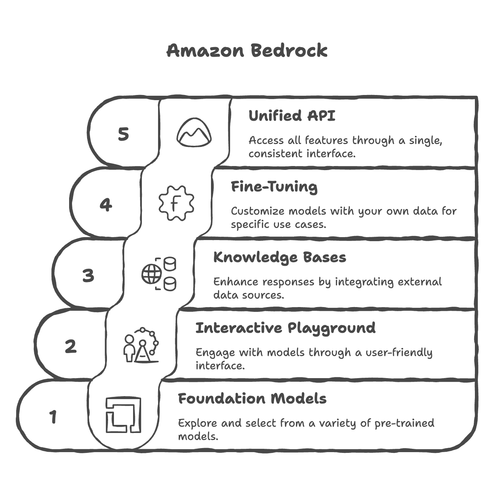
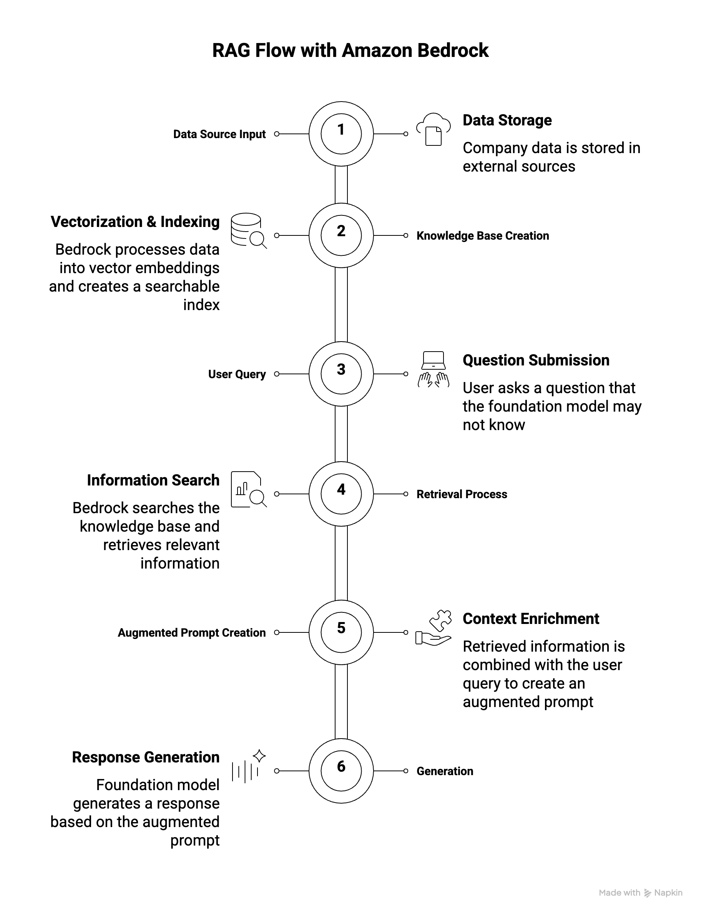

# Amazon Bedrock

- [Amazon Bedrock](#amazon-bedrock)
  - [What is Amazon Bedrock?](#what-is-amazon-bedrock)
  - [Foundation Models](#foundation-models)
    - [How to choose a foundation model?](#how-to-choose-a-foundation-model)
      - [Key Selection Factors](#key-selection-factors)
      - [Important Considerations](#important-considerations)
      - [Model-Specific Details](#model-specific-details)
        - [Amazon Titan](#amazon-titan)
        - [Llama-2 (Meta)](#llama-2-meta)
        - [Claude (Anthropic)](#claude-anthropic)
        - [Stable Diffusion (Stability AI)](#stable-diffusion-stability-ai)
      - [Selection Strategy](#selection-strategy)
  - [Fine-Tuning a Model](#fine-tuning-a-model)
    - [Types of Fine-Tuning](#types-of-fine-tuning)
      - [1. Instruction-Based Fine-Tuning](#1-instruction-based-fine-tuning)
      - [2. Continued Pre-training](#2-continued-pre-training)
      - [3. Single-Turn and Multi-Turn Messaging](#3-single-turn-and-multi-turn-messaging)
    - [Transfer Learning](#transfer-learning)
    - [Use Cases for Fine-Tuning](#use-cases-for-fine-tuning)
  - [Evaluating Foundation Models](#evaluating-foundation-models)
    - [Automatic Evaluation](#automatic-evaluation)
    - [Human Evaluation](#human-evaluation)
  - [What is RAG (Retrieval-Augmented Generation)?](#what-is-rag-retrieval-augmented-generation)
    - [How RAG Works with Amazon Bedrock](#how-rag-works-with-amazon-bedrock)
    - [Benefits of RAG](#benefits-of-rag)
  - [What is a Vector Database?](#what-is-a-vector-database)
    - [Available Vector Database Options](#available-vector-database-options)
    - [Data Sources Supported by Amazon Bedrock](#data-sources-supported-by-amazon-bedrock)
    - [Vector Embeddings and Document Processing](#vector-embeddings-and-document-processing)
    - [Use Cases for Amazon Bedrock with RAG](#use-cases-for-amazon-bedrock-with-rag)
  - [RAG vs Fine-Tuning Comparison](#rag-vs-fine-tuning-comparison)
  - [When to Use RAG vs Fine-Tuning](#when-to-use-rag-vs-fine-tuning)
  - [Guardrails](#guardrails)
  - [Bedrock Agents](#bedrock-agents)
  - [Bedrock - Other Features](#bedrock---other-features)
  - [Amazon Bedrock \& CloudWatch](#amazon-bedrock--cloudwatch)
  - [Pricing](#pricing)
    - [Pricing Modes](#pricing-modes)
    - [Cost Impact of Model Improvement Approaches](#cost-impact-of-model-improvement-approaches)
    - [Cost Optimization Strategies](#cost-optimization-strategies)

## What is Amazon Bedrock?

- **Primary service on AWS** for building generative AI applications
- A fully managed service with no infrastructure or service management required
- **Data Control & Privacy**: All data remains within your AWS account and never leaves—ensuring complete privacy and security
- Operates on a **pay-per-use pricing model** (no upfront commitment)
- Provides a **unified standardized API** for consistent access across all models
- Leverages a **wide array of foundation models** from multiple providers
- Offers advanced out-of-the-box features:
  - Retrieval-Augmented Generation (RAG)
  - LLM Agents
  - Knowledge Bases
- Built-in capabilities for **security, privacy, governance, and responsible AI**
- Users focus on applications while AWS manages the infrastructure



## Foundation Models

- Amazon Bedrock hosts foundation models from multiple providers with AWS agreements:
  - AI21 Labs
  - Cohere
  - Stability.ai
  - Amazon
  - Anthropic
  - Meta
  - Mistral AI
  - Reference: [Models Supported](https://docs.aws.amazon.com/bedrock/latest/userguide/models-supported.html)
- Additional providers and models continue to be added over time
- **Model Isolation**: When you select a foundation model, Amazon Bedrock creates an exclusive copy accessible only within your account
- **Fine-tuning Support**: Some models can be fine-tuned with your own data for specific use cases
- **Data Privacy Guarantee**: None of your data is sent to model providers for training the original foundation models—all operations occur solely within your account
- The model copy can be customized to better suit specific needs without affecting the original foundation model

### How to choose a foundation model?

#### Key Selection Factors

The choice of foundation model depends on multiple factors:

- **Model Type & Performance**: Different models excel at different tasks
- **Capabilities**: What the model can and cannot do
- **Constraints & Compliance**: Business and regulatory requirements
- **Customization Options**: Ability to fine-tune with your own data
- **Model Size & Inference Capabilities**: How outputs are generated (affects speed and resource usage)
- **Licensing Agreements**: Commercial use restrictions or requirements
- **Context Window**: Maximum amount of data you can send to the model (important for large documents/codebases)
- **Latency**: Response speed and performance
- **Multimodal Support**: Can the model handle multiple input types (text, audio, video, images) and produce multiple output types?

#### Important Considerations

- **Trade-offs**: Smaller models are more cost-effective but have less knowledge and capability
- **Testing is Essential**: There is no definitive answer; you must test models with your specific inputs and use cases
- **Language Support**: Different models support different languages
- **Cost Accumulation**: AI usage costs can accumulate rapidly, so pricing is a key consideration

#### Model-Specific Details

##### Amazon Titan

- High-performing foundation model directly from AWS (important for AWS certification)
- Supports multimodal inputs (text, images)
- Customizable through fine-tuning with your own data
- Cost-effective option
- Best for: Content generation, text classification, educational use cases

##### Llama-2 (Meta)

- Good for large-scale tasks and dialogue
- More expensive than Amazon Titan but cheaper than Claude
- 4,000 token limit (moderate context window)
- Best for: Technical content generation, customer service applications

##### Claude (Anthropic)

- Excellent for analysis, forecasting, and detailed document comparison
- **Largest context window (200,000 tokens)** - can process entire books, large codebases
- Most expensive option
- Best for: Complex analysis tasks, research, large document processing

##### Stable Diffusion (Stability AI)

- Image generation only
- Charged per image generated
- Best for: Advertising, media creation, visual content generation

#### Selection Strategy

1. **Identify Your Requirements**: Determine if you need text, images, or multimodal capabilities
2. **Check Language & Context Needs**: Do you need 100+ language support or large context windows?
3. **Consider Use Cases**: Match model strengths to your specific applications
4. **Factor in Cost**: Balance capabilities with pricing for your projected usage
5. **Test Thoroughly**: Validate model performance with your actual inputs and expected outputs before committing to production

## Fine-Tuning a Model

- Adapt a copy of a foundation model by adding your own training data
- **How It Works**: Fine-tuning changes the underlying **weights** of the base foundation model to better suit your specific needs
- **Training Data Requirements**:
  - Must adhere to a **specific format** (depends on fine-tuning type)
  - Must be stored in **Amazon S3**
- **Output**: A fine-tuned version of the foundation model that incorporates your data

### Types of Fine-Tuning

#### 1. Instruction-Based Fine-Tuning

- Improve performance on domain-specific tasks using labeled examples

- **Data Format**:
  - Requires **labeled data** as prompt–response pairs
  - Each example includes a prompt and expected completion

**Example**:

```text
Prompt: what is aws?
Completion: AWS stands for Amazon Web Services — it’s Amazon’s cloud computing platform that provides a wide range of on-demand IT services over the internet.
```

- **Benefits**:
  - Shows the model **how you want it to answer** specific questions
  - Aligns **tone and structure** of responses
  - Teaches domain-specific communication patterns
  - Usually **cheaper** because computations are less intense and less data is required
  - **Use Case**: Teaching a model specific answering style for customer service or specialized tasks

#### 2. Continued Pre-training

- Make a foundation model an expert in a specific domain
- **Data Format**:
  - Requires **unlabeled data** only (no prompt–response pairs)
  - Dataset contains inputs only—the model learns from raw information
  - Can be large documents or entire knowledge bases
- **Example**:
  - Feed entire AWS documentation to a model
  - After training, the model becomes an AWS expert
- **Benefits**:
  - Model learns specialized knowledge in a specific field
  - Can incrementally add more domain-specific data over time
  - Adapts to evolving information in your domain
- **Use Cases**:
  - Financial documents with industry-specific terminology
  - Medical literature for healthcare applications
  - Company proprietary knowledge bases
- **Note**: Usually **more expensive** than instruction-based fine-tuning due to higher computational requirements

#### 3. Single-Turn and Multi-Turn Messaging

- Subsets of instruction-based fine-tuning focused on conversational behavior
- **Data Format**:
  - Each message has a **role** (system, user, or assistant) and **content** (text)
  - Optional **system role** provides context for the conversation

**Example Structure**:

```text
System: You are a helpful customer service assistant.
User: What are your support hours?
Assistant: We're available 24/7 to assist you.
User: How do I reset my password?
Assistant: You can reset your password by clicking "Forgot Password" on the login page.
```

### Transfer Learning

- Using a pre-trained model to adapt it to a new but related task
- **Key Concept**:
  - Foundation models already have base knowledge (recognize patterns, process language, etc.)
  - Transfer learning leverages this knowledge for specialized applications
  - **Fine-tuning is a specific type of transfer learning**
- **Examples**:
  - Image Classification: Pre-trained model knows edges/shapes → fine-tune to recognize specific image classes
  - NLP Tasks: Model understands language → transfer to domain-specific tasks

### Use Cases for Fine-Tuning

Common scenarios where fine-tuning is beneficial:

1. **Chatbot Personalization**
   - Create a chatbot with a particular persona, tone, or brand voice
   - Example: Customer service bot with friendly, empathetic tone

2. **Purpose-Specific Adaptation**
   - Adapt a model for specific business purposes
   - Examples: Customer assistance, advertisement creation, technical support

3. **Proprietary Data Integration**
   - Train with exclusive data the foundation model doesn't have access to
   - Examples: Historical emails, internal messages, customer service records, company procedures

4. **Targeted Tasks**
   - Specialized applications like text categorization or accuracy assessment
   - Domain-specific classification tasks

## Evaluating Foundation Models

- Sometimes you need to evaluate a model rigorously before selection or deployment
- Amazon Bedrock provides **Automatic Evaluation** feature to assess models for quality control
- Evaluation helps measure **accuracy, speed, efficiency, and scalability** of models
- Can detect **bias and potential discrimination** against groups of people
- Ensures model quality, fairness, and effectiveness in real-world applications
- We can have business metrics top evaluate a model on:
  - **Uses Satisfaction**: gather use feedback and asses their satisfaction with the model responses
  - **Average Revenue Per Use (ARPU)**: we can compute the average revenue per user attributed to the GenAI app (monitor ecommerce user base revenue)
  - **Cross-Domain Performance**: measure the model's ability to perform cross different domain tasks (example monitor multi-domain ecommerce platforms)
  - **Conversion Rate**: generate recommended desired outcomes such as purchases
  - **Efficiency**: evaluate the model's efficiency in computation, resource utilization

### Automatic Evaluation

- Uses **benchmark questions** and **benchmark answers** representing ideal responses
- The model to be evaluated generates answers to benchmark questions
- A **judge model** (another generative AI model) compares generated answers with benchmark answers
- The judge model assigns a **grading score** based on similarity and quality
- Built-in task types:
  - Text summarization
  - Question and answer
  - Text classification
  - Open-ended text generation
- **Prompt Datasets**
  - **Your own custom prompt datasets** (tailored to your specific needs)
  - **AWS built-in curated prompt datasets** (pre-validated collections)
- Scores are calculated automatically
- There are different ways to calculate this grading score suing various statistical methods (example BERTScore, F1 score)

### Human Evaluation

- Benchmark questions and answers are reviewed by **humans** (not automated)
- Evaluators compare benchmark answers to model-generated answers
- Humans judge correctness based on domain expertise and business criteria
- This work team can be employees of our company or subject-matter experts (SMEs)
- We define metrics and how to evaluate a model: thumbs up/down, ranking, etc.
- We can chose from built-in task types (same as with automatic evaluation) or add custom task types

## What is RAG (Retrieval-Augmented Generation)?

- **Definition**: Allows a foundation model to reference data sources **outside of its training data** without requiring fine-tuning
- **Key Advantage**: Enables models to access **up-to-date and specific information dynamically**
- **Use Case**: Perfect for company-specific data or frequently updated information
- **Comparison to Fine-Tuning**: RAG doesn't require retraining; it retrieves data at query time
- This data source is usually stored in a **vector database**

### How RAG Works with Amazon Bedrock

1. **Data Source Input**
   - Your data is stored in external sources (e.g., Amazon S3, Confluence, SharePoint)
   - Example: Company documents, product information, customer records

2. **Knowledge Base Creation**
   - Amazon Bedrock automatically processes your data from the source
   - Data is converted into **vector embeddings** via a vector database
   - Creates a searchable index of your data

3. **User Query**
   - User asks: "Who is the product manager for John?"
   - Foundation model may not have this company-specific information in its training data

4. **Retrieval Process**
   - A search is performed within the knowledge base
   - Relevant information is fetched from the vector database using similarity matching
   - Example results: John's details, support contacts, **product manager: Bob**, engineer: Sara

5. **Augmented Prompt Creation**
   - Retrieved information is combined with the original user query
   - Augmented prompt now contains both the question and relevant context
   - This enriched prompt is sent to the foundation model

6. **Generation**
   - Foundation model generates a response based on the augmented prompt
   - Response: "Jessie Smith is the product manager for John."



### Benefits of RAG

- **Real-Time and Up-to-Date Data**: Feed current information without retraining
- **Cost-Effective**: No fine-tuning required; use base models
- **Company-Specific Information**: Retrieve proprietary data not in foundation model training
- **Dynamic Content**: Access latest documents, PDFs, and information automatically
- **Scalability**: Add new data sources without model retraining

## What is a Vector Database?

- Store **vector embeddings** of your documents for efficient retrieval
- Enable **similarity search** to find relevant information based on meaning, not exact keywords
- Created automatically by Bedrock from your data sources
- Support **nearest neighbor (KNN) search** for fast information retrieval

### Available Vector Database Options

- AWS-Native Options

| Service                       | Description                                               | Best For                                                    |
| ----------------------------- | --------------------------------------------------------- | ----------------------------------------------------------- |
| **Amazon OpenSearch Service** | Serverless/managed clusters, real-time search & analytics | Production RAG, millions of embeddings, scalable KNN search |
| **Amazon Aurora**             | Relational database with vector support                   | Relational data structures, existing Aurora environments    |
| **Amazon Neptune Analytics**  | Graph database service                                    | Graph-based RAG (GraphRAG), relationships between entities  |
| **Amazon S3 Vectors**         | Cost-effective vector storage in S3                       | Cost-optimized scenarios, sub-second query performance      |

- External Options

- **MongoDB**: Document database with vector search capabilities
- **Redis**: In-memory database for fast vector operations
- **Pinecone**: Specialized vector database service (third-party)

### Data Sources Supported by Amazon Bedrock

Amazon Bedrock can ingest data from multiple sources:

- **Amazon S3**: Cloud file storage (documents, PDFs, etc.)
- **Confluence**: Wiki and collaboration platform
- **Microsoft SharePoint**: Enterprise content management
- **Salesforce**: CRM data and customer information
- **Webpages**: Websites, social media feeds, public content
- **Future**: More data sources expected to be added over time

### Vector Embeddings and Document Processing

- **Embedding Models**: Convert data (text, images) into numerical vectors
  - Available embedding models: Amazon Titan, Cohere
  - Embedding model can be different from the foundation model
- **Document Chunking**: Documents are split into chunks before vectorization
  - Improves retrieval relevance and efficiency
  - Smaller chunks = more precise matches
- **Searchability**: Vectors are easily searchable using similarity queries
- **Semantic Search**: Find relevant information based on meaning, not just keywords

### Use Cases for Amazon Bedrock with RAG

- **Customer Service Chatbot**
  - **Knowledge Base Contains**:
    - Product information and specifications
    - Features and capabilities
    - Troubleshooting guides
    - Frequently asked questions (FAQs)
  - **How It Works**:
    - Customer asks: "How do I troubleshoot error code 404?"
    - System retrieves relevant troubleshooting guide from knowledge base
    - Chatbot provides accurate, specific answer
  - **Benefits**: Real-time product information, consistent responses, reduced support load

- **Legal Research and Analysis**
  - **Knowledge Base Contains**:
    - Laws and regulations
    - Case precedents
    - Legal opinions
    - Expert analysis
  - **How It Works**:
    - Lawyer queries: "What are the precedents for contract violations in tech?"
    - System retrieves relevant case law and legal opinions
    - Provides comprehensive analysis with citations
  - **Benefits**: Fast legal research, consistent interpretation, up-to-date statutes

- **Healthcare Question Answering**
  - **Knowledge Base Contains**:
    - Disease information and treatment options
    - Clinical guidelines
    - Research papers
    - Previous patient data (anonymized)
  - **How It Works**:
    - Medical professional asks: "What are the latest treatment options for diabetes?"
    - System retrieves latest clinical guidelines and research
    - Provides evidence-based answers
  - **Benefits**: Access to latest medical research, evidence-based recommendations, quick decision support

## RAG vs Fine-Tuning Comparison

| Aspect                    | RAG                              | Fine-Tuning                       |
| ------------------------- | -------------------------------- | --------------------------------- |
| **Data Update Frequency** | Real-time                        | Requires retraining               |
| **Implementation Speed**  | Immediate                        | Time-consuming                    |
| **Cost**                  | Lower (no retraining)            | Higher (computation)              |
| **Data Size**             | Can handle large datasets        | Limited by training data          |
| **Model Changes**         | No model modification            | Model weights updated             |
| **Best For**              | Dynamic, frequently-updated data | Static, domain-specific knowledge |

## When to Use RAG vs Fine-Tuning

- **RAG**:
  - Company-specific, proprietary data
  - Frequently updated information
  - Large document collections
  - Multiple data sources
  - Need for latest information

- **Fine-Tuning**:
  - Improve model tone/style
  - Build domain expertise
  - Permanent knowledge integration
  - Limited external data sources

## Guardrails

- Control interaction between users and foundation models
- **Primary Functions**:
  - Filter undesirable and harmful content
  - Remove Personally Identifiable Information (PII) - Names, emails, phone numbers, SSN, credit cards, etc.
  - Reduce hallucinations by enforcing fact-based responses
  - Maintain response quality and compliance
- **Architecture**: Multiple guardrails at multiple levels
  - Input layer: Filter user requests before processing
  - Processing layer: Control model behavior
  - Output layer: Sanitize responses before returning to users
- **Monitoring**: Track and analyze guardrail violations to refine rules and ensure proper calibration
- **Key Benefits**: Safety, privacy, reliability, compliance, transparency

## Bedrock Agents

- We can create agents that will fulfill users' requests, invoke specific APIs automatically based on the needs
- Intelligent entities that think and act autonomously to perform multi-step tasks
  - Not just answering questions - they execute complex workflows
  - Can create infrastructure, deploy applications, perform operations
  - Think and act autonomously without explicit programming for each task
- Define what actions agents can perform
  - Integrate with APIs, Lambda functions, databases, and external systems
  - Can exchange data or initiate actions automatically
  - Define expected inputs
- **Agent Responsibilities**:
  - Example: Access customer purchase history → Provide recommendations → Place new orders
  - Agent understands these responsibilities and acts accordingly
- **How Agents Work** (Chain of Thought Approach):
  1. Agent receives task and examines: prompt, conversation history, available actions, knowledge bases
  2. Sends request to Bedrock Foundation Model to generate action plan
  3. Model outputs step-by-step instructions
  4. Agent executes steps sequentially (calling APIs, searching knowledge bases)
  5. Results returned to Bedrock model for synthesis
  6. Final response generated and returned to user

## Bedrock - Other Features

- Bedrock Studio:
  - It is an UI that we can provide to our team so they can create AI powered applications easily
- Watermark detection:
  - Check if an image was generated by Amazon Titan Generator

## Amazon Bedrock & CloudWatch

- Amazon Bedrock integrates with CloudWatch for comprehensive cloud monitoring
- **Model Invocation Logging**:
  - Captures all model invocations (inputs and outputs)
  - Data types: text, images, embeddings
  - Storage destinations: CloudWatch Logs or Amazon S3
  - Provides complete history of all Bedrock activities
- **CloudWatch Logs Insights**:
  - Real-time analysis of logs stored in CloudWatch Logs
  - Full tracing and monitoring capabilities
  - Build alerting mechanisms based on logs
- **CloudWatch Metrics**:
  - Bedrock publishes various metrics to CloudWatch Metrics
  - **General usage metrics**: Track overall Bedrock usage
  - **Feature-specific metrics**:
    - Example: "Content Filtered Count" - tracks guardrail filtering
    - Shows if content was blocked due to guardrail policies
- **CloudWatch Alarms**:
  - Create alarms to get notified when events occur
  - Example: Alert when content is caught by guardrails
  - Monitor specific thresholds for any metric
  - Enables proactive monitoring and operational excellence
- **Use Cases**: Operational monitoring, compliance tracking, guardrail effectiveness analysis, security monitoring

## Pricing

### Pricing Modes

- **On-Demand Mode**:
  - Pay-as-you-go (no long-term commitment)
  - Text models: charged for every input/output token processed
  - Embedding models: charged for every input token processed
  - Image models: charged for every image generated
  - Works with Base models only
  - Ideal for unpredictable workloads

- **Batch Mode**:
  - Process multiple predictions at once
  - Output delivered as single file in Amazon S3
  - Responses are delayed (not real-time)
  - Offers up to 50% discount
  - Cost-effective for non-urgent workloads

- **Provisioned Throughput**:
  - Purchase model units for fixed period (1 month, 6 months, etc.)
  - Guarantees max input/output tokens per minute
  - Ensures consistent capacity and performance
  - Works with Base, Fine-tuned, Custom, and Imported models
  - Required for fine-tuned and custom models (cannot use On-Demand)

### Cost Impact of Model Improvement Approaches

| Approach                          | Cost     | Details                                                  |
| --------------------------------- | -------- | -------------------------------------------------------- |
| **Prompt Engineering**            | Very Low | No fine-tuning needed, optimize prompts only             |
| **RAG**                           | Moderate | Costs for vector database and access system              |
| **Instruction-Based Fine-Tuning** | Medium   | Less intensive computation, labeled data                 |
| **Full Fine-Tuning**              | High     | Most expensive, domain-specific training, unlabeled data |

### Cost Optimization Strategies

- **Token Management** (Primary cost):
  - Efficient prompt design
  - Concise outputs
  - Minimize input/output tokens
- **Model Size**: Smaller models generally cost less (varies by provider)
- **Parameter Tuning**: Does NOT affect pricing
  - Temperature, Top K, Top P don't impact cost
  - Only affects model behavior
- **Batch Mode**: Use for non-urgent workloads (up to 50% savings)
- **On-Demand**: For unpredictable/variable workloads
- **Provisioned Throughput**: For predictable, sustained usage

---

## Prerequisites

- [GenAI Introduction](genai-introduction.md)

## Recommended Next Topics

- [Prompt Engineering](prompt-engineering.md)

## Related Topics

- [GenAI Introduction](genai-introduction.md)
- [Prompt Engineering](prompt-engineering.md)
- [Amazon Q](amazon-q.md)
