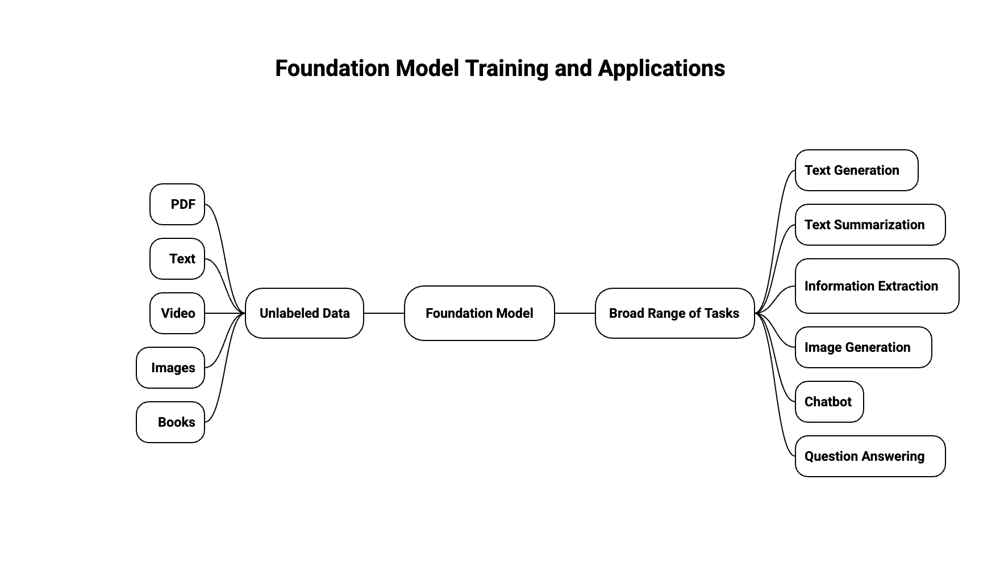

# GenAI Introduction

- [GenAI Introduction](#genai-introduction)
  - [What is Generative AI?](#what-is-generative-ai)
    - [How it differs from traditional AI](#how-it-differs-from-traditional-ai)
    - [Real-world applications](#real-world-applications)
    - [Why it's revolutionary](#why-its-revolutionary)
  - [Foundation Model](#foundation-model)
  - [Large Language Models](#large-language-models)
    - [What makes them "large"](#what-makes-them-large)
    - [How to use them](#how-to-use-them)
    - [Important characteristics](#important-characteristics)
    - [Popular LLM examples](#popular-llm-examples)
  - [Generative Language Models](#generative-language-models)
    - [The way they work](#the-way-they-work)
    - [Example of next-word prediction](#example-of-next-word-prediction)
    - [Key characteristics](#key-characteristics)
    - [How they're trained](#how-theyre-trained)
    - [The power of generative models](#the-power-of-generative-models)
  - [GenAI for Images](#genai-for-images)
    - [How diffusion models work](#how-diffusion-models-work)
    - [What they can do](#what-they-can-do)

## What is Generative AI?

- Generative AI is a branch of Deep Learning
- The idea is simple: you train a model on existing data, and it learns to create new data that looks similar
- Think of it like teaching someone to paint by showing them thousands of paintings
- Once trained, it can create brand new content that follows the same patterns

### How it differs from traditional AI

- Traditional AI: Analyzes and classifies existing data ("Is this a cat or dog?")
- Generative AI: Creates new data ("Generate a picture of a cat playing piano")
- It's like the difference between sorting mail and writing letters

### Real-world applications

- Chatbots: Having conversations (ChatGPT, Claude)
- Code generation: Writing code from descriptions (GitHub Copilot)
- Image creation: Making art and photos (DALL-E, Midjourney)
- Music composition: Creating original music
- Content writing: Blogs, emails, marketing copy
- Video generation: Creating video clips from text

### Why it's revolutionary

- Can automate creative tasks that humans do
- Works across multiple types of content (text, images, audio, video)
- Gets better over time as models improve
- Makes advanced AI accessible to everyone through simple prompts
- Can combine ideas in ways humans might not think of

- You can train these models on almost anything:
  - Text: Books, articles, conversations
  - Images: Photos, paintings, illustrations
  - Audio: Music, speech, sound effects
  - Code: Programming languages and scripts
  - Video: Movies, TV shows, clips
  - And more: 3D models, scientific data, etc.

## Foundation Model

- To create anything, you need a Foundation Model
- These models are trained on huge amounts of data from different sources
- Training one is expensive - think tens of millions of dollars
- Examples: GPT-4o is the foundation model that powers ChatGPT
- You can find foundation models from big companies like:
  - OpenAI
  - Meta (Facebook)
  - Amazon
  - Google
  - Anthropic
  - And many others
- Some are free and open (like Meta's Llama, Google's BERT), while others cost money to use (like OpenAI's GPT-4o)

## Large Language Models

- These are AI models that generate text that sounds like a human wrote it (like ChatGPT)
- They learn from massive amounts of text - books, articles, websites, basically everything
- They're huge models with billions of parameters

### What makes them "large"

- GPT-3 has 175 billion parameters
- GPT-4 has even more (exact number is not publicly disclosed)
- Parameters are like the knobs that the model adjusts during training
- More parameters usually means better understanding and more capabilities
- But also means more computing power and cost to run

- They can do all sorts of language tasks:
  - Translation: Convert text from one language to another
  - Summarization: Condense long articles into short summaries
  - Answering questions: Respond to questions based on their training
  - Creating content: Write stories, emails, code, etc.
  - Classification: Categorize text into different groups
  - Named entity recognition: Identify people, places, organizations in text

### How to use them

- You give them a prompt (instructions or questions)
- They use everything they've learned to create new content
- The better your prompt, the better the output
- You can guide them with examples, instructions, or conversation

### Important characteristics

- Unpredictable: Same prompt might give different results each time
- Context window: Limited by how much text they can "remember" at once
- Knowledge cutoff: Only know information up to their training date
- Can hallucinate: Make up facts that sound believable but aren't true
- No real understanding: They don't truly understand meaning, just patterns

### Popular LLM examples

- GPT-4 (OpenAI) - Powers ChatGPT
- Claude (Anthropic) - Known for being helpful and safe
- Gemini (Google) - Multi modal (can handle text, images, audio)
- Llama (Meta) - Open source, can run on your own hardware
- PaLM (Google) - Very large, used in various Google products

## Generative Language Models

- These are models specifically designed to generate text that makes sense
- They predict what word comes next based on what came before (like autocomplete on steroids)

### The way they work

- They break down text into smaller pieces called tokens
- Each token gets turned into numbers (embeddings) that the model can understand
- The model looks at all previous tokens and guesses the next one
- It builds responses word by word, considering the whole context

### Example of next-word prediction

- Given: "After the storm passed, the village was"
- The model calculates probabilities for the next word:
  - "destroyed" (25% probability)
  - "flooded" (18% probability)
  - "quiet" (15% probability)
  - "empty" (12% probability)
  - "rebuilt" (8% probability)
  - ... and many other options
- The model randomly selects from these probabilities, so different runs might give different results
- Each choice affects the next word prediction, building a coherent story

### Key characteristics

- Context-aware: They remember what you said earlier in the conversation
- Probabilistic: They don't always pick the "best" word, they pick from likely options
- This is why you get different outputs for the same input

### How they're trained

- Pre-training: Learn general language patterns from tons of text data
- Fine-tuning: Adjust the model for specific tasks (like following instructions)
- This two-step process makes them both knowledgeable and helpful

### The power of generative models

- They can keep conversations going naturally
- They adapt their style based on your prompt
- They can be creative when asked (write stories, poems, code)

## GenAI for Images

- Just like LLMs generate text, some models can generate images from text descriptions
- One popular type is called Diffusion Models (like Stable Diffusion from Stability AI)
- They basically learn what images look like and can create new ones based on your description

### How diffusion models work

- Start with random noise (like static on a TV)
- Gradually remove noise step by step
- Guide the process with your text prompt
- End up with a clear, meaningful image

### What they can do

- Text-to-image: Turn descriptions into images ("a red sunset over mountains")
- Image-to-image: Modify existing images based on text ("make this photo look like a painting")
- Inpainting: Fill in missing parts of images
- Style transfer: Apply artistic styles to photos

- Popular models and tools:
  - Stable Diffusion (open source, can run on your computer)
  - DALL-E (from OpenAI, used in ChatGPT)
  - Midjourney (very artistic, high-quality results)

- Key differences from LLMs:
  - Images are 2D grids of pixels (not sequential like text)
  - Need to learn patterns like colors, shapes, textures, lighting
  - Much larger files (images vs text)
  - More computational power needed
  - Usually slower to generate than text

- Common use cases:
  - Creating art and illustrations
  - Generating product mockups
  - Architectural visualization
  - Creating marketing visuals
  - Personalized avatars and portraits
  - Concept art for games and movies

---

## Prerequisites

- [AI and Machine Learning Overview](../ai-and-ml/ai-and-ml-introduction.md)

## Recommended Next Topics

- [Amazon Bedrock](amazon-bedrock.md)

## Related Topics

- [Amazon Bedrock](amazon-bedrock.md)
- [Prompt Engineering](prompt-engineering.md)
- [Amazon Q](amazon-q.md)
