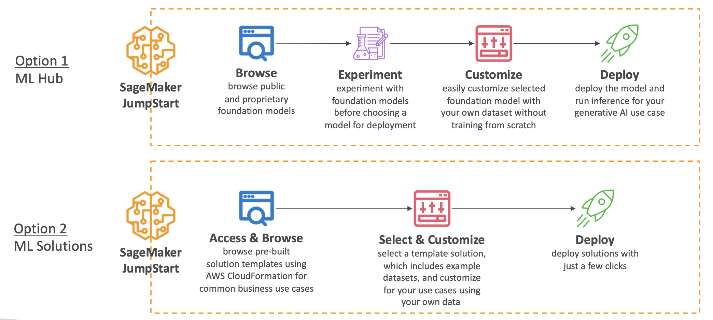

# Amazon SageMaker

- [Amazon SageMaker](#amazon-sagemaker)
  - [Overview](#overview)
    - [Built-in ML Algorithms](#built-in-ml-algorithms)
  - [Automatic Model Tuning (AMT)](#automatic-model-tuning-amt)
  - [Model Deployment and Inference](#model-deployment-and-inference)
    - [SageMaker Model Deployment Comparison](#sagemaker-model-deployment-comparison)
  - [SageMaker Studio](#sagemaker-studio)
  - [Data Wrangler](#data-wrangler)
    - [ML Features](#ml-features)
  - [SageMaker Feature Store](#sagemaker-feature-store)
  - [SageMaker Clarify](#sagemaker-clarify)
    - [Model Explainability](#model-explainability)
  - [SageMaker Ground Truth](#sagemaker-ground-truth)
  - [ML Governance](#ml-governance)
  - [SageMaker Model Dashboards](#sagemaker-model-dashboards)
  - [SageMaker Model Monitor](#sagemaker-model-monitor)
  - [SageMaker Model Registry](#sagemaker-model-registry)
  - [SageMaker Pipelines](#sagemaker-pipelines)
    - [Pipeline Structure](#pipeline-structure)
  - [SageMaker JumpStart](#sagemaker-jumpstart)
    - [Model Fine-Tuning with JumpStart](#model-fine-tuning-with-jumpstart)
  - [SageMaker Canvas](#sagemaker-canvas)
  - [MLFlow for Amazon SageMaker](#mlflow-for-amazon-sagemaker)
  - [Summary](#summary)

## Overview

- Amazon SageMaker is a fully managed service that enables developers and data scientists to build, train, and deploy machine learning models.
- It addresses the common challenges of managing the entire ML process in one place and provisioning infrastructure.
- SageMaker provides an end-to-end ML service that includes
- **Data Collection and Preparation**: Gather and prepare datasets for training
- **Model Building, Training, and Tuning**: Develop and optimize ML models
- **Model Deployment**: Deploy models to production
- **Performance Monitoring**: Track and monitor prediction performance

### Built-in ML Algorithms

- SageMaker offers a comprehensive set of built-in ML algorithms
- **Supervised Algorithms:**
  - Linear regression and classification
  - K-Nearest Neighbors (KNN) for classification
- **Unsupervised Algorithms:**
  - Principal Component Analysis (PCA) - reduces the number of features in a dataset
  - K-means clustering - finds groupings in data
  - Anomaly detection
- **Specialized Algorithms:**
  - Textual algorithms for NLP and summarization
  - Image processing algorithms for classification and detection

## Automatic Model Tuning (AMT)

- Automatic Model Tuning optimizes hyperparameters to improve model performance
- You define the objective metric
- AMT automatically selects:
  - Hyperparameter ranges
  - Search strategy
  - Maximum runtime for tuning jobs
  - Early stopping conditions
- Benefits: Saves time and money by avoiding suboptimal configurations

## Model Deployment and Inference

- SageMaker enables one-click model deployment with automatic scaling and no server management, reducing operational overhead.
- **Real-Time Inference:**
  - Provides an endpoint for individual predictions
  - Uses EC2 instances under the hood
  - Best for: Low-latency, interactive applications
- **Serverless Inference:**
  - No charges during idle periods between traffic spikes
  - Trade-off: Must tolerate initial startup latency (cold starts)
  - Best for: Sporadic, unpredictable workloads
- **Asynchronous Inference:**
  - Supports large payloads up to 1 GB (stored in S3)
  - Supports long processing times (up to 1 hour)
  - Good for near-real-time latency requirements
  - Requests and responses stored in S3
  - Best for: Large payloads requiring extended processing
- **Batch Transform:**
  - Recommended for predictions on entire datasets
  - Requests and responses stored in S3 buckets
  - Best for: Bulk processing of large datasets

### SageMaker Model Deployment Comparison

| **Feature**      | **Real-Time Inference**                                                                                                                   | **Serverless Inference**                                                                                                                     | **Asynchronous Inference**                                                                                                                                       | **Batch Transform**                                                                                                                                                          |
| ---------------- | ----------------------------------------------------------------------------------------------------------------------------------------- | -------------------------------------------------------------------------------------------------------------------------------------------- | ---------------------------------------------------------------------------------------------------------------------------------------------------------------- | ---------------------------------------------------------------------------------------------------------------------------------------------------------------------------- |
| **Latency**      | Low (milliseconds to seconds)                                                                                                             | Low (milliseconds to seconds)                                                                                                                | Medium to high (near real-time)                                                                                                                                  | High (minutes to hours)                                                                                                                                                      |
| **Max Payload**  | up to 6 MB                                                                                                                                | up to 4 MB                                                                                                                                   | 1 GB                                                                                                                                                             | Up to 100 MB per invocation (per mini batch)                                                                                                                                 |
| **Timeout**      | 60 seconds                                                                                                                                | 60 seconds                                                                                                                                   | Max 1 hour                                                                                                                                                       | Max 1 hour                                                                                                                                                                   |
| **Real Example** | Fast, near-instant predictions for web/mobile apps like Online Fraud Detection: Processing live credit card transactions in milliseconds. | Sporadic, short-term inference without infrastructure like Customer Support Bot: Handling unpredictable chat volume during product launches. | Large payloads and workloads requiring longer processing times, like Medical Imaging Analysis: Processing large high-res MRI scans or video files for diagnosis. | Bulk processing for large datasets like E-commerce Analytics: Weekly churn prediction for 1M+ customers or generating daily product recommendations for an entire user base. |

## SageMaker Studio

- SageMaker Studio provides a unified interface for end-to-end ML development
- Unified interface for all ML workflows
- Team collaboration features
- Interface for tuning, debugging, and deploying ML models
- Ability to create automated workflows

## Data Wrangler

- Data Wrangler is part of SageMaker Studio and provides comprehensive data preparation capabilities
- Prepare tabular and image data for machine learning
- Perform data preparation, transformations, and feature engineering
- Single interface for:
  - Data selection
  - Data cleansing
  - Data exploration
  - Data visualizations
  - Data processing
- SQL support for data queries
- Data Quality tool for analyzing data quality
- When we use Data Wrangler we would want to create ML features:
  - Features are inputs to ML models used during training and used for inference
  - It is important to have high quality features across our datasets in our company for reuse

### ML Features

- Features are inputs to ML models used during both training and inference.
- They represent the variables used to train models.
- **Example:** From customer data (name, birth date, income, location), you can create engineered features such as:
  - Age (derived from birth date)
  - Income group (categorized income ranges)
  - Location group (geographic segmentation)
- High-quality, reusable features across datasets are essential for effective ML operations.

## SageMaker Feature Store

- SageMaker Feature Store provides centralized feature management
- Ingests features from multiple sources
- Provides an overview of all saved features
- Defines transformations to convert data into features
- Direct publishing from Data Wrangler
- Features are discoverable within SageMaker Studio

## SageMaker Clarify

- SageMaker Clarify enables model evaluation and comparison
- Evaluate and compare Foundation Models
- Evaluate human factors such as friendliness or humor
- Human intervention options:
  - AWS-managed team
  - Your own employees
- Evaluation data sources:
  - Built-in datasets
  - Your own custom data
- Built-in metrics and algorithms
- Part of SageMaker Studio

### Model Explainability

- SageMaker Clarify provides tools to explain how ML models work and make predictions
- Understand model characteristics before deployment
- Debug predictions after deployment
- Increase trust and understanding of models
- **Bias Detection:**
  - Detect and explain biases in datasets and models
  - Measure bias using statistical metrics
  - Automatically detect bias by specifying input features
- **Example Use Cases:**
  - Why did the model predict a loan rejection for a given applicant?
  - Why did the model make an incorrect prediction?

## SageMaker Ground Truth

- SageMaker Ground Truth is based on Reinforcement Learning from Human Feedback (RLHF)
- Review models, customizations, and evaluations based on human feedback
- Align models to human preferences
- **Human Feedback for ML:**
  - Use human feedback to create and evaluate models
  - Use human workforce to generate or annotate data (e.g., create labels)
- **Reviewer Options:**
  - Amazon Mechanical Turk workers
  - Your employees
  - Third-party vendors
- **SageMaker Ground Truth Plus:** Provides managed data labeling services

## ML Governance

- SageMaker provides comprehensive governance tools for ML operations
- **SageMaker Model Cards:**
  - Centralized location to gather essential model information
  - Document model's intended uses, risk ratings, and training details
- **SageMaker Model Dashboards**
  - Centralized repository of all models
  - View information and insights about:
    - Risk ratings
    - Model quality
    - Data quality
    - And more
- **SageMaker Role Manager**
  - Define roles and permissions for employees within SageMaker
  - Example roles: data scientists, MLOps engineers

## SageMaker Model Dashboards

- A centralized portal to view, search, and explore all models
- Track which models are deployed for inference
- Accessible directly from the SageMaker Console
- Identify models that violate thresholds for:
  - Data quality
  - Model quality
  - Bias
  - Explainability

## SageMaker Model Monitor

- Monitors the quality of models deployed in production
- Runs continuously or on a schedule
- Alerts on deviations in model quality
- Enables proactive fixes and model retraining
- **Example:** A loan model starts approving loans for applicants who don't meet credit score requirements (model drift)

## SageMaker Model Registry

- Centralized repository for ML model management
- Track, manage, and version ML models
- Catalog models and manage model versions
- Associate metadata with models
- Manage approval status for automated model deployment
- Share models across teams

## SageMaker Pipelines

- SageMaker Pipelines automate the ML lifecycle, similar to CI/CD for machine learning
- Create workflows that automate building, training, and deploying ML models
- Build, train, test, and deploy hundreds of models automatically
- Benefits:
  - Faster iteration
  - Reduced errors (no manual steps)
  - Repeatable processes

### Pipeline Structure

- Pipelines are composed of steps, where each step performs a specific task (e.g., data preprocessing, model training).
- **Supported Step Types:**
  - **Processing**: Data preprocessing
  - **Training**: Model training
  - **Tuning**: Hyperparameter tuning
  - **AutoML**: Automatically train a model
  - **Model**: Create or register a SageMaker model
  - **ClarifyCheck**: Perform drift checks against baseline (data bias, model bias, model explainability)
  - **QualityCheck**: Perform drift checks against baseline (data quality, model quality)
  - For a full list, see: [SageMaker Pipeline Step Types](https://docs.aws.amazon.com/sagemaker/latest/dg/build-and-manage-steps.html#build-and-manage-steps-types)

## SageMaker JumpStart

- SageMaker JumpStart is an ML hub providing access to pre-trained models
- Pre-trained Foundation Models
- Computer vision models
- Natural language processing models
- Larger collection compared to Amazon Bedrock
- Models from Hugging Face, Databricks, Meta, Stability AI, and more
- Models can be fully customized for your data and use case
- Full control over deployment options
- Pre-built ML solutions for:
  - Demand forecasting
  - Credit rate predictions
  - Fraud detection
  - Computer vision

### Model Fine-Tuning with JumpStart

- You can fine-tune foundation models from SageMaker JumpStart.
- Fine-tuning is a customization method that involves further training and modifies model weights.
- **Fine-Tuning Approaches:**
  - **Domain Adaptation Fine-Tuning:**
    - Use when prompt engineering doesn't provide enough customization
    - Adapts models to domain-specific language, industry jargon, technical terms, or specialized data
  - **Instruction-Based Fine-Tuning:**
    - Uses labeled examples to improve performance on specific tasks
    - Labeled examples formatted as prompt-response pairs phrased as instructions
- **Cost Comparison (Least to Most Expensive):**
  - **Prompt Engineering** (cheapest)
  - **Retrieval Augmented Generation (RAG)**: More expensive than prompt engineering, usually requires a vector database
  - **Instruction-Based Fine-Tuning**: Uses labeled data and modifies model weights, more expensive than RAG or prompt engineering
  - **Domain Adaptation Fine-Tuning**: Uses unlabeled data for fine-tuning, the most expensive approach

## SageMaker Canvas

- SageMaker Canvas provides a visual, no-code/low-code interface for building ML models
- Visual interface for ML model development
- Access ready-to-use models from Bedrock or JumpStart
- Build custom models using AutoML powered by SageMaker Autopilot
- Part of SageMaker Studio
- Data transformation leverages Data Wrangler for data preparation
- **Ready-to-Use Models:**
  - Direct integration with AWS AI services:
    - Amazon Rekognition
    - Amazon Comprehend
    - Amazon Textract
  - Build complete ML pipelines without writing code
  - Leverage various AWS AI services seamlessly

## MLFlow for Amazon SageMaker

- MLFlow is an open-source tool that helps ML teams manage the entire ML lifecycle
- Integrates with SageMaker using MLFlow Tracking Servers
- Track runs and experiments
- Launch on SageMaker with a few clicks

## Summary

- **SageMaker**: End-to-end ML service
- **SageMaker Automatic Model Tuning**: Tune hyperparameters automatically
- **SageMaker Deployment & Inference**: Real-time, serverless, batch, and async deployment options
- **SageMaker Studio**: Unified interface for SageMaker
- **SageMaker Data Wrangler**: Explore and prepare datasets, create features
- **SageMaker Feature Store**: Store feature metadata in a central place
- **SageMaker Clarify**: Compare models, explain model outputs, detect bias
- **SageMaker Ground Truth**: RLHF, human feedback for model grading and data labeling
- **SageMaker Model Cards**: ML model documentation
- **SageMaker Model Dashboard**: View all models in one place
- **SageMaker Model Monitor**: Monitoring and alerts for deployed models
- **SageMaker Model Registry**: Centralized repository to manage ML model versions
- **SageMaker Pipelines**: CI/CD for Machine Learning
- **SageMaker Role Manager**: Access control and permissions
- **SageMaker JumpStart**: ML model hub & pre-built ML solutions
- **SageMaker Canvas**: No-code interface for SageMaker
- **MLFlow on SageMaker**: Use MLFlow tracking servers on AWS

---

## Prerequisites

- [AWS Managed AI Services - Quick Revision Summary](../aws-managed-ai-services/aws-ai-services-summary.md)

## Recommended Next Topics

- [Responsible AI and Security](../ai-challenges-and-responsibilities/responsible-ai.md)

## Related Topics

- [AI and Machine Learning Overview](../ai-and-ml/ai-and-ml-introduction.md)
- [GenAI Introduction](../gen-ai/genai-introduction.md)
- [Amazon Bedrock](../gen-ai/amazon-bedrock.md)
