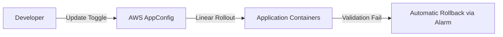

# AWS AppConfig

## 1. Overview & Real-World Analogy

**Real-World Analogy:** A remote control dimmer switch: you can dynamically adjust the brightness of lights (App Features) without replacing the lightbulbs (Code deployments).

AWS AppConfig is a capability of AWS Systems Manager used to create, manage, and quickly deploy application configurations independently of code.

---

## 2. Architecture & Flow Diagram

---

## 3. Comparison & Decision Guidance

| Configuration Method | AppConfig Deployment | Redeploying App Code |
| :--- | :--- | :--- |
| **Execution Time** | Seconds | Minutes (Requires full compilation/CI/CD loop) |
| **Risk Profile** | Low (Automatic alarm-based rollbacks) | High (Requires full service restart) |

### When to use
- When designing high-scale, production-ready solutions on AWS.
- To enforce operational excellence and follow security best practices.

### When not to use
- For basic prototyping where native defaults are sufficient.

---

## 4. Key Performance, Cost & Security Considerations

### Performance Impact
AppConfig APIs cache configuration settings locally in application memory, avoiding repeated network requests to AWS.

### Cost Impact
Billed per configuration retrieval API call.

### Security Implications
Use IAM resource policies to restrict who can deploy configuration changes or flip feature flags.

---

## 5. Exam tips & Traps

:::tip
**Exam Clues:** Feature flag management, linear rollout validation, automatic rollback via CloudWatch alarm.

Configure AppConfig validators (JSON Schema or Lambda functions) to automatically verify configuration content before deploying.
:::

:::warning
**Common Exam Traps:** Configure CloudWatch Alarms inside AppConfig to monitor service errors; if an alarm fires during rollout, it initiates an automatic rollback.
:::

---

## Prerequisites

- [Amazon CodeCatalyst](codecatalyst.md)

## Recommended Next Topics

- [AWS CloudShell](cloudshell.md)

## Related Topics

- [CLI: Command Line Interface](cli.md)
- [SDK: Software Development Kit](sdk.md)
- [Elastic Beanstalk](elastic-beanstalk.md)
