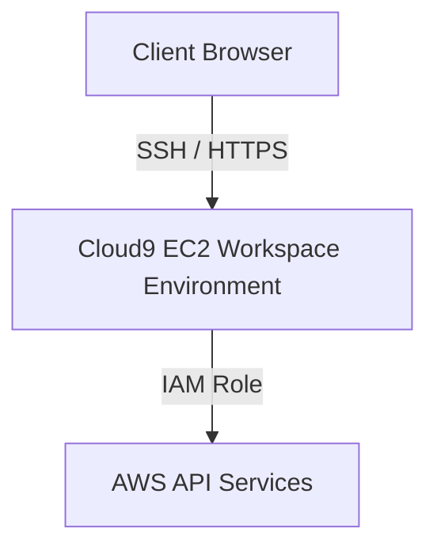

# AWS Cloud9 IDE

## 1. Overview & Real-World Analogy

**Real-World Analogy:** A rented workstation setup pre-installed with every tool you need, accessible via a web browser from any computer.

AWS Cloud9 is a cloud-based integrated development environment (IDE) that lets you write, run, and debug code with just a browser.

---

## 2. Architecture & Flow Diagram

---

## 3. Comparison & Decision Guidance

| Environment | Cloud9 IDE | Local VS Code |
| :--- | :--- | :--- |
| **Pre-configurations**| AWS CLI, SDKs, Docker pre-installed | Requires manual setup |
| **Authentication** | Automatic IAM credential delegation | Requires manual profiles setup |

### When to use
- When designing high-scale, production-ready solutions on AWS.
- To enforce operational excellence and follow security best practices.

### When not to use
- For basic prototyping where native defaults are sufficient.

---

## 4. Key Performance, Cost & Security Considerations

### Performance Impact
Cloud9 starts an EC2 instance to back the workspace. It pauses the EC2 instance automatically after a custom timeout (e.g. 30 mins) to save compute.

### Cost Impact
No additional charge for the IDE software; you only pay for the backing EC2 instance and EBS storage volume.

### Security Implications
Restricts workspace access using IAM policies. Workspace instances run in public or private subnets.

---

## 5. Exam tips & Traps

:::tip
**Exam Clues:** Browser-based IDE, EC2 auto-shutdown configuration, pre-loaded development environment, real-time code sharing.

Use the integrated terminal to run AWS CLI commands using the default Cloud9 temporary credentials.
:::

:::warning
**Common Exam Traps:** Cloud9 temporary credentials may block specific AWS operations like modifying IAM boundaries; disable them and attach an IAM role if needed.
:::

---

## Prerequisites

- [Elastic Beanstalk](elastic-beanstalk.md)

## Recommended Next Topics

- [AWS CodeArtifact](codeartifact.md)

## Related Topics

- [CLI: Command Line Interface](cli.md)
- [SDK: Software Development Kit](sdk.md)
- [Elastic Beanstalk](elastic-beanstalk.md)
