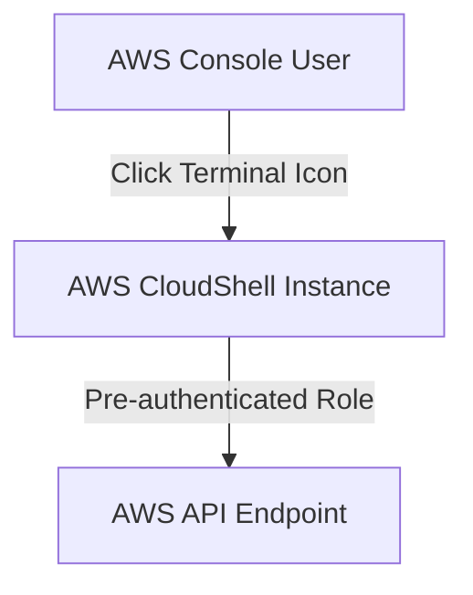

# AWS CloudShell

## 1. Overview & Real-World Analogy

**Real-World Analogy:** A key to a developer shell: you log in to your console and click a button to get a terminal with full AWS CLI pre-authenticated keys.

AWS CloudShell is a browser-based shell that makes it easy to manage, explore, and interact with AWS resources securely.

---

## 2. Architecture & Flow Diagram

---

## 3. Comparison & Decision Guidance

| CLI Environment | CloudShell | Local Terminal |
| :--- | :--- | :--- |
| **Authentication** | Automatic (Uses console user credentials) | Requires configuring credentials profiles |
| **Persistent Storage**| 1 GB persistent storage in home directory | Local disk drive storage |

### When to use
- When designing high-scale, production-ready solutions on AWS.
- To enforce operational excellence and follow security best practices.

### When not to use
- For basic prototyping where native defaults are sufficient.

---

## 4. Key Performance, Cost & Security Considerations

### Performance Impact
Spins up a lightweight Linux container in seconds with major developer utilities pre-installed.

### Cost Impact
Free service; you only pay for storage/resources outside the CloudShell container.

### Security Implications
Enforces security by running instances in isolation and terminating them after sessions end.

---

## 5. Exam tips & Traps

:::tip
**Exam Clues:** Browser CLI terminal, pre-configured AWS CLI environment, persistent home directory storage.

Use CloudShell to run quick ad-hoc scripts, upload files, or perform database queries without local tool requirements.
:::

:::warning
**Common Exam Traps:** Files stored outside the home directory (`$HOME`) are lost when the CloudShell session terminates or times out.
:::

---

## Prerequisites

- [AWS AppConfig](appconfig.md)

## Recommended Next Topics

- [CICD: Continuous Integration and Deployment](cicd/cicd.md)

## Related Topics

- [CLI: Command Line Interface](cli.md)
- [SDK: Software Development Kit](sdk.md)
- [Elastic Beanstalk](elastic-beanstalk.md)
