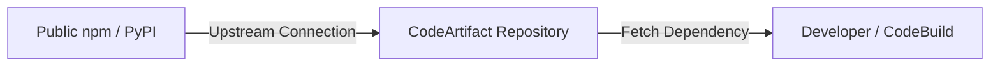

# AWS CodeArtifact

## 1. Overview & Real-World Analogy

**Real-World Analogy:** A private corporate warehouse that stores both proprietary building materials (Packages) and verifies external shipments before delivery to workers.

AWS CodeArtifact is a fully managed artifact repository service that makes it easy for organizations to securely store, publish, and share software packages.

---

## 2. Architecture & Flow Diagram

---

## 3. Comparison & Decision Guidance

| Tool | AWS CodeArtifact | Public npm registry |
| :--- | :--- | :--- |
| **Access Control** | IAM Policies, VPC Endpoint isolation | Public, token-based authentication |
| **Pricing** | Billed per GB stored + requests | Free for public, billing for private accounts |

### When to use
- When designing high-scale, production-ready solutions on AWS.
- To enforce operational excellence and follow security best practices.

### When not to use
- For basic prototyping where native defaults are sufficient.

---

## 4. Key Performance, Cost & Security Considerations

### Performance Impact
Integrate CodeArtifact repositories with AWS VPC Endpoints to fetch package dependencies over the private AWS backbone, reducing latency.

### Cost Impact
Billed per GB stored, and per million requests for package metadata.

### Security Implications
Restricts package publication and ingestion using repository-level policies and KMS key encryption.

---

## 5. Exam tips & Traps

:::tip
**Exam Clues:** Secure package registry on AWS, caching upstream dependencies, package token authentication.

Use Upstream Connections to configure CodeArtifact to automatically cache dependencies fetched from public registries like npm, Maven, or PyPI.
:::

:::warning
**Common Exam Traps:** Ensure to call the CodeArtifact authorization token command (`get-authorization-token`) to update local npm/pip tokens before running builds.
:::

---

## Prerequisites

- [AWS Cloud9 IDE](cloud9.md)

## Recommended Next Topics

- [Amazon CodeCatalyst](codecatalyst.md)

## Related Topics

- [CLI: Command Line Interface](cli.md)
- [SDK: Software Development Kit](sdk.md)
- [Elastic Beanstalk](elastic-beanstalk.md)
