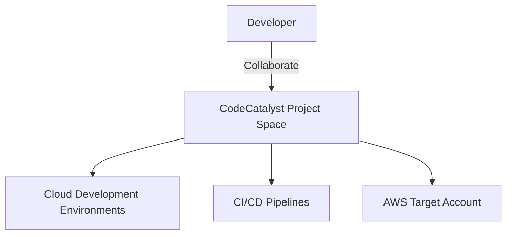

# Amazon CodeCatalyst

## 1. Overview & Real-World Analogy

**Real-World Analogy:** A complete developer toolbox containing the project template, pipeline configuration, development environment, and task board in one package.

Amazon CodeCatalyst is a unified software development service for developer teams to configure pipelines, issues, dev environments, and deployments on AWS.

---

## 2. Architecture & Flow Diagram

---

## 3. Comparison & Decision Guidance

| Service | CodeCatalyst | CodeSuite (CodeCommit/Build/Deploy) |
| :--- | :--- | :--- |
| **Setup Complexity**| Very low (Single unified workspace) | High (Requires wiring distinct services together) |
| **Repository** | Git repos hosted inside CodeCatalyst or GitHub | AWS CodeCommit |

### When to use
- When designing high-scale, production-ready solutions on AWS.
- To enforce operational excellence and follow security best practices.

### When not to use
- For basic prototyping where native defaults are sufficient.

---

## 4. Key Performance, Cost & Security Considerations

### Performance Impact
Pipelines run on managed runner containers, speeding up compile and deploy tasks.

### Cost Impact
Free tier covers basic developers, storage, and build minutes; billing applies to advanced plans.

### Security Implications
Integrates with AWS IAM Identity Center for enterprise developer login authentication.

---

## 5. Exam tips & Traps

:::tip
**Exam Clues:** Unified developer service, project space setup, cloud development environment integration.

Use Cloud Development Environments (CDE) in CodeCatalyst to instantly spin up pre-configured workspaces.
:::

:::warning
**Common Exam Traps:** CodeCatalyst is a SaaS platform; configuration is separate from standard AWS CloudFormation configs.
:::

---

## Prerequisites

- [AWS CodeArtifact](codeartifact.md)

## Recommended Next Topics

- [AWS AppConfig](appconfig.md)

## Related Topics

- [CLI: Command Line Interface](cli.md)
- [SDK: Software Development Kit](sdk.md)
- [Elastic Beanstalk](elastic-beanstalk.md)
