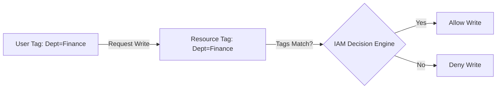

# IAM Attribute-Based Access Control (ABAC)

## 1. Overview & Real-World Analogy

**Real-World Analogy:** An office keycard that reads your department tag (e.g., "Engineering") and automatically grants access only to doors labeled "Engineering".

Attribute-Based Access Control (ABAC) is an authorization strategy that defines permissions based on tags (attributes) attached to users, roles, and resources.

---

## 2. Architecture & Flow Diagram

---

## 3. Comparison & Decision Guidance

| Parameter | Role-Based Access Control (RBAC) | Attribute-Based Access Control (ABAC) |
| :--- | :--- | :--- |
| **Management** | Harder, requires creating new roles/policies | Easier, permissions scale automatically with tags |
| **Policy Count** | High | Low (Single policy for matching attributes) |
| **Granularity** | Coarse-grained | Fine-grained |

### When to use
- When designing high-scale, production-ready solutions on AWS.
- To enforce operational excellence and follow security best practices.

### When not to use
- For basic prototyping where native defaults are sufficient.

---

## 4. Key Performance, Cost & Security Considerations

### Performance Impact
No performance latency difference compared to standard IAM evaluations.

### Cost Impact
Tag-based evaluations are free of charge.

### Security Implications
Reduces security team overhead when scaling teams or adding resources.

---

## 5. Exam tips & Traps

:::tip
**Exam Clues:** Fine-grained access based on tag matching, dynamic policy scale, principal tags, resource tags.

Configure session tags in AWS STS to pass client-specific tags during role assumption for ABAC evaluations.
:::

:::warning
**Common Exam Traps:** If a resource or user is untagged or has typos in tags (e.g., "finance" vs "Finance"), access will be denied.
:::

---

## Prerequisites

- [IAM Cross-Account Access](iam-cross-account-access.md)

## Recommended Next Topics

- [IAM Access Analyzer](iam-access-analyzer.md)

## Related Topics

- [IAM Permission Boundaries](iam-permission-boundaries.md)
- [IAM Policy Evaluation Logic](iam-policy-evaluation.md)
- [IAM Cross-Account Access](iam-cross-account-access.md)
