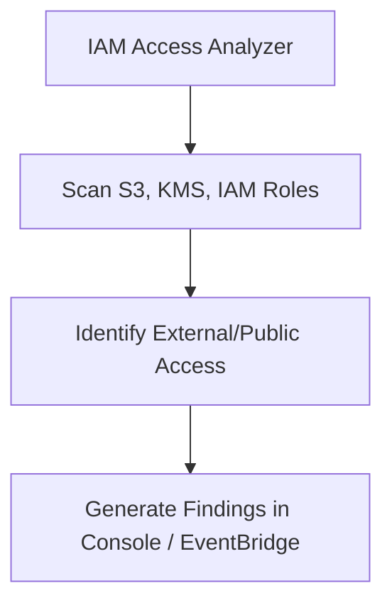

# IAM Access Analyzer

## 1. Overview & Real-World Analogy

**Real-World Analogy:** A security guard walking the perimeter of your building checking if any doors are accidentally left open to the public street.

IAM Access Analyzer monitors and analyzes resource policies to identify resources shared with external entities or public access.

---

## 2. Architecture & Flow Diagram

---

## 3. Comparison & Decision Guidance

| Tool | IAM Access Analyzer | AWS Config |
| :--- | :--- | :--- |
| **Primary Scope** | Policy analysis (Mathematical proving) | Resource configuration state changes over time |
| **Automation** | Runs automatically on policy changes | Runs based on rule triggers |

### When to use
- When designing high-scale, production-ready solutions on AWS.
- To enforce operational excellence and follow security best practices.

### When not to use
- For basic prototyping where native defaults are sufficient.

---

## 4. Key Performance, Cost & Security Considerations

### Performance Impact
Asynchronous analysis has zero runtime performance impact on active services.

### Cost Impact
Free service within your account.

### Security Implications
Identifies unintended external access path violations, preventing data leaks.

---

## 5. Exam tips & Traps

:::tip
**Exam Clues:** Finding public access to S3, external access path detection, automated policy generator, mathematical verification.

Enable IAM Access Analyzer in all regions to detect cross-account role sharing or open S3 buckets.
:::

:::warning
**Common Exam Traps:** Access Analyzer only alerts on public or cross-account access; it does not automatically modify or lock down policies.
:::

---

## Prerequisites

- [IAM Attribute-Based Access Control (ABAC)](iam-abac.md)

## Recommended Next Topics

- [AWS Serverless](../../3-aws-serverless/serverless.md)

## Related Topics

- [IAM Permission Boundaries](iam-permission-boundaries.md)
- [IAM Policy Evaluation Logic](iam-policy-evaluation.md)
- [IAM Cross-Account Access](iam-cross-account-access.md)
