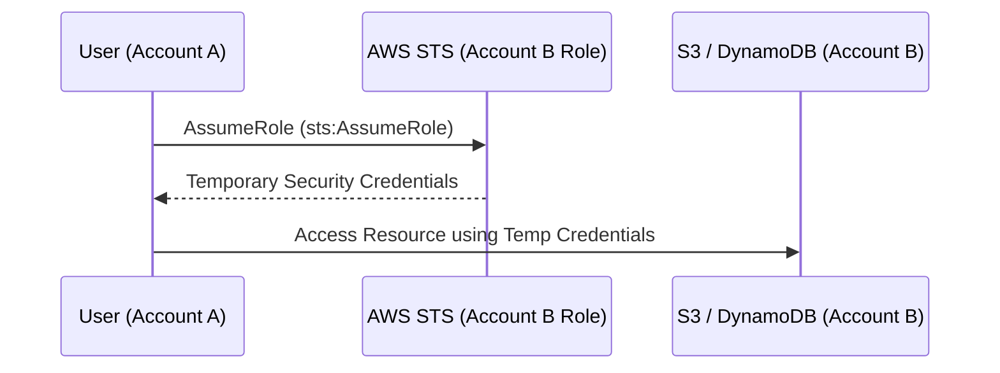

# IAM Cross-Account Access

## 1. Overview & Real-World Analogy

**Real-World Analogy:** A visitor badge provided by a host company that lets a guest employee temporarily enter their building and access specific rooms.

IAM Cross-Account Access allows identities in one AWS account to safely access resources in another AWS account without sharing security credentials.

---

## 2. Architecture & Flow Diagram

---

## 3. Comparison & Decision Guidance

| Method | AssumeRole | Resource-Based Policy |
| :--- | :--- | :--- |
| **Pros** | Provides temporary credentials, audit logs in destination | Faster access, does not require switching roles |
| **Cons** | Requires STS API call overhead | Not supported by all AWS services |

### When to use
- When designing high-scale, production-ready solutions on AWS.
- To enforce operational excellence and follow security best practices.

### When not to use
- For basic prototyping where native defaults are sufficient.

---

## 4. Key Performance, Cost & Security Considerations

### Performance Impact
Requires a one-time latency cost for the STS `AssumeRole` call, after which local temp credentials are cached.

### Cost Impact
Free, though STS calls are billed at standard minor execution rates if external.

### Security Implications
Recommended over long-lived IAM user access keys, enforcing token rotation.

---

## 5. Exam tips & Traps

:::tip
**Exam Clues:** Cross-account trust relationship, STS AssumeRole, temp credentials, External ID protection.

Always configure the ExternalId when implementing cross-account access for third-party integrations to prevent the confused deputy problem.
:::

:::warning
**Common Exam Traps:** Cross-account resource policies do not automatically grant access to users in target accounts unless the target account administrators also allow it.
:::

---

## Prerequisites

- [IAM Policy Evaluation Logic](iam-policy-evaluation.md)

## Recommended Next Topics

- [IAM Attribute-Based Access Control (ABAC)](iam-abac.md)

## Related Topics

- [IAM Permission Boundaries](iam-permission-boundaries.md)
- [IAM Policy Evaluation Logic](iam-policy-evaluation.md)
- [IAM Attribute-Based Access Control (ABAC)](iam-abac.md)
