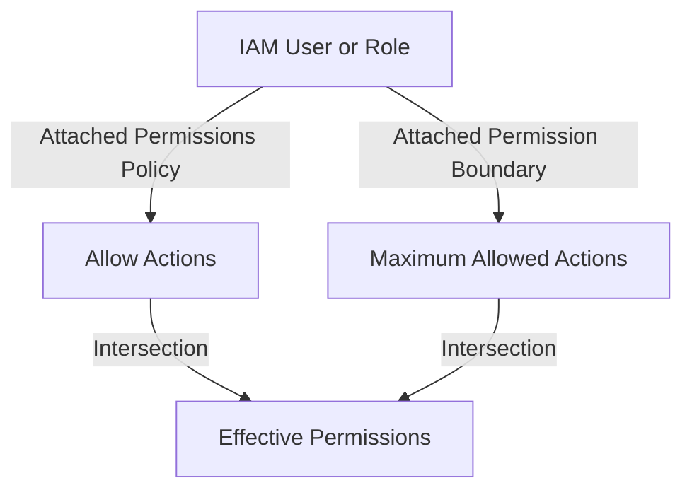

# IAM Permission Boundaries

## 1. Overview & Real-World Analogy

**Real-World Analogy:** A boundary line set by a building owner: no matter what keycard permission a tenant gives their employees (IAM policies), they cannot access rooms beyond the building outer wall boundary.

An IAM permission boundary is an advanced security feature used to delegate policy creation authority to developers while preventing privilege escalation. It sets the maximum permissions that an identity-based policy can grant.

---

## 2. Architecture & Flow Diagram

---

## 3. Comparison & Decision Guidance

| Feature | Identity-Based Policy | Permission Boundary | Service Control Policy (SCP) |
| :--- | :--- | :--- | :--- |
| **Applied To** | User or Role | User or Role | AWS Account or OU |
| **Use Case** | Grants permissions | Restricts maximum permissions | Restricts maximum permissions across accounts |
| **Allows Escalation?**| Yes, if not limited | No, limits delegation | No, overrides account admin |

### When to use
- When designing high-scale, production-ready solutions on AWS.
- To enforce operational excellence and follow security best practices.

### When not to use
- For basic prototyping where native defaults are sufficient.

---

## 4. Key Performance, Cost & Security Considerations

### Performance Impact
Permission boundaries are evaluated during the auth decision process by IAM engine. There is zero performance latency impact on API requests.

### Cost Impact
IAM features, including permission boundaries, are free of charge.

### Security Implications
Ensures developers can create new roles and attach policies for Lambda functions or EC2 instances without the risk of creating a superuser admin role.

---

## 5. Exam tips & Traps

:::tip
**Exam Clues:** Delegating IAM role creation, preventing privilege escalation, setting maximum permissions boundary for developers.

Use permission boundaries to safely delegate IAM administrative tasks to non-admin users without risk of privilege escalation.
:::

:::warning
**Common Exam Traps:** A permission boundary by itself does NOT grant permissions. The user/role must still have an identity-based policy allowing the action.
:::

---

## Prerequisites

- [AWS X-Ray Advanced](../monitoring-and-audit/xray-advanced.md)

## Recommended Next Topics

- [IAM Policy Evaluation Logic](iam-policy-evaluation.md)

## Related Topics

- [IAM Policy Evaluation Logic](iam-policy-evaluation.md)
- [IAM Cross-Account Access](iam-cross-account-access.md)
- [IAM Attribute-Based Access Control (ABAC)](iam-abac.md)
