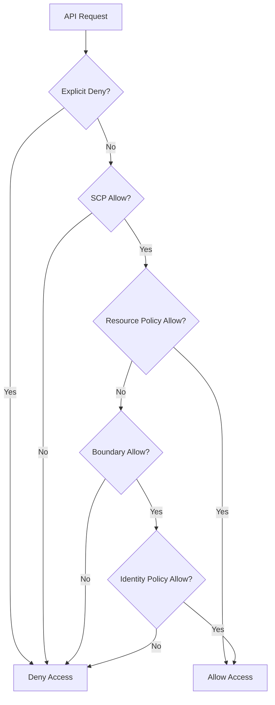

# IAM Policy Evaluation Logic

## 1. Overview & Real-World Analogy

**Real-World Analogy:** A court system where a single "No" (Explicit Deny) immediately overrides all "Yes" (Allow) approvals, regardless of who signed them.

IAM Policy Evaluation Logic is the framework AWS uses to decide whether an API request is authorized. It evaluates identity-based, resource-based, permission boundaries, and SCPs.

---

## 2. Architecture & Flow Diagram

---

## 3. Comparison & Decision Guidance

| Policy Type | Evaluated For | Can Deny? | Can Allow? |
| :--- | :--- | :--- | :--- |
| **Explicit Deny** | Everywhere | Yes (Immediate Override) | N/A |
| **SCP** | Multi-Account | Yes | Yes (Restricts) |
| **Resource Policy** | Resource itself | Yes | Yes (Bypasses Boundary if principal is local) |

### When to use
- When designing high-scale, production-ready solutions on AWS.
- To enforce operational excellence and follow security best practices.

### When not to use
- For basic prototyping where native defaults are sufficient.

---

## 4. Key Performance, Cost & Security Considerations

### Performance Impact
IAM engine processes policies in micro-seconds, ensuring no delay to AWS API requests.

### Cost Impact
Evaluated at no cost.

### Security Implications
Crucial for implementing defense-in-depth security policies across identity and resource layers.

---

## 5. Exam tips & Traps

:::tip
**Exam Clues:** API authorization flow, resource-based vs identity-based precedence, explicit deny overrides allow.

Understand that resource-based policies can grant direct access to cross-account principals without requiring role assumption.
:::

:::warning
**Common Exam Traps:** An explicit deny in *any* policy always overrides any allows, even if the allow is in an administrator policy.
:::

---

## Prerequisites

- [IAM Permission Boundaries](iam-permission-boundaries.md)

## Recommended Next Topics

- [IAM Cross-Account Access](iam-cross-account-access.md)

## Related Topics

- [IAM Permission Boundaries](iam-permission-boundaries.md)
- [IAM Cross-Account Access](iam-cross-account-access.md)
- [IAM Attribute-Based Access Control (ABAC)](iam-abac.md)
