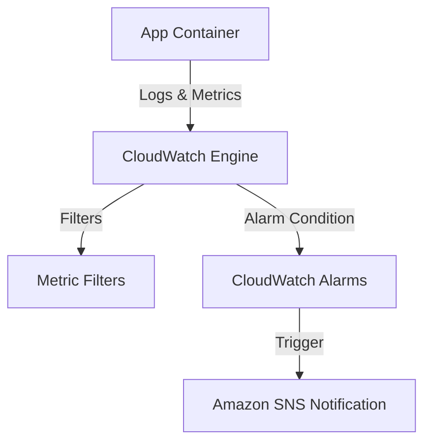

# CloudWatch Advanced

## 1. Overview & Real-World Analogy

**Real-World Analogy:** A high-tech monitoring room with screens displaying live statistics (Metrics), log files scrolling (Logs), and loud alarms ringing (Alarms).

AWS CloudWatch is a monitoring and observability service that provides data and actionable insights for AWS resources and applications.

---

## 2. Architecture & Flow Diagram

---

## 3. Comparison & Decision Guidance

| Feature | CloudWatch Logs | CloudWatch Metrics | CloudWatch Events (EventBridge) |
| :--- | :--- | :--- | :--- |
| **Data Type** | Text output log lines | Numeric time-series values | Structured JSON system events |
| **Retention** | Customizable (1 day to Infinite) | Up to 15 months | Ephemeral (unless archived) |

### When to use
- When designing high-scale, production-ready solutions on AWS.
- To enforce operational excellence and follow security best practices.

### When not to use
- For basic prototyping where native defaults are sufficient.

---

## 4. Key Performance, Cost & Security Considerations

### Performance Impact
CloudWatch metrics are retrieved in intervals ranging from 1 second (high-resolution) to 1 minute (standard).

### Cost Impact
Billed per custom metric, per GB of logs ingested/stored, and per alarm configured.

### Security Implications
Encrypt logs at rest using AWS KMS Customer Managed Keys, and use IAM policies to restrict log group read access.

---

## 5. Exam tips & Traps

:::tip
**Exam Clues:** Metric filters, custom namespace metrics, high-resolution alarm configuration, log group KMS encryption.

Use CloudWatch Logs Metric Filters to search text log streams for specific strings (e.g. "ERROR") and increment a numeric metric.
:::

:::warning
**Common Exam Traps:** Metric filters do not process historical logs; they only count matches for logs ingested after the filter is created.
:::

---

## Prerequisites

- [CloudWatch](cloudwatch.md)

## Recommended Next Topics

- [AWS CloudTrail](cloudtrail.md)

## Related Topics

- [CloudWatch](cloudwatch.md)
- [AWS CloudTrail](cloudtrail.md)
- [AWS Config](config.md)
