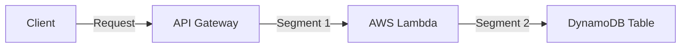

# AWS X-Ray Advanced

## 1. Overview & Real-World Analogy

**Real-World Analogy:** An dye tracer test injected into a plumbing network to trace exactly which pipe gets blocked or experiences high pressure (Latency).

AWS X-Ray is a distributed tracing service that helps developers analyze and debug production, distributed applications, such as microservices.

---

## 2. Architecture & Flow Diagram

---

## 3. Comparison & Decision Guidance

| Telemetry | X-Ray Annotations | X-Ray Metadata |
| :--- | :--- | :--- |
| **Searchable** | Yes (Indexed by X-Ray query language) | No (Arbitrary JSON structure) |
| **Use Case** | Filter traces by UserID, TenantID, Stage | Raw stack traces, complete database responses |

### When to use
- When designing high-scale, production-ready solutions on AWS.
- To enforce operational excellence and follow security best practices.

### When not to use
- For basic prototyping where native defaults are sufficient.

---

## 4. Key Performance, Cost & Security Considerations

### Performance Impact
To prevent application performance overhead, configure the X-Ray daemon to sample traffic (e.g., 5% of requests) instead of tracing 100%.

### Cost Impact
Billed per million traces stored and scanned.

### Security Implications
Traces contain application identifiers; use KMS key integration if traces contain sensitive database query telemetry.

---

## 5. Exam tips & Traps

:::tip
**Exam Clues:** Distributed tracing, trace segment vs subsegment, searchable annotations, non-indexed metadata, X-Ray daemon port 2000 UDP.

Use subsegments to trace specific database queries or HTTP calls made from within your Lambda function code.
:::

:::warning
**Common Exam Traps:** X-Ray annotations are restricted to string, integer, or boolean values; complex objects must be stored in metadata.
:::

---

## Prerequisites

- [AWS X-Ray](xray.md)

## Recommended Next Topics

- [IAM Permission Boundaries](../iam-deep-dive/iam-permission-boundaries.md)

## Related Topics

- [CloudWatch](cloudwatch.md)
- [CloudWatch Advanced](cloudwatch-advanced.md)
- [AWS CloudTrail](cloudtrail.md)
