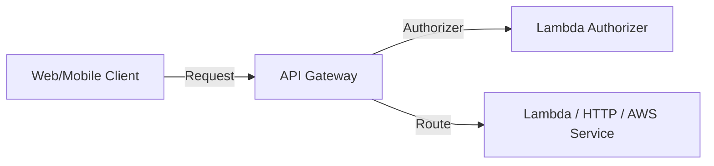

# API Gateway Deep Dive

## 1. Overview & Real-World Analogy

**Real-World Analogy:** A smart office receptionist who validates tickets (API Keys), routes visitors (Stage Variables), and limits the speed of entries (Throttling) to prevent overcrowding.

AWS API Gateway is a fully managed service that makes it easy for developers to create, publish, maintain, monitor, and secure APIs at any scale.

---

## 2. Architecture & Flow Diagram

---

## 3. Comparison & Decision Guidance

| Feature | HTTP API | REST API |
| :--- | :--- | :--- |
| **Latency** | Ultra-low latency | Higher features, slightly higher latency |
| **Securities** | mTLS, JWT authorizers | mTLS, Cognito, IAM, API Keys, WAF |
| **Cost** | Much cheaper (~$1.00 per million) | Standard pricing (~$3.50 per million) |

### When to use
- When designing high-scale, production-ready solutions on AWS.
- To enforce operational excellence and follow security best practices.

### When not to use
- For basic prototyping where native defaults are sufficient.

---

## 4. Key Performance, Cost & Security Considerations

### Performance Impact
Enable API Gateway caching to store backend responses and bypass Lambda execution for static endpoints, reducing latency.

### Cost Impact
Billed per million requests processed, plus data transfer output fees.

### Security Implications
Enable mTLS (mutual TLS) for client-to-API authentication, and configure AWS WAF to filter malicious web inputs.

---

## 5. Exam tips & Traps

:::tip
**Exam Clues:** Throttling limit status code 429, mTLS integration, custom authorizer, stage variables, REST vs HTTP API.

Use Stage Variables to dynamically point API Gateway integrations to different backend Lambda versions or aliases (e.g., dev, prod).
:::

:::warning
**Common Exam Traps:** API Gateway has a hard 29-second timeout limit for integration requests that cannot be increased.
:::

---

## Prerequisites

- [API Gateway](apigateway.md)

## Recommended Next Topics

- [DynamoDB](dynamodb.md)

## Related Topics

- [AWS Serverless](serverless.md)
- [AWS Lambda](lambda.md)
- [AWS Lambda Deep Dive](lambda-advanced.md)
