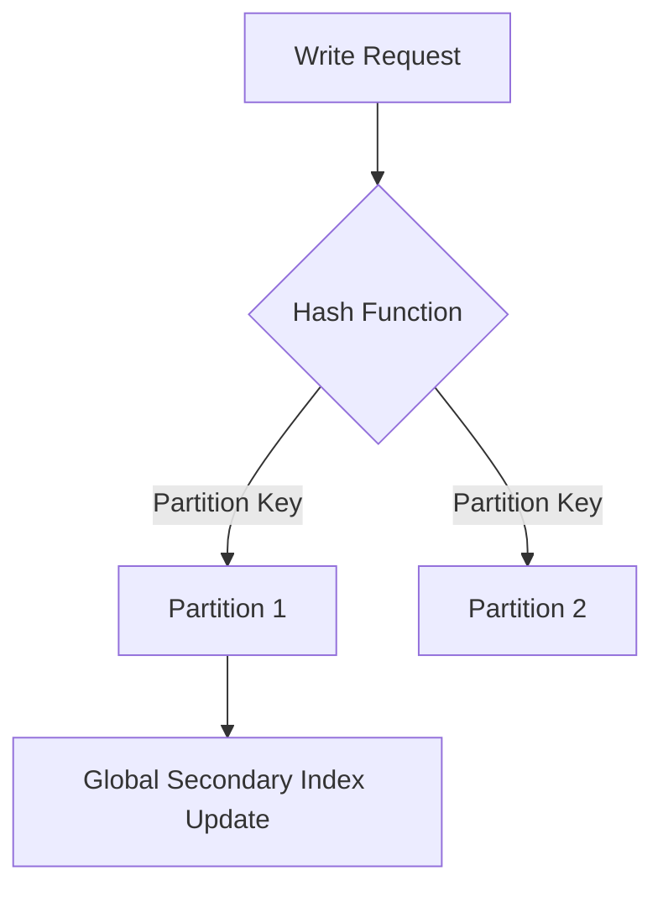

# DynamoDB Deep Dive

## 1. Overview & Real-World Analogy

**Real-World Analogy:** A dictionary index card catalog system where you can look up items directly by a word (Partition Key) or list them alphabetically within a category (Sort Key).

Amazon DynamoDB is a fully managed, serverless, multi-region NoSQL database. This advanced deep dive details adaptive capacity, transactions, PITR, and Global Tables.

---

## 2. Architecture & Flow Diagram

---

## 3. Comparison & Decision Guidance

| Feature | Local Secondary Index (LSI) | Global Secondary Index (GSI) |
| :--- | :--- | :--- |
| **Partition Key** | Same as base table | Can be different |
| **Sort Key** | Must be different | Can be different |
| **Creation** | Only at table creation | At table creation or any time |
| **Capacity** | Shares base table WCU/RCU | Has its own provisioned capacity |

### When to use
- When designing high-scale, production-ready solutions on AWS.
- To enforce operational excellence and follow security best practices.

### When not to use
- For basic prototyping where native defaults are sufficient.

---

## 4. Key Performance, Cost & Security Considerations

### Performance Impact
Enable DynamoDB Accelerator (DAX) to provide microsecond response times for read-heavy key-value workloads.

### Cost Impact
Billed based on Provisioned Capacity (RCU/WCU) or On-Demand Request Units, plus storage and backup sizes.

### Security Implications
Use KMS customer managed keys for data encryption at rest, and IAM policy variables to restrict user access to their own data partitions.

---

## 5. Exam tips & Traps

:::tip
**Exam Clues:** Hot partition resolution, LSI vs GSI differences, ACID Transactions, DAX cache integration, PITR backups.

Use On-Demand capacity mode for unpredictable workloads to avoid throttling, and Provisioned capacity with Auto Scaling for stable traffic.
:::

:::warning
**Common Exam Traps:** Updating a GSI with low provisioned write capacity can throttle writes on the base table. Ensure GSIs have matching write capacities.
:::

---

## Prerequisites

- [DynamoDB](dynamodb.md)

## Recommended Next Topics

- [AWS Step Functions](stepfunctions.md)

## Related Topics

- [AWS Serverless](serverless.md)
- [AWS Lambda](lambda.md)
- [AWS Lambda Deep Dive](lambda-advanced.md)
