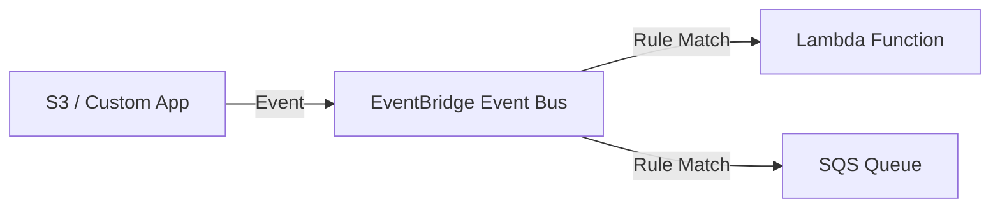

# Amazon EventBridge

## 1. Overview & Real-World Analogy

**Real-World Analogy:** A centralized corporate mail hub that reads letters, matches their addresses/departments, and routes them to the correct office boxes.

Amazon EventBridge is a serverless event bus service that makes it easy to connect application data from various sources and route it to targets.

---

## 2. Architecture & Flow Diagram

---

## 3. Comparison & Decision Guidance

| Feature | EventBridge | Amazon SNS |
| :--- | :--- | :--- |
| **Payload Routing** | Rich JSON pattern matching | Simple message attributes |
| **Targets** | 20+ AWS target types | HTTP, SQS, SMS, Email |
| **Schema Registry** | Yes, auto-detects payload shapes | No |

### When to use
- When designing high-scale, production-ready solutions on AWS.
- To enforce operational excellence and follow security best practices.

### When not to use
- For basic prototyping where native defaults are sufficient.

---

## 4. Key Performance, Cost & Security Considerations

### Performance Impact
EventBridge routes events asynchronously. Delivery times are typically sub-second, though not designed for real-time streaming operations.

### Cost Impact
Billed per million custom events published. AWS service events are free.

### Security Implications
Use resource-based policies on target resources (like SQS or Lambda) to allow EventBridge to trigger them.

---

## 5. Exam tips & Traps

:::tip
**Exam Clues:** Event buses, schema registry, API destinations to call third-party endpoints, event replay, JSON rule match.

Use EventBridge Archive and Replay to capture event streams and replay them during testing or failure recovery phases.
:::

:::warning
**Common Exam Traps:** EventBridge has a default payload size limit of 256 KB. If events exceed this, use the claim-check pattern (S3 link).
:::

---

## Prerequisites

- [AWS Step Functions](stepfunctions.md)

## Recommended Next Topics

- [AWS SAM](sam.md)

## Related Topics

- [AWS Serverless](serverless.md)
- [AWS Lambda](lambda.md)
- [AWS Lambda Deep Dive](lambda-advanced.md)
