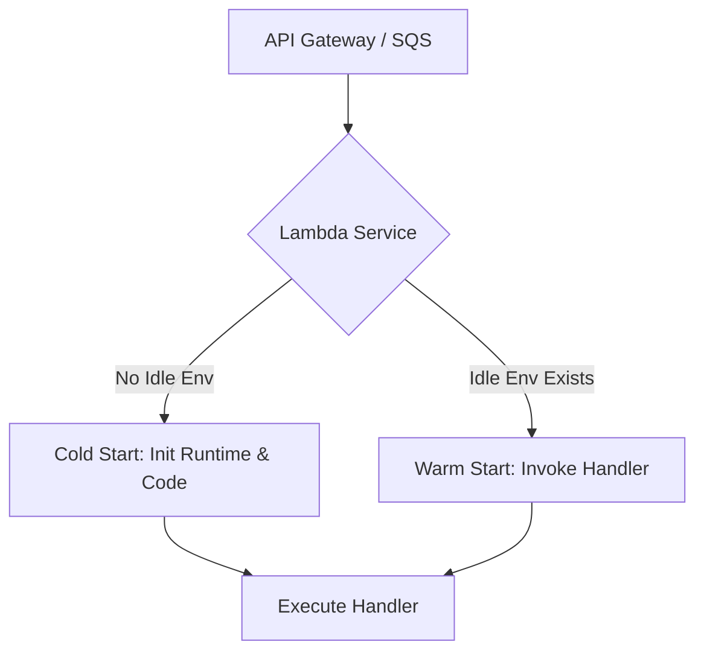

# AWS Lambda Deep Dive

## 1. Overview & Real-World Analogy

**Real-World Analogy:** A restaurant kitchen prep station that instantly boots up (Cold Start) when a customer orders, but remains warm and ready (Warm Start) for immediate subsequent orders.

AWS Lambda is a serverless function-as-a-service (FaaS) platform. Advanced Lambda engineering covers SnapStart, concurrency types, DLQs, Destinations, and execution environments.

---

## 2. Architecture & Flow Diagram

---

## 3. Comparison & Decision Guidance

| Parameter | Reserved Concurrency | Provisioned Concurrency |
| :--- | :--- | :--- |
| **Primary Goal** | Limits concurrency to prevent backend overload | Eliminates cold start latency |
| **Cost Impact** | Free | Hourly charge per provisioned block |
| **Scaling Cap** | Yes, strictly limits scale | No, functions scale beyond provisioned to on-demand |

### When to use
- When designing high-scale, production-ready solutions on AWS.
- To enforce operational excellence and follow security best practices.

### When not to use
- For basic prototyping where native defaults are sufficient.

---

## 4. Key Performance, Cost & Security Considerations

### Performance Impact
SnapStart uses Firecracker VM micro-virtual machine snapshots to reduce Java application start times from seconds to sub-100ms.

### Cost Impact
Provisioned concurrency is billed per GB-second allocated, regardless of invocation count.

### Security Implications
Enforce execution roles with least-privilege policies and place functions in private VPCs for database access.

---

## 5. Exam tips & Traps

:::tip
**Exam Clues:** Cold starts mitigation, SnapStart, reserved concurrency vs provisioned concurrency, SQS event source mapping.

Implement Lambda Destinations to route asynchronous invocation results (Success/Failure) to SQS, SNS, or EventBridge without code.
:::

:::warning
**Common Exam Traps:** Do not use Provisioned Concurrency if you do not have cold start performance constraints, as it introduces constant hourly running costs.
:::

---

## Prerequisites

- [AWS Lambda](lambda.md)

## Recommended Next Topics

- [API Gateway](apigateway.md)

## Related Topics

- [AWS Serverless](serverless.md)
- [AWS Lambda](lambda.md)
- [API Gateway](apigateway.md)
