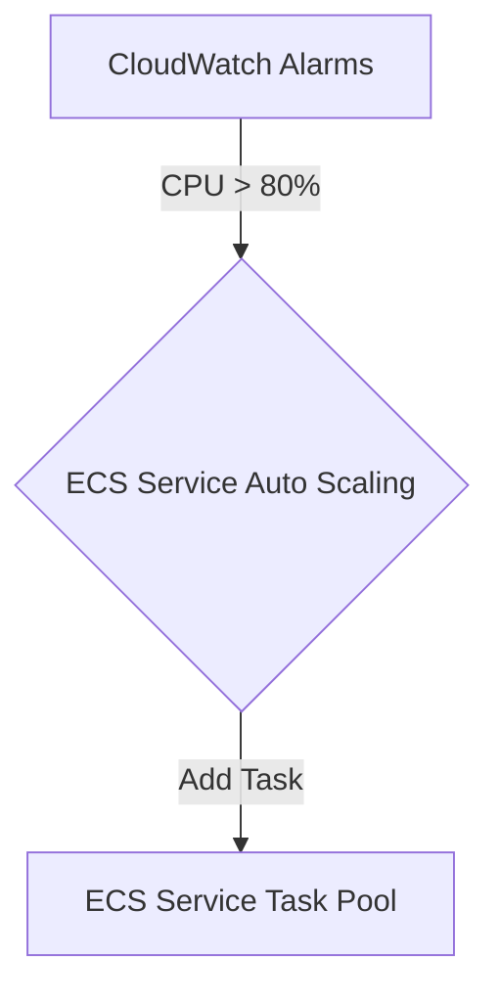

# ECS Auto Scaling

## 1. Overview & Real-World Analogy

**Real-World Analogy:** A highway that automatically opens extra lanes (Tasks) during rush hour and closes them at midnight to keep traffic moving.

ECS Auto Scaling is the system that dynamically adjust the desired task count of an ECS Service in response to CPU/Memory utilization or custom CloudWatch metrics.

---

## 2. Architecture & Flow Diagram

---

## 3. Comparison & Decision Guidance

| Scaling Policy | Target Tracking | Step Scaling |
| :--- | :--- | :--- |
| **Metric Goal** | Maintains specific metric value (e.g., 70% CPU) | Responds based on step metrics (e.g., if CPU > 85%, add 3 tasks) |
| **Setup Complexity**| Very simple | Moderate |

### When to use
- When designing high-scale, production-ready solutions on AWS.
- To enforce operational excellence and follow security best practices.

### When not to use
- For basic prototyping where native defaults are sufficient.

---

## 4. Key Performance, Cost & Security Considerations

### Performance Impact
Container metrics are evaluated by CloudWatch in 1-minute intervals, enabling reactive scaling configurations.

### Cost Impact
Auto scaling itself is free; you only pay for the containers/instances launched.

### Security Implications
Ensure IAM execution roles have permissions to publish metrics to CloudWatch for scaling decisions.

---

## 5. Exam tips & Traps

:::tip
**Exam Clues:** Dynamic task scaling, target tracking CPU utilization, ECS service scaling cooldowns.

Combine target tracking CPU scaling with target tracking Memory scaling to protect tasks against memory leaks.
:::

:::warning
**Common Exam Traps:** Always configure a cooldown period to allow newly launched tasks to boot and start handling load before calculating another scaling step.
:::

---

## Prerequisites

- [ECS Capacity Providers](ecs-capacity-providers.md)

## Recommended Next Topics

- [EKS Fundamentals](eks-fundamentals.md)

## Related Topics

- [ecs](ecs.md)
- [ECS Capacity Providers](ecs-capacity-providers.md)
- [EKS Fundamentals](eks-fundamentals.md)
