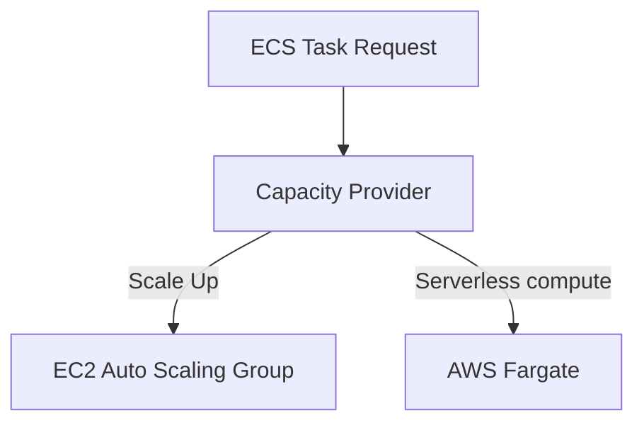

# ECS Capacity Providers

## 1. Overview & Real-World Analogy

**Real-World Analogy:** A logistics manager who dynamically rents trucks (EC2 instances) or hires courier bikes (Fargate containers) depending on the size and volume of packages.

ECS Capacity Providers manage the infrastructure scaling for tasks in an ECS cluster. They link Auto Scaling groups to container execution configurations.

---

## 2. Architecture & Flow Diagram

---

## 3. Comparison & Decision Guidance

| Compute Type | EC2 Instance Capacity | AWS Fargate |
| :--- | :--- | :--- |
| **Management** | Manual patches, host scaling configurations | Serverless, zero OS management |
| **Cost Model** | Billed per running EC2 instance | Billed per task CPU/Memory runtime |
| **Startup Speed** | Fast (if instances pre-warmed) | Moderate (takes seconds to boot container) |

### When to use
- When designing high-scale, production-ready solutions on AWS.
- To enforce operational excellence and follow security best practices.

### When not to use
- For basic prototyping where native defaults are sufficient.

---

## 4. Key Performance, Cost & Security Considerations

### Performance Impact
Using Fargate Capacity Providers provides rapid scaling since there is no underlying OS VM boot latency to manage.

### Cost Impact
Fargate Spot capacity providers offer up to a 70% discount compared to regular Fargate pricing, with interruption risk.

### Security Implications
Isolate container networking using the `awsvpc` network mode, which assigns each task its own elastic network interface (ENI).

---

## 5. Exam tips & Traps

:::tip
**Exam Clues:** ECS auto scaling instance provider, Fargate Spot fallback, dynamic instance group mapping.

Use ECS Cluster Auto Scaling (CAS) through Capacity Providers to automatically scale the EC2 host pool from zero based on task demand.
:::

:::warning
**Common Exam Traps:** Ensure target capacity tracking metrics are set correctly (e.g. 80-90%) to avoid constant scaling loops (thrashing).
:::

---

## Prerequisites

- [ecs](ecs.md)

## Recommended Next Topics

- [ECS Auto Scaling](ecs-autoscaling.md)

## Related Topics

- [ecs](ecs.md)
- [ECS Auto Scaling](ecs-autoscaling.md)
- [EKS Fundamentals](eks-fundamentals.md)
