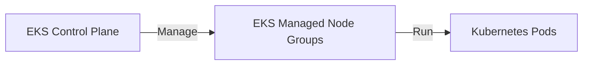

# EKS Fundamentals

## 1. Overview & Real-World Analogy

**Real-World Analogy:** A centralized shipping port container yard supervisor (Kubernetes Control Plane) that organizes cargo bays managed by hired laborers.

Amazon Elastic Kubernetes Service (EKS) is a managed Kubernetes service that runs Kubernetes control plane infrastructure across multiple Availability Zones.

---

## 2. Architecture & Flow Diagram

---

## 3. Comparison & Decision Guidance

| Feature | Amazon ECS | Amazon EKS (Kubernetes) |
| :--- | :--- | :--- |
| **Ecosystem** | AWS Native, tight integration | Open-source Kubernetes APIs, high portability |
| **Configuration** | Simple Task Definitions | Complex YAML Manifests (Pods, Deployments) |
| **Management Cost** | Free (only pay for resources) | Control Plane fee ($0.10/hour) |

### When to use
- When designing high-scale, production-ready solutions on AWS.
- To enforce operational excellence and follow security best practices.

### When not to use
- For basic prototyping where native defaults are sufficient.

---

## 4. Key Performance, Cost & Security Considerations

### Performance Impact
Use the AWS VPC CNI plugin to assign native VPC IP addresses to Kubernetes pods, providing line-rate networking speed.

### Cost Impact
EKS charges $0.10 per hour per cluster for control plane management, in addition to worker node EC2/Fargate costs.

### Security Implications
Use IAM Roles for Service Accounts (IRSA) to assign least-privilege IAM policies directly to individual Kubernetes pods.

---

## 5. Exam tips & Traps

:::tip
**Exam Clues:** Kubernetes on AWS, managed control plane, IRSA pod authorization, pod networking CNI.

Use EKS managed node groups to automate the lifecycle management (creation, update, termination) of Kubernetes worker instances.
:::

:::warning
**Common Exam Traps:** Do not use hardcoded IAM access keys inside pod containers. Always use IRSA or instance profiles for AWS authentication.
:::

---

## Prerequisites

- [ECS Auto Scaling](ecs-autoscaling.md)

## Recommended Next Topics

- [ecr](ecr.md)

## Related Topics

- [ecs](ecs.md)
- [ECS Capacity Providers](ecs-capacity-providers.md)
- [ECS Auto Scaling](ecs-autoscaling.md)
