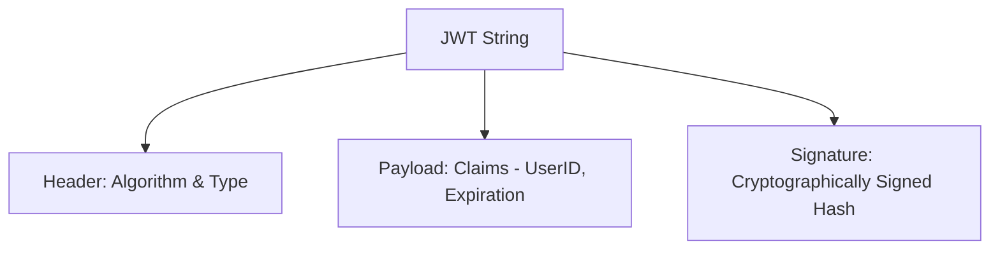

# JWT and Authentication

## 1. Overview & Real-World Analogy

**Real-World Analogy:** A signed luggage ticket: the airline agent writes the details and stamps it. Anyone can read the tag, but no one can alter it without breaking the stamp signature.

JSON Web Token (JWT) is an open standard (RFC 7519) that defines a compact and self-contained way for securely transmitting information between parties as a JSON object.

---

## 2. Architecture & Flow Diagram

---

## 3. Comparison & Decision Guidance

| Token Type | ID Token | Access Token | Refresh Token |
| :--- | :--- | :--- | :--- |
| **Target Audience**| Client App (contains profile claims) | Resource Server (APIs, ALB) | Auth Server (reissues tokens) |
| **Lifespan** | Short-lived (e.g. 1 hour) | Short-lived (e.g. 1 hour) | Long-lived (e.g. 30 days) |

### When to use
- When designing high-scale, production-ready solutions on AWS.
- To enforce operational excellence and follow security best practices.

### When not to use
- For basic prototyping where native defaults are sufficient.

---

## 4. Key Performance, Cost & Security Considerations

### Performance Impact
Zero database lookups are required for validation, as JWT contains expiration and signature verification keys locally.

### Cost Impact
Token-based validation requires no operational infrastructure, reducing resource costs.

### Security Implications
Always verify the JWT signature using the public JSON Web Key Set (JWKS) provided by the Identity Provider before extracting payload data.

---

## 5. Exam tips & Traps

:::tip
**Exam Clues:** JSON Web Token sections header payload signature, JWKS public validation, stateless session architecture.

Store Refresh Tokens securely in HttpOnly cookies to protect them from cross-site scripting (XSS) attacks.
:::

:::warning
**Common Exam Traps:** JWTs are base64-encoded, not encrypted. Do not store sensitive info (like database passwords or API keys) inside the JWT payload.
:::

---

## Prerequisites

- [AWS Cognito Integration](cognito.md)

## Recommended Next Topics

- [Signature Version 4 (SigV4)](sigv4.md)

## Related Topics

- [KMS](kms.md)
- [Secret Manager and System Parameters](secret-manager.md)
- [AWS Cognito Integration](cognito.md)
