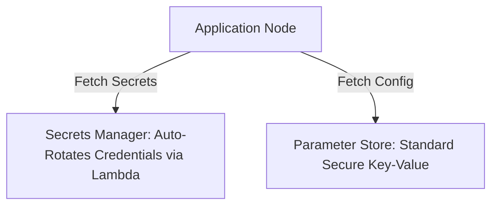

# Parameter Store vs Secrets Manager

## 1. Overview & Real-World Analogy

**Real-World Analogy:** Parameter Store is a standard secure cabinet for office supplies (Variables/Passwords); Secrets Manager is an armored vault with a robotic guard that changes the locks every month (Auto Rotation).

SSM Parameter Store and Secrets Manager are AWS key-value configuration stores. Choosing between them depends on cost, rotation requirements, and secret size.

---

## 2. Architecture & Flow Diagram

---

## 3. Comparison & Decision Guidance

| Feature | SSM Parameter Store | AWS Secrets Manager |
| :--- | :--- | :--- |
| **Cost** | Free (Standard parameters) | $0.40 per secret per month |
| **Auto-Rotation** | Requires manual or custom scripts | Native integration with Lambda rotation |
| **API Limit** | High (Up to 10,000 TPS enabled) | Lower base limits (requires ticket/tuning) |
| **Cross-Account** | Difficult | Native support via resource policies |

### When to use
- When designing high-scale, production-ready solutions on AWS.
- To enforce operational excellence and follow security best practices.

### When not to use
- For basic prototyping where native defaults are sufficient.

---

## 4. Key Performance, Cost & Security Considerations

### Performance Impact
Enable Parameter Store API throughput upgrades if you scale to thousands of concurrent container invocations.

### Cost Impact
Secrets Manager costs $0.40 per secret per month plus $0.05 per 10,000 API requests. Parameter store is free for standard configurations.

### Security Implications
Both support KMS encryption at rest. Secrets Manager integrates directly with RDS, Redshift, and DocumentDB secrets.

---

## 5. Exam tips & Traps

:::tip
**Exam Clues:** AWS database credential rotation, cross-account secret sharing, parameter store pricing compared to secrets manager.

Use Parameter Store for standard app configs (e.g. database hostnames) and Secrets Manager for sensitive access keys requiring rotation.
:::

:::warning
**Common Exam Traps:** Do not use Secrets Manager for non-sensitive settings (like build numbers), as it will unnecessarily inflate your monthly AWS bill.
:::

---

## Prerequisites

- [Signature Version 4 (SigV4)](sigv4.md)

## Recommended Next Topics

- [AWS Certified Developer – Associate (DVA-C02) Practice Mock Exams](../Practice Exams/DVA-C02-Mock-Exam.md)

## Related Topics

- [KMS](kms.md)
- [Secret Manager and System Parameters](secret-manager.md)
- [AWS Cognito Integration](cognito.md)
