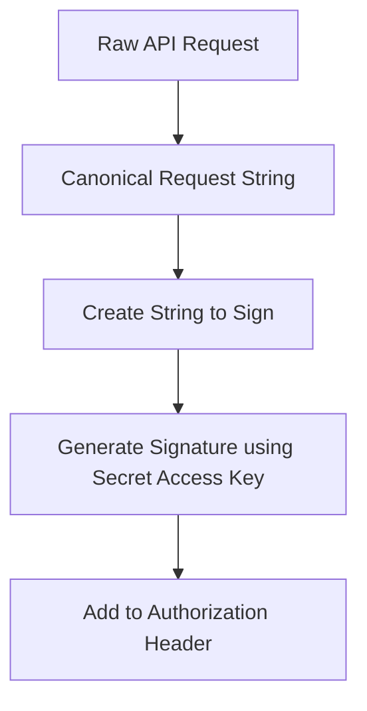

# Signature Version 4 (SigV4)

## 1. Overview & Real-World Analogy

**Real-World Analogy:** A wax-sealed envelope with a stamp: if someone intercepts the mail and changes the message, the stamp seal is broken, alerting the receiver of tampering.

Signature Version 4 (SigV4) is the protocol AWS uses to authenticate API requests sent to AWS services. It uses cryptographic hashing to sign incoming payloads.

---

## 2. Architecture & Flow Diagram

---

## 3. Comparison & Decision Guidance

| Signing Protocol | Signature Version 4 (SigV4) | Signature Version 2 (Legacy) |
| :--- | :--- | :--- |
| **Hashing Algorithm** | SHA-256 | MD5 / SHA-1 (Deprecated) |
| **Security** | Highly secure (Scoped signature keys) | Less secure (Uses raw secret key directly) |

### When to use
- When designing high-scale, production-ready solutions on AWS.
- To enforce operational excellence and follow security best practices.

### When not to use
- For basic prototyping where native defaults are sufficient.

---

## 4. Key Performance, Cost & Security Considerations

### Performance Impact
SDKs handle request signing locally in milliseconds, causing negligible CPU latency.

### Cost Impact
No additional charge for request authentication.

### Security Implications
SigV4 protects against man-in-the-middle attacks by including the request timestamp in the signed hash, preventing replay attacks.

---

## 5. Exam tips & Traps

:::tip
**Exam Clues:** AWS API request authentication, pre-signed URL validation, payload hashing, HMAC-SHA256, 5-minute clock drift rule.

Use SigV4 signing headers to create S3 pre-signed URLs, allowing clients to securely upload files without AWS credentials.
:::

:::warning
**Common Exam Traps:** Signed requests are timestamp-sensitive; if the client clock drifts by more than 5 minutes from AWS servers, the request is rejected.
:::

---

## Prerequisites

- [JWT and Authentication](jwt-and-authentication.md)

## Recommended Next Topics

- [Parameter Store vs Secrets Manager](parameter-store-vs-secrets-manager.md)

## Related Topics

- [KMS](kms.md)
- [Secret Manager and System Parameters](secret-manager.md)
- [AWS Cognito Integration](cognito.md)
