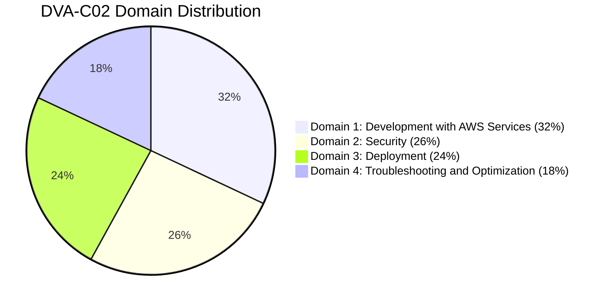
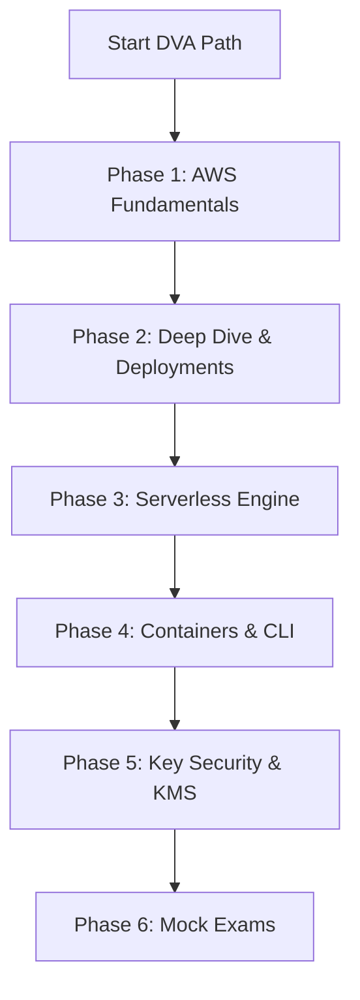

# AWS Certified Developer – Associate (DVA-C02) Study Plan & Roadmap

_A comprehensive, consolidated guide designed to prepare you for the AWS Certified Developer – Associate exam. This plan guides you through core fundamentals, deployments, serverless architectures, containerization, security, and practice mock tests._

:::info
💡 **Prerequisite (Phase 0):** If you are new to IT, systems, networks, databases, or programming, it is highly recommended to complete the shared [IT Foundations Bridge Roadmap (Phase 0)](../00-it-foundation/beginner-roadmap.md) before starting this track.
:::

---

## 🏆 DVA-C02 Exam Syllabus Coverage

Before starting, familiarize yourself with the official exam domain weighting:
| Parameter | Details |
|---|---|
| Exam Code | DVA-C02 |
| Level | Associate |
| Duration | 130 minutes |
| Number of Questions | 65 (Multiple Choice/Multiple Response) |
| Passing Score | 750 / 1000 |
| Cost | $150 USD |

---

## 🚀 Recommended Study Sequence

Follow this sequence to build a progressive understanding of developer topics:

---

## 📅 Step-by-Step Study Phases

### Phase 1: AWS Fundamentals (12 Hours)

Get started with the foundational compute, storage, networking, and databases required for developer associates.

- **Identity & Network Security:**
  - [IAM: Identity Access & Management](./1-aws-fundamentals/iam.md) — Users, groups, roles, policy formats, federation, and simulator tools.
  - [Security Groups](./1-aws-fundamentals/security-groups.md) — Inbound/outbound rules, referencing IP/CIDR blocks, and diagnosing network timeouts.
  - [VPC: Virtual Private Cloud](./1-aws-fundamentals/vpc.md) — Subnets, internet gateways, route tables, and private/public IPs.
- **Virtual Servers & Scaling:**
  - [EC2: Virtual Machines](./1-aws-fundamentals/ec2.md) — Instance types, key pairs, user data scripts, and SSH connectivity configurations.
  - [ELB: Elastic Load Balancers](./1-aws-fundamentals/elb.md) — Routing rules, listeners, health checks, and cross-zone load balancing.
  - [ASG: Auto Scaling Group](./1-aws-fundamentals/asg.md) — Scaling policies, cooldown periods, launch templates, and minimum/maximum size limits.
- **Storage & Databases:**
  - [S3 Buckets](./1-aws-fundamentals/s3.md) — Objects, buckets, storage classes, versioning, security, and policies.
  - [EBS: Elastic Block Store](./1-aws-fundamentals/ebs.md) — Volumes, snapshots, instance store local drives, and performance IOPS limits.
  - [RDS: Relational Database Service](./1-aws-fundamentals/rds.md) — Postgres/MySQL, Multi-AZ high availability, Read Replicas, and backups.
  - [ElastiCache](./1-aws-fundamentals/elasticache.md) — Redis vs. Memcached engines, caching strategies, and performance patterns.
- **Domain Name Services:**
  - [Route 53](./1-aws-fundamentals/route53.md) — DNS records (A, AAAA, CNAME, Alias), hosted zones, and routing logic.

:::info
**Milestone Checkpoint 1:** You must be able to deploy an EC2 instance inside a public subnet, associate a security group allowing port 80/443 traffic, and register it behind an Application Load Balancer.
:::

---

### Phase 2: AWS Deep Dive & Deployment (15 Hours)

Advanced tools for configuration, automated pipelines, orchestration, infrastructure-as-code, and monitoring.

- **Command Line & Development Kits:**
  - [CLI: Command Line Interface](./2-aws-deep-dive/cli.md) — CLI configuration, credentials profiles, and dry-run API calls.
  - [SDK: Software Development Kit](./2-aws-deep-dive/sdk.md) — Language bindings, client connections, retry policies, and timeout tuning.
- **PaaS & Containerized Deployments:**
  - [Elastic Beanstalk](./2-aws-deep-dive/elastic-beanstalk.md) — Platform configurations, deployment types (rolling, canary), and `.ebextensions` customization scripts.
- **AWS Developer Suite & Tooling:**
  - [Cloud9 IDE](./2-aws-deep-dive/cloud9.md) — Browser-based developer environment.
  - [CodeArtifact Repository](./2-aws-deep-dive/codeartifact.md) — Secure package registry caching.
  - [CodeCatalyst Workspace](./2-aws-deep-dive/codecatalyst.md) — Unified DevOps platform.
  - [AppConfig Configurations](./2-aws-deep-dive/appconfig.md) — Dynamic feature flags and rollouts.
  - [CloudShell Terminal](./2-aws-deep-dive/cloudshell.md) — Pre-authenticated browser CLI terminal.
- **Continuous Delivery & Deployments (CI/CD):**
  - [CICD Integration Intro](./2-aws-deep-dive/cicd/cicd.md) — Automation benefits, repositories, builds, test runners, and pipeline stages.
  - [CodeCommit](./2-aws-deep-dive/cicd/codecommit.md) — Git repositories, branches, pull requests, and permissions mapping.
  - [CodeBuild](./2-aws-deep-dive/cicd/codebuild.md) — Compilation containers, runtime setup, artifacts cache, and `buildspec.yml` stages.
  - [CodeDeploy](./2-aws-deep-dive/cicd/codedeploy.md) — Lifecycle hooks, `appspec.yml` configurations, and ECS/Lambda target group updates.
  - [CodePipeline](./2-aws-deep-dive/cicd/codepipeline.md) — Multi-stage release orchestrations, custom actions, and EventBridge triggers.
- **Infrastructure as Code & Templates:**
  - [CloudFormation](./2-aws-deep-dive/cloudformation/cloudformation.md) — Resources, parameters, mappings, outputs, stack sets, and templates.
  - [YAML Formatting](./2-aws-deep-dive/yaml.md) — Syntax, key-value mappings, and list structures.
- **Messaging & Streaming Integrations:**
  - [Integration Intro](./2-aws-deep-dive/integration-and-messaging/0-intro.md) — De-coupling architectures, publish/subscribe, and data pipelines.
  - [SQS: Simple Queue Service](./2-aws-deep-dive/integration-and-messaging/1-sqs.md) — Standard vs. FIFO queues, visibility timeouts, dead letter queues (DLQs), and polling strategies.
  - [SNS: Simple Notification Service](./2-aws-deep-dive/integration-and-messaging/2-sns.md) — Topics, subscribers, message filtering policies, fan-out configurations, and SMS/Email endpoints.
  - [Kinesis Streams](./2-aws-deep-dive/integration-and-messaging/3-kinesis.md) — Shards, partition keys, hot spot resolution, and Firehose data ingestion.
- **Monitoring, Auditing & Observability:**
  - [CloudWatch](./2-aws-deep-dive/monitoring-and-audit/cloudwatch.md) — Custom namespaces, metric filters, alarm triggers, and logs.
  - [CloudWatch Advanced observability](./2-aws-deep-dive/monitoring-and-audit/cloudwatch-advanced.md) — Synthetics, RUM, Contributor Insights.
  - [CloudTrail](./2-aws-deep-dive/monitoring-and-audit/cloudtrail.md) — API tracking, user auditing, and write/read event logs.
  - [AWS Config](./2-aws-deep-dive/monitoring-and-audit/config.md) — Configuration rules, history tracking, and resource compliance auditing.
  - [AWS X-Ray](./2-aws-deep-dive/monitoring-and-audit/xray.md) — Subsegment tracing, instrumentation SDK APIs, service maps, annotations, and metadata details.
  - [AWS X-Ray Advanced Tracing](./2-aws-deep-dive/monitoring-and-audit/xray-advanced.md) — Distributed tracing, custom segment APIs.
- **IAM Security Boundaries & Deep Dives:**
  - [IAM Permission Boundaries](./2-aws-deep-dive/iam-deep-dive/iam-permission-boundaries.md) — Delegate IAM without privilege escalation.
  - [IAM Policy Evaluation](./2-aws-deep-dive/iam-deep-dive/iam-policy-evaluation.md) — Evaluation logic and precedence mapping.
  - [IAM Cross-Account Access](./2-aws-deep-dive/iam-deep-dive/iam-cross-account-access.md) — Trust delegation via AssumeRole.
  - [IAM ABAC](./2-aws-deep-dive/iam-deep-dive/iam-abac.md) — Attribute-based fine-grained controls.
  - [IAM Access Analyzer](./2-aws-deep-dive/iam-deep-dive/iam-access-analyzer.md) — Automated external and public sharing check.

:::info
**Milestone Checkpoint 2:** You must understand the difference between SQS standard/FIFO visibility timeouts, and be able to construct a basic CloudFormation template deploying an SQS queue.
:::

---

### Phase 3: AWS Serverless (15 Hours)

Advanced serverless architectures that require no server configuration and auto-scale dynamically.

- **Serverless Introduction:**
  - [Serverless Intro](./3-aws-serverless/serverless.md) — Serverless benefits, architectures, and cost considerations.
- **FaaS & API Management:**
  - [AWS Lambda](./3-aws-serverless/lambda.md) — Concurrency, execution environment cold/warm starts, handler functions, and invocation types (sync/async/esm).
  - [Lambda Advanced Deep Dive](./3-aws-serverless/lambda-advanced.md) — SnapStart, concurrency scaling, DLQs, Destinations.
  - [API Gateway](./3-aws-serverless/apigateway.md) — REST vs. HTTP APIs, custom Lambda authorizers, CORS controls, and response mapping templates.
  - [API Gateway Advanced Deep Dive](./3-aws-serverless/api-gateway-advanced.md) — Usage plans, keys, private APIs, mTLS, WAF, canaries.
- **Serverless Database & Workflows:**
  - [Amazon DynamoDB](./3-aws-serverless/dynamodb.md) — Partition/Sort keys, WCU/RCU calculations, local/global secondary indexes (LSI vs. GSI), streams, optimistic locking, and DAX caches.
  - [DynamoDB Advanced Deep Dive](./3-aws-serverless/dynamodb-advanced.md) — Adaptive capacity, transactions, PITR, Global Tables.
  - [Step Functions](./3-aws-serverless/stepfunctions.md) — Visual workflows, Standard vs. Express state machines, retry policies, and error catch paths.
  - [Amazon EventBridge Deep Dive](./3-aws-serverless/eventbridge-deep-dive.md) — Event buses, schema registry, API destinations, archive & replay.
- **Application Frameworks & GraphQL:**
  - [SAM: Serverless Application Model](./3-aws-serverless/sam.md) — Declarative template structures, SAM local testing commands, and package/deploy cycles.
  - [Cognito](./3-aws-serverless/cognito.md) — User Pools user directory vs. Identity Pools for temporary AWS credential exchanges.
  - [AppSync](./3-aws-serverless/appsync.md) — GraphQL schema formats, queries, mutations, subscriptions, and resolvers.

:::info
**Milestone Checkpoint 3:** Calculate RCU/WCU requirements for a DynamoDB table, configure a Lambda trigger parsing SQS queue items, and debug an API Gateway integration timeout.
:::

---

### Phase 4: Docker & Containerization (8 Hours)

Manage containerized application lifecycles and microservices.

- [ECS: Elastic Container Service](./4-aws-containers/ecs.md) — Clusters, task definitions, service scaling rules, and networking modes.
- [ECS Capacity Providers](./4-aws-containers/ecs-capacity-providers.md) — Scaling EC2 Auto Scaling groups and Fargate.
- [ECS Service Auto Scaling](./4-aws-containers/ecs-autoscaling.md) — Dynamic service scaling rules.
- [EKS Fundamentals](./4-aws-containers/eks-fundamentals.md) — Kubernetes managed control plane, IRSA, pod configurations.
- [ECR: Elastic Container Registry](./4-aws-containers/ecr.md) — Docker images, repository policies, credentials, and image tag scanning.
- [Fargate](./4-aws-containers/fargate.md) — Serverless container compute model, CPU/Memory configurations, and security profiles.

---

### Phase 5: Security & Encryption (5 Hours)

Master key security, envelope encryption, and safe credentials management.

- [KMS: Key Management Service](./5-others/kms.md) — Key policies, customer managed keys, and envelope encryption API flows (`GenerateDataKey`).
- [Secrets Manager](./5-others/secret-manager.md) — Automatic API credentials rotation, security boundaries, and Systems Manager Parameter Store integrations.
- [Cognito Integration](./5-others/cognito.md) — Deep dive into identity authentication and authorization.
- [JWT Token-Based Authentication](./5-others/jwt-and-authentication.md) — Stateless session tokens validation.
- [Signature Version 4 (SigV4)](./5-others/sigv4.md) — Cryptographic API request signing.
- [Parameter Store vs Secrets Manager](./5-others/parameter-store-vs-secrets-manager.md) — Architectural comparison of configuration stores.

---

### Phase 6: Practice & Validation (5 Hours)

Before taking the official exam, validate your readiness with three full-length practice tests under timed conditions:

- **[DVA-C02 Practice Mock Exams Overview](./Practice%20Exams/DVA-C02-Mock-Exam.md)**
- **🏆 Mock Exam 1 (75 Questions):**
  - [Part 1: Questions 1 - 25](./Practice%20Exams/DVA-C02-Mock-Exam-Part-1.md) (Domain 1 & 2)
  - [Part 2: Questions 26 - 50](./Practice%20Exams/DVA-C02-Mock-Exam-Part-2.md) (Domain 2 & 3)
  - [Part 3: Questions 51 - 75](./Practice%20Exams/DVA-C02-Mock-Exam-Part-3.md) (Domain 3 & 4)
- **🏆 Mock Exam 2 (75 Questions):**
  - [Part 1: Questions 1 - 25](./Practice%20Exams/DVA-C02-Mock-Exam-2-Part-1.md) (Domain 1 & 2)
  - [Part 2: Questions 26 - 50](./Practice%20Exams/DVA-C02-Mock-Exam-2-Part-2.md) (Domain 2 & 3)
  - [Part 3: Questions 51 - 75](./Practice%20Exams/DVA-C02-Mock-Exam-2-Part-3.md) (Domain 3 & 4)
- **🌶️ Mock Exam 3 (75 Questions - Advanced Difficulty):**
  - [Part 1: Questions 1 - 25](./Practice%20Exams/DVA-C02-Mock-Exam-3-Part-1.md) (Domain 1 & 2)
  - [Part 2: Questions 26 - 50](./Practice%20Exams/DVA-C02-Mock-Exam-3-Part-2.md) (Domain 2 & 3)
  - [Part 3: Questions 51 - 75](./Practice%20Exams/DVA-C02-Mock-Exam-3-Part-3.md) (Domain 3 & 4)

---

## Recommended Next Topics

After passing DVA-C02, step up to the **Solutions Architect Professional (SAP-C02)** syllabus!

- [Go to AWS SAP Study Roadmap](../02-solutions-architect-professional/sap-roadmap.md)
- [AWS Well-Architected Framework](../02-solutions-architect-professional/well-architected-framework.md)

---

## Prerequisites

- None (Start of Developer Associate track)

## Recommended Next Topics

- [IAM: Identity and Access Management](1-aws-fundamentals/iam.md)
