# Storage Services - Mermaid Diagrams

## Amazon S3 Overview

### S3 Storage Classes Hierarchy

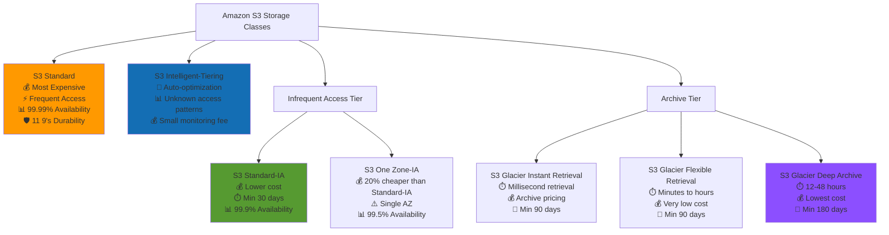

### S3 Lifecycle Policy Flow

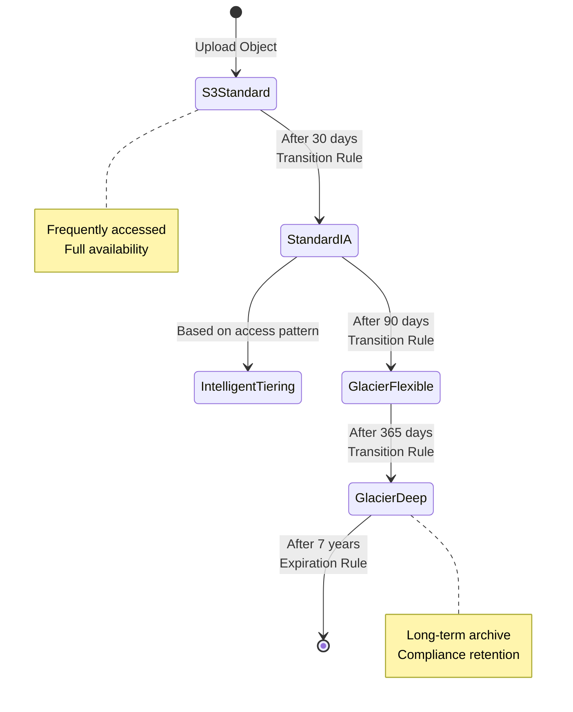

### S3 Data Flow and Access

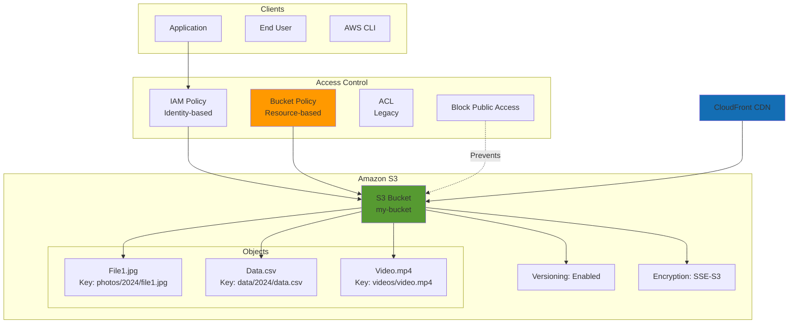

### S3 Versioning

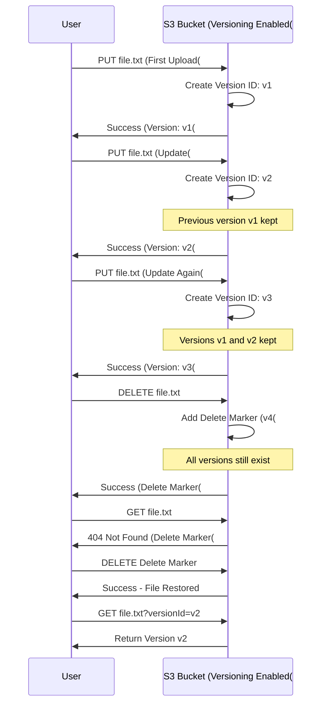

### S3 Replication (CRR & SRR)

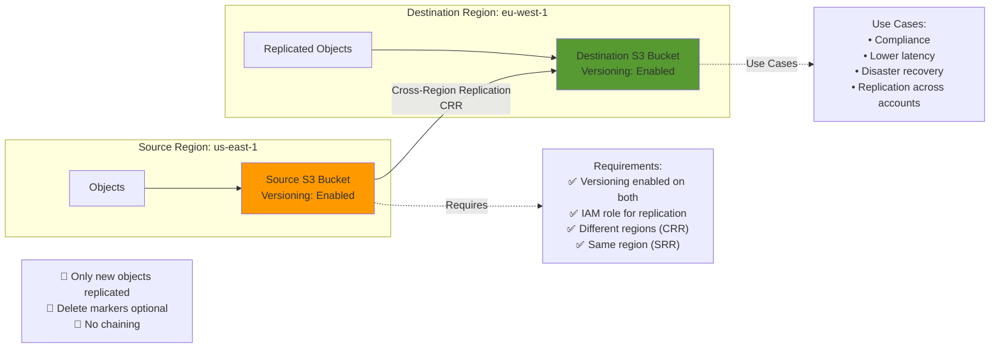

### S3 Encryption Options

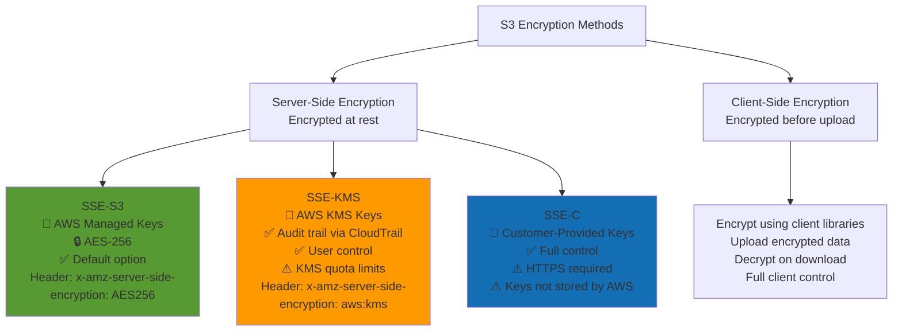

### S3 Access Points

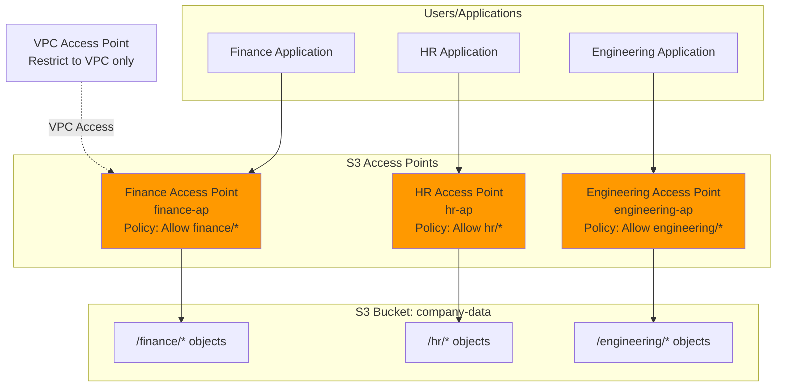

### S3 Event Notifications

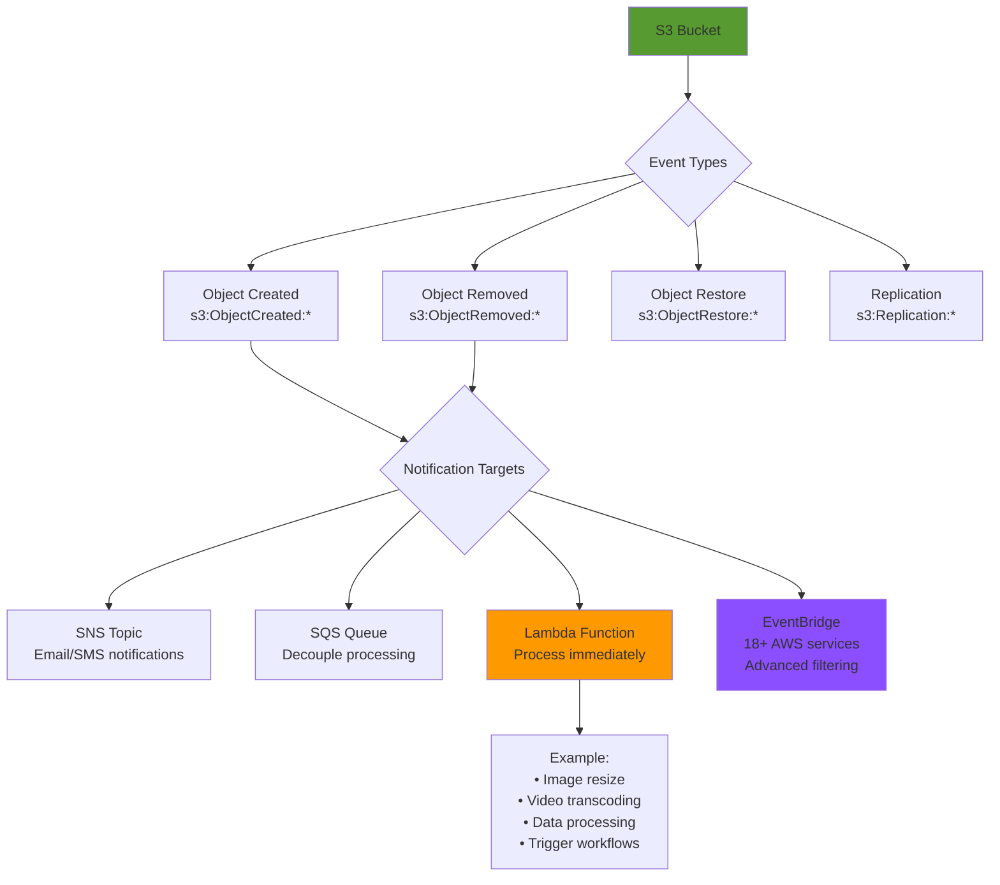

### S3 Performance Optimization

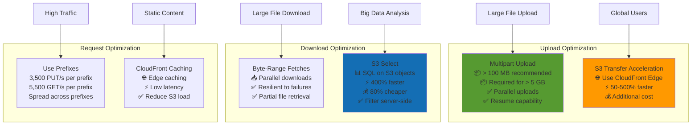

## Amazon EBS (Elastic Block Store)

### EBS Volume Types

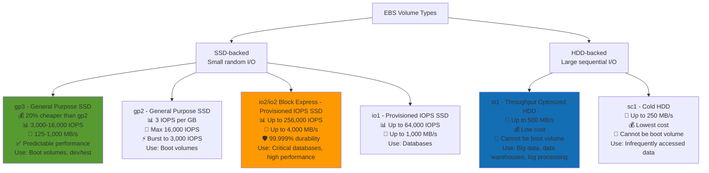

### EBS Volume Lifecycle

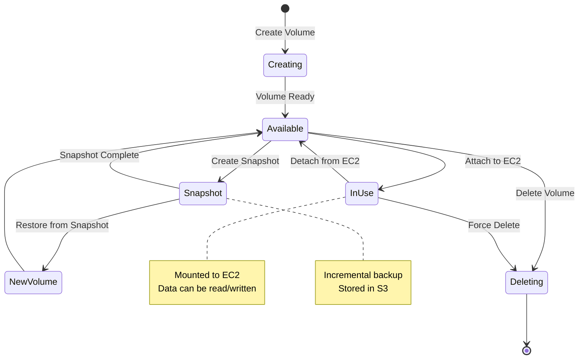

### EBS Snapshots Architecture

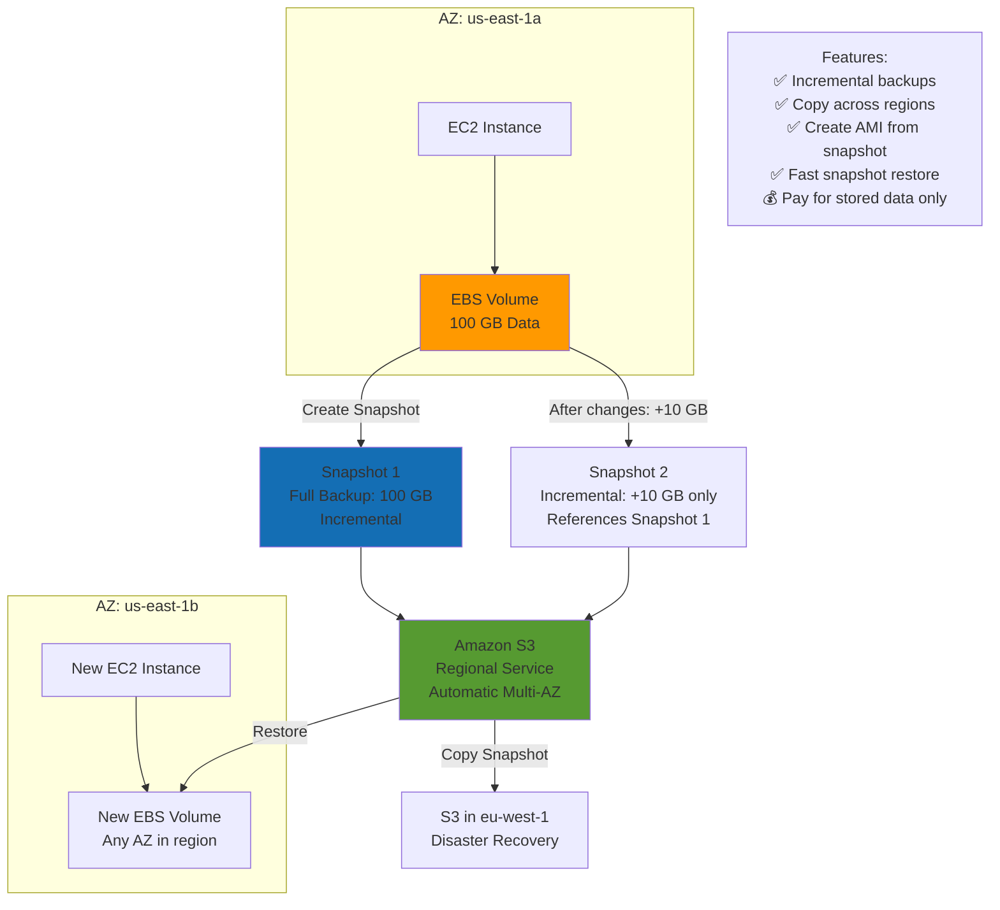

### EBS Multi-Attach (io1/io2 only)

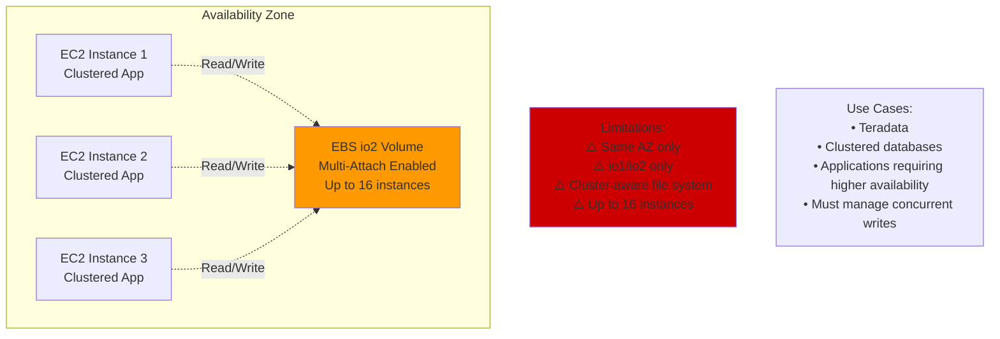

## Amazon EFS (Elastic File System)

### EFS Architecture

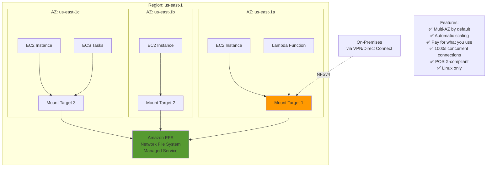

### EFS Storage Classes

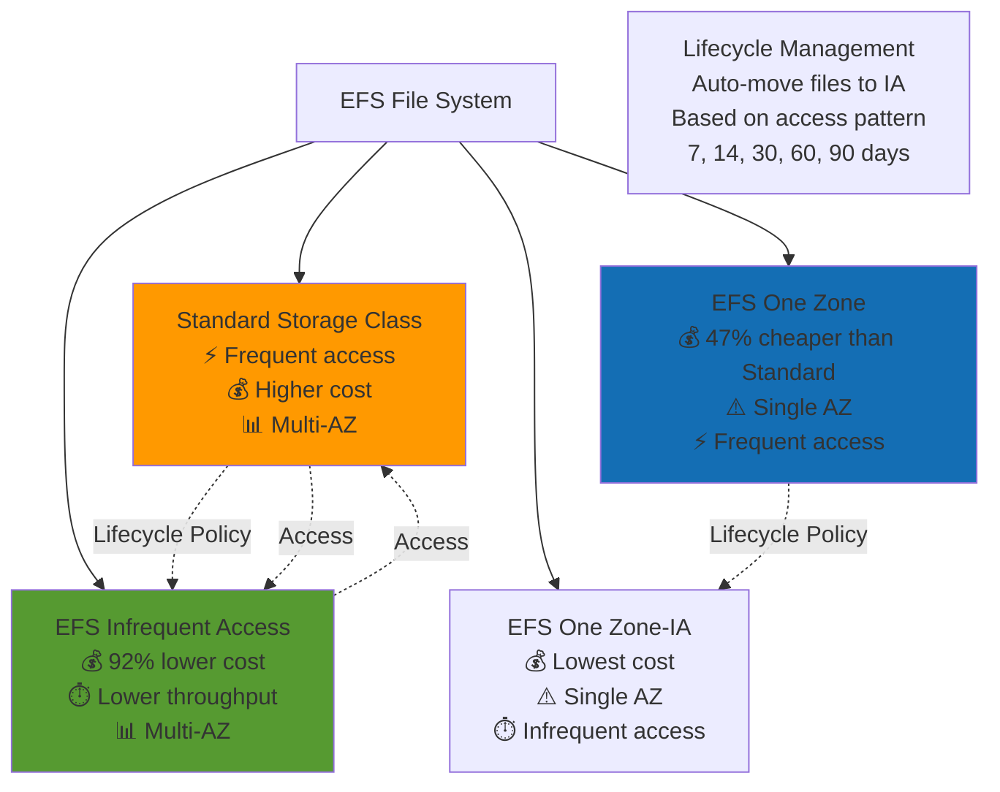

### EFS Performance Modes

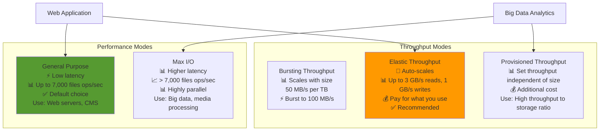

## AWS Storage Gateway

### Storage Gateway Types

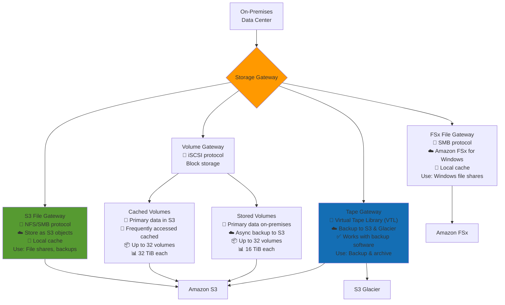

### Storage Gateway Hybrid Architecture

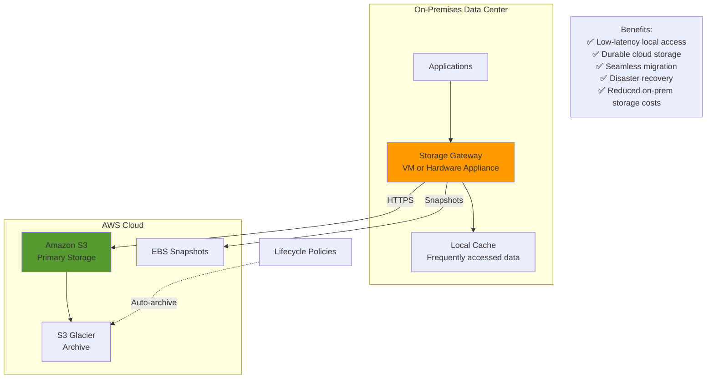

## AWS Snow Family

### Snow Family Devices

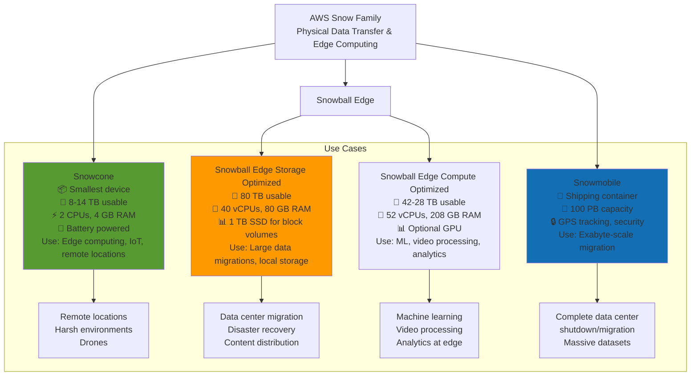

### Snow Family Data Migration Flow

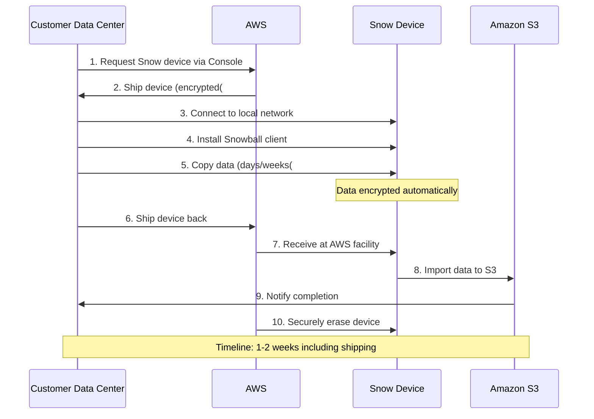

## Amazon FSx

### FSx Family Overview

```mermaid
graph TB
    FSx["Amazon FSx<br/>Managed File Systems"]
    
    FSx --> Windows["FSx for Windows File Server<br/>🪟 Windows-native<br/>📁 SMB protocol<br/>✅ Active Directory integration<br/>✅ DFS Namespaces<br/>📊 SSD & HDD options<br/>Use: Windows apps, SQL Server, SharePoint"]
    
    FSx --> Lustre["FSx for Lustre<br/>⚡ High-performance computing<br/>📊 100+ GB/s, millions IOPS<br/>🔗 S3 integration<br/>⚙️ Sub-millisecond latencies<br/>Use: ML, HPC, video processing, financial modeling"]
    
    FSx --> NetApp["FSx for NetApp ONTAP<br/>🔧 NetApp ONTAP features<br/>📁 NFS, SMB, iSCSI<br/>✅ Multi-protocol access<br/>📸 Snapshots, replication<br/>Use: Enterprise apps, multi-protocol access"]
    
    FSx --> OpenZFS["FSx for OpenZFS<br/>🐧 Linux workloads<br/>📁 NFS protocol<br/>⚡ Up to 1 million IOPS<br/>📸 Point-in-time snapshots<br/>Use: Linux apps, data analytics"]
    
    subgraph Key_Differences_Group["Key Differences"]
        Windows --> WinNote["Windows environment<br/>SMB shares<br/>AD integration"]
        Lustre --> LustreNote["HPC workloads<br/>Parallel file system<br/>S3 backend"]
        NetApp --> NetAppNote["Enterprise features<br/>Multi-protocol<br/>Data management"]
        OpenZFS --> ZFSNote["Linux workloads<br/>ZFS file system<br/>High performance"]
    end
    
    classDef style1 fill:#FF9900
    class Windows style1
    classDef style2 fill:#569A31
    class Lustre style2
    classDef style3 fill:#146EB4
    class NetApp style3
```

### FSx for Lustre with S3 Integration

```mermaid
graph TB
    subgraph Compute_Resources_Group["Compute Resources"]
        EC2_1[EC2 Instance 1]
        EC2_2[EC2 Instance 2]
        EC2_3[EC2 Instance 3]
        Cluster[HPC Cluster]
    end
    
    subgraph FSx_for_Lustre_Group["FSx for Lustre"]
        FSxLustre["FSx for Lustre<br/>High-performance file system<br/>Parallel I/O"]
        Cache[File System Cache]
        
        FSxLustre --> Cache
    end
    
    subgraph Amazon_S3_Group["Amazon S3"]
        S3Input["S3 Bucket<br/>Input Data"]
        S3Output["S3 Bucket<br/>Output Results"]
    end
    
    EC2_1 --> FSxLustre
    EC2_2 --> FSxLustre
    EC2_3 --> FSxLustre
    Cluster --> FSxLustre
    
    S3Input -->|Lazy Load| FSxLustre
    FSxLustre -->|Write Back| S3Output
    
    Process["Process:<br/>1. Data in S3<br/>2. FSx lazy-loads on demand<br/>3. Parallel processing<br/>4. Results written to S3"]
    
    DeploymentOptions["Deployment Options:<br/>• Scratch: Temporary, no replication<br/>• Persistent: HA, auto-replication"]
    
    classDef style1 fill:#569A31
    class FSxLustre style1
    classDef style2 fill:#FF9900
    class S3Input style2
```

## Storage Comparison Matrix

### When to Use Which Storage Service

```mermaid
graph TB
    Start([Choose Storage Service])
    
    Start --> Q1{Data Type?}
    
    Q1 -->|Object Storage| S3Decision{Access Pattern?}
    Q1 -->|Block Storage| BlockDecision{Shared Access?}
    Q1 -->|File Storage| FileDecision{OS Type?}
    
    S3Decision -->|Frequent| S3Standard[S3 Standard]
    S3Decision -->|Infrequent| S3IA[S3 Standard-IA]
    S3Decision -->|Archive| Glacier[S3 Glacier]
    S3Decision -->|Unknown| Intelligent[S3 Intelligent-Tiering]
    
    BlockDecision -->|No| EBSChoice["EBS Volume<br/>Single EC2 instance"]
    BlockDecision -->|Yes, same AZ| EBSMulti["EBS Multi-Attach<br/>io1/io2 only"]
    BlockDecision -->|Yes, multi-AZ| InstanceStore[Consider EFS instead]
    
    FileDecision -->|Linux| LinuxFile{Performance?}
    FileDecision -->|Windows| WindowsFile{Location?}
    
    LinuxFile -->|Standard| EFS[Amazon EFS]
    LinuxFile -->|HPC| Lustre[FSx for Lustre]
    LinuxFile -->|Enterprise| OpenZFS[FSx for OpenZFS]
    
    WindowsFile -->|AWS| FSxWindows[FSx for Windows]
    WindowsFile -->|On-Premises| StorageGW[Storage Gateway]
    
    classDef style1 fill:#569A31
    class S3Standard style1
    classDef style2 fill:#FF9900
    class EBSChoice style2
    classDef style3 fill:#146EB4
    class EFS style3
    classDef style4 fill:#8C4FFF
    class Lustre style4
```

---

## Prerequisites

- [04: Storage Services - Ultra Fast Learning 🚀](ULTRA-FAST-LEARN.md)

## Recommended Next Topics

- [Storage Services - Practice Questions](PRACTICE-QUESTIONS.md)

## Related Topics

- [Module 01: Storage Services](README.md)
- [⚡ Fast Learning - Storage Services](FAST-LEARN.md)
- [04: Storage Services - Ultra Fast Learning 🚀](ULTRA-FAST-LEARN.md)
