# Database Services - Mermaid Diagrams

## Database Services Overview

### AWS Database Services Map

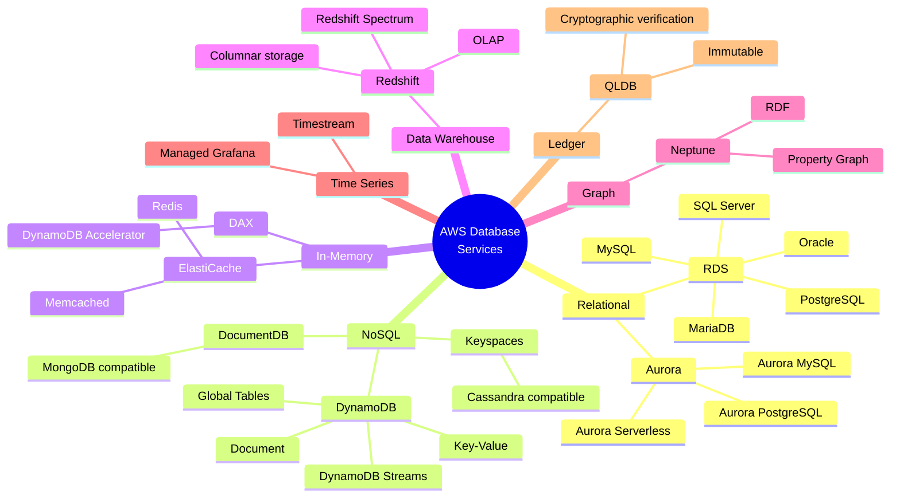
```mermaid
mindmap
    root((AWS Database<br/>Services))
        Relational
            RDS
                PostgreSQL
                MySQL
                MariaDB
                Oracle
                SQL Server
            Aurora
                Aurora PostgreSQL
                Aurora MySQL
                Aurora Serverless
        NoSQL
            DynamoDB
                Key-Value
                Document
                DynamoDB Streams
                Global Tables
            DocumentDB
                MongoDB compatible
            Keyspaces
                Cassandra compatible
        In-Memory
            ElastiCache
                Redis
                Memcached
            DAX
                DynamoDB Accelerator
        Data Warehouse
            Redshift
                OLAP
                Columnar storage
                Redshift Spectrum
        Graph
            Neptune
                Property Graph
                RDF
        Time Series
            Timestream
            Managed Grafana
        Ledger
            QLDB
                Immutable
                Cryptographic verification
```

## Amazon RDS

### RDS Multi-AZ Deployment

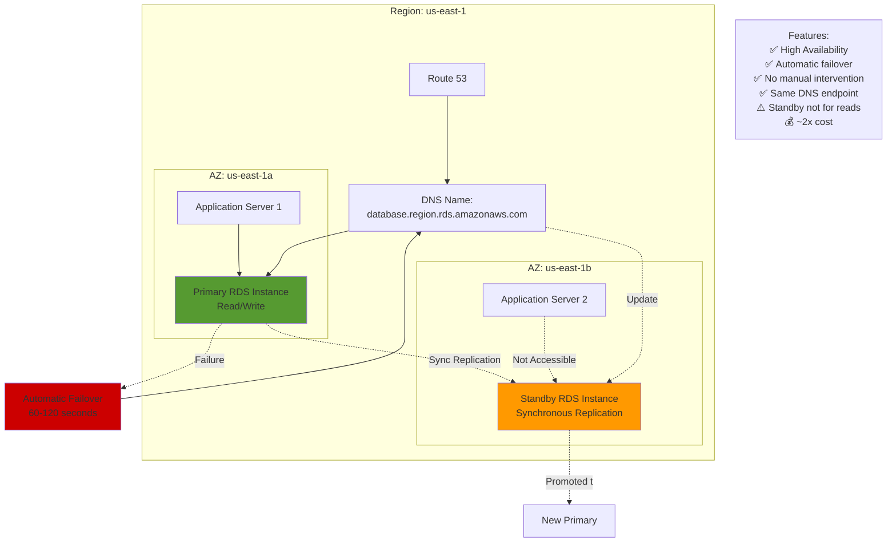
```mermaid
graph TB
    subgraph Region_us_east_1_Group["Region: us-east-1"]
        Route53[Route 53]
        DNS["DNS Name:<br/>database.region.rds.amazonaws.com"]
        
        subgraph AZ_us_east_1a_Group["AZ: us-east-1a"]
            Primary["Primary RDS Instance<br/>Read/Write"]
            App1[Application Server 1]
            
            App1 --> Primary
        end
        
        subgraph AZ_us_east_1b_Group["AZ: us-east-1b"]
            Standby["Standby RDS Instance<br/>Synchronous Replication"]
            App2[Application Server 2]
            
            App2 -.Not Accessible.-> Standby
        end
    end
    
    Route53 --> DNS
    DNS --> Primary
    Primary -.Sync Replication.-> Standby
    
    Primary -.Failure.-> Failover["Automatic Failover<br/>60-120 seconds"]
    Failover --> DNS
    DNS -.Update.-> Standby
    Standby -.Promoted to.-> NewPrimary[New Primary]
    
    Features["Features:<br/>✅ High Availability<br/>✅ Automatic failover<br/>✅ No manual intervention<br/>✅ Same DNS endpoint<br/>⚠️ Standby not for reads<br/>💰 ~2x cost"]
    
    classDef style1 fill:#569A31
    class Primary style1
    classDef style2 fill:#FF9900
    class Standby style2
    classDef style3 fill:#C00
    class Failover style3
```

### RDS Read Replicas

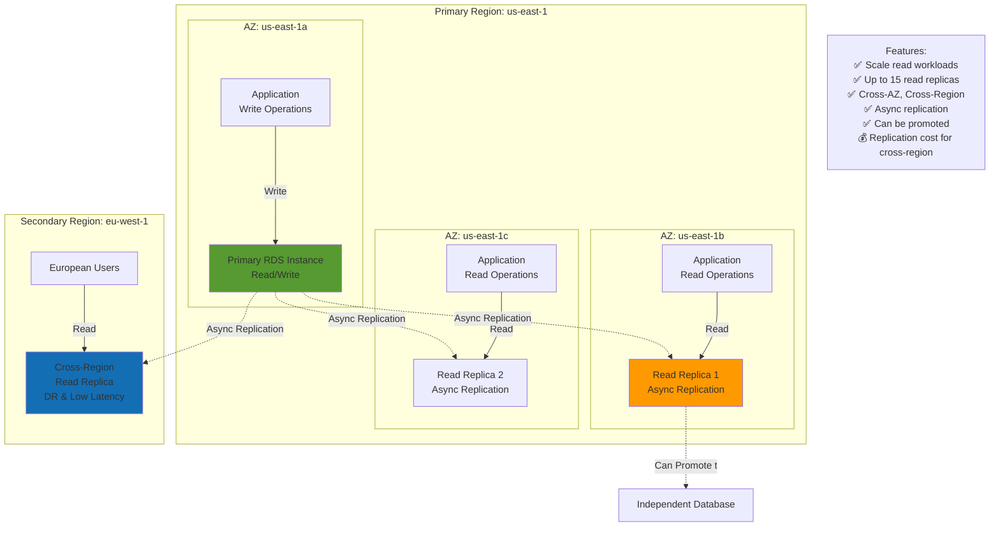
```mermaid
graph TB
    subgraph Primary_Region_us_east_1_Group["Primary Region: us-east-1"]
        subgraph AZ_us_east_1a_Group["AZ: us-east-1a"]
            Primary["Primary RDS Instance<br/>Read/Write"]
            App1["Application<br/>Write Operations"]
            
            App1 -->|Write| Primary
        end
        
        subgraph AZ_us_east_1b_Group["AZ: us-east-1b"]
            Replica1["Read Replica 1<br/>Async Replication"]
            App2["Application<br/>Read Operations"]
            
            App2 -->|Read| Replica1
        end
        
        subgraph AZ_us_east_1c_Group["AZ: us-east-1c"]
            Replica2["Read Replica 2<br/>Async Replication"]
            App3["Application<br/>Read Operations"]
            
            App3 -->|Read| Replica2
        end
    end
    
    subgraph Secondary_Region_eu_west_1_Group["Secondary Region: eu-west-1"]
        ReplicaCR["Cross-Region<br/>Read Replica<br/>DR & Low Latency"]
        AppEU[European Users]
        
        AppEU -->|Read| ReplicaCR
    end
    
    Primary -.Async Replication.-> Replica1
    Primary -.Async Replication.-> Replica2
    Primary -.Async Replication.-> ReplicaCR
    
    Replica1 -.Can Promote to.-> Independent[Independent Database]
    
    Features["Features:<br/>✅ Scale read workloads<br/>✅ Up to 15 read replicas<br/>✅ Cross-AZ, Cross-Region<br/>✅ Async replication<br/>✅ Can be promoted<br/>💰 Replication cost for cross-region"]
    
    classDef style1 fill:#569A31
    class Primary style1
    classDef style2 fill:#FF9900
    class Replica1 style2
    classDef style3 fill:#146EB4
    class ReplicaCR style3
```

### RDS Backup and Restore

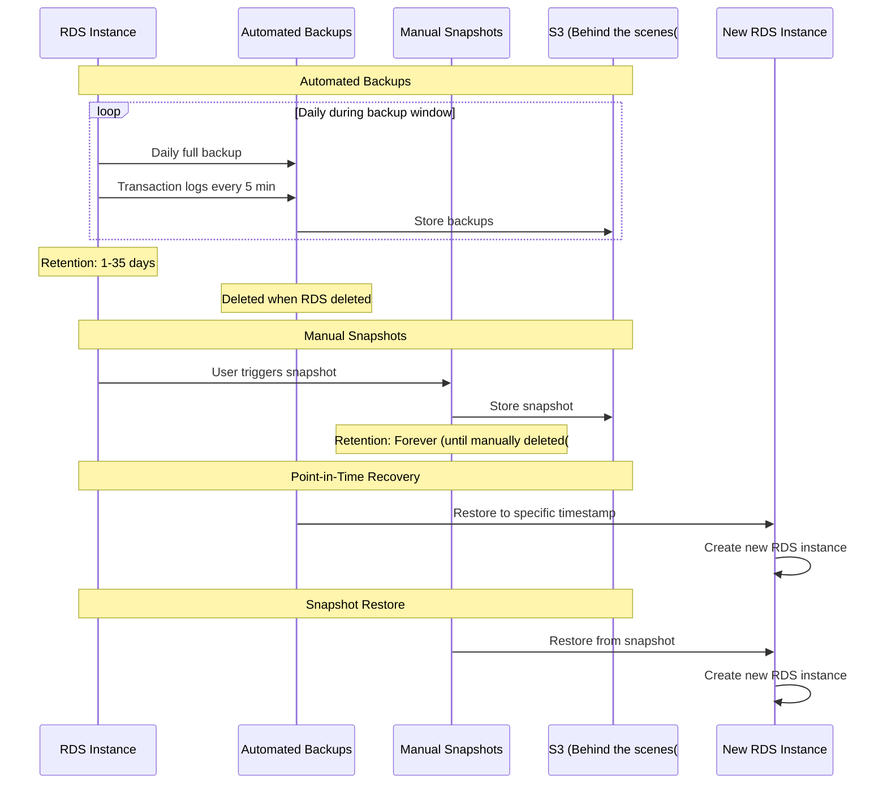
```mermaid
sequenceDiagram
    participant RDS as RDS Instance
    participant AutoBackup as Automated Backups
    participant Snapshot as Manual Snapshots
    participant S3 as S3 (Behind the scenes(
    participant Restore as New RDS Instance
    
    Note over RDS,S3: Automated Backups
    
    loop Daily during backup window
        RDS->>AutoBackup: Daily full backup
        RDS->>AutoBackup: Transaction logs every 5 min
        AutoBackup->>S3: Store backups
    end
    
    Note over RDS: Retention: 1-35 days
    Note over AutoBackup: Deleted when RDS deleted
    
    Note over RDS,S3: Manual Snapshots
    
    RDS->>Snapshot: User triggers snapshot
    Snapshot->>S3: Store snapshot
    Note over Snapshot: Retention: Forever (until manually deleted(
    
    Note over RDS,S3: Point-in-Time Recovery
    
    AutoBackup->>Restore: Restore to specific timestamp
    Restore->>Restore: Create new RDS instance
    
    Note over RDS,S3: Snapshot Restore
    
    Snapshot->>Restore: Restore from snapshot
    Restore->>Restore: Create new RDS instance
    
```

### RDS Proxy Architecture

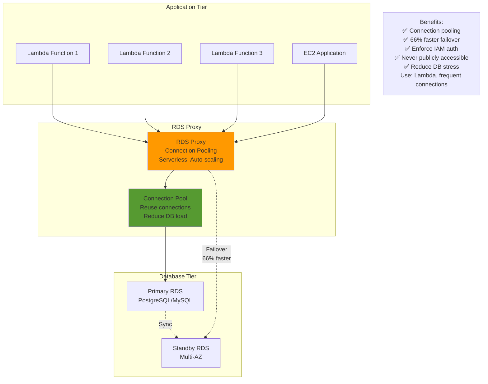
```mermaid
graph TB
    subgraph Application_Tier_Group["Application Tier"]
        Lambda1[Lambda Function 1]
        Lambda2[Lambda Function 2]
        Lambda3[Lambda Function 3]
        EC2[EC2 Application]
    end
    
    subgraph RDS_Proxy_Group["RDS Proxy"]
        Proxy["RDS Proxy<br/>Connection Pooling<br/>Serverless, Auto-scaling"]
        Pool["Connection Pool<br/>Reuse connections<br/>Reduce DB load"]
        
        Proxy --> Pool
    end
    
    subgraph Database_Tier_Group["Database Tier"]
        Primary["Primary RDS<br/>PostgreSQL/MySQL"]
        Standby["Standby RDS<br/>Multi-AZ"]
        
        Primary -.Sync.-> Standby
    end
    
    Lambda1 --> Proxy
    Lambda2 --> Proxy
    Lambda3 --> Proxy
    EC2 --> Proxy
    
    Pool --> Primary
    
    Proxy -.Failover<br/>66% faster.-> Standby
    
    Benefits["Benefits:<br/>✅ Connection pooling<br/>✅ 66% faster failover<br/>✅ Enforce IAM auth<br/>✅ Never publicly accessible<br/>✅ Reduce DB stress<br/>Use: Lambda, frequent connections"]
    
    classDef style1 fill:#FF9900
    class Proxy style1
    classDef style2 fill:#569A31
    class Pool style2
```

## Amazon Aurora

### Aurora Architecture

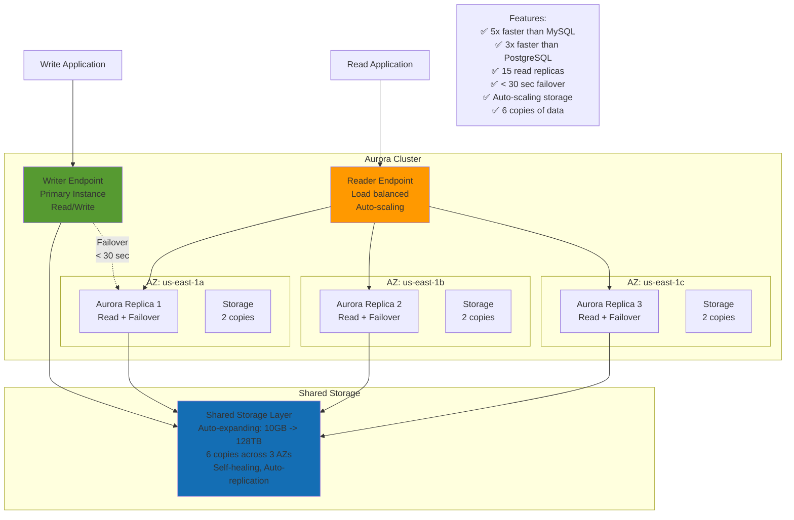
```mermaid
graph TB
    subgraph Aurora_Cluster_Group["Aurora Cluster"]
        Writer["Writer Endpoint<br/>Primary Instance<br/>Read/Write"]
        
        Reader["Reader Endpoint<br/>Load balanced<br/>Auto-scaling"]
        
        subgraph AZ_us_east_1a_Group["AZ: us-east-1a"]
            R1["Aurora Replica 1<br/>Read + Failover"]
            Storage1["Storage<br/>2 copies"]
        end
        
        subgraph AZ_us_east_1b_Group["AZ: us-east-1b"]
            R2["Aurora Replica 2<br/>Read + Failover"]
            Storage2["Storage<br/>2 copies"]
        end
        
        subgraph AZ_us_east_1c_Group["AZ: us-east-1c"]
            R3["Aurora Replica 3<br/>Read + Failover"]
            Storage3["Storage<br/>2 copies"]
        end
    end
    
    subgraph Shared_Storage_Group["Shared Storage"]
        SharedStorage["Shared Storage Layer<br/>Auto-expanding: 10GB -&gt; 128TB<br/>6 copies across 3 AZs<br/>Self-healing, Auto-replication"]
    end
    
    Writer --> SharedStorage
    R1 --> SharedStorage
    R2 --> SharedStorage
    R3 --> SharedStorage
    
    Reader --> R1
    Reader --> R2
    Reader --> R3
    
    App1[Write Application] --> Writer
    App2[Read Application] --> Reader
    
    Writer -.Failover<br/>< 30 sec.-> R1
    
    Features["Features:<br/>✅ 5x faster than MySQL<br/>✅ 3x faster than PostgreSQL<br/>✅ 15 read replicas<br/>✅ &lt; 30 sec failover<br/>✅ Auto-scaling storage<br/>✅ 6 copies of data"]
    
    classDef style1 fill:#569A31
    class Writer style1
    classDef style2 fill:#FF9900
    class Reader style2
    classDef style3 fill:#146EB4
    class SharedStorage style3
```

### Aurora Global Database

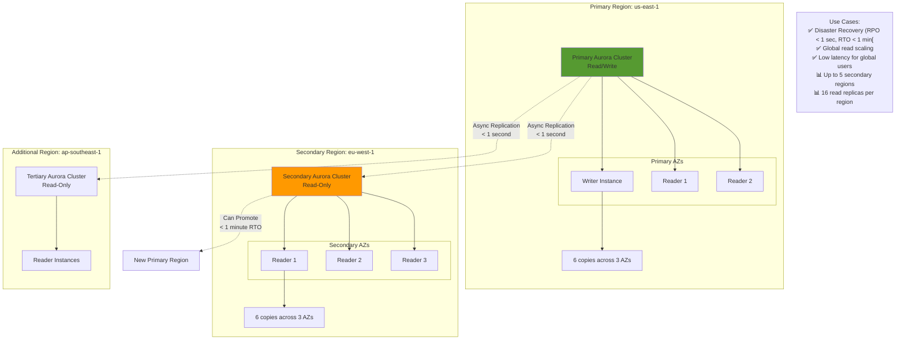
```mermaid
graph TB
    subgraph Primary_Region_us_east_1_Group["Primary Region: us-east-1"]
        PrimaryCluster["Primary Aurora Cluster<br/>Read/Write"]
        
        subgraph Primary_AZs_Group["Primary AZs"]
            P_Writer[Writer Instance]
            P_Reader1[Reader 1]
            P_Reader2[Reader 2]
        end
        
        PrimaryCluster --> P_Writer
        PrimaryCluster --> P_Reader1
        PrimaryCluster --> P_Reader2
        
        P_Storage[6 copies across 3 AZs]
        P_Writer --> P_Storage
    end
    
    subgraph Secondary_Region_eu_west_1_Group["Secondary Region: eu-west-1"]
        SecondaryCluster["Secondary Aurora Cluster<br/>Read-Only"]
        
        subgraph Secondary_AZs_Group["Secondary AZs"]
            S_Reader1[Reader 1]
            S_Reader2[Reader 2]
            S_Reader3[Reader 3]
        end
        
        SecondaryCluster --> S_Reader1
        SecondaryCluster --> S_Reader2
        SecondaryCluster --> S_Reader3
        
        S_Storage[6 copies across 3 AZs]
        S_Reader1 --> S_Storage
    end
    
    subgraph Additional_Region_ap_southeast_1_Group["Additional Region: ap-southeast-1"]
        APCluster["Tertiary Aurora Cluster<br/>Read-Only"]
        AP_Reader[Reader Instances]
        APCluster --> AP_Reader
    end
    
    PrimaryCluster -.Async Replication<br/>< 1 second.-> SecondaryCluster
    PrimaryCluster -.Async Replication<br/>< 1 second.-> APCluster
    
    SecondaryCluster -.Can Promote<br/>< 1 minute RTO.-> NewPrimary[New Primary Region]
    
    UseCases["Use Cases:<br/>✅ Disaster Recovery (RPO &lt; 1 sec, RTO &lt; 1 min[<br/>✅ Global read scaling<br/>✅ Low latency for global users<br/>📊 Up to 5 secondary regions<br/>📊 16 read replicas per region"]
    
    classDef style1 fill:#569A31
    class PrimaryCluster style1
    classDef style2 fill:#FF9900
    class SecondaryCluster style2
```

### Aurora Serverless

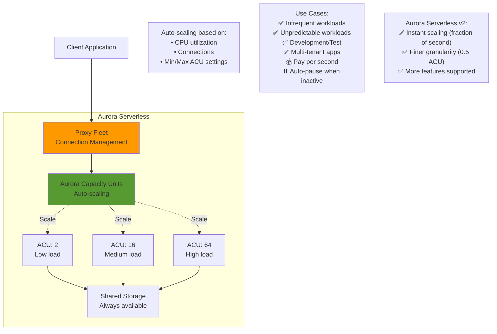
```mermaid
graph TB
    Client["Client Application"]
    
    subgraph Aurora_Serverless_Group["Aurora Serverless"]
        Proxy["Proxy Fleet<br/>Connection Management"]
        
        ACU["Aurora Capacity Units<br/>Auto-scaling"]
        
        ACU1["ACU: 2<br/>Low load"]
        ACU2["ACU: 16<br/>Medium load"]
        ACU3["ACU: 64<br/>High load"]
        
        SharedStorage["Shared Storage<br/>Always available"]
    end
    
    Client --> Proxy
    Proxy --> ACU
    
    ACU -.Scale.-> ACU1
    ACU -.Scale.-> ACU2
    ACU -.Scale.-> ACU3
    
    ACU1 --> SharedStorage
    ACU2 --> SharedStorage
    ACU3 --> SharedStorage
    
    Scaling["Auto-scaling based on:<br/>• CPU utilization<br/>• Connections<br/>• Min/Max ACU settings"]
    
    UseCases["Use Cases:<br/>✅ Infrequent workloads<br/>✅ Unpredictable workloads<br/>✅ Development/Test<br/>✅ Multi-tenant apps<br/>💰 Pay per second<br/>⏸️ Auto-pause when inactive"]
    
    V1vsV2["Aurora Serverless v2:<br/>✅ Instant scaling (fraction of second)<br/>✅ Finer granularity (0.5 ACU)<br/>✅ More features supported"]
    
    classDef style1 fill:#FF9900
    class Proxy style1
    classDef style2 fill:#569A31
    class ACU style2
```

## Amazon DynamoDB

### DynamoDB Architecture

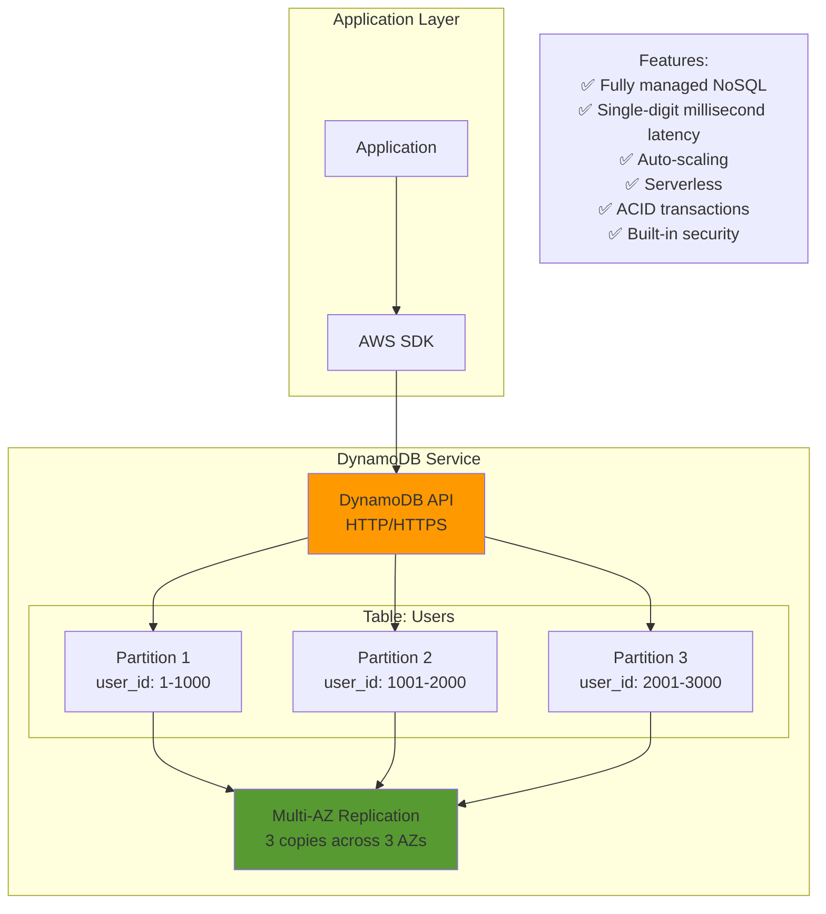
```mermaid
graph TB
    subgraph Application_Layer_Group["Application Layer"]
        App[Application]
        SDK[AWS SDK]
        
        App --> SDK
    end
    
    subgraph DynamoDB_Service_Group["DynamoDB Service"]
        API["DynamoDB API<br/>HTTP/HTTPS"]
        
        subgraph Table_Users_Group["Table: Users"]
            Partition1["Partition 1<br/>user_id: 1-1000"]
            Partition2["Partition 2<br/>user_id: 1001-2000"]
            Partition3["Partition 3<br/>user_id: 2001-3000"]
        end
        
        Replication["Multi-AZ Replication<br/>3 copies across 3 AZs"]
        
        API --> Partition1
        API --> Partition2
        API --> Partition3
        
        Partition1 --> Replication
        Partition2 --> Replication
        Partition3 --> Replication
    end
    
    SDK --> API
    
    Features["Features:<br/>✅ Fully managed NoSQL<br/>✅ Single-digit millisecond latency<br/>✅ Auto-scaling<br/>✅ Serverless<br/>✅ ACID transactions<br/>✅ Built-in security"]
    
    classDef style1 fill:#FF9900
    class API style1
    classDef style2 fill:#569A31
    class Replication style2
```

### DynamoDB Read/Write Capacity Modes

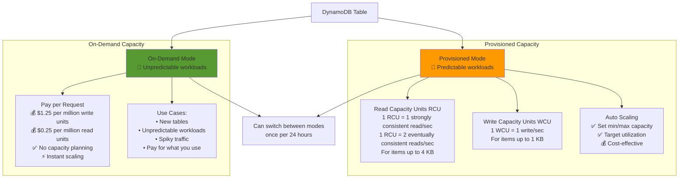
```mermaid
graph TB
    DynamoDB[DynamoDB Table]
    
    DynamoDB --> Provisioned["Provisioned Mode<br/>🎯 Predictable workloads"]
    DynamoDB --> OnDemand["On-Demand Mode<br/>🔄 Unpredictable workloads"]
    
    subgraph Provisioned_Capacity_Group["Provisioned Capacity"]
        Provisioned --> RCU["Read Capacity Units RCU<br/>1 RCU = 1 strongly consistent read/sec<br/>1 RCU = 2 eventually consistent reads/sec<br/>For items up to 4 KB"]
        
        Provisioned --> WCU["Write Capacity Units WCU<br/>1 WCU = 1 write/sec<br/>For items up to 1 KB"]
        
        Provisioned --> AutoScale["Auto Scaling<br/>✅ Set min/max capacity<br/>✅ Target utilization<br/>💰 Cost-effective"]
    end
    
    subgraph On_Demand_Capacity_Group["On-Demand Capacity"]
        OnDemand --> PayPerRequest["Pay per Request<br/>💰 $1.25 per million write units<br/>💰 $0.25 per million read units<br/>✅ No capacity planning<br/>⚡ Instant scaling"]
        
        OnDemand --> UseCase["Use Cases:<br/>• New tables<br/>• Unpredictable workloads<br/>• Spiky traffic<br/>• Pay for what you use"]
    end
    
    Provisioned --> Switch["Can switch between modes<br/>once per 24 hours"]
    OnDemand --> Switch
    
    classDef style1 fill:#FF9900
    class Provisioned style1
    classDef style2 fill:#569A31
    class OnDemand style2
```

### DynamoDB Global Tables

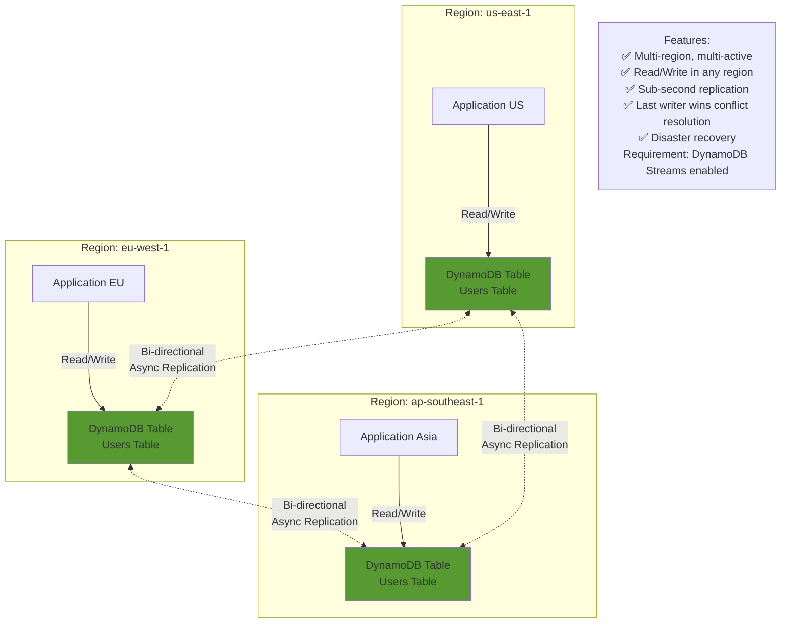
```mermaid
graph TB
    subgraph Region_us_east_1_Group["Region: us-east-1"]
        Table1["DynamoDB Table<br/>Users Table"]
        App1[Application US]
        
        App1 -->|Read/Write| Table1
    end
    
    subgraph Region_eu_west_1_Group["Region: eu-west-1"]
        Table2["DynamoDB Table<br/>Users Table"]
        App2[Application EU]
        
        App2 -->|Read/Write| Table2
    end
    
    subgraph Region_ap_southeast_1_Group["Region: ap-southeast-1"]
        Table3["DynamoDB Table<br/>Users Table"]
        App3[Application Asia]
        
        App3 -->|Read/Write| Table3
    end
    
    Table1 <-.Bi-directional<br/>Async Replication.-> Table2
    Table2 <-.Bi-directional<br/>Async Replication.-> Table3
    Table3 <-.Bi-directional<br/>Async Replication.-> Table1
    
    Features["Features:<br/>✅ Multi-region, multi-active<br/>✅ Read/Write in any region<br/>✅ Sub-second replication<br/>✅ Last writer wins conflict resolution<br/>✅ Disaster recovery<br/>Requirement: DynamoDB Streams enabled"]
    
    classDef style1 fill:#569A31
    class Table1 style1
    classDef style2 fill:#569A31
    class Table2 style2
    classDef style3 fill:#569A31
    class Table3 style3
```

### DynamoDB Streams and Lambda Integration

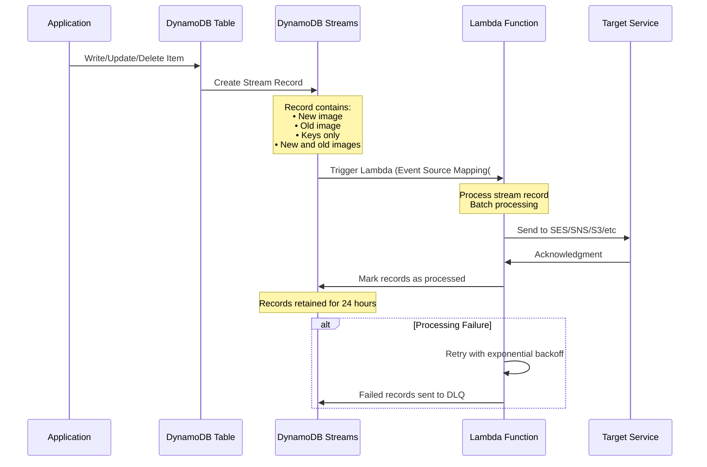
```mermaid
sequenceDiagram
    participant App as Application
    participant DDB as DynamoDB Table
    participant Stream as DynamoDB Streams
    participant Lambda as Lambda Function
    participant Target as Target Service
    
    App->>DDB: Write/Update/Delete Item
    DDB->>Stream: Create Stream Record
    Note over Stream: Record contains:<br/>• New image<br/>• Old image<br/>• Keys only<br/>• New and old images
    
    Stream->>Lambda: Trigger Lambda (Event Source Mapping(
    Note over Lambda: Process stream record<br/>Batch processing
    
    Lambda->>Target: Send to SES/SNS/S3/etc
    Target->>Lambda: Acknowledgment
    
    Lambda->>Stream: Mark records as processed
    
    Note over Stream: Records retained for 24 hours
    
    alt Processing Failure
        Lambda->>Lambda: Retry with exponential backoff
        Lambda->>Stream: Failed records sent to DLQ
    end
    
```

### DynamoDB Accelerator (DAX)

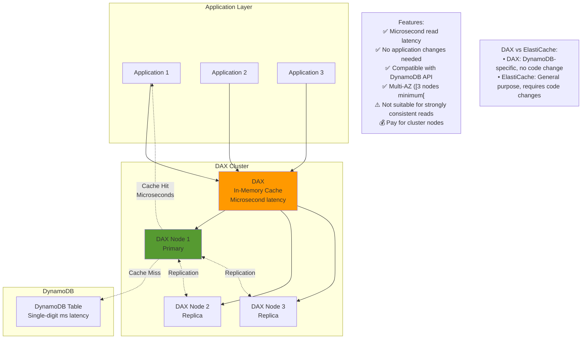
```mermaid
graph TB
    subgraph Application_Layer_Group["Application Layer"]
        App1[Application 1]
        App2[Application 2]
        App3[Application 3]
    end
    
    subgraph DAX_Cluster_Group["DAX Cluster"]
        DAX["DAX<br/>In-Memory Cache<br/>Microsecond latency"]
        
        Node1["DAX Node 1<br/>Primary"]
        Node2["DAX Node 2<br/>Replica"]
        Node3["DAX Node 3<br/>Replica"]
        
        DAX --> Node1
        DAX --> Node2
        DAX --> Node3
    end
    
    subgraph DynamoDB_Group["DynamoDB"]
        Table["DynamoDB Table<br/>Single-digit ms latency"]
    end
    
    App1 --> DAX
    App2 --> DAX
    App3 --> DAX
    
    Node1 -.Cache Miss.-> Table
    Node1 -.Cache Hit<br/>Microseconds.-> App1
    
    Node1 <-.Replication.-> Node2
    Node1 <-.Replication.-> Node3
    
    Features["Features:<br/>✅ Microsecond read latency<br/>✅ No application changes needed<br/>✅ Compatible with DynamoDB API<br/>✅ Multi-AZ ([3 nodes minimum[<br/>⚠️ Not suitable for strongly consistent reads<br/>💰 Pay for cluster nodes"]
    
    Comparison["DAX vs ElastiCache:<br/>• DAX: DynamoDB-specific, no code change<br/>• ElastiCache: General purpose, requires code changes"]
    
    classDef style1 fill:#FF9900
    class DAX style1
    classDef style2 fill:#569A31
    class Node1 style2
```

## Amazon ElastiCache

### ElastiCache - Redis vs Memcached

```mermaid
graph TB
    ElastiCache["Amazon ElastiCache<br/>Managed In-Memory Cache"]
    
    ElastiCache --> Redis[ElastiCache for Redis]
    ElastiCache --> Memcached[ElastiCache for Memcached]
    
    subgraph Redis_Features_Group["Redis Features"]
        Redis --> RedisF1["✅ Data Persistence"]
        Redis --> RedisF2["✅ Backup & Restore"]
        Redis --> RedisF3["✅ Multi-AZ with failover"]
        Redis --> RedisF4["✅ Read Replicas"]
        Redis --> RedisF5["✅ Data structures: sets, sorted sets, lists"]
        Redis --> RedisF6["✅ Pub/Sub capability"]
        Redis --> RedisF7["✅ Geospatial support"]
        Redis --> RedisF8["✅ Transactions"]
        Redis --> RedisF9["⚠️ Single-threaded"]
    end
    
    subgraph Memcached_Features_Group["Memcached Features"]
        Memcached --> MemF1["✅ Multi-threaded"]
        Memcached --> MemF2["✅ Horizontal scaling sharding"]
        Memcached --> MemF3["✅ Simple data types"]
        Memcached --> MemF4["❌ No persistence"]
        Memcached --> MemF5["❌ No backup/restore"]
        Memcached --> MemF6["❌ No replication"]
        Memcached --> MemF7["❌ No Multi-AZ"]
    end
    
    subgraph Use_Cases_Group["Use Cases"]
        Redis --> RedisUC["• Session store<br/>• Gaming leaderboards<br/>• Real-time analytics<br/>• Pub/Sub messaging<br/>• Geospatial data<br/>• HA requirements"]
        
        Memcached --> MemUC["• Simple caching<br/>• Multi-core optimization<br/>• Large cache nodes<br/>• No persistence needed<br/>• Horizontal scaling"]
    end
    
    classDef style1 fill:#C00
    class Redis style1
    classDef style2 fill:#569A31
    class Memcached style2
```

### ElastiCache Redis Cluster Architecture

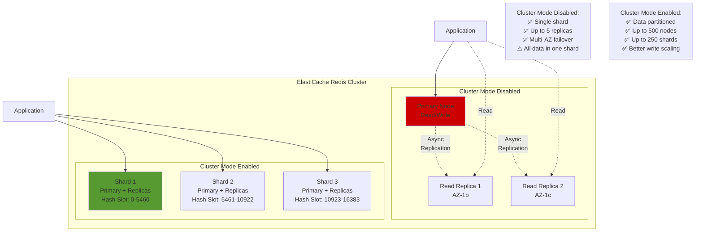
```mermaid
graph TB
    subgraph ElastiCache_Redis_Cluster_Group["ElastiCache Redis Cluster"]
        subgraph Cluster_Mode_Disabled_Group["Cluster Mode Disabled"]
            Primary["Primary Node<br/>Read/Write"]
            Replica1["Read Replica 1<br/>AZ-1b"]
            Replica2["Read Replica 2<br/>AZ-1c"]
            
            Primary -.Async<br/>Replication.-> Replica1
            Primary -.Async<br/>Replication.-> Replica2
        end
        
        subgraph Cluster_Mode_Enabled_Group["Cluster Mode Enabled"]
            Shard1["Shard 1<br/>Primary + Replicas<br/>Hash Slot: 0-5460"]
            Shard2["Shard 2<br/>Primary + Replicas<br/>Hash Slot: 5461-10922"]
            Shard3["Shard 3<br/>Primary + Replicas<br/>Hash Slot: 10923-16383"]
        end
    end
    
    App1[Application] --> Primary
    App1 -.Read.-> Replica1
    App1 -.Read.-> Replica2
    
    App2[Application] --> Shard1
    App2 --> Shard2
    App2 --> Shard3
    
    Features["Cluster Mode Disabled:<br/>✅ Single shard<br/>✅ Up to 5 replicas<br/>✅ Multi-AZ failover<br/>⚠️ All data in one shard"]
    
    ClusterFeatures["Cluster Mode Enabled:<br/>✅ Data partitioned<br/>✅ Up to 500 nodes<br/>✅ Up to 250 shards<br/>✅ Better write scaling"]
    
    classDef style1 fill:#C00
    class Primary style1
    classDef style2 fill:#569A31
    class Shard1 style2
```

### Caching Strategies

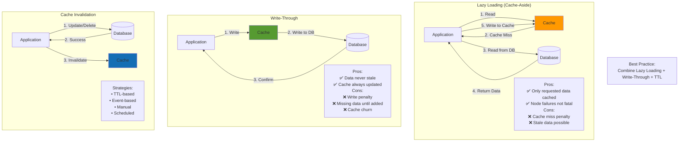
```mermaid
graph TB
    subgraph Lazy_Loading_Cache_Aside_Group["Lazy Loading (Cache-Aside)"]
        App1[Application]
        App1 -->|1. Read| Cache1[Cache]
        Cache1 -->|2. Cache Miss| App1
        App1 -->|3. Read from DB| DB1[(Database)]
        DB1 -->|4. Return Data| App1
        App1 -->|5. Write to Cache| Cache1
        
        Lazy["Pros:<br/>✅ Only requested data cached<br/>✅ Node failures not fatal<br/>Cons:<br/>❌ Cache miss penalty<br/>❌ Stale data possible"]
    end
    
    subgraph Write_Through_Group["Write-Through"]
        App2[Application]
        App2 -->|1. Write| Cache2[Cache]
        Cache2 -->|2. Write to DB| DB2[(Database)]
        DB2 -->|3. Confirm| App2
        
        WriteThrough["Pros:<br/>✅ Data never stale<br/>✅ Cache always updated<br/>Cons:<br/>❌ Write penalty<br/>❌ Missing data until added<br/>❌ Cache churn"]
    end
    
    subgraph Cache_Invalidation_Group["Cache Invalidation"]
        App3[Application]
        App3 -->|1. Update/Delete| DB3[(Database)]
        DB3 -->|2. Success| App3
        App3 -->|3. Invalidate| Cache3[Cache]
        
        Invalidation["Strategies:<br/>• TTL-based<br/>• Event-based<br/>• Manual<br/>• Scheduled"]
    end
    
    Combined["Best Practice:<br/>Combine Lazy Loading + Write-Through + TTL"]
    
    classDef style1 fill:#FF9900
    class Cache1 style1
    classDef style2 fill:#569A31
    class Cache2 style2
    classDef style3 fill:#146EB4
    class Cache3 style3
```

## Amazon Redshift

### Redshift Architecture

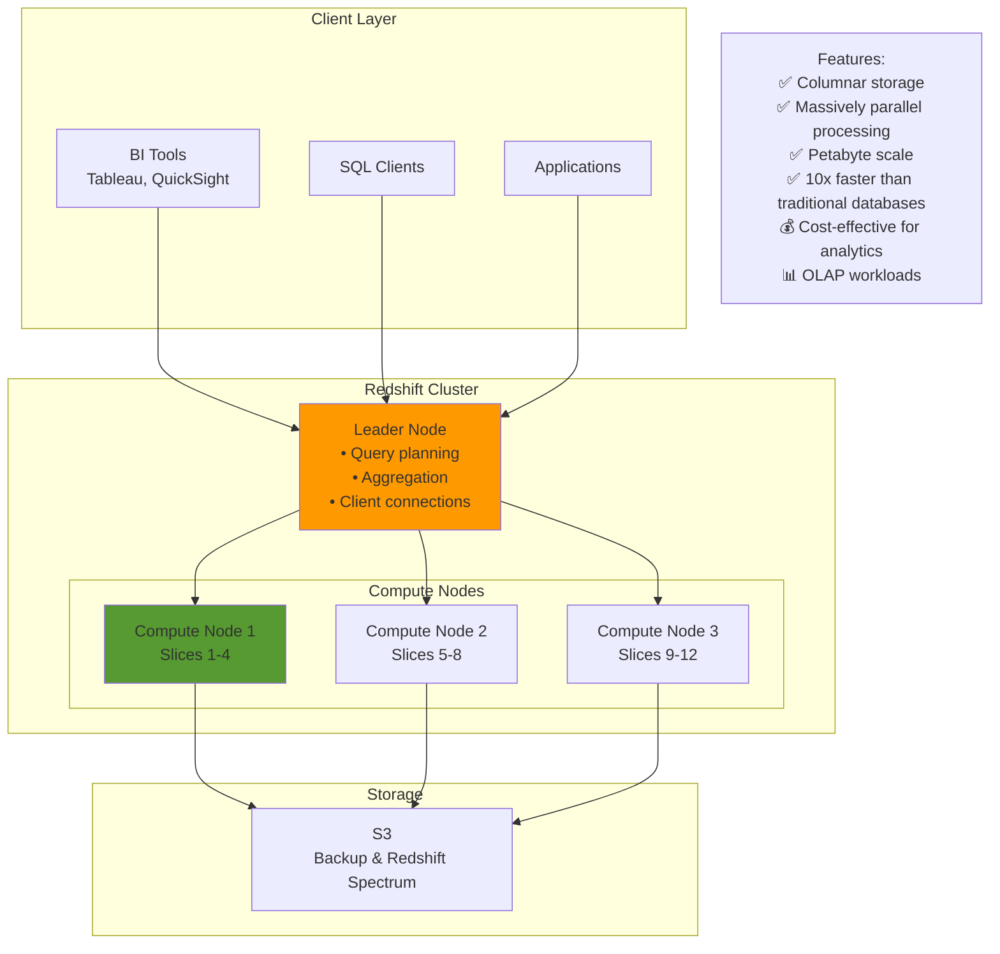
```mermaid
graph TB
    subgraph Client_Layer_Group["Client Layer"]
        BI["BI Tools<br/>Tableau, QuickSight"]
        SQL[SQL Clients]
        App[Applications]
    end
    
    subgraph Redshift_Cluster_Group["Redshift Cluster"]
        Leader["Leader Node<br/>• Query planning<br/>• Aggregation<br/>• Client connections"]
        
        subgraph Compute_Nodes_Group["Compute Nodes"]
            Node1["Compute Node 1<br/>Slices 1-4"]
            Node2["Compute Node 2<br/>Slices 5-8"]
            Node3["Compute Node 3<br/>Slices 9-12"]
        end
        
        Leader --> Node1
        Leader --> Node2
        Leader --> Node3
    end
    
    subgraph Storage_Group["Storage"]
        S3["S3<br/>Backup & Redshift Spectrum"]
    end
    
    BI --> Leader
    SQL --> Leader
    App --> Leader
    
    Node1 --> S3
    Node2 --> S3
    Node3 --> S3
    
    Features["Features:<br/>✅ Columnar storage<br/>✅ Massively parallel processing<br/>✅ Petabyte scale<br/>✅ 10x faster than traditional databases<br/>💰 Cost-effective for analytics<br/>📊 OLAP workloads"]
    
    classDef style1 fill:#FF9900
    class Leader style1
    classDef style2 fill:#569A31
    class Node1 style2
```

### Redshift Spectrum

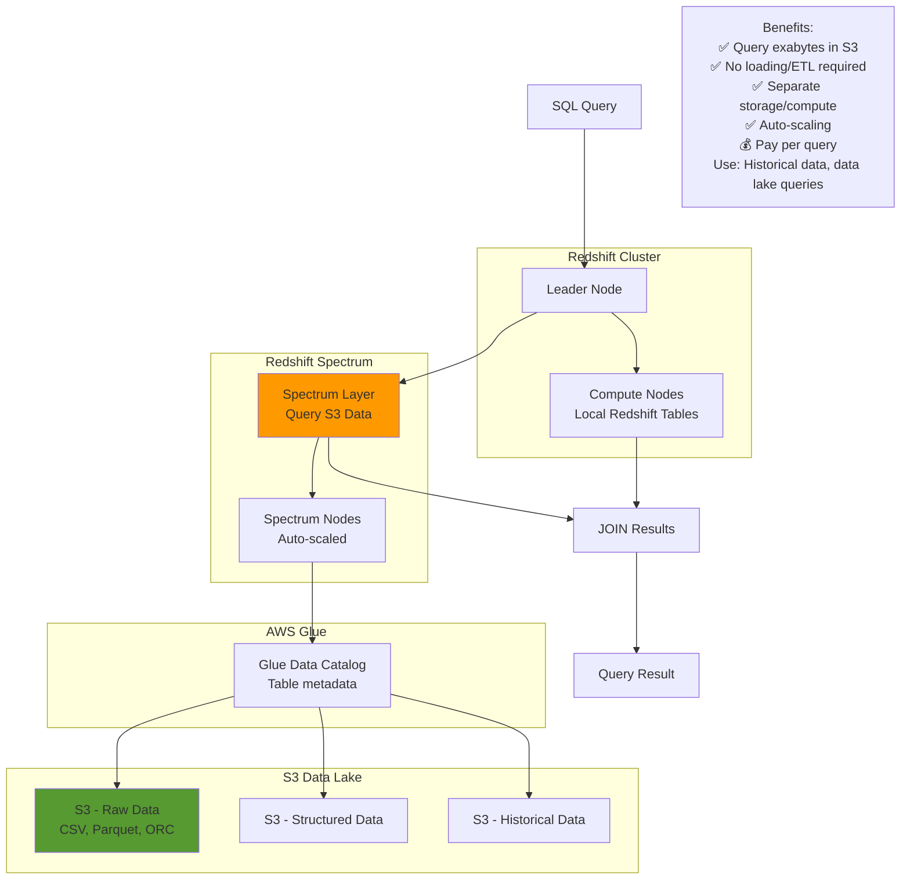
```mermaid
graph TB
    subgraph Redshift_Cluster_Group["Redshift Cluster"]
        Leader[Leader Node]
        Compute["Compute Nodes<br/>Local Redshift Tables"]
    end
    
    subgraph Redshift_Spectrum_Group["Redshift Spectrum"]
        Spectrum["Spectrum Layer<br/>Query S3 Data"]
        SpectrumNodes["Spectrum Nodes<br/>Auto-scaled"]
    end
    
    subgraph S3_Data_Lake_Group["S3 Data Lake"]
        S3_Raw["S3 - Raw Data<br/>CSV, Parquet, ORC"]
        S3_Structured[S3 - Structured Data]
        S3_Archive[S3 - Historical Data]
    end
    
    subgraph AWS_Glue_Group["AWS Glue"]
        GlueCatalog["Glue Data Catalog<br/>Table metadata"]
    end
    
    Query[SQL Query] --> Leader
    Leader --> Compute
    Leader --> Spectrum
    
    Spectrum --> SpectrumNodes
    SpectrumNodes --> GlueCatalog
    GlueCatalog --> S3_Raw
    GlueCatalog --> S3_Structured
    GlueCatalog --> S3_Archive
    
    Compute --> Join[JOIN Results]
    Spectrum --> Join
    
    Join --> Result[Query Result]
    
    Benefits["Benefits:<br/>✅ Query exabytes in S3<br/>✅ No loading/ETL required<br/>✅ Separate storage/compute<br/>✅ Auto-scaling<br/>💰 Pay per query<br/>Use: Historical data, data lake queries"]
    
    classDef style1 fill:#FF9900
    class Spectrum style1
    classDef style2 fill:#569A31
    class S3_Raw style2
```

## Database Selection Decision Tree

### Choosing the Right Database

```mermaid
flowchart TD
    Start([Choose Database Service])
    
    Start --> Q1{Workload Type?}
    
    Q1 -->|OLTP<br/>Transactional| OLTP{Data Model?}
    Q1 -->|OLAP<br/>Analytics| Redshift["Amazon Redshift<br/>Data Warehouse"]
    Q1 -->|Caching| Cache{Feature Needs?}
    
    OLTP -->|Relational| RDSChoice{Performance Needs?}
    OLTP -->|Key-Value| DynamoDB["DynamoDB<br/>NoSQL"]
    OLTP -->|Document| DocDB["DocumentDB<br/>MongoDB compatible"]
    OLTP -->|Graph| Neptune["Neptune<br/>Graph database"]
    OLTP -->|Time Series| Timestream[Timestream]
    OLTP -->|Ledger| QLDB["QLDB<br/>Immutable ledger"]
    
    RDSChoice -->|High performance<br/>AWS-specific| Aurora["Amazon Aurora<br/>5x MySQL, 3x PostgreSQL"]
    RDSChoice -->|Standard<br/>Engine compatibility| RDS["Amazon RDS<br/>MySQL, PostgreSQL,<br/>Oracle, SQL Server"]
    
    Cache -->|Simple<br/>Multi-threaded| Memcached["ElastiCache<br/>Memcached"]
    Cache -->|Advanced<br/>HA, Persistence| Redis["ElastiCache<br/>Redis"]
    Cache -->|DynamoDB specific| DAX["DynamoDB<br/>Accelerator DAX"]
    
    Aurora --> Serverless{Predictable?}
    Serverless -->|No| AuroraServerless[Aurora Serverless]
    Serverless -->|Yes| AuroraProvisioned[Aurora Provisioned]
    
    classDef style1 fill:#232F3E
    class Start style1
    classDef style2 fill:#569A31
    class Aurora style2
    classDef style3 fill:#FF9900
    class DynamoDB style3
    classDef style4 fill:#146EB4
    class Redshift style4
```

### Database Migration Paths

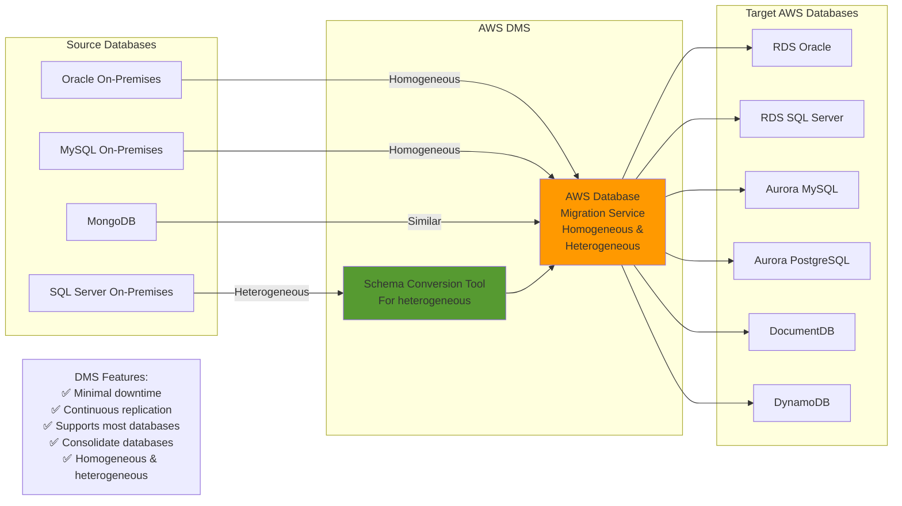
```mermaid
graph LR
    subgraph Source_Databases_Group["Source Databases"]
        OnPremOracle[Oracle On-Premises]
        OnPremSQL[SQL Server On-Premises]
        OnPremMySQL[MySQL On-Premises]
        OnPremMongo[MongoDB]
    end
    
    subgraph AWS_DMS_Group["AWS DMS"]
        DMS["AWS Database<br/>Migration Service<br/>Homogeneous &<br/>Heterogeneous"]
        SCT["Schema Conversion Tool<br/>For heterogeneous"]
    end
    
    subgraph Target_AWS_Databases_Group["Target AWS Databases"]
        RDS_Oracle[RDS Oracle]
        RDS_SQL[RDS SQL Server]
        Aurora_MySQL[Aurora MySQL]
        Aurora_PG[Aurora PostgreSQL]
        DocumentDB[DocumentDB]
        DynamoDBTarget[DynamoDB]
    end
    
    OnPremOracle -->|Homogeneous| DMS
    OnPremSQL -->|Heterogeneous| SCT
    OnPremMySQL -->|Homogeneous| DMS
    OnPremMongo -->|Similar| DMS
    
    SCT --> DMS
    
    DMS --> RDS_Oracle
    DMS --> RDS_SQL
    DMS --> Aurora_MySQL
    DMS --> Aurora_PG
    DMS --> DocumentDB
    DMS --> DynamoDBTarget
    
    Features["DMS Features:<br/>✅ Minimal downtime<br/>✅ Continuous replication<br/>✅ Supports most databases<br/>✅ Consolidate databases<br/>✅ Homogeneous & heterogeneous"]
    
    classDef style1 fill:#FF9900
    class DMS style1
    classDef style2 fill:#569A31
    class SCT style2
```

---

## Prerequisites

- [05: Database Services - Ultra Fast Learning 🚀](ULTRA-FAST-LEARN.md)

## Recommended Next Topics

- [Database Services - Practice Questions](PRACTICE-QUESTIONS.md)

## Related Topics

- [Module 01: Database Services](README.md)
- [⚡ Fast Learning - Database Services](FAST-LEARN.md)
- [05: Database Services - Ultra Fast Learning 🚀](ULTRA-FAST-LEARN.md)
