# Networking & Content Delivery - Mermaid Diagrams

## VPC Architecture

### VPC Complete Architecture

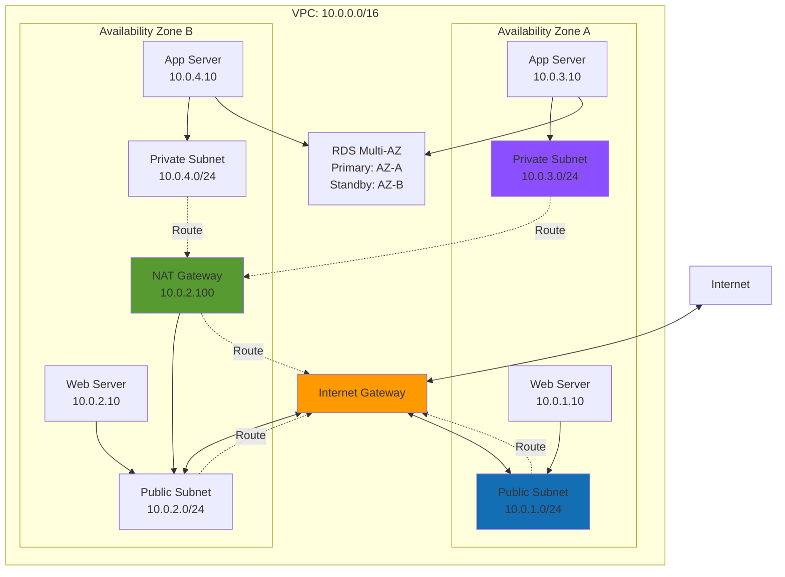

### VPC Subnet CIDR Calculation

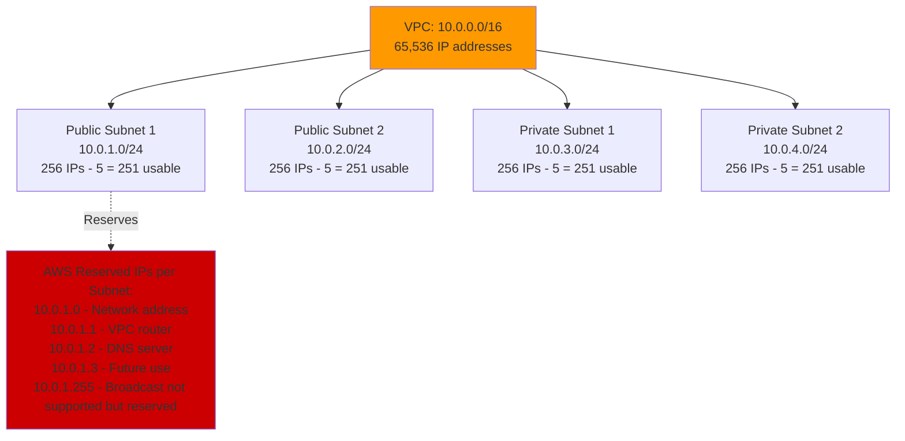

### Route Table Configuration

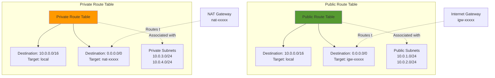

## Security Groups vs NACLs

### Security Groups vs Network ACLs

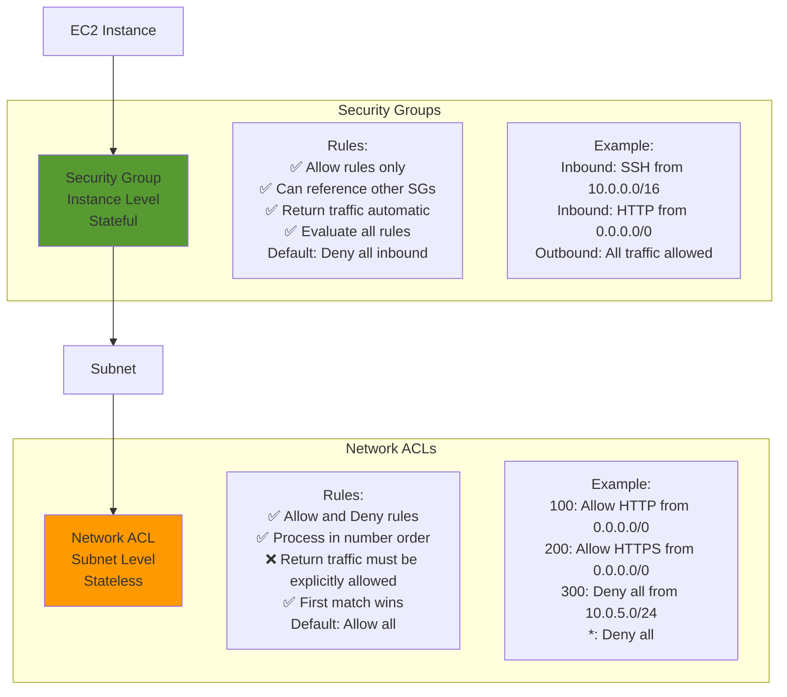

### Traffic Flow with SG and NACL

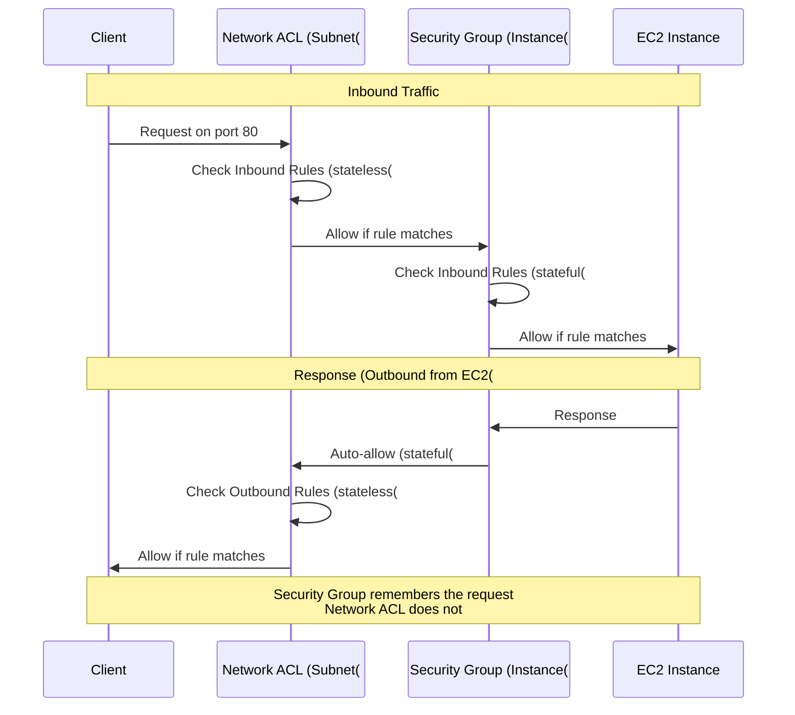

## VPC Connectivity

### VPC Peering

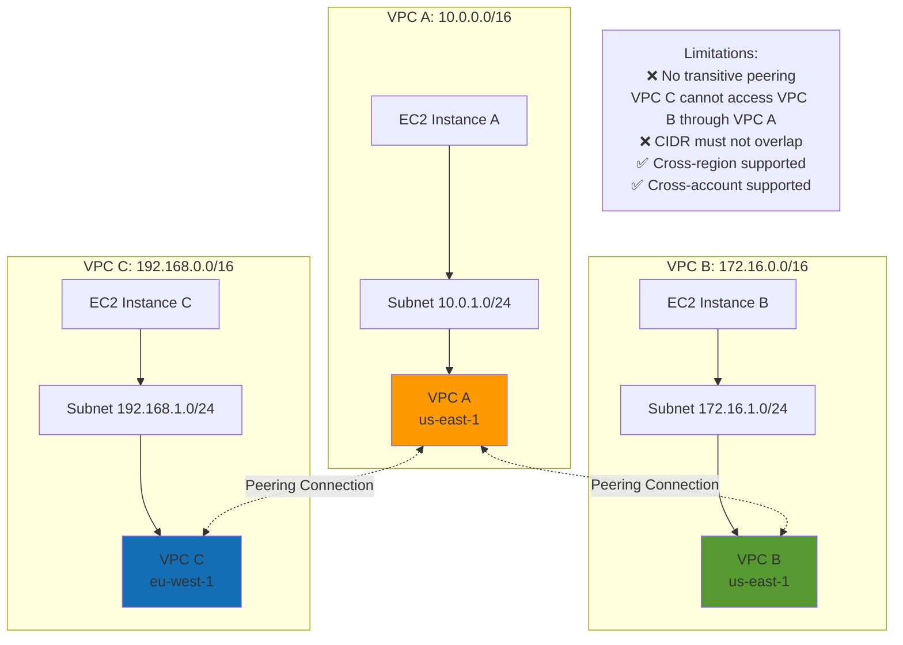

### Transit Gateway

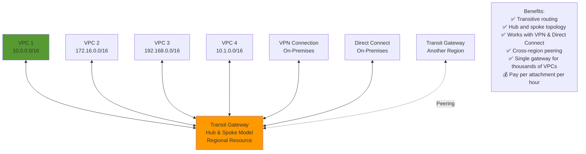

### VPC Endpoints

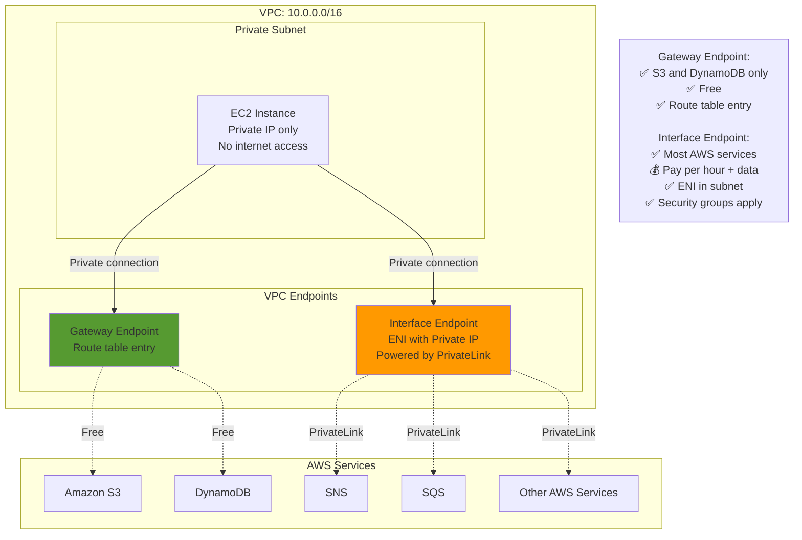

## Route 53

### Route 53 Routing Policies

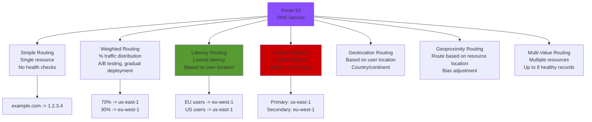

### Route 53 Health Checks and Failover

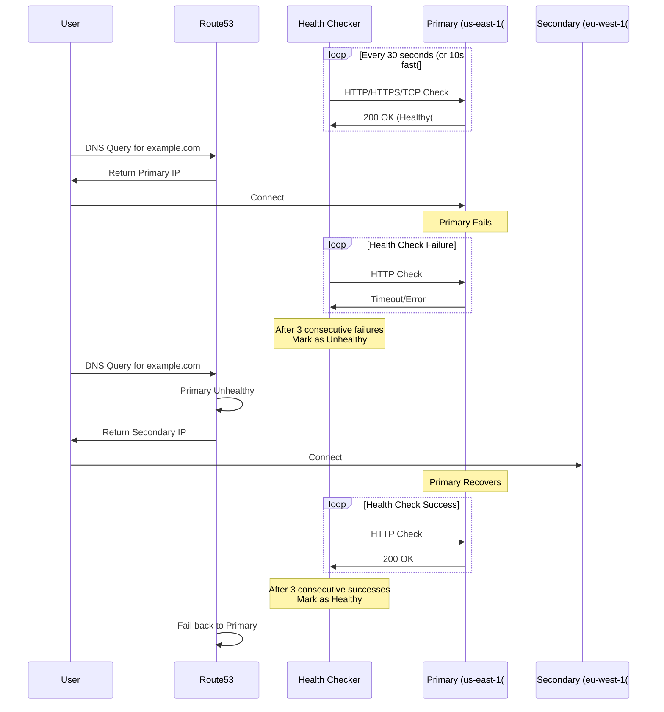

## CloudFront

### CloudFront Distribution Architecture

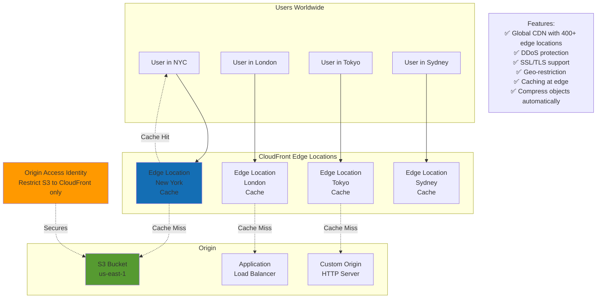

### CloudFront Cache Behavior

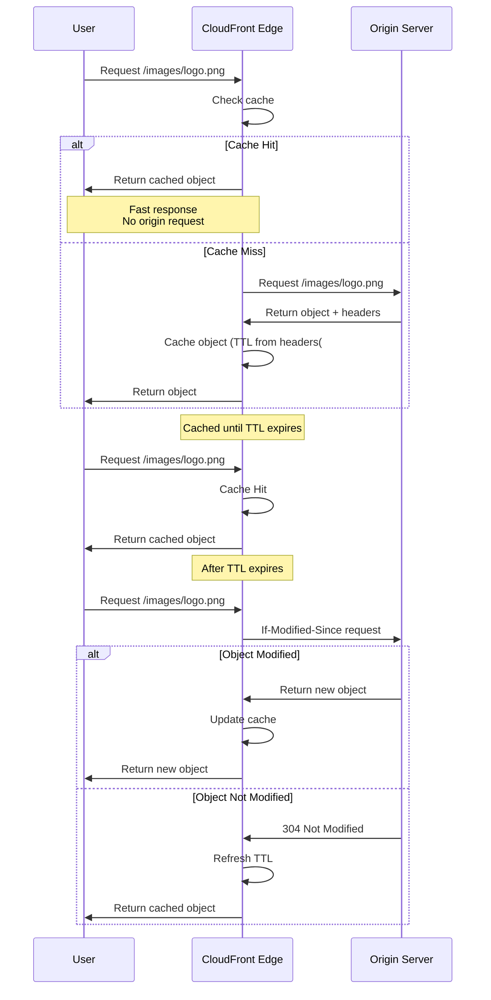

## Hybrid Connectivity

### VPN Connection

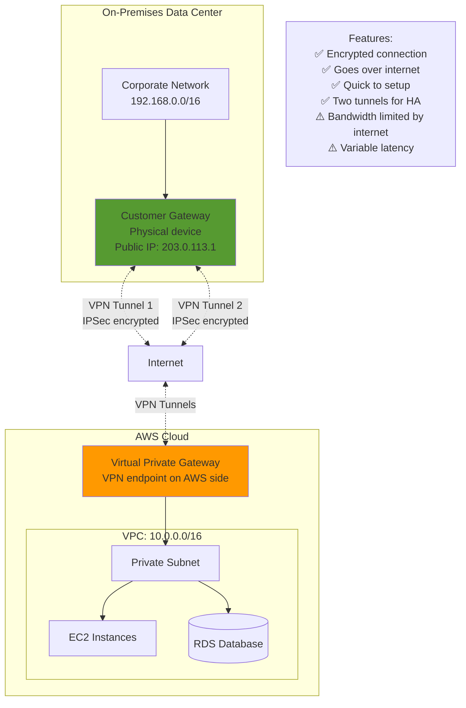

### Direct Connect

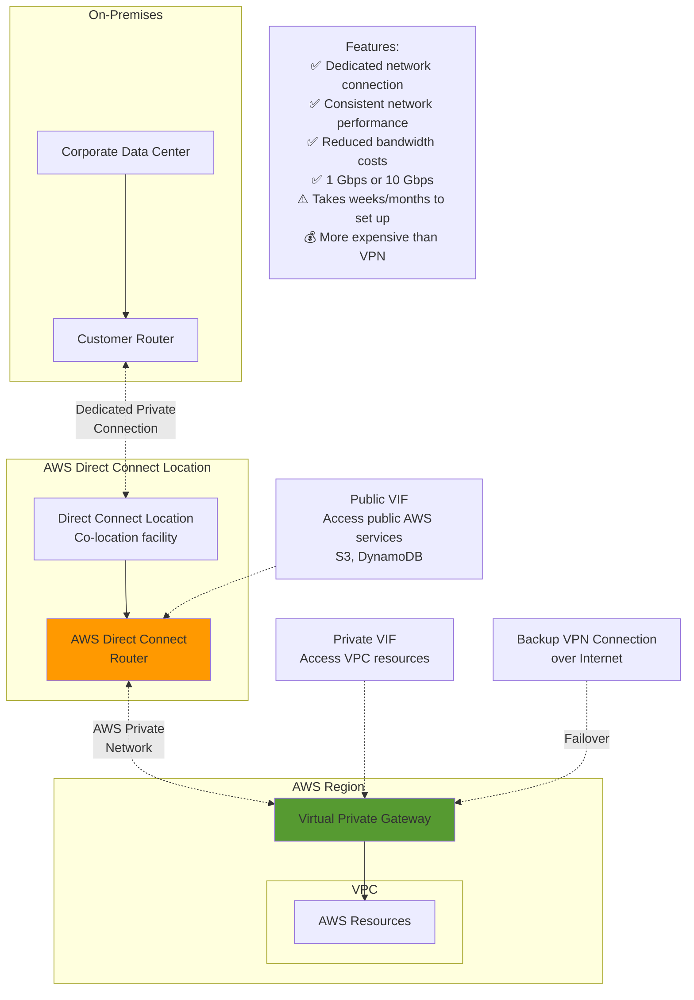

### AWS Global Accelerator

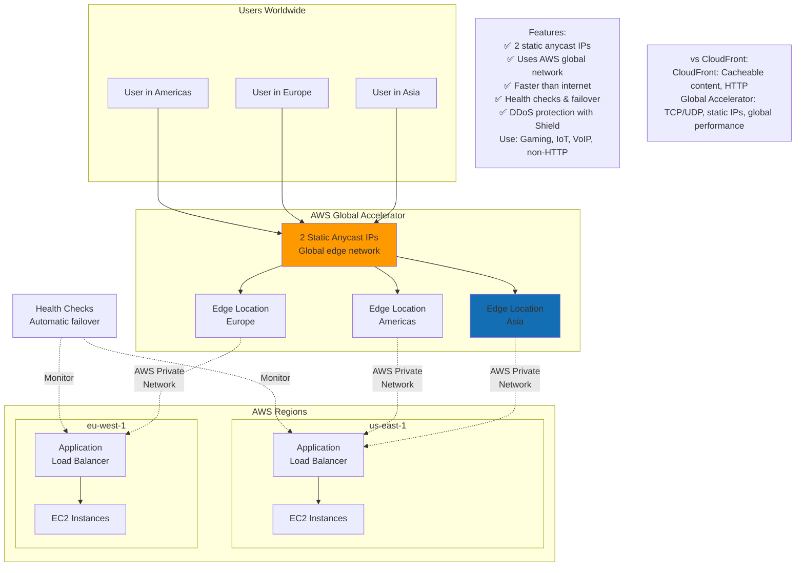

## Network Performance

### Enhanced Networking

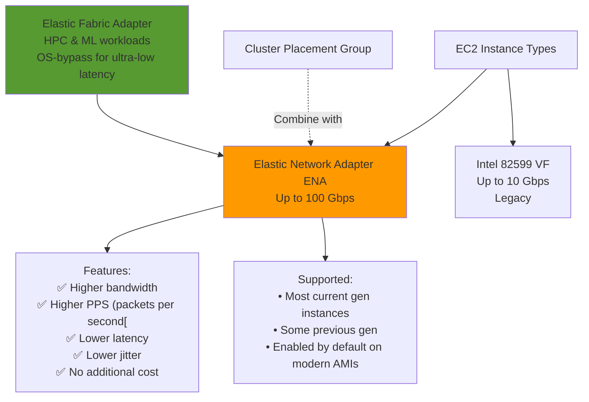

---

## Prerequisites

- [06: Networking - Ultra Fast Learning 🚀](ULTRA-FAST-LEARN.md)

## Recommended Next Topics

- [Networking - Practice Questions](PRACTICE-QUESTIONS.md)

## Related Topics

- [Module 06: Networking & Content Delivery](README.md)
- [⚡ Fast Learning - Networking & Content Delivery](FAST-LEARN.md)
- [06: Networking - Ultra Fast Learning 🚀](ULTRA-FAST-LEARN.md)
