# Security & Compliance - Mermaid Diagrams

## AWS KMS (Key Management Service)

### KMS Architecture

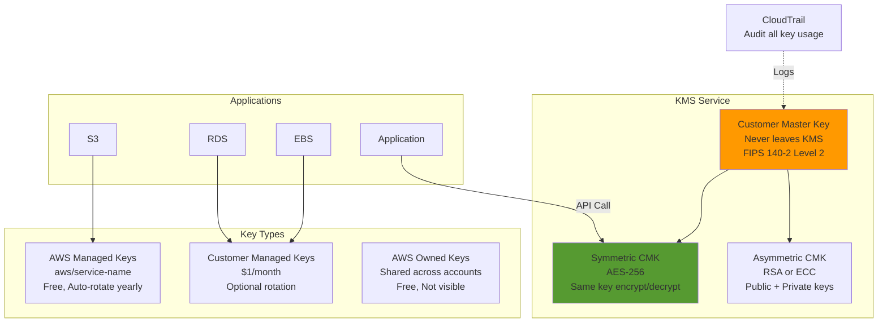

### KMS Envelope Encryption

```mermaid
sequenceDiagram
    participant App as Application
    participant KMS as AWS KMS
    participant S3 as Amazon S3
    
    Note over App,S3: Encrypt Large File (&gt; 4 KB(
    
    App->>KMS: GenerateDataKey(CMK(
    KMS->>KMS: Generate Data Key
    KMS->>App: Return Plaintext Data Key + Encrypted Data Key
    
    App->>App: Encrypt file with Plaintext Data Key
    App->>App: Delete Plaintext Data Key from memory
    App->>S3: Upload Encrypted File + Encrypted Data Key
    
    Note over App,S3: Decrypt File
    
    S3->>App: Download Encrypted File + Encrypted Data Key
    App->>KMS: Decrypt(Encrypted Data Key(
    KMS->>App: Return Plaintext Data Key
    App->>App: Decrypt file with Plaintext Data Key
    App->>App: Delete Plaintext Data Key from memory
    
    Note over App,S3: Benefits: Encrypt unlimited data size, Network overhead only for small Data Key
    
```

### KMS Key Policies

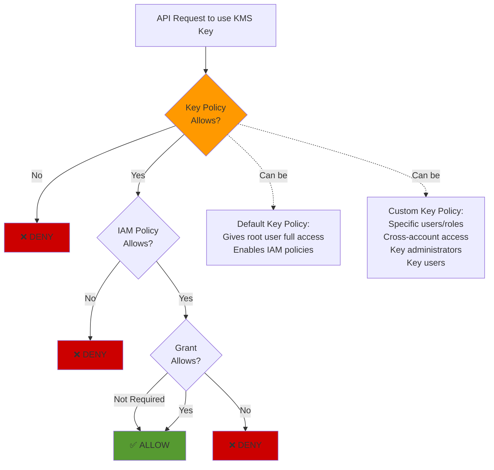

## CloudHSM

### CloudHSM vs KMS

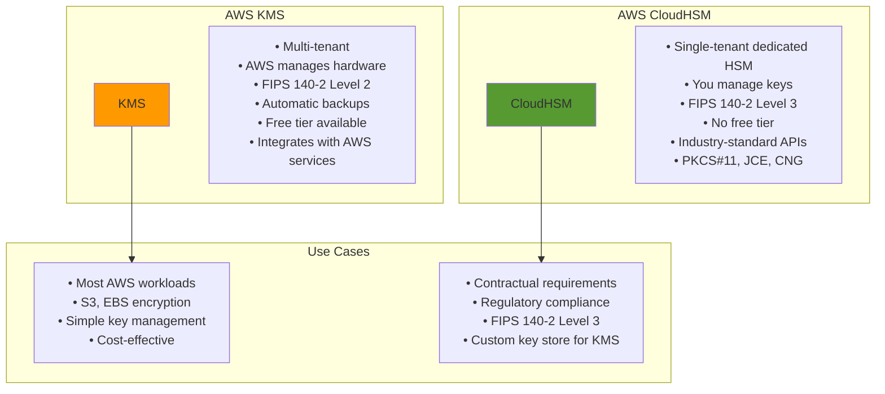

## Secrets Manager vs Parameter Store

### Secrets Manager and Parameter Store Comparison

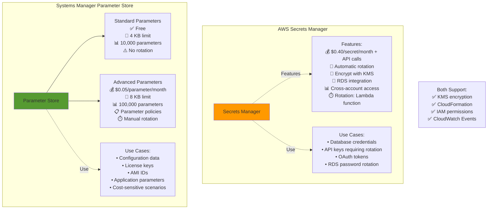

### Secrets Manager Rotation

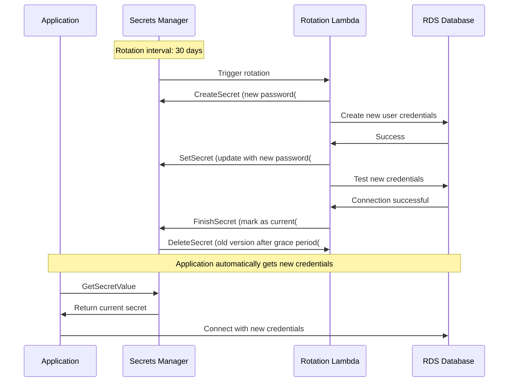

## AWS WAF & Shield

### AWS WAF Architecture

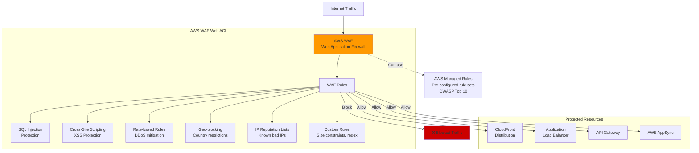

### AWS Shield Standard vs Advanced

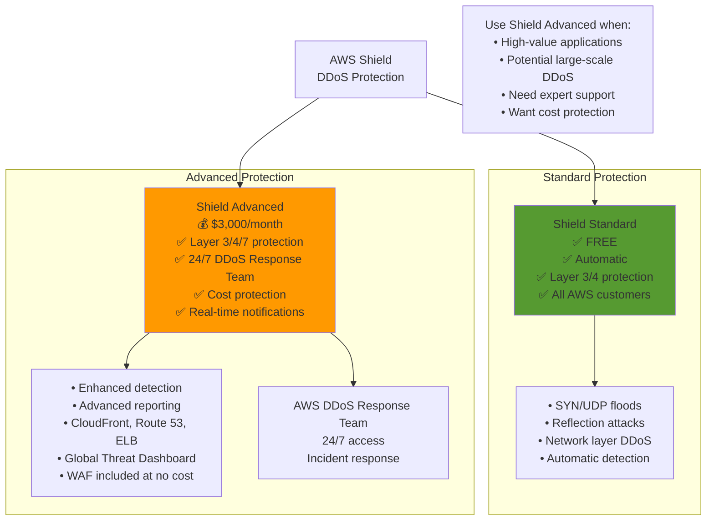

## Amazon GuardDuty

### GuardDuty Architecture

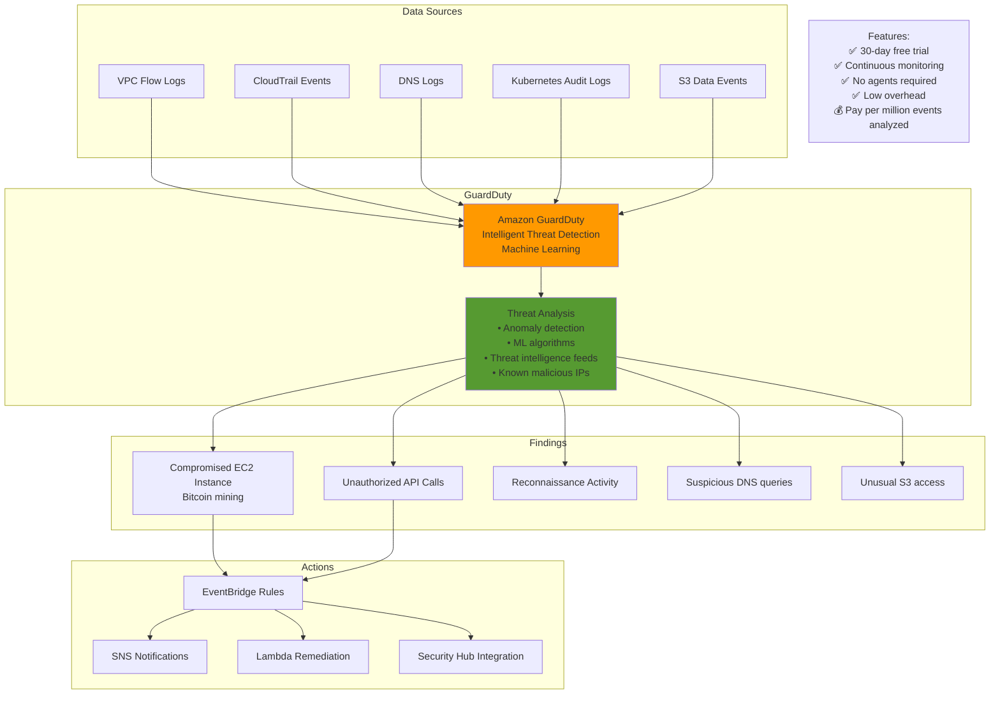

## Amazon Inspector

### Inspector Assessment

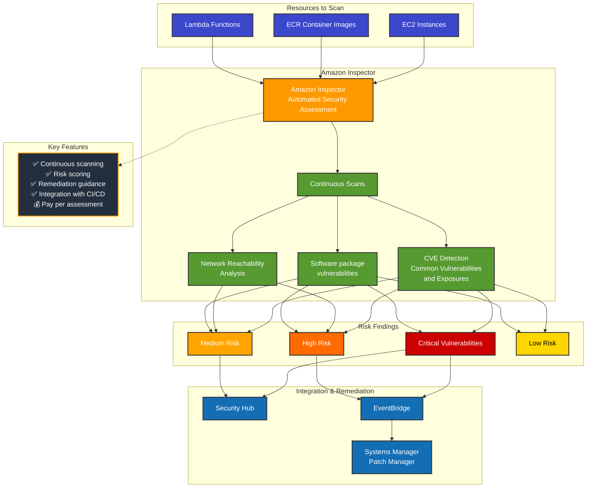

## AWS Macie

### Macie Data Discovery

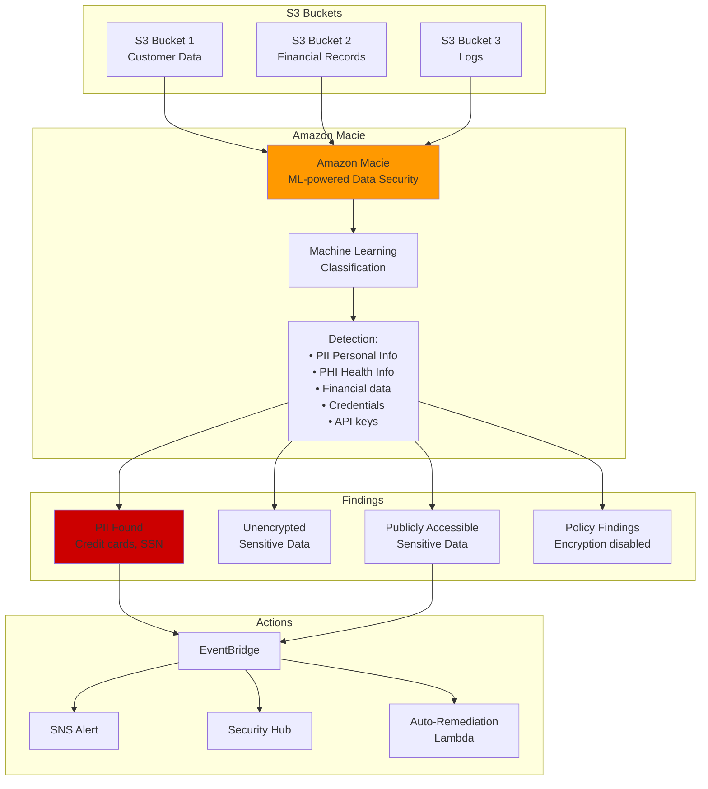

## AWS Certificate Manager (ACM)

### ACM Certificate Lifecycle

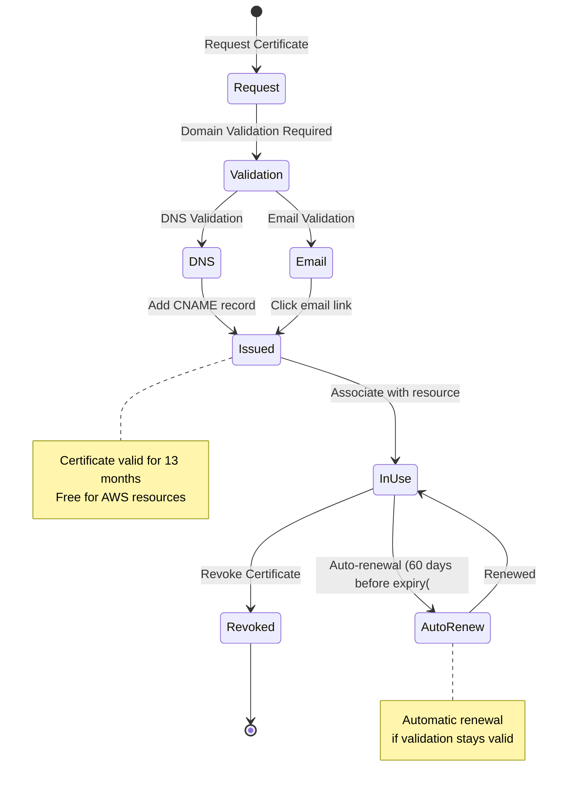

### ACM Integration

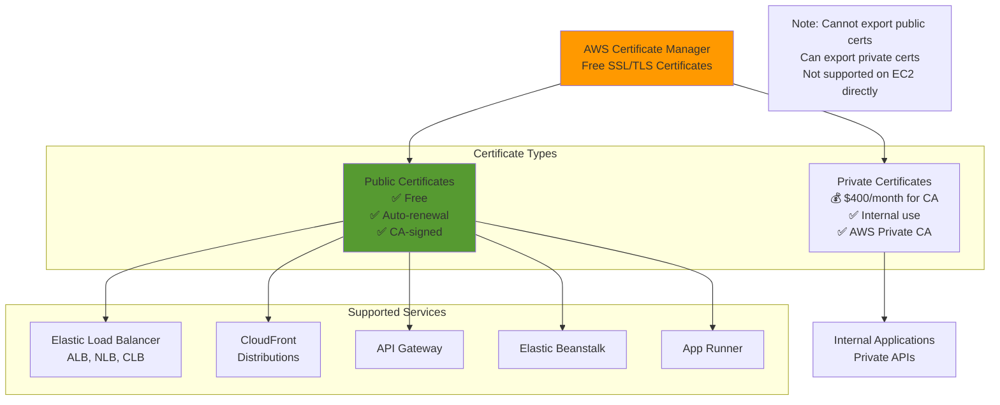

## AWS Security Services Overview

### Security Services Map

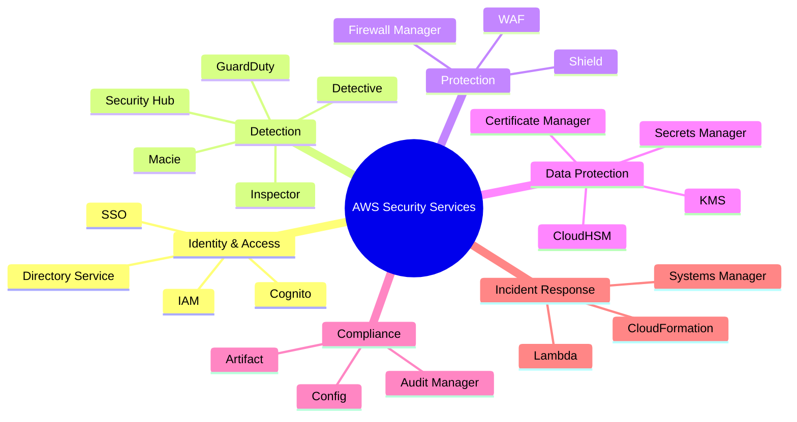

### Defense in Depth Strategy

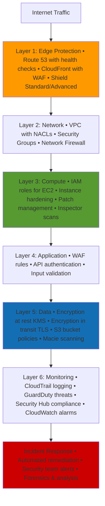

---

## Prerequisites

- [07: Security & Compliance - Ultra Fast Learning 🚀](ULTRA-FAST-LEARN.md)

## Recommended Next Topics

- [Security - Practice Questions](PRACTICE-QUESTIONS.md)

## Related Topics

- [Module 01: Security & Compliance](README.md)
- [⚡ Fast Learning - Security & Compliance](FAST-LEARN.md)
- [07: Security & Compliance - Ultra Fast Learning 🚀](ULTRA-FAST-LEARN.md)
