# Application Integration - Mermaid Diagrams

## Amazon SQS (Simple Queue Service)

### SQS Standard vs FIFO Queue

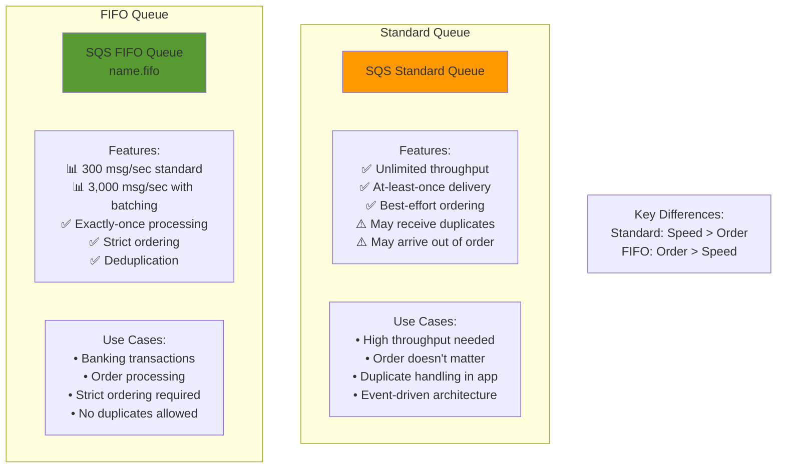

### SQS Message Lifecycle

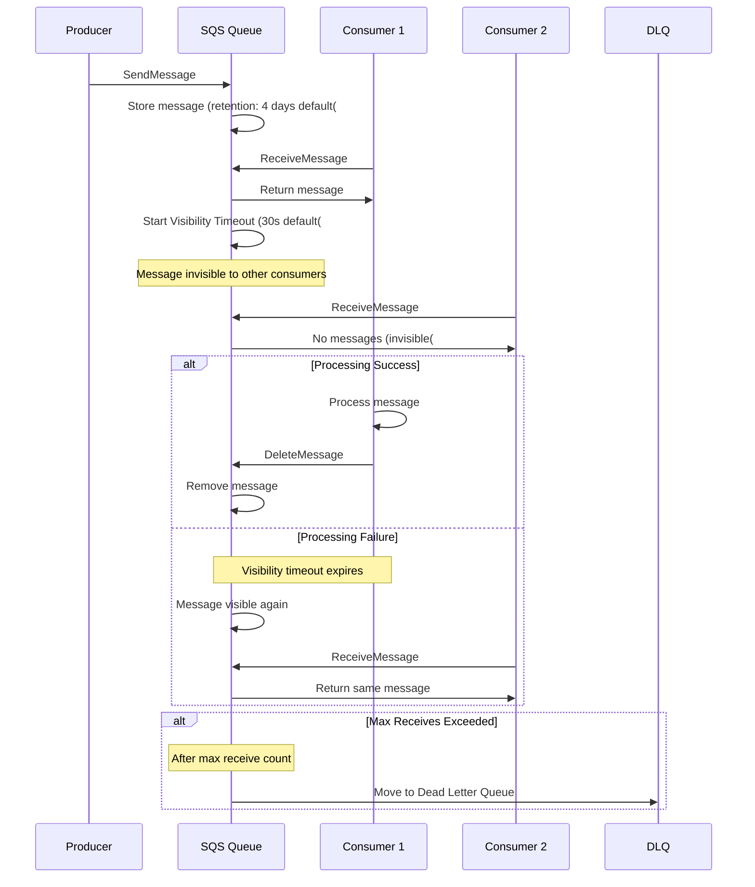

### SQS Decoupling Pattern

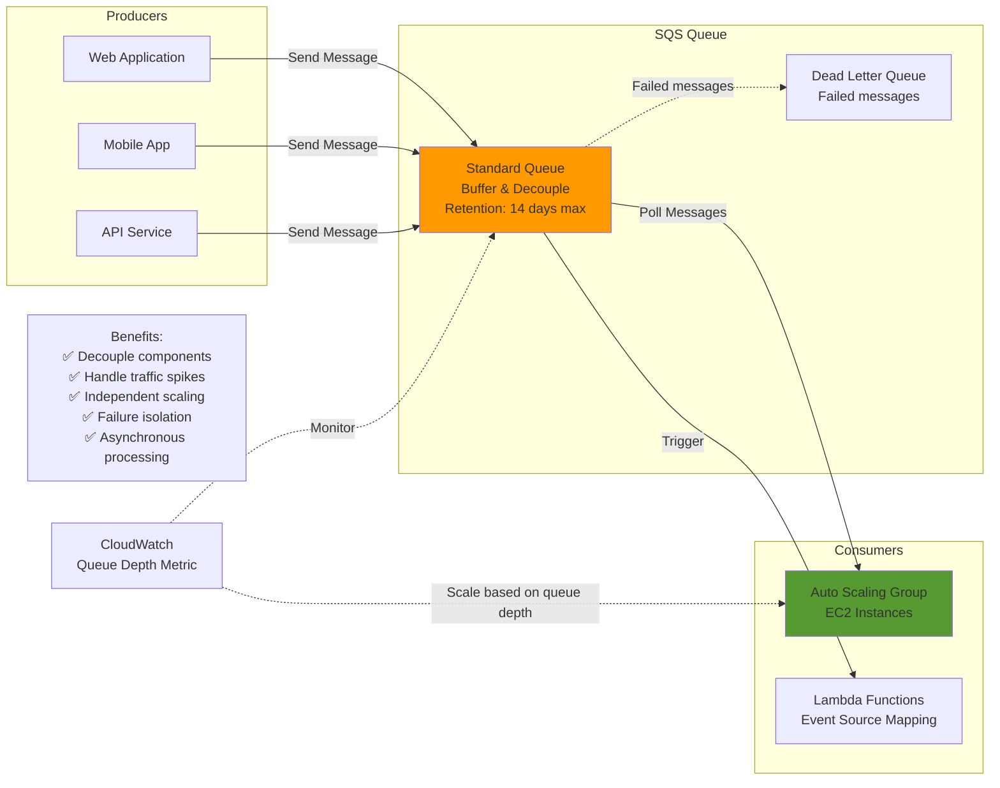

### SQS Long Polling

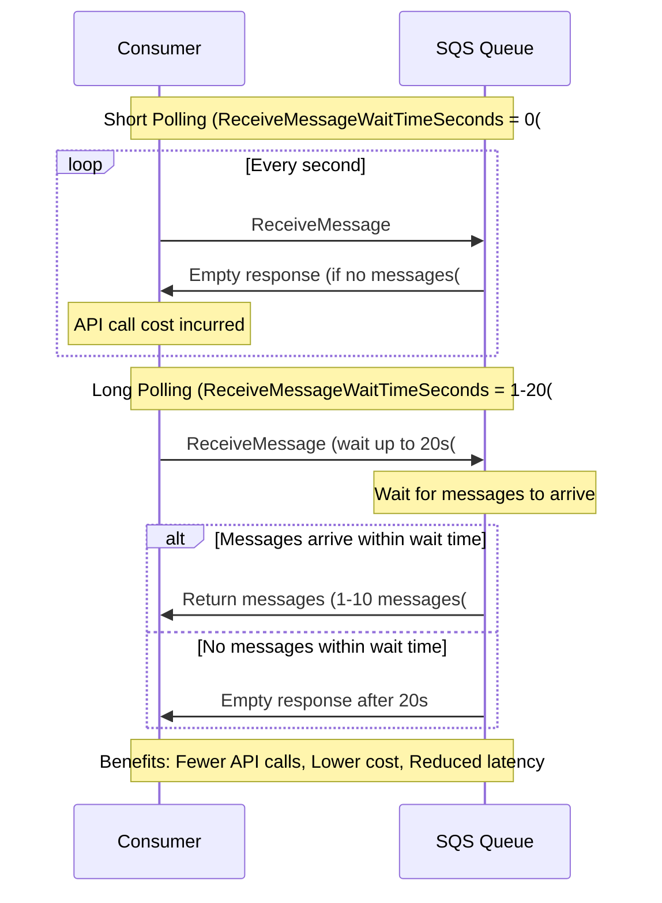

## Amazon SNS (Simple Notification Service)

### SNS Pub/Sub Architecture

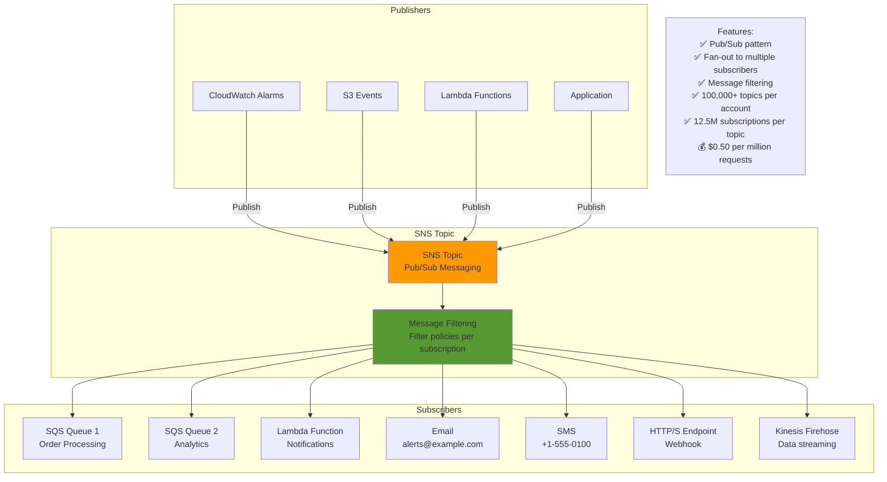

### SNS Fan-Out Pattern with SQS

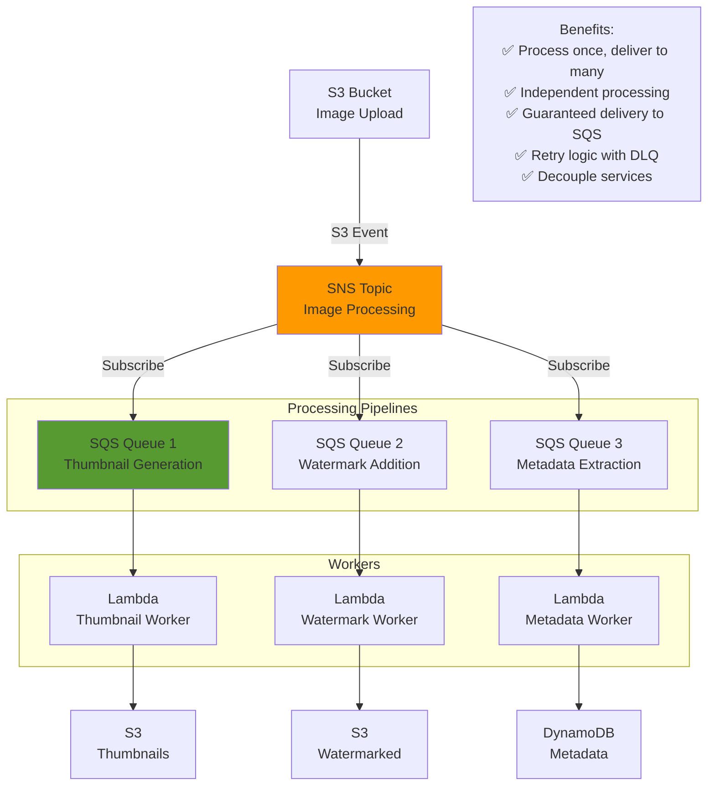

### SNS Message Filtering

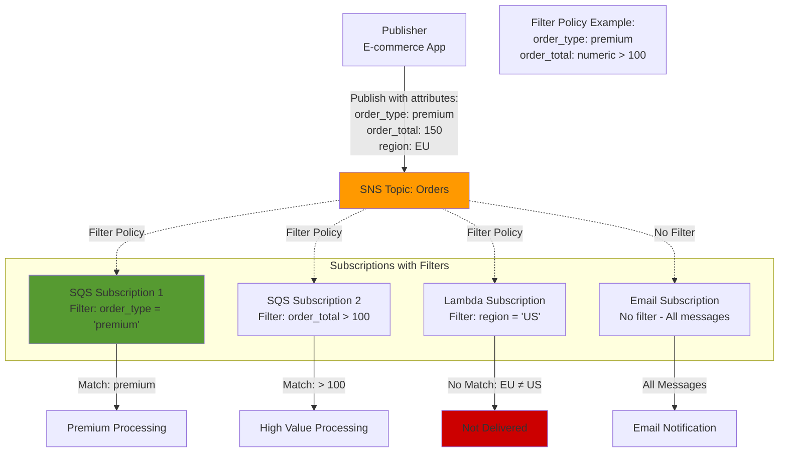

## Amazon EventBridge

### EventBridge Architecture

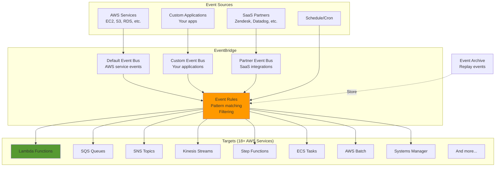

### EventBridge Event Pattern Matching

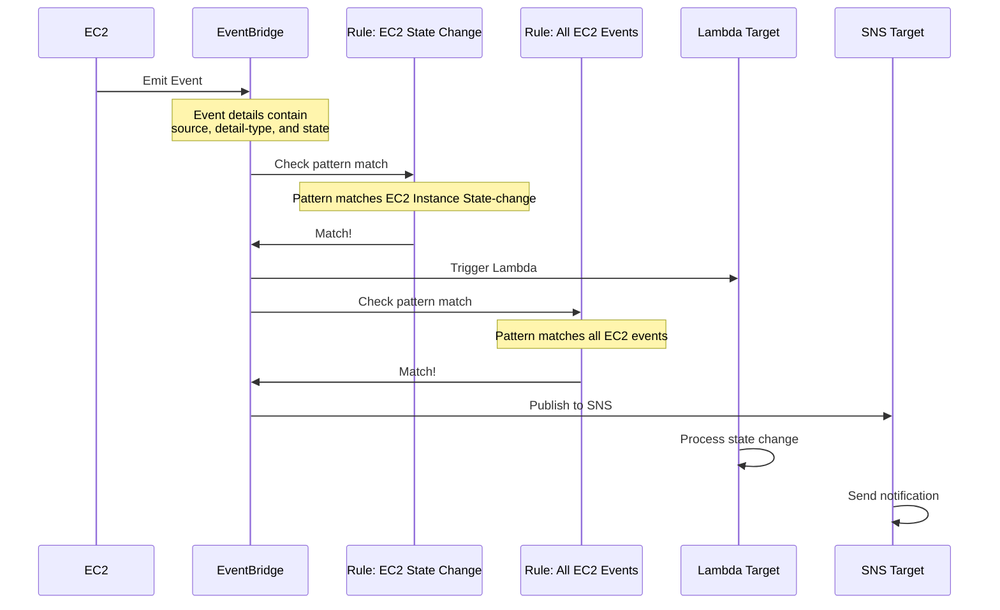

### EventBridge vs CloudWatch Events

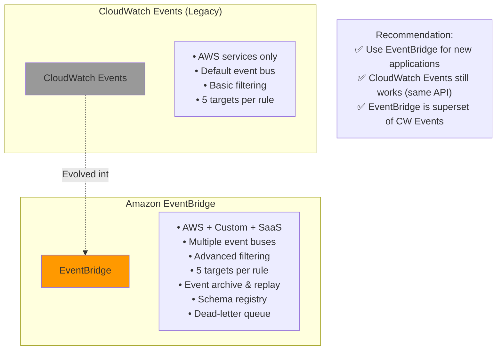

## AWS Step Functions

### Step Functions State Machine

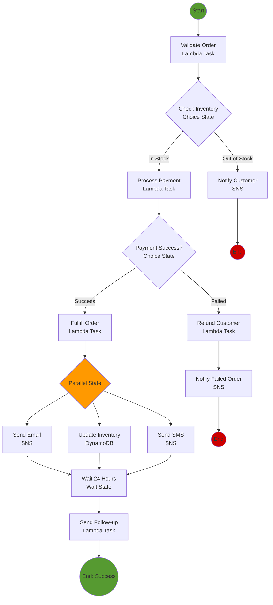

### Step Functions State Types

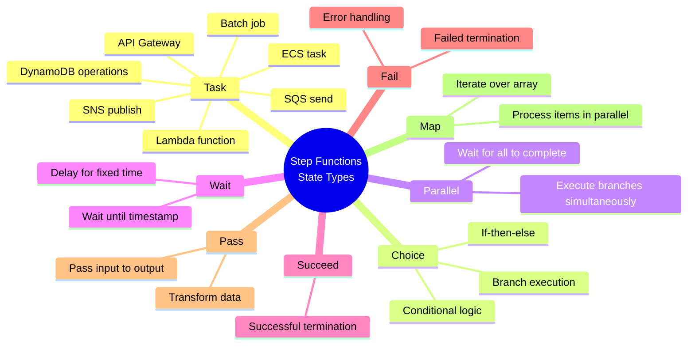

### Step Functions vs SQS vs SNS

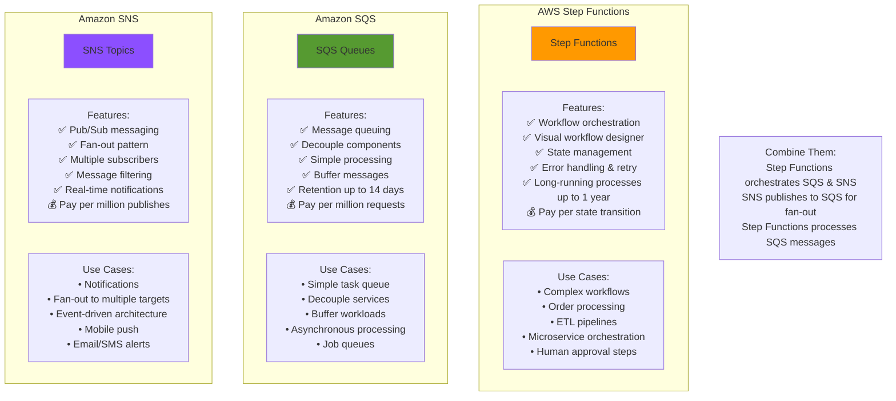

## Amazon MQ

### Amazon MQ Architecture

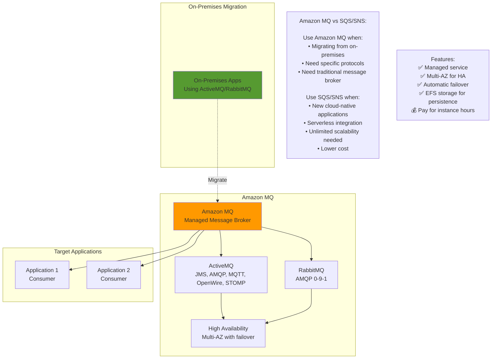

## Amazon AppSync

### AppSync GraphQL API

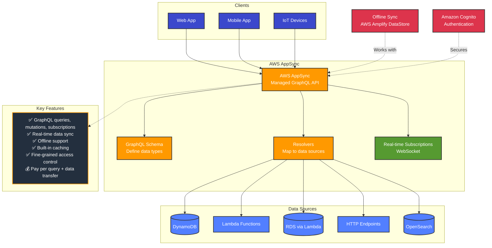

## Integration Patterns Summary

### Event-Driven Architecture Patterns

```mermaid
graph TB
    subgraph Pattern_1_Simple_Queue_Group["Pattern 1: Simple Queue"]
        P1_Producer[Producer] --> P1_SQS[SQS Queue]
        P1_SQS --> P1_Consumer[Consumer]
    end
    
    subgraph Pattern_2_Pub_Sub_Fan_Out_Group["Pattern 2: Pub/Sub Fan-Out"]
        P2_Publisher[Publisher] --> P2_SNS[SNS Topic]
        P2_SNS --> P2_Sub1[Subscriber 1]
        P2_SNS --> P2_Sub2[Subscriber 2]
        P2_SNS --> P2_Sub3[Subscriber 3]
    end
    
    subgraph Pattern_3_SNS_SQS_Fan_Out_Group["Pattern 3: SNS + SQS Fan-Out"]
        P3_Publisher[Publisher] --> P3_SNS[SNS Topic]
        P3_SNS --> P3_SQS1[SQS Queue 1]
        P3_SNS --> P3_SQS2[SQS Queue 2]
        P3_SQS1 --> P3_C1[Consumer 1]
        P3_SQS2 --> P3_C2[Consumer 2]
    end
    
    subgraph Pattern_4_Event_Driven_with_EventBridge_Group["Pattern 4: Event-Driven with EventBridge"]
        P4_Source[Event Source] --> P4_EB[EventBridge]
        P4_EB --> P4_T1[Lambda]
        P4_EB --> P4_T2[SQS]
        P4_EB --> P4_T3[Step Functions]
    end
    
    subgraph Pattern_5_Workflow_Orchestration_Group["Pattern 5: Workflow Orchestration"]
        P5_Trigger[Trigger] --> P5_SF[Step Functions]
        P5_SF --> P5_L1[Lambda 1]
        P5_SF --> P5_L2[Lambda 2]
        P5_SF --> P5_L3[Lambda 3]
    end
    
    classDef style1 fill:#FF9900
    class P1_SQS style1
    classDef style2 fill:#8C4FFF
    class P2_SNS style2
    classDef style3 fill:#8C4FFF
    class P3_SNS style3
    classDef style4 fill:#569A31
    class P4_EB style4
    classDef style5 fill:#146EB4
    class P5_SF style5
```

---

## Prerequisites

- [08: Application Integration - Ultra Fast Learning 🚀](ULTRA-FAST-LEARN.md)

## Recommended Next Topics

- [Application Integration - Practice Questions](PRACTICE-QUESTIONS.md)

## Related Topics

- [Module 01: Application Integration](README.md)
- [⚡ Fast Learning - Application Integration](FAST-LEARN.md)
- [08: Application Integration - Ultra Fast Learning 🚀](ULTRA-FAST-LEARN.md)
