# Monitoring & Management - Mermaid Diagrams

## Amazon CloudWatch

### CloudWatch Architecture

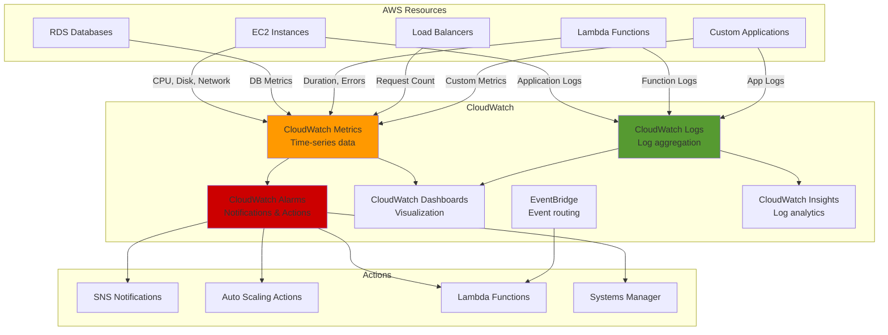

### CloudWatch Metrics and Alarms

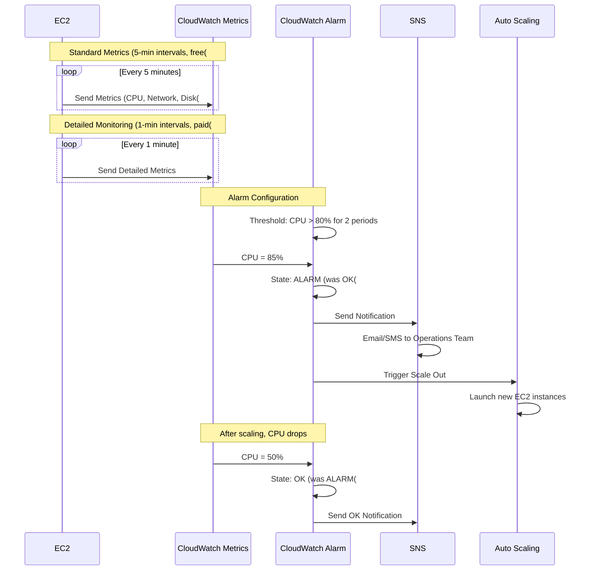

### CloudWatch Logs Architecture

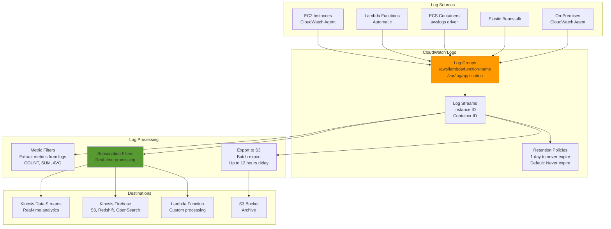

### CloudWatch Logs Insights

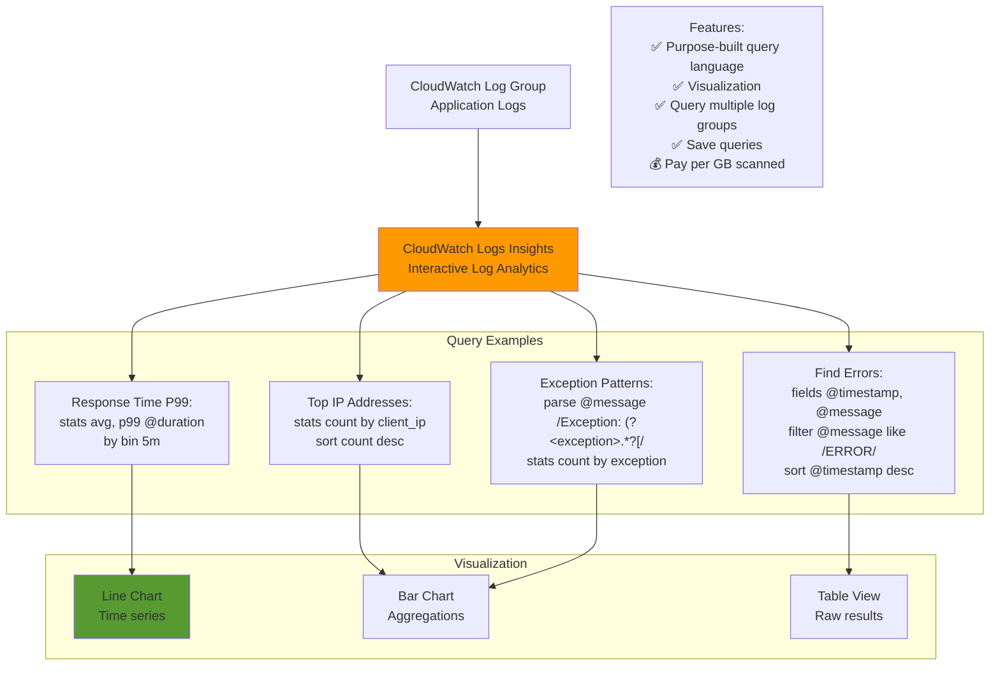

## AWS X-Ray

### X-Ray Distributed Tracing

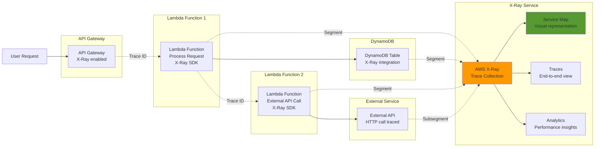

### X-Ray Concepts

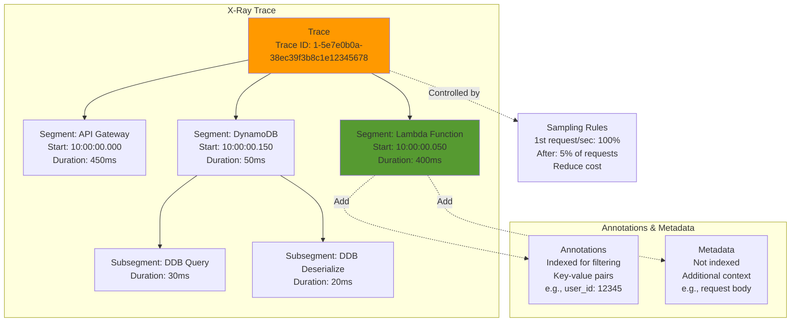

## AWS CloudTrail

### CloudTrail Architecture

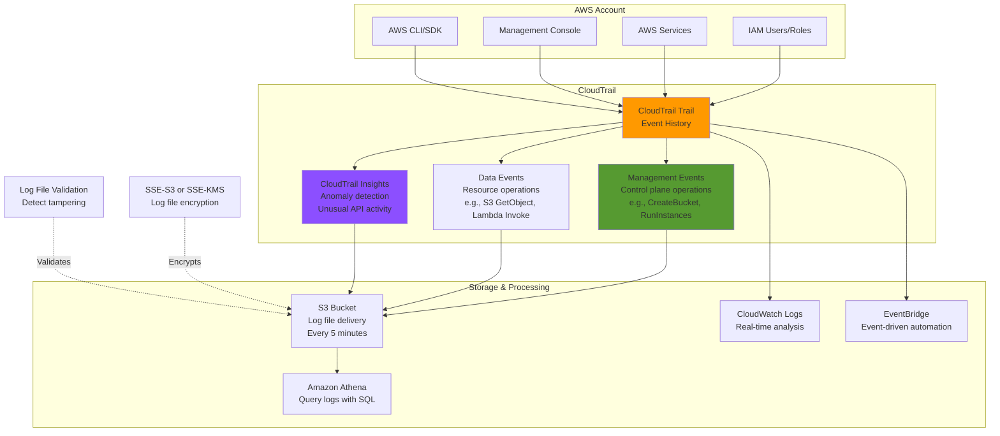

### CloudTrail Event Structure

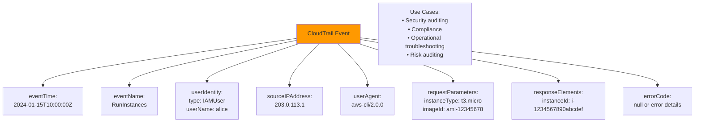

## AWS Config

### AWS Config Architecture

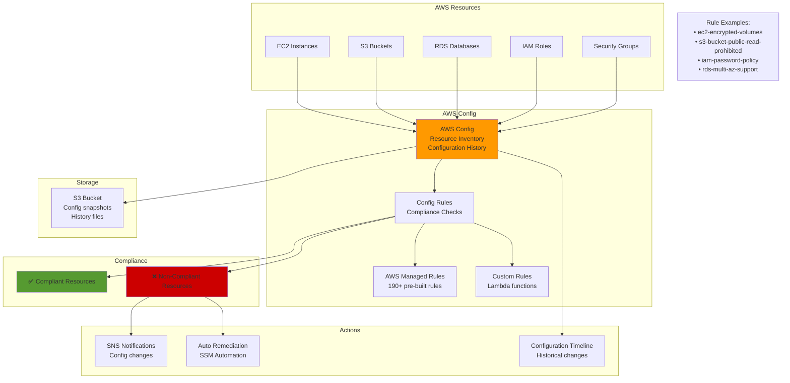

### Config Rules and Remediation

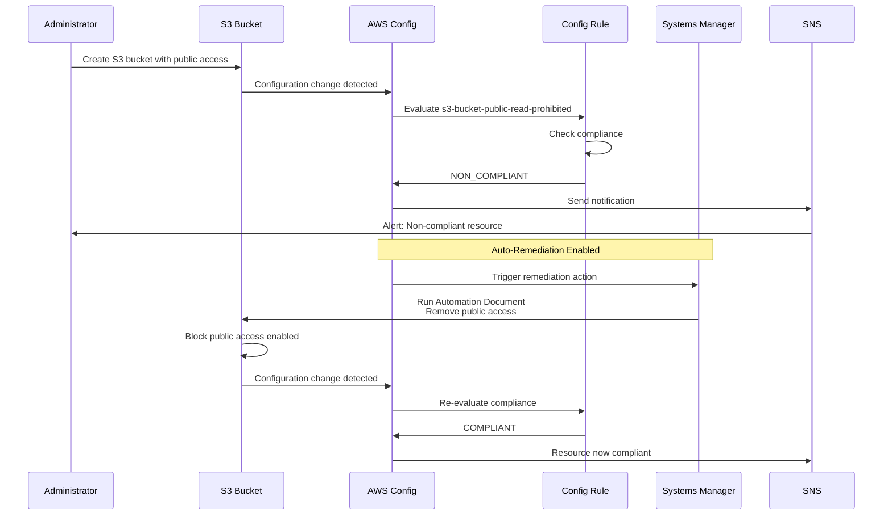

## AWS Systems Manager

### Systems Manager Capabilities

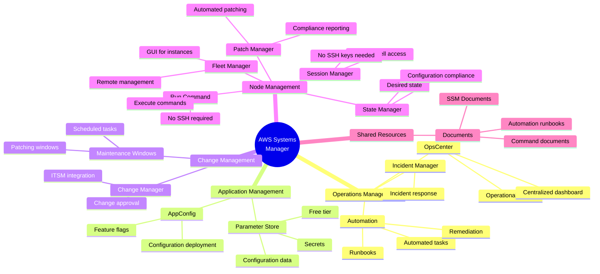

### Systems Manager Session Manager

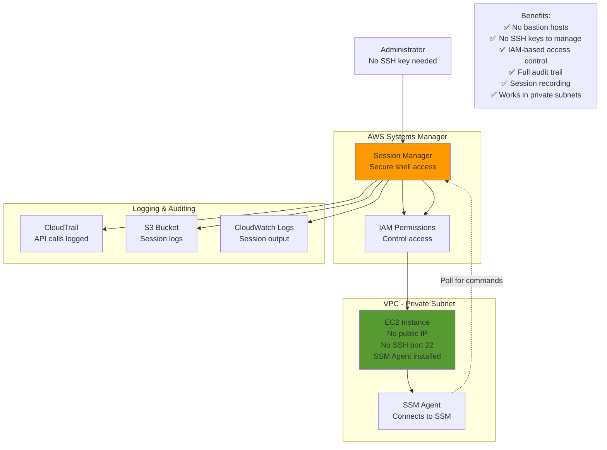

### Systems Manager Parameter Store

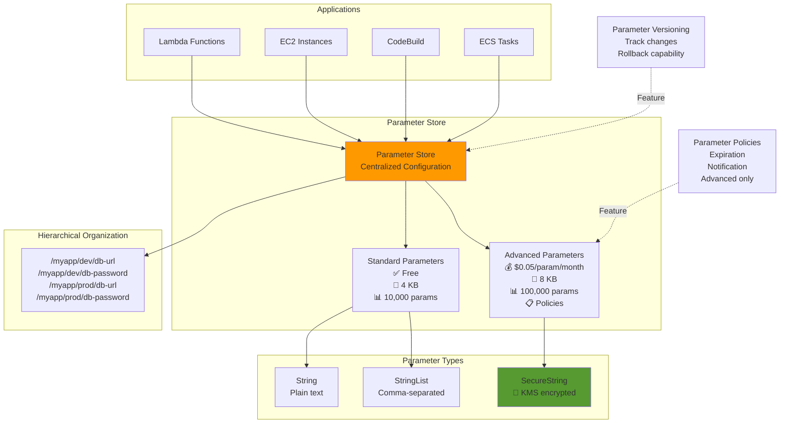

## AWS Personal Health Dashboard

### Health Dashboard Architecture

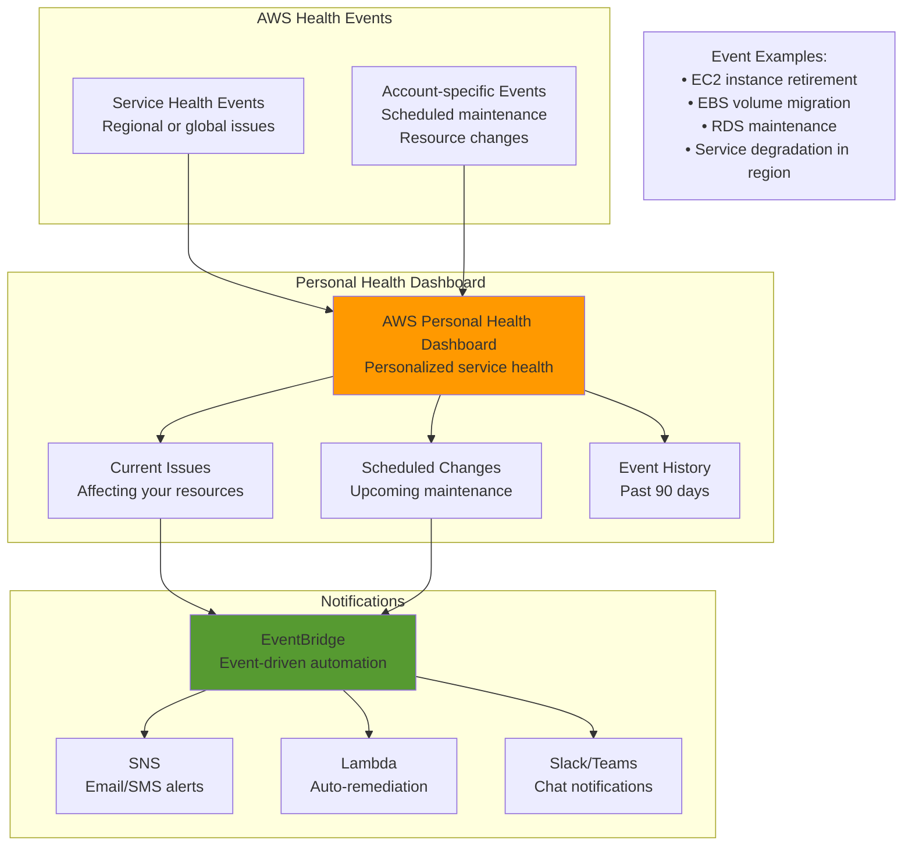

## Monitoring Best Practices

### Comprehensive Monitoring Strategy

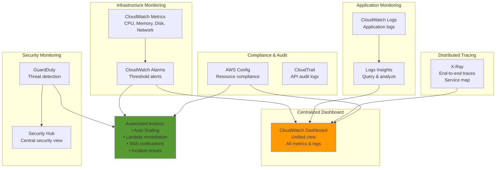

---

## Prerequisites

- [09: Monitoring & Management - Ultra Fast Learning 🚀](ULTRA-FAST-LEARN.md)

## Recommended Next Topics

- [Monitoring & Management - Practice Questions](PRACTICE-QUESTIONS.md)

## Related Topics

- [Module 01: Monitoring & Management](README.md)
- [⚡ Fast Learning - Monitoring & Management](FAST-LEARN.md)
- [09: Monitoring & Management - Ultra Fast Learning 🚀](ULTRA-FAST-LEARN.md)
