# Migration & Transfer - Mermaid Diagrams

## AWS Migration Strategies (7 Rs)

### The 7 Rs of Migration

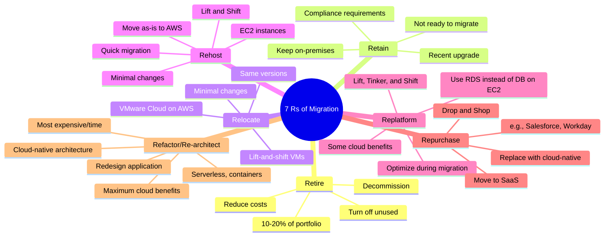

### Migration Decision Tree

```mermaid
flowchart TD
    Start([Application to Migrate])
    
    Start --> Q1{Still needed?}
    Q1 -->|No| Retire["Retire: Decommission"]
    Q1 -->|Yes| Q2{Ready to migrate?}
    
    Q2 -->|No| Retain["Retain: Keep on-premises"]
    Q2 -->|Yes| Q3{Migration urgency?}
    
    Q3 -->|Very Urgent| Q4{VMware workload?}
    Q3 -->|Not Urgent| Q5{Willing to redesign?}
    
    Q4 -->|Yes| Relocate["Relocate: VMware Cloud on AWS"]
    Q4 -->|No| Rehost["Rehost: Lift & Shift to EC2"]
    
    Q5 -->|No| Q6{Some optimization OK?}
    Q5 -->|Yes| Q7{Budget available?}
    
    Q6 -->|Yes| Replatform["Replatform: Use managed services"]
    Q6 -->|No| Rehost
    
    Q7 -->|No| Repurchase["Repurchase: Move to SaaS"]
    Q7 -->|Yes| Refactor["Refactor: Cloud-native redesign"]
    
    classDef style1 fill:#232F3E
    class Start style1
    classDef style2 fill:#FF9900
    class Rehost style2
    classDef style3 fill:#569A31
    class Refactor style3
    classDef style4 fill:#C00
    class Retire style4
```

## AWS Migration Hub

### Migration Hub Architecture

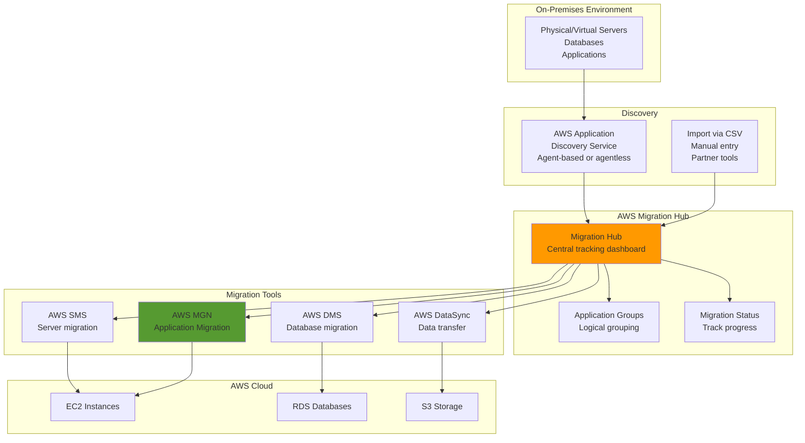

## AWS Application Discovery Service

### Discovery Service Options

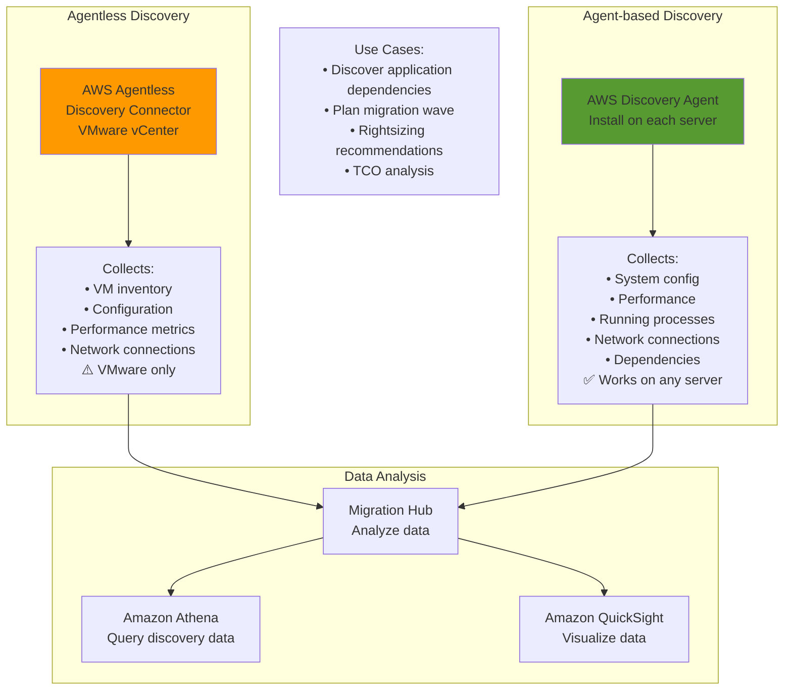

## AWS Database Migration Service (DMS)

### DMS Architecture

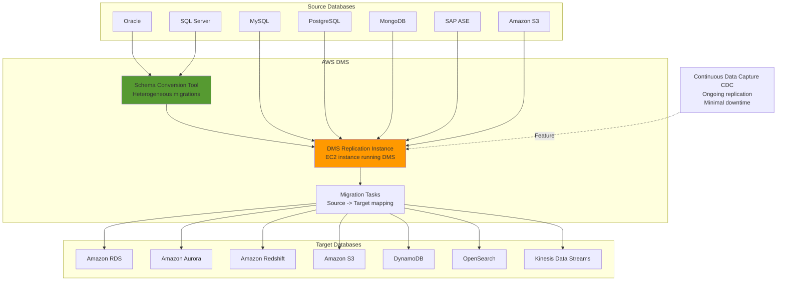

### DMS Migration Types

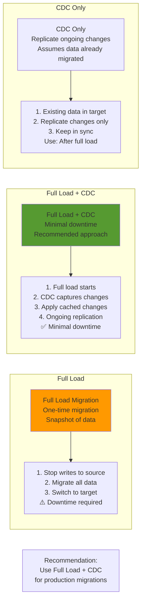

### DMS with Schema Conversion Tool

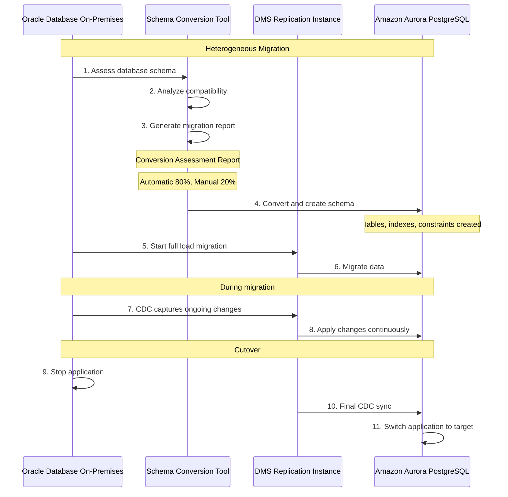

## AWS Application Migration Service (MGN)

### MGN CloudEndure Migration

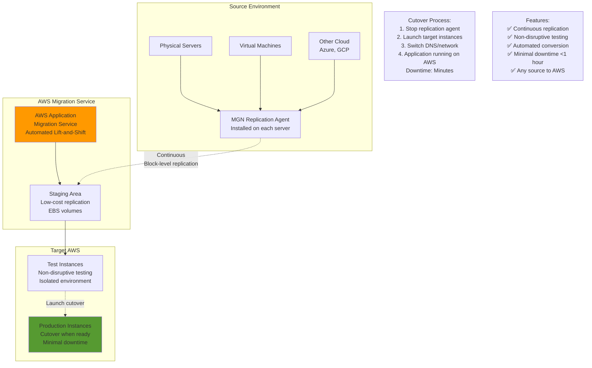

## AWS DataSync

### DataSync Architecture

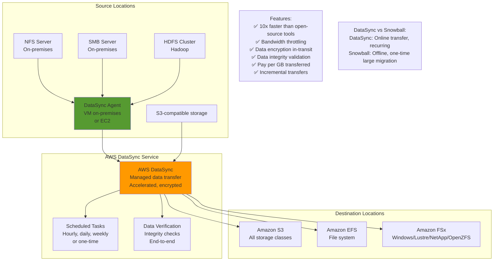

### DataSync Transfer Flow

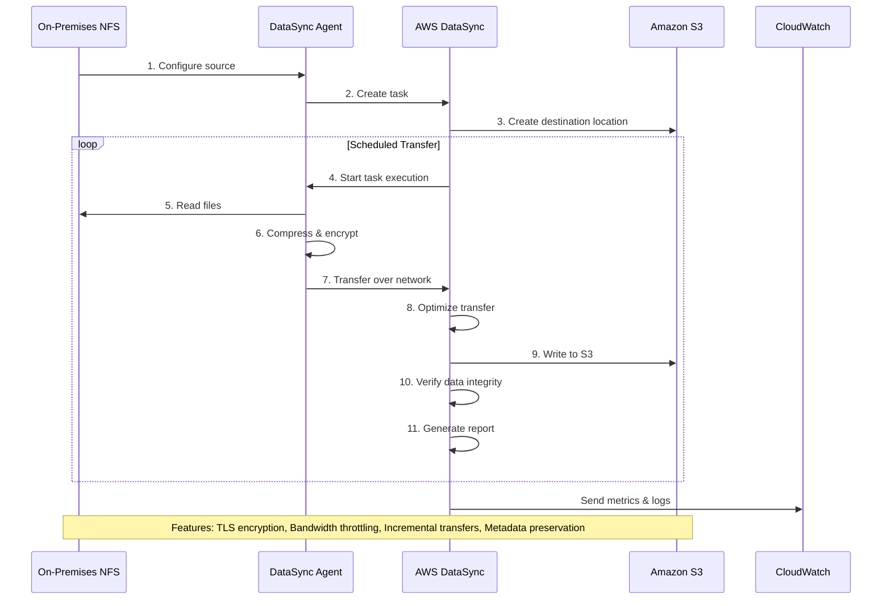

## AWS Transfer Family

### Transfer Family Services

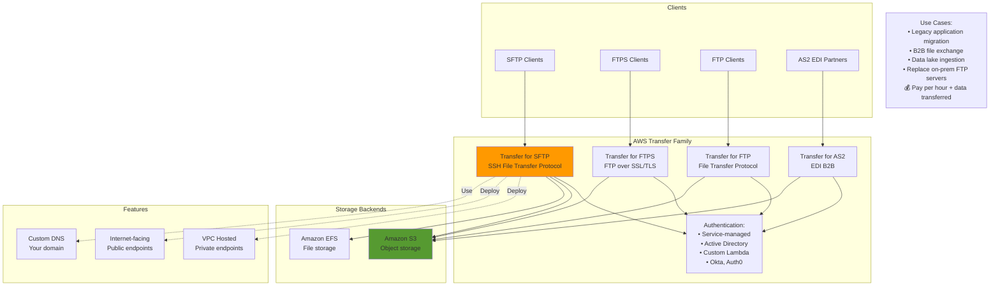

## AWS Snow Family Migration

### Snow Family Device Comparison

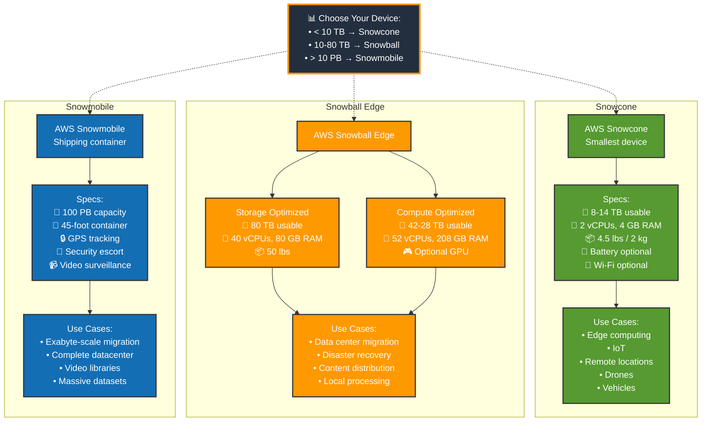

### Snow Family with Edge Computing

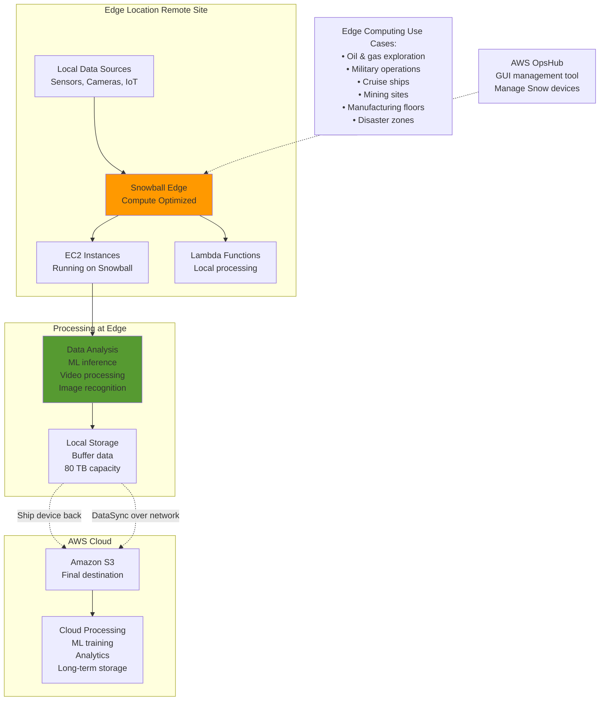

## Migration Timeline

### Typical Large-Scale Migration

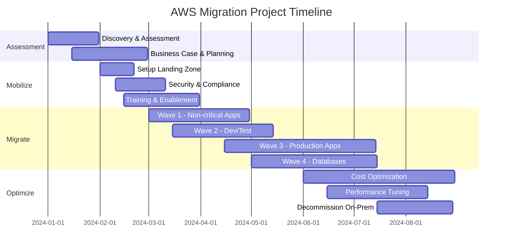

---

## Prerequisites

- [10: Migration & Transfer - Ultra Fast Learning 🚀](ULTRA-FAST-LEARN.md)

## Recommended Next Topics

- [Migration & Transfer Services - Practice Questions](PRACTICE-QUESTIONS.md)

## Related Topics

- [Module 01: Migration & Transfer Services](README.md)
- [⚡ Fast Learning - Migration & Transfer](FAST-LEARN.md)
- [10: Migration & Transfer - Ultra Fast Learning 🚀](ULTRA-FAST-LEARN.md)
