# Analytics - Mermaid Diagrams

## Amazon Athena

### Athena Architecture

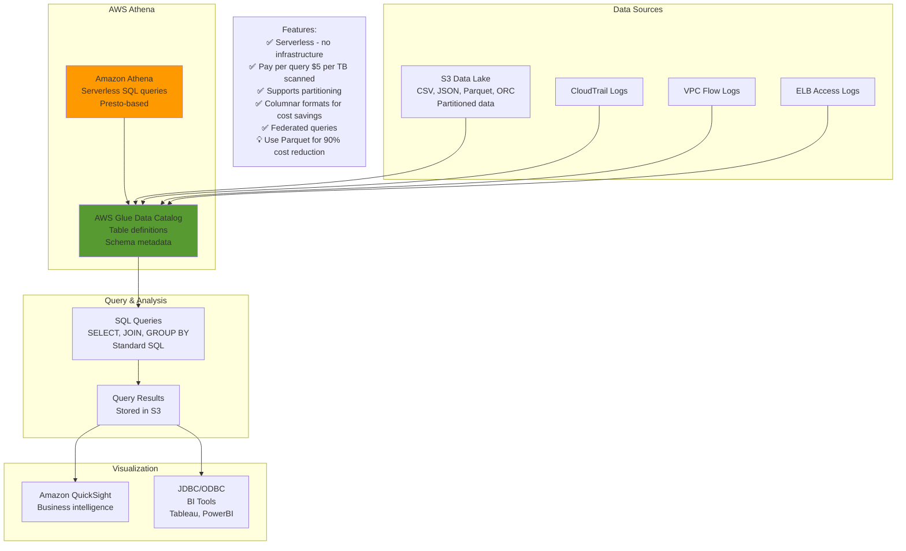

### Athena Performance Optimization

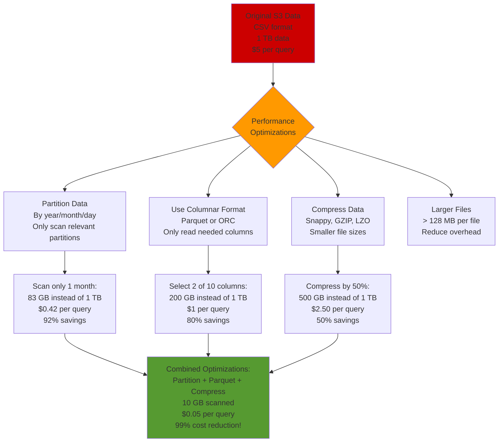

## Amazon EMR (Elastic MapReduce)

### EMR Cluster Architecture

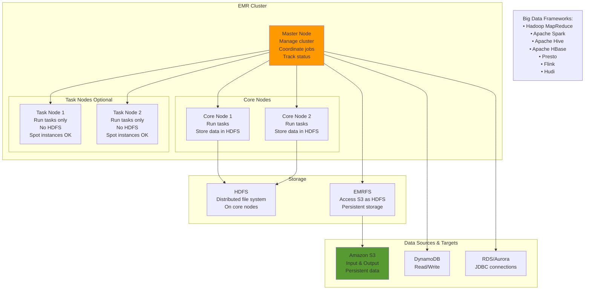

### EMR Deployment Options

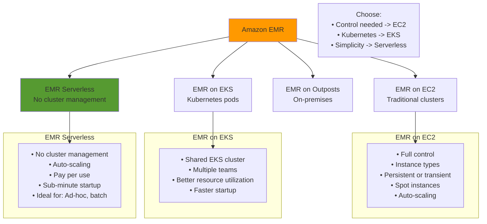

## Amazon Kinesis

### Kinesis Services Overview

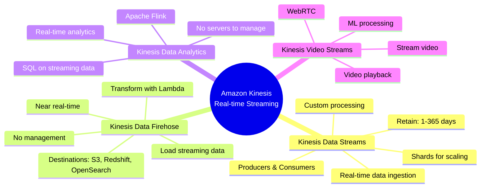

### Kinesis Data Streams Architecture

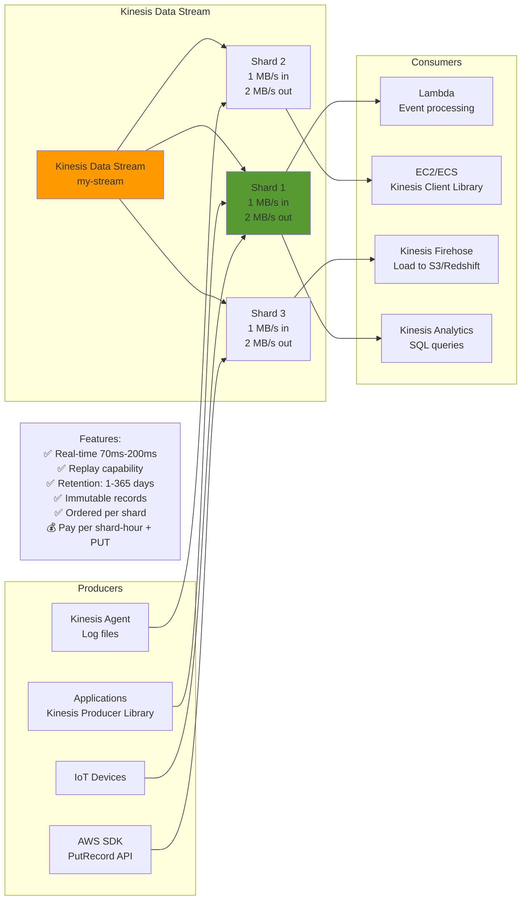

### Kinesis Data Firehose

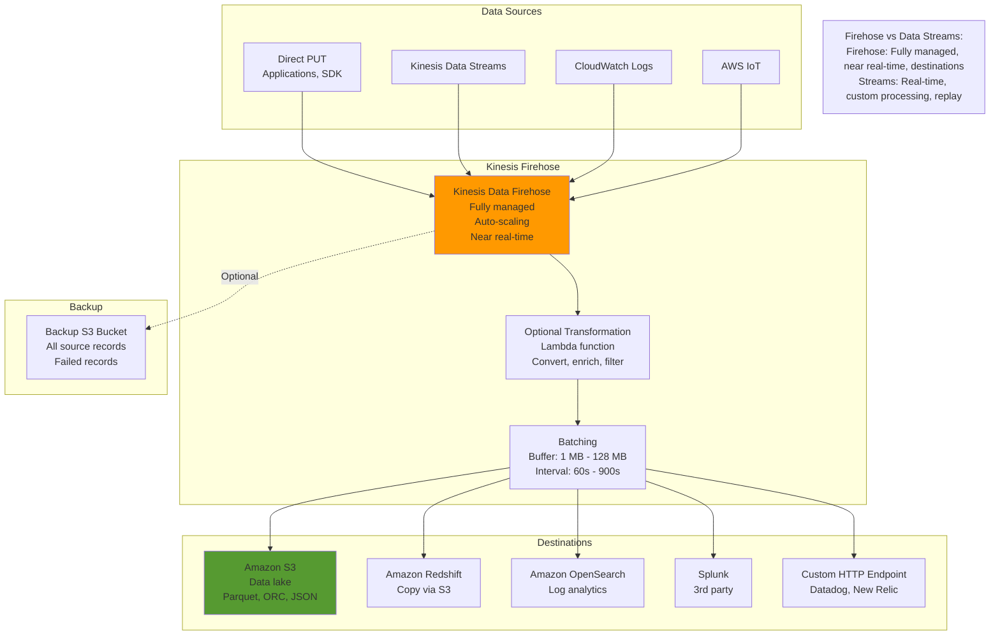

### Kinesis Data Analytics

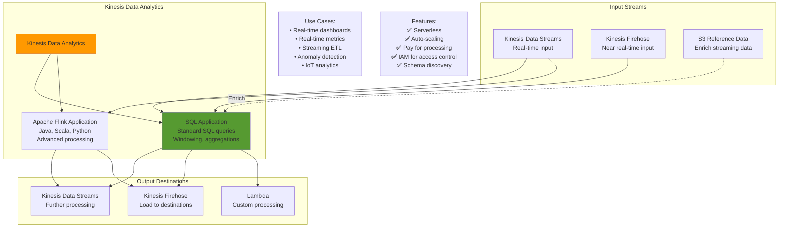

## AWS Glue

### Glue ETL Architecture

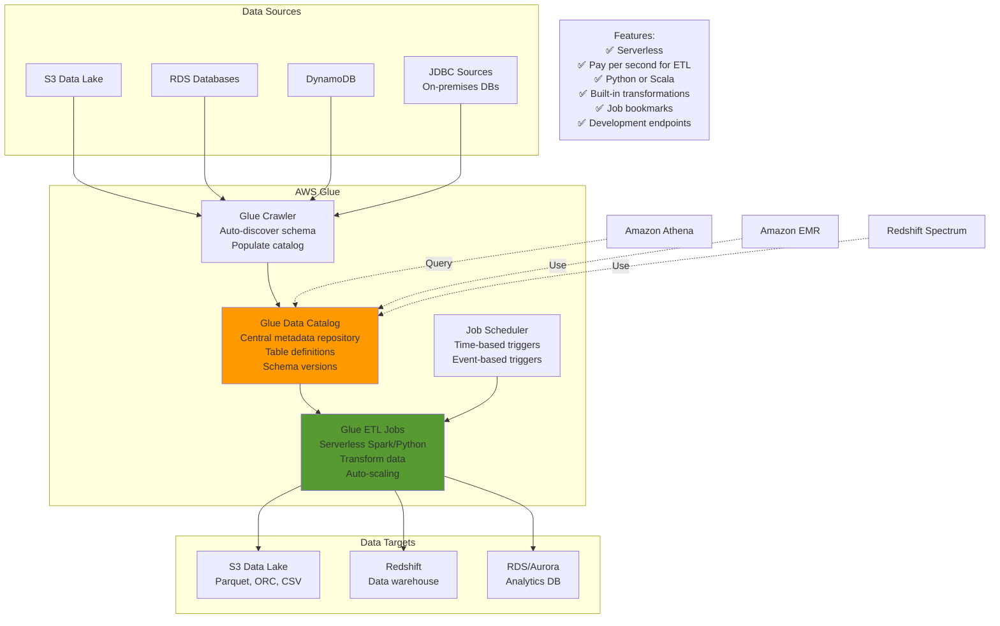

### Glue Data Catalog

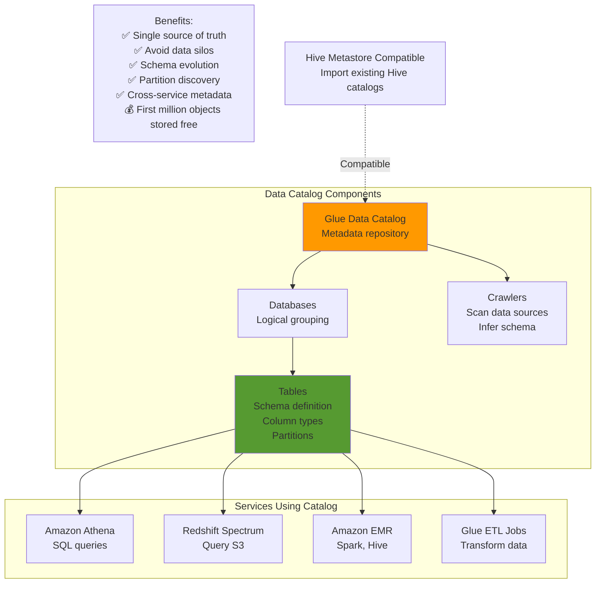

## Amazon QuickSight

### QuickSight Architecture

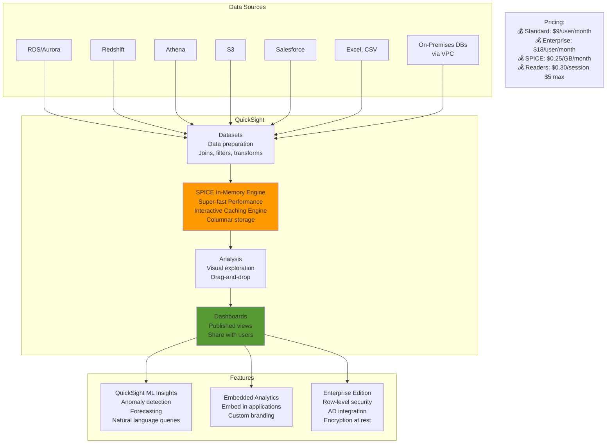

## Amazon OpenSearch (ElasticSearch)

### OpenSearch Architecture

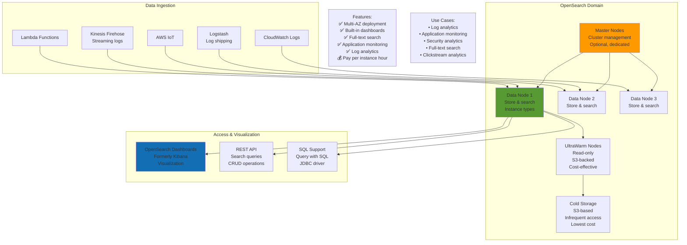

## Analytics Architecture Patterns

### Real-Time Analytics Pipeline

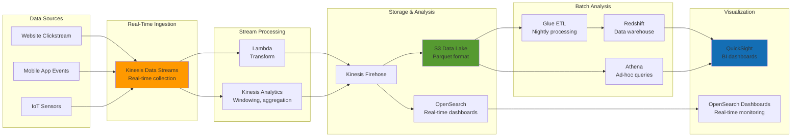

### Batch Analytics Pipeline

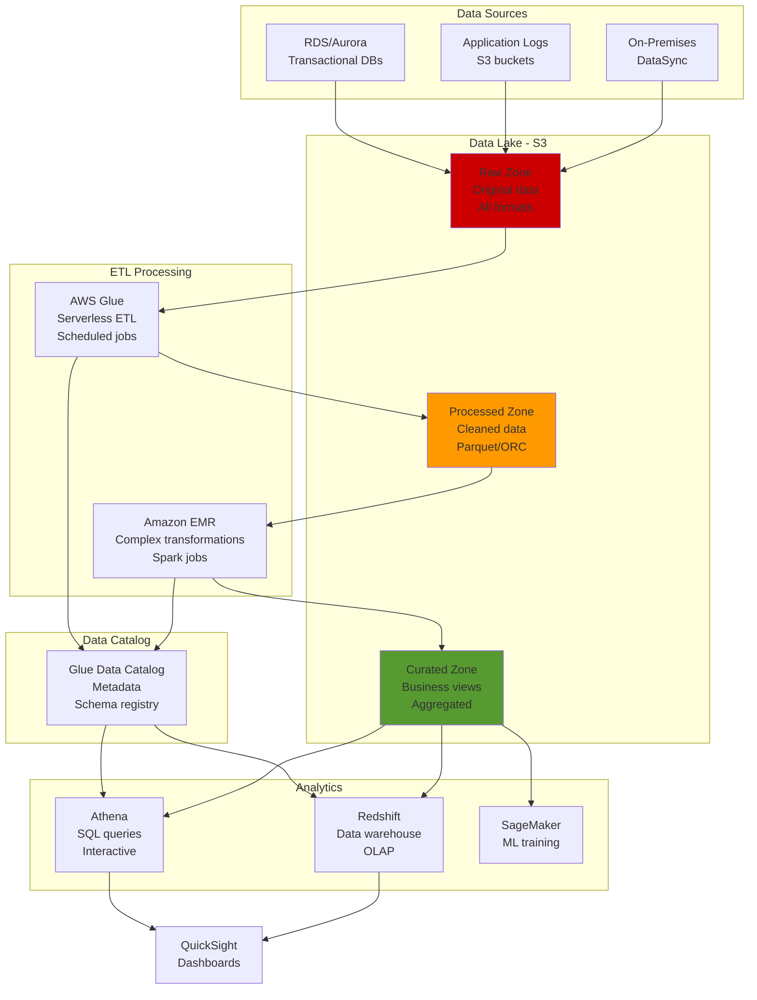

---

## Prerequisites

- [11: Analytics Services - Ultra Fast Learning 🚀](ULTRA-FAST-LEARN.md)

## Recommended Next Topics

- [Analytics Services - Practice Questions](PRACTICE-QUESTIONS.md)

## Related Topics

- [Module 01: Analytics Services](README.md)
- [⚡ Fast Learning - Analytics Services](FAST-LEARN.md)
- [11: Analytics Services - Ultra Fast Learning 🚀](ULTRA-FAST-LEARN.md)
