# Architecture Patterns - Mermaid Diagrams

## Well-Architected Framework Pillars

### AWS Well-Architected Framework

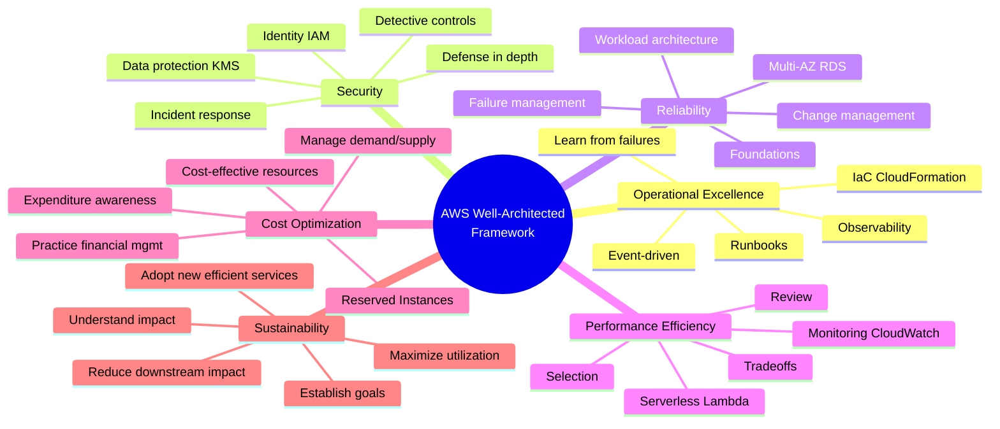

## High Availability Architectures

### Multi-AZ Web Application

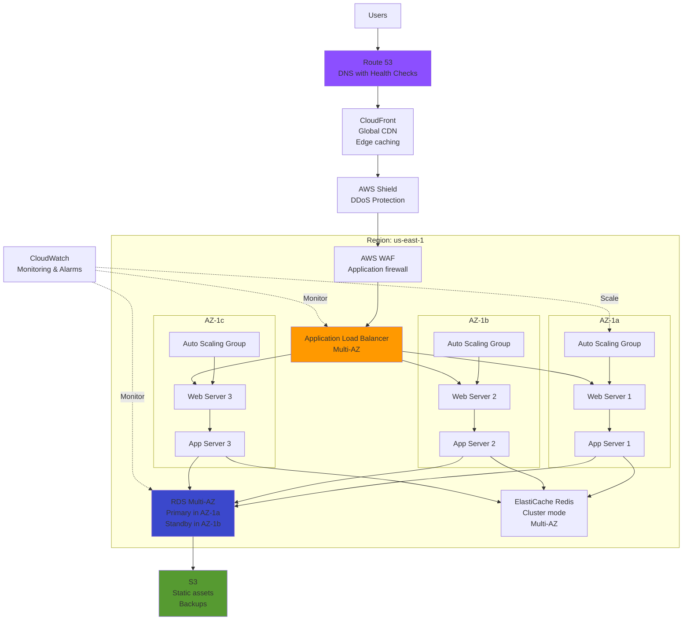

### Multi-Region Active-Active

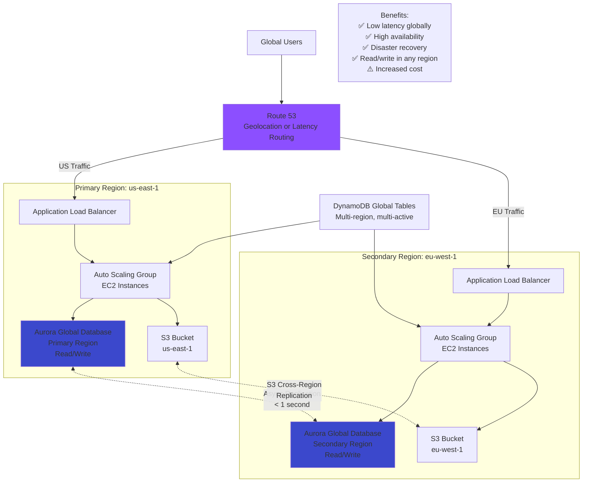

## Disaster Recovery Patterns

### DR Strategies Comparison

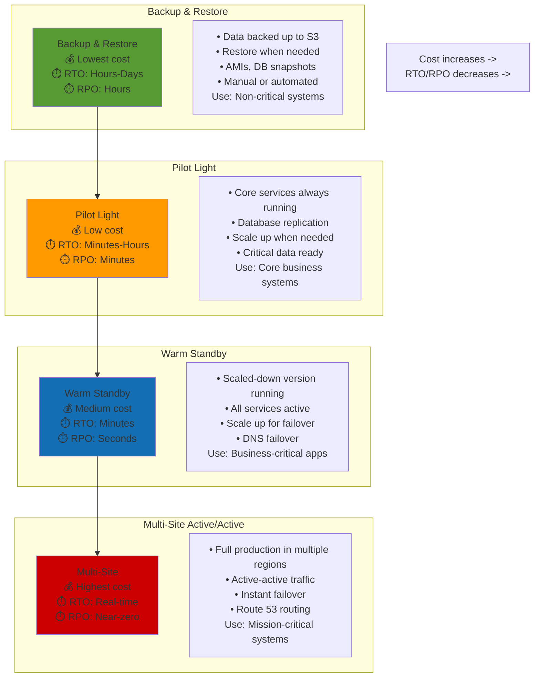

### Pilot Light Architecture

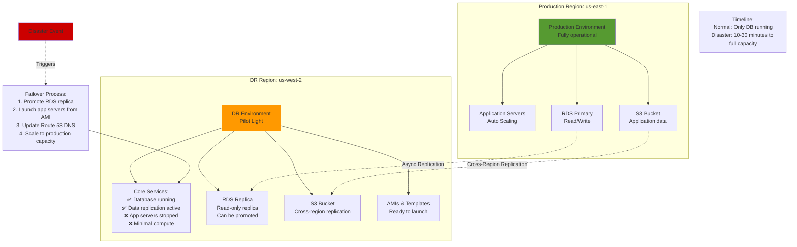

## Serverless Architectures

### Serverless Web Application

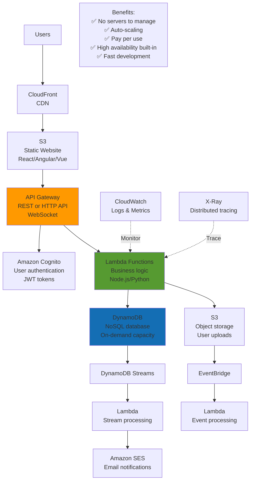

### Event-Driven Serverless

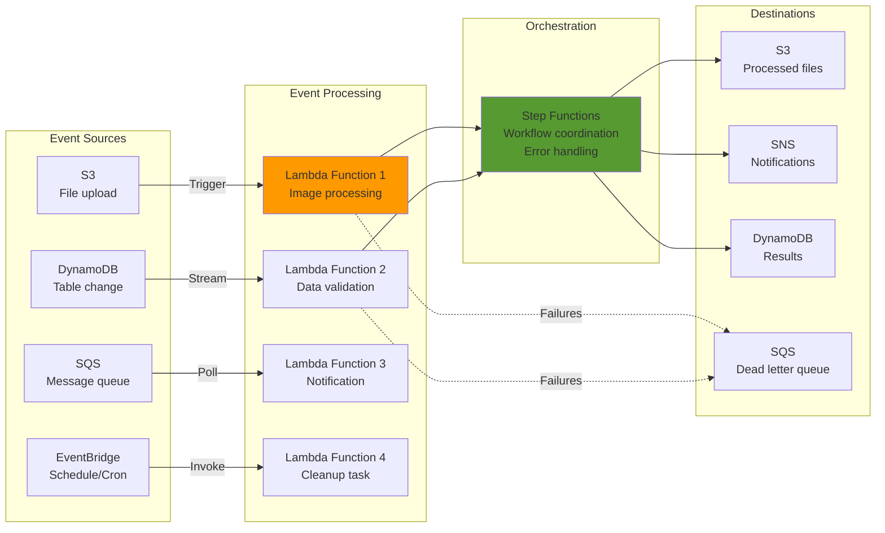

## Microservices Patterns

### Container-Based Microservices

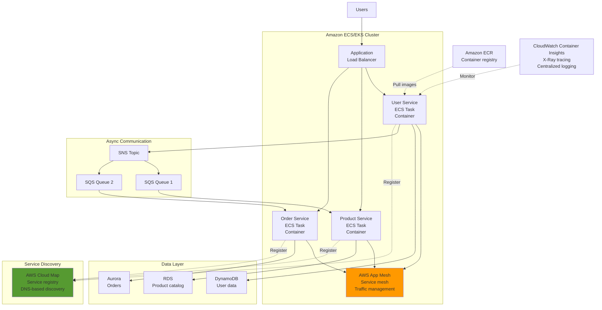

### API-First Microservices

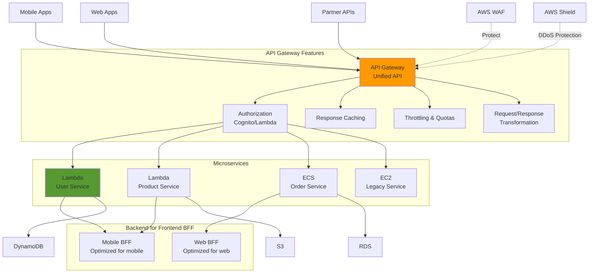

## Data Lake Architecture

### Comprehensive Data Lake

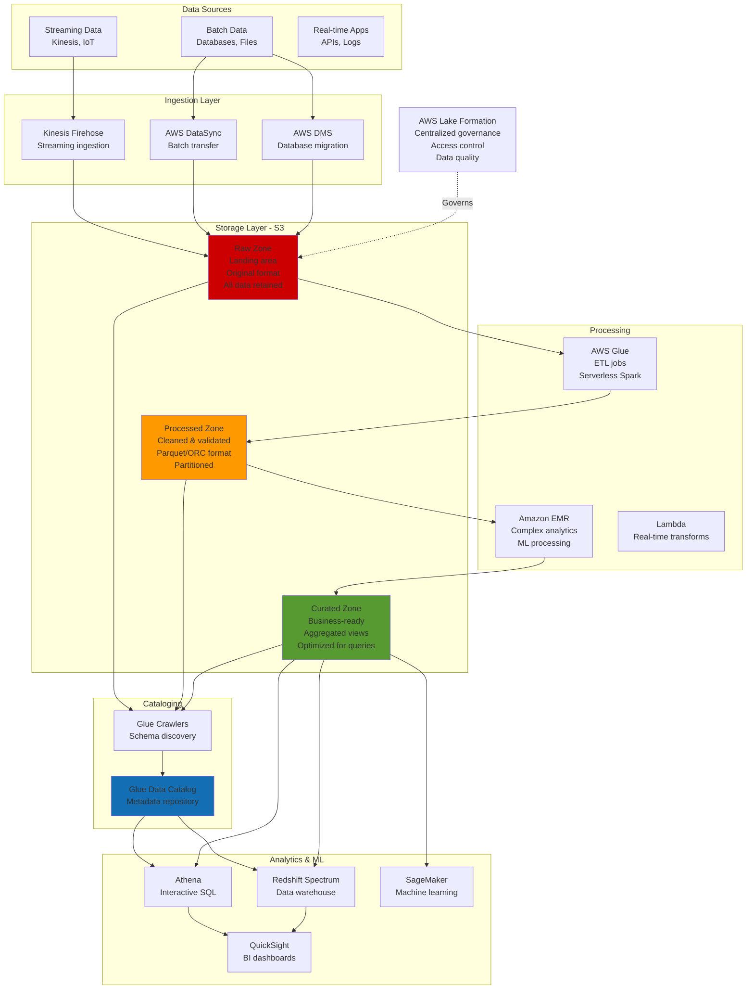

## Hybrid Cloud Patterns

### Hybrid Cloud Architecture

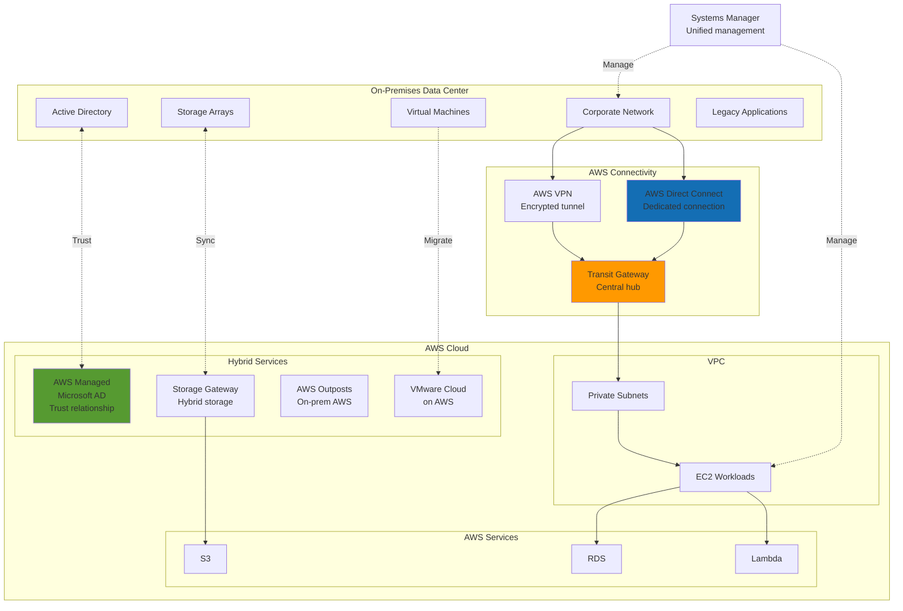

## Caching Strategies

### Multi-Layer Caching

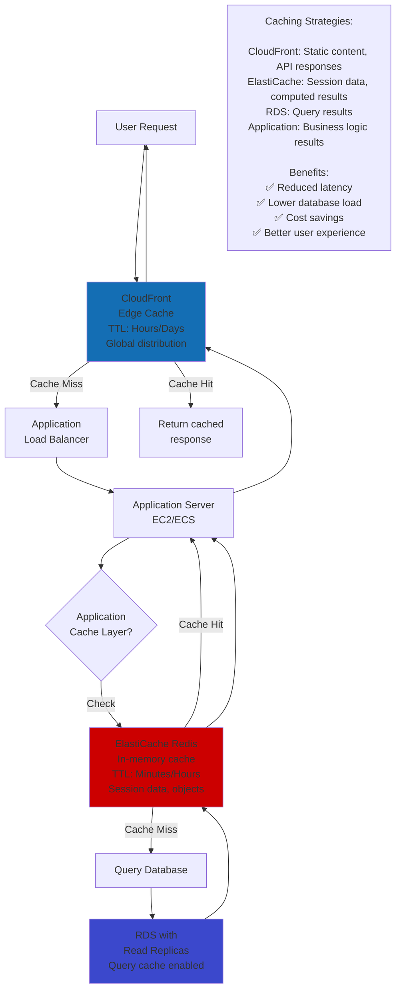

---

## Prerequisites

- [12: Architecture Patterns - Ultra Fast Learning 🚀](ULTRA-FAST-LEARN.md)

## Recommended Next Topics

- [Architecture Patterns - Practice Questions](PRACTICE-QUESTIONS.md)

## Related Topics

- [Module 01: Architecture Patterns](README.md)
- [FAST-LEARN](FAST-LEARN.md)
- [12: Architecture Patterns - Ultra Fast Learning 🚀](ULTRA-FAST-LEARN.md)
