# Cost Optimization - Mermaid Diagrams

## Cost Optimization Strategies

### Cost Optimization Pillars

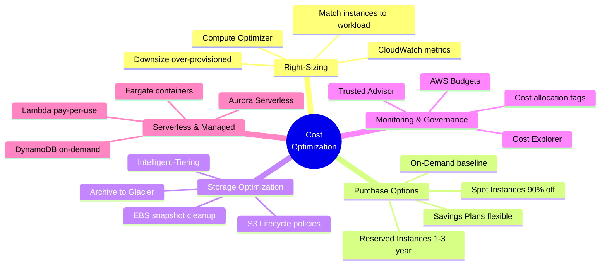

## EC2 Cost Optimization

### EC2 Pricing Models Comparison

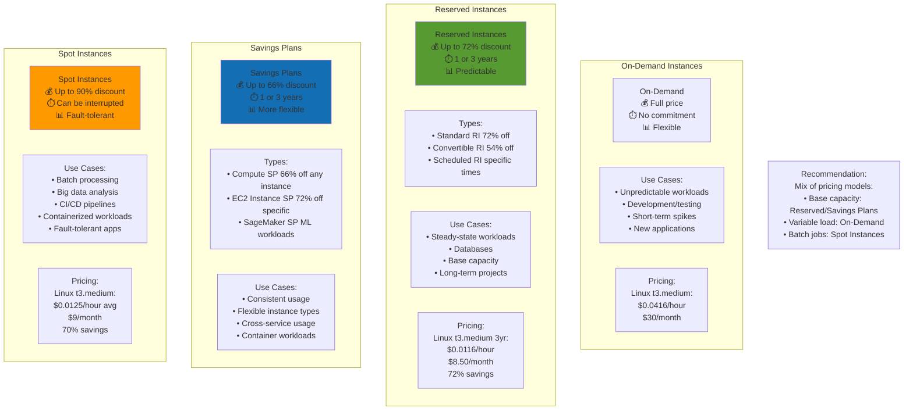

### Reserved Instance Types

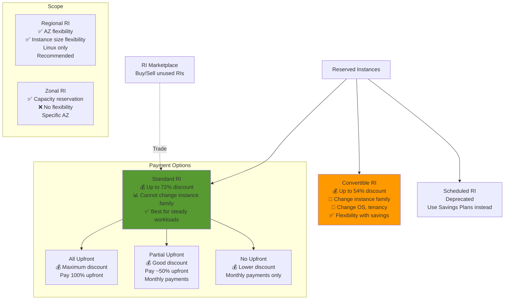

### Spot Instance Strategies

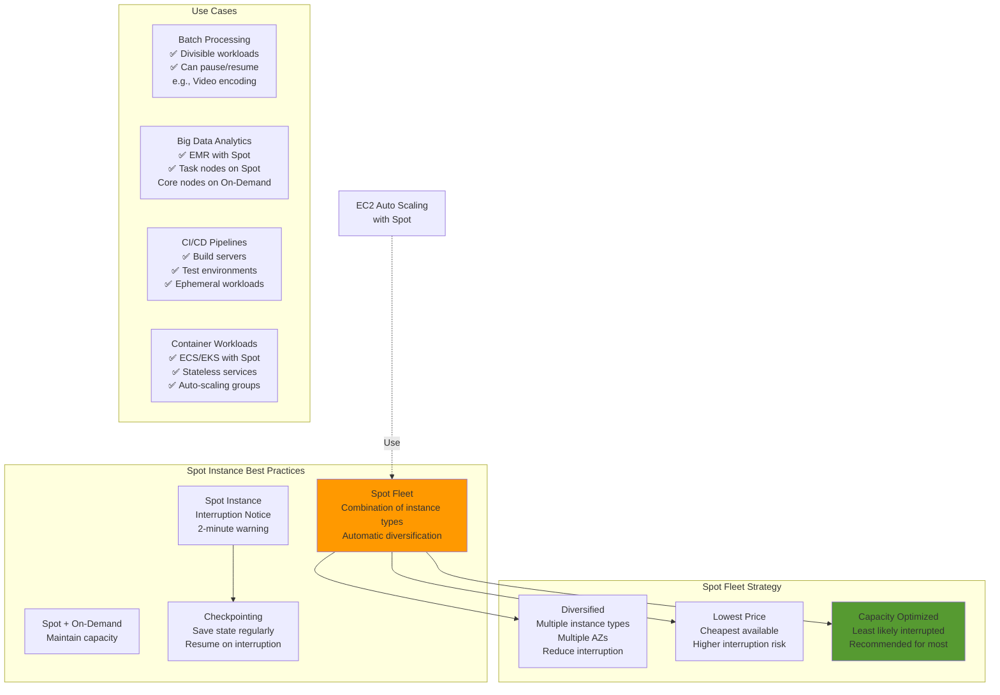

## Storage Cost Optimization

### S3 Storage Classes Cost Comparison

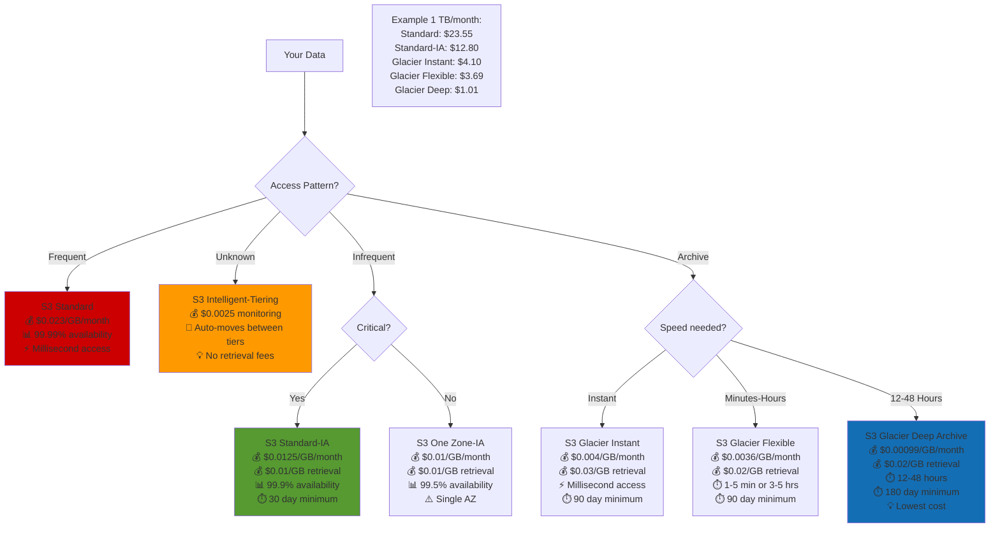

### S3 Lifecycle Policies

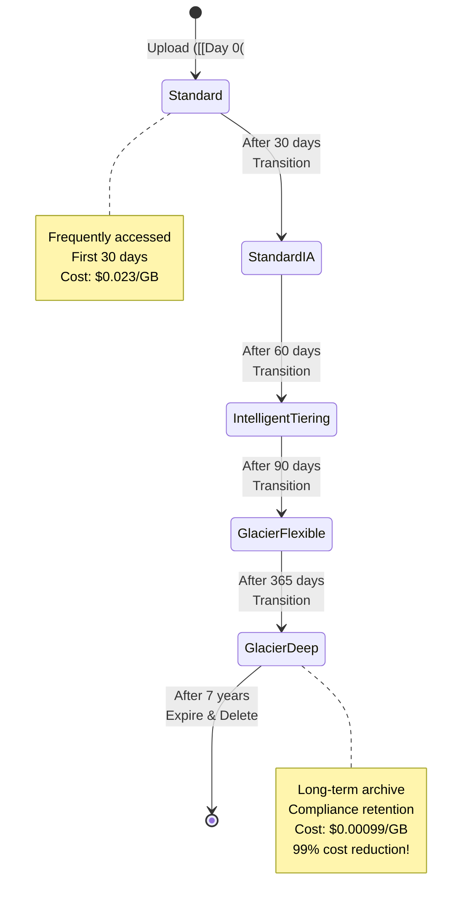

### EBS Cost Optimization

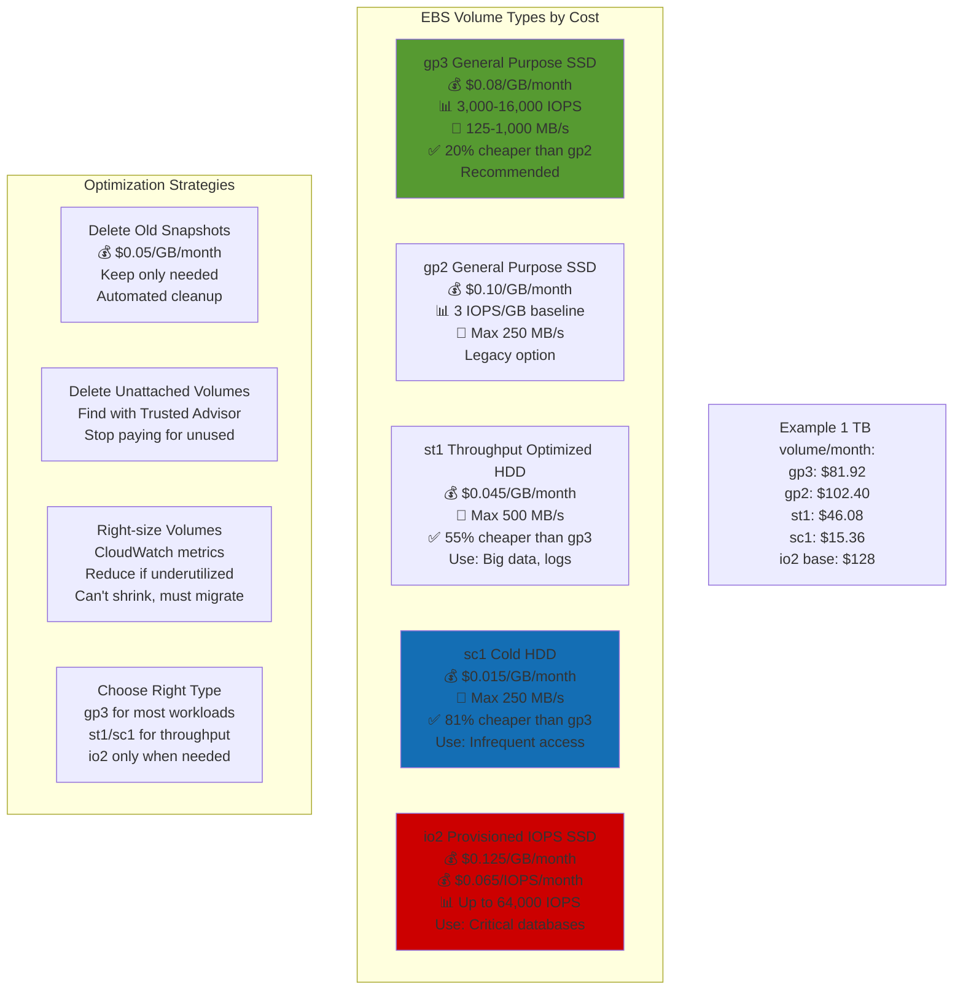

## Database Cost Optimization

### RDS Cost Optimization

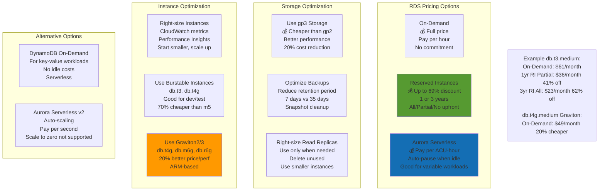

## Data Transfer Costs

### Data Transfer Pricing

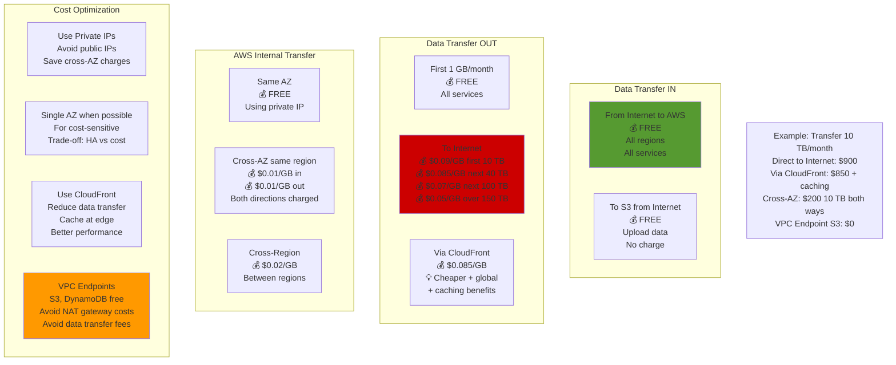

## AWS Cost Management Tools

### Cost Management Architecture

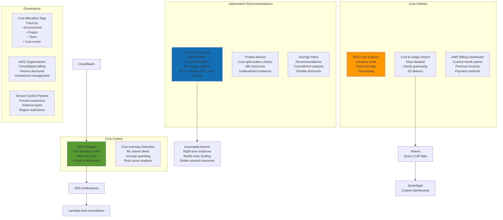

### AWS Budgets and Alerts

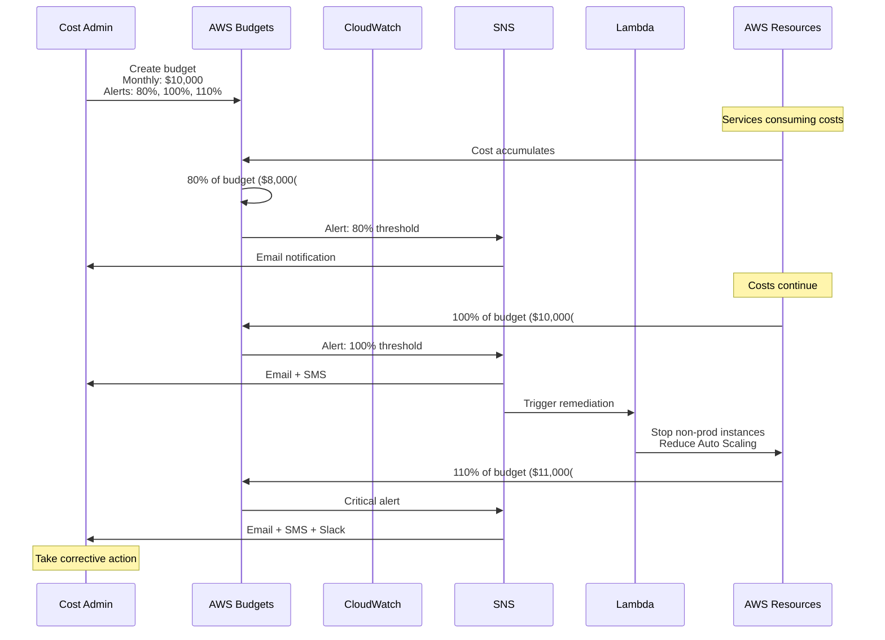

### Cost Optimization Workflow

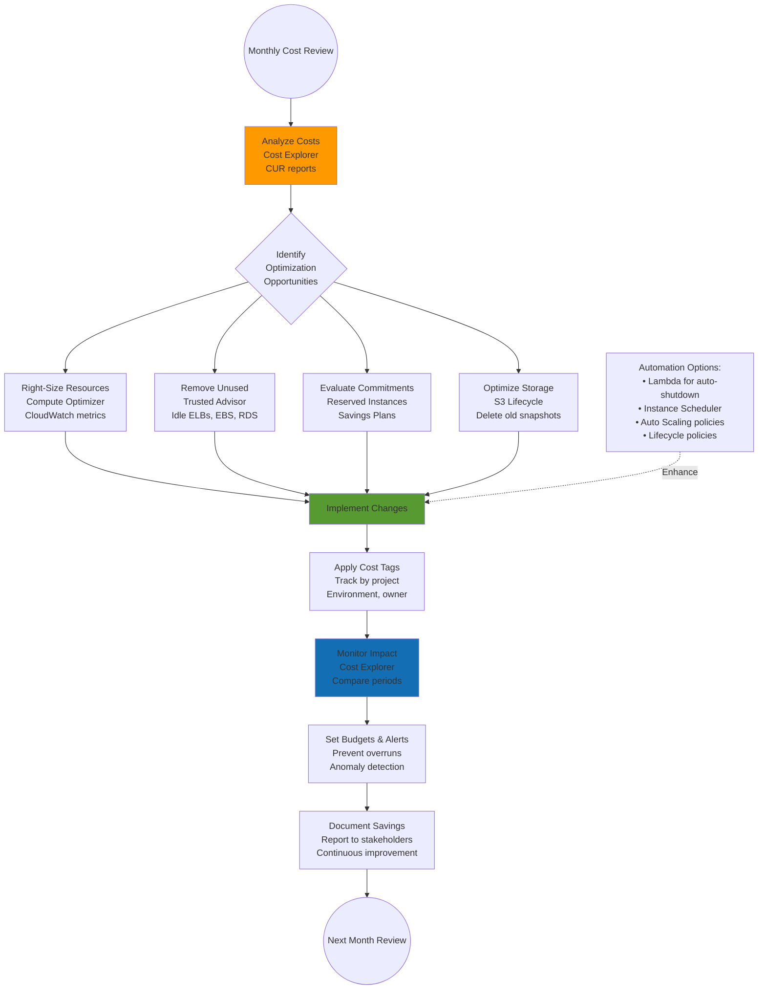

## Cost Optimization Best Practices

### Cost Optimization Checklist

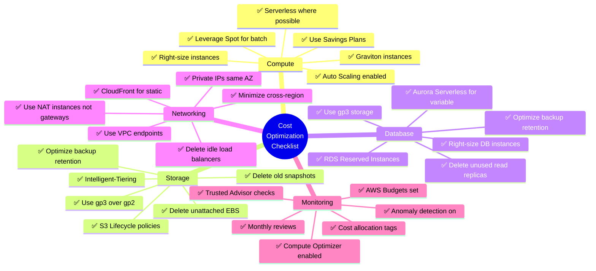

### Potential Savings Summary

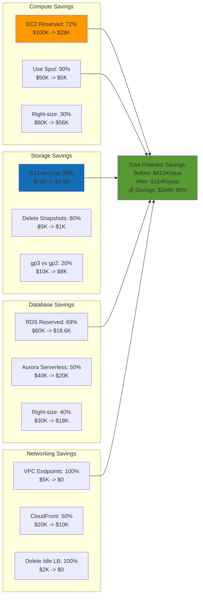

---

## Prerequisites

- [13: Cost Optimization - Ultra Fast Learning 🚀](ULTRA-FAST-LEARN.md)

## Recommended Next Topics

- [Cost Optimization - Practice Questions](PRACTICE-QUESTIONS.md)

## Related Topics

- [Module 01: Cost Optimization](README.md)
- [FAST-LEARN](FAST-LEARN.md)
- [13: Cost Optimization - Ultra Fast Learning 🚀](ULTRA-FAST-LEARN.md)
