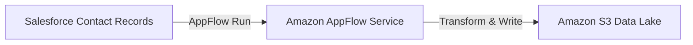

# Amazon AppFlow

## 1. Overview & Real-World Analogy

**Real-World Analogy:** A managed transport bridge connecting two completely different companies (Salesforce and AWS S3): it automatically transfers contacts every hour without requiring custom code.

Amazon AppFlow is a fully managed integration service that enables you to securely transfer data between Software as a Service (SaaS) applications (such as Salesforce, Marketo, Slack, and Zendesk) and AWS services.

---

## 2. Architecture & Flow Diagram

---

## 3. Comparison & Decision Guidance

| Tool | Amazon AppFlow | Custom Lambda integration |
| :--- | :--- | :--- |
| **Complexity** | Zero Code (managed UI setup) | Custom development and token refresh scripts |
| **Execution** | Fully managed scaling | Cold start limits, runtime limits (15 min) |
| **SaaS Tokens** | Auto-managed refresh keys | Custom Key Rotation scripts required |

### When to use
- When designing high-scale, production-ready solutions on AWS.
- To enforce operational excellence and follow security best practices.

### When not to use
- For basic prototyping where native defaults are sufficient.

---

## 4. Key Performance, Cost & Security Considerations

### Performance Impact
Handles multi-gigabyte files, executing transformations (such as filtering and masking) during data transfer.

### Cost Impact
Billed per flow execution run, plus total data volume transferred.

### Security Implications
Integrates with AWS PrivateLink to transfer SaaS data without routing packets over the public internet.

---

## 5. Exam tips & Traps

:::tip
**Exam Clues:** appflow, salesforce data lake sync, saas data transfer integration, zero code integration

Look for "Salesforce to S3 data lake transfer without custom code" or SaaS API data syncs in the exam.
:::

:::warning
**Common Exam Traps:** AppFlow is strictly for data transfer and simple mappings; do not use it for complex data processing pipeline tasks.
:::

---

## Prerequisites

- [Amazon Managed Streaming for Apache Kafka (MSK)](amazon-msk.md)

## Recommended Next Topics

- [Amazon SNS](Messaging & Eventing/Amazon SNS.md)

## Related Topics

- [Amazon Managed Streaming for Apache Kafka (MSK)](amazon-msk.md)
