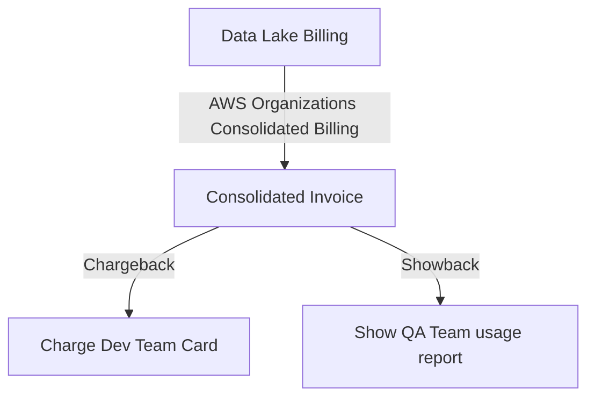

# Chargeback & Showback Methodologies

## 1. Overview & Real-World Analogy

**Real-World Analogy:** Chargeback is charging each roommate’s card for their exact share of the electricity bill based on room monitors; Showback is sticking the itemized bill on the fridge so they see how much they consume.

Chargeback allocates cloud costs back to the internal business units that generated them, while Showback presents costs to teams without actively billing their internal accounts.

---

## 2. Architecture & Flow Diagram

---

## 3. Comparison & Decision Guidance

| Metric | Chargeback | Showback |
| :--- | :--- | :--- |
| **Action** | Transfers funds internally between departments | Reports usage costs for visibility |
| **Primary Goal** | Operational budget accountability | Awareness and cost culture education |
| **Complexity** | High (requires billing integration scripts) | Low (requires dashboard sharing) |

### When to use
- When designing high-scale, production-ready solutions on AWS.
- To enforce operational excellence and follow security best practices.

### When not to use
- For basic prototyping where native defaults are sufficient.

---

## 4. Key Performance, Cost & Security Considerations

### Performance Impact
No performance overhead; these are financial governance methodologies.

### Cost Impact
Improves cost culture, driving developers to terminate idle instances when their teams are charged directly.

### Security Implications
Restricts billing data visibility to authorized accounting and engineering roles using IAM.

---

## 5. Exam tips & Traps

:::tip
**Exam Clues:** chargeback, showback, billing conductor custom billing, consolidated invoice distribution

Use AWS Billing Conductor to define custom pricing groups and manage billing structures for chargebacks.
:::

:::warning
**Common Exam Traps:** Do not implement chargeback systems without clear alignment from department leaders on how untagged costs are shared.
:::

---

## Prerequisites

- [Reserved Instance (RI) Strategy](reserved-instance-strategy.md)

## Recommended Next Topics

- [AWS Budgets](Cost Monitoring & Budgeting/AWS Budgets.md)

## Related Topics

- [AWS Cost & Usage Report (CUR)](cost-and-usage-reports.md)
- [Savings Plans Modeling & Purchase](savings-plans-modeling.md)
- [Reserved Instance (RI) Strategy](reserved-instance-strategy.md)
